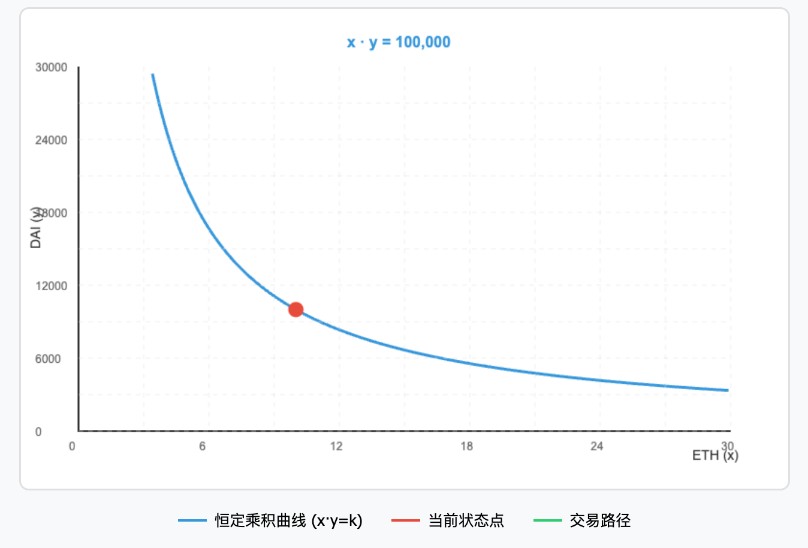
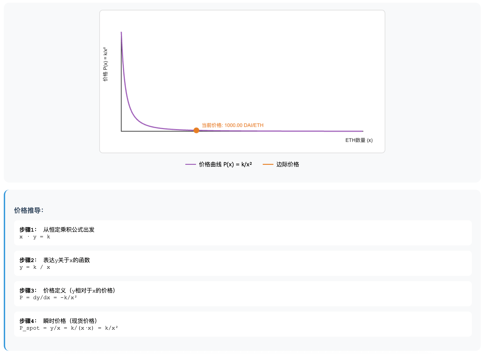
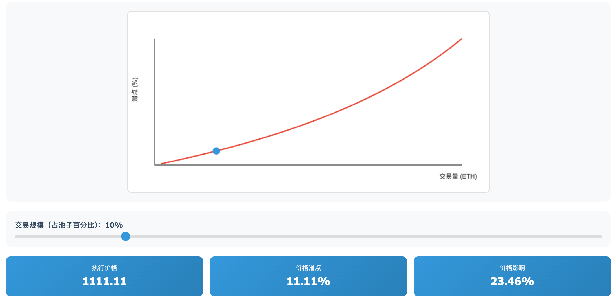

# Uniswap V1 恒定乘积公式的数学原理

### 1. **双曲线的数学特性**

恒定乘积公式 `x·y = k` 在数学上是一个**矩形双曲线**（Rectangular Hyperbola），具有以下关键特性：



#### 渐近线特性

- **永不触零**：曲线永远不会触及x轴或y轴，这意味着池子永远不会完全耗尽某种代币
- **数学表达**：当 x→0 时，y→∞；当 y→0 时，x→∞
- **实际意义**：理论上总有流动性，但价格可能变得极其昂贵

#### 对称性

- 曲线关于直线 y=x 对称（当两种代币价值相等时）
- 这保证了交易的公平性：买入和卖出遵循相同的定价规则

### 2. **价格函数的深层含义**

#### 瞬时价格（Spot Price）

```
P_spot = y/x
```

- 这是池中两种代币的比率
- 代表"此时此刻"的价格
- 小额交易接近这个价格

#### 边际价格（Marginal Price）

```
P_marginal = dy/dx = -k/x²
```

- 这是价格变化率
- 表示每增加一单位x，y的变化量
- 负号表示反向关系

#### 有效价格（Effective Price）

```
P_effective = Δy/Δx
```

- 实际交易的平均价格
- 大额交易时与瞬时价格差异很大
- 这个差异就是"滑点"的来源



### 3. **滑点的数学分析**

#### 滑点公式推导

对于购买 Δx 数量的代币X：

```
初始状态：x₀, y₀, k = x₀·y₀
交易后：x₁ = x₀ - Δx, y₁ = k/(x₀ - Δx)

滑点 = (执行价格 - 现货价格) / 现货价格
     = ((y₁ - y₀)/Δx - y₀/x₀) / (y₀/x₀)
     = Δx/(x₀ - Δx)
```

#### 滑点的关键观察

- **非线性增长**：滑点不是线性增长，而是呈指数级增长
- **10%规则**：当交易量达到池子10%时，滑点约为11.11%
- **50%极限**：交易量接近池子50%时，滑点趋向无穷大



### 4. **无常损失的几何解释**

无常损失可以通过恒定乘积曲线来理解：

#### 几何视角

- LP的仓位始终在曲线上移动
- 价格变化导致仓位沿曲线滑动
- 曲线的凸性导致了无常损失

#### 数学表达

```
设初始价格比 = 1，最终价格比 = r
无常损失 = 2√r/(1+r) - 1

示例：
- r = 2（价格翻倍）：IL = -5.72%
- r = 4（价格4倍）：IL = -20%
- r = 0.5（价格减半）：IL = -5.72%（对称性）
```

### 5. **套利机制的数学基础**

#### 套利条件

当 Uniswap 价格偏离市场价格时：

```
Uniswap价格：P_uni = y/x
市场价格：P_market

套利利润 = |P_uni - P_market| × 交易量 - gas费用
```

#### 套利如何恢复平衡

1. 如果 P_uni > P_market：套利者在市场买入，在Uniswap卖出
2. 这增加了x，减少了y
3. 新价格 P_new = (y-Δy)/(x+Δx) < P_uni
4. 重复直到价格趋同

### 6. **流动性深度的影响**

#### 深度与滑点的关系

```
滑点 ≈ (交易量/池子总量)²

池子规模翻倍 → 相同交易的滑点减少75%
```

#### 资本效率问题

V1的流动性分布在整个价格范围（0到∞），导致：

- 大部分流动性未被使用
- 资本效率低下
- 这是V3引入集中流动性的动机

### 7. **实际应用中的考虑**

#### Gas费用的影响

```
最小可盈利交易量 = √(2 × gas费用 × k / 现货价格)
```

#### 三明治攻击

利用交易顺序和滑点：

1. 攻击者看到大额交易
2. 抢先交易推高价格
3. 用户交易执行（高价）
4. 攻击者反向交易获利

### 8. **V1公式的局限性**

#### 价格发现效率

- 只依赖套利者平衡价格
- 没有预言机功能
- 容易被操纵

#### 资本利用率

```
实际使用的流动性 ≈ 2 × 日交易量 / √k
通常 < 5% 的总流动性
```

## 总结

Uniswap V1的恒定乘积公式虽然简单（`x·y=k`），但它蕴含了丰富的数学原理：

1. **双曲线特性**保证了永续流动性
2. **价格函数**实现了自动定价
3. **滑点机制**防止了市场操纵
4. **套利机制**维持了价格平衡

这个优雅的数学模型开创了AMM的先河，虽然有资本效率等问题，但它证明了去中心化交易的可行性。V2和V3的改进都是在这个基础上的优化，而非推翻。

