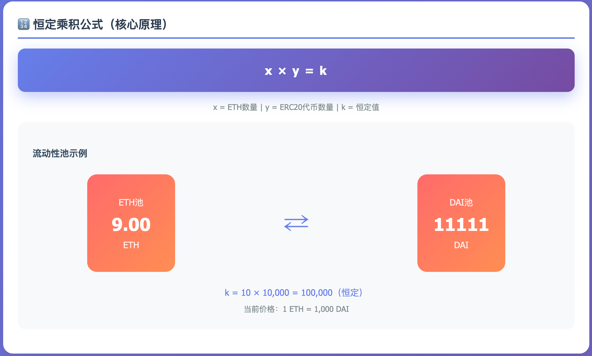
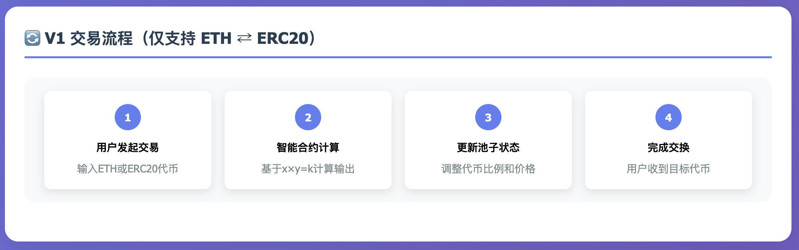
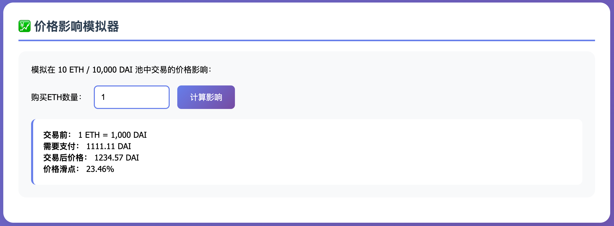
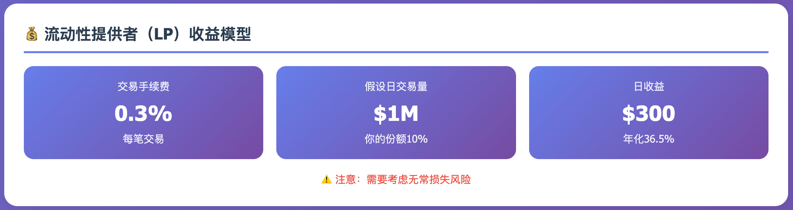

# Uniswap V1 详解：去中心化交易的开端

## 一、背景与问题

### 传统交易的演变

举一个农业交易的例子：

- **历史类比**：几千年前，一个种土豆的农民想要苹果，会直接与种苹果的农民交换土豆，没有费用或中间人。
- **现代情景（十年前）**：为了获得苹果，农民会先在类似Marketplace的平台上卖掉土豆换取现金，然后用现金在杂货店购买苹果，这引入了货币和中介费用。
- **中心化系统的问题**：杂货店（中间人）收取费用以维持库存和运营，随着时间推移，这些费用可能因其对供应的控制而增加。

在加密货币世界中，2018年之前的情况类似：

- 中心化交易所充当"杂货店"角色
- 高昂的上币费和交易费
- KYC要求和地域限制
- 交易所可能被黑客攻击或跑路

## 二、Uniswap V1 的诞生（2018年11月）

### 2018年的加密世界现状

2018年，加密货币市场正经历着"加密寒冬"。比特币从2017年底近2万美元的高点跌至3000多美元，整个市场弥漫着悲观情绪。然而，正是在这个看似最黑暗的时刻，DeFi的种子开始萌芽。

当时的代币交易面临着严重的问题：

**中心化交易所的垄断**

- **高昂的上币费**：主流交易所收取10-100万美元的上币费，小项目根本无法承受
- **地域限制**：许多交易所因监管原因限制特定国家用户访问
- **资金托管风险**：Mt.Gox的倒闭（损失85万BTC）仍让人心有余悸
- **不透明的操作**：交易所可能进行暗箱操作、操纵价格、挪用用户资金
- **繁琐的KYC流程**：注册需要提供身份证明，等待数天审核

**去中心化交易的早期尝试**

- **EtherDelta**：基于订单簿的DEX，用户体验极差，经常出现交易失败
- **0x协议**：需要链下撮合，依然存在中心化风险
- **Bancor**：使用复杂的代币模型，需要BNT作为中介货币

这些早期DEX的共同问题：

- 流动性分散，交易深度不足
- 用户体验复杂，普通用户难以使用
- 依然需要某种形式的中心化组件

### Hayden Adams：从失业工程师到DeFi先驱

**2017年7月**，Hayden Adams被西门子解雇，成为一名失业的机械工程师。他对未来感到迷茫，甚至考虑过转行。这时，他的朋友Karl Floersch（以太坊基金会研究员）建议他学习智能合约开发。

**关键转折点**：

- **2017年10月**：Hayden读到了Vitalik Buterin在2016年Reddit上发布的一篇关于"链上做市商"的帖子
- **核心思想**：使用`x * y = k`公式实现自动化做市
- **灵感爆发**：Hayden意识到这个简单的数学公式可以彻底改变代币交易

### 从概念到产品的艰难历程

**2017年11月 - 2018年3月：原型开发**

第一版原型：
- 只有300行Solidity代码
- 仅支持单一交易对
- 没有用户界面
- 在测试网上勉强运行

Hayden住在纽约布鲁克林的一间小公寓里，每天编程超过12小时。他靠着积蓄和朋友的资助维持生活，全身心投入到Uniswap的开发中。

**2018年4月：获得以太坊基金会资助**

- Vitalik Buterin亲自推荐
- 获得10万美元的开发资助
- 这笔资金让项目得以继续

**2018年7月：在Devcon遇见关键人物**

- 遇到了Paradigm的研究合伙人Dan Robinson
- Dan帮助完善了经济模型和安全机制
- 建立了与加密社区的联系

##  三、Uniswap V1 的技术突破

### 1. 智能合约架构

Uniswap V1 采用了极简的设计：

- **工厂合约（Factory Contract）**：负责创建新的交易对
  - 仅400行代码
  - 功能：创建新的交易对
  - 记录所有交易对地址
- **交易合约（Exchange Contract）**：每个 ETH-ERC20 对都有独立的合约
  - 每个ETH-ERC20对一个独立合约
  - 核心功能：swap、addLiquidity、removeLiquidity
  - 完全去中心化，无管理员权限

#### 关键代码实现

```solidity
// V1核心交易函数（简化版）
function ethToTokenSwapInput(uint256 min_tokens, uint256 deadline) 
    public 
    payable 
    returns (uint256 tokens_bought) 
{
    require(deadline >= block.timestamp);
    require(msg.value > 0);
    
    uint256 eth_reserve = address(this).balance - msg.value;
    uint256 token_reserve = token.balanceOf(address(this));
    uint256 tokens_bought = getInputPrice(msg.value, eth_reserve, token_reserve);
    
    require(tokens_bought >= min_tokens);
    require(token.transfer(msg.sender, tokens_bought));
    
    return tokens_bought;
}

// 价格计算函数
function getInputPrice(uint256 input_amount, uint256 input_reserve, uint256 output_reserve) 
    private 
    pure 
    returns (uint256) 
{
    uint256 input_amount_with_fee = input_amount * 997;
    uint256 numerator = input_amount_with_fee * output_reserve;
    uint256 denominator = (input_reserve * 1000) + input_amount_with_fee;
    return numerator / denominator;
}
```


### 2. 交易机制详解

#### 农业类比理解

回到农业交易例子：

- **传统方式**：农民→卖土豆给中间商→获得现金→从中间商买苹果
- **Uniswap方式**：农民直接把土豆放入"公共粮仓"，按比例取出苹果

#### 实际交易过程

假设池中有 10 ETH 和 10,000 DAI：

**场景1：用户想用 DAI 购买 1 ETH**

```
初始状态：10 ETH × 10,000 DAI = 100,000
用户买走 1 ETH 后：9 ETH × ? DAI = 100,000
需要的 DAI = 100,000 ÷ 9 = 11,111.11 DAI
用户支付：11,111.11 - 10,000 = 1,111.11 DAI（含0.3%手续费）
```







### 3. 流动性提供的激励机制

**收益计算**：

- 每笔交易收取 0.3% 手续费
- 手续费按LP的份额比例分配
- 如果你提供了池子50%的流动性，你将获得50%的手续费

**实例**：

- 池子总价值：$100,000
- 你的份额：$10,000 (10%)
- 日交易量：$50,000
- 日手续费：$50,000 × 0.3% = $150
- 你的日收益：$150 × 10% = $15
- 年化收益率：($15 × 365) / $10,000 = 54.75%




### 4. 革命性的创新：自动做市商（AMM）

**传统订单簿 vs AMM的根本区别**：

传统订单簿模式（如EtherDelta）：

卖单列表：
- 用户A：卖1 ETH @ $201
- 用户B：卖2 ETH @ $202
- 用户C：卖5 ETH @ $203

买单列表：
- 用户D：买1 ETH @ $199
- 用户E：买3 ETH @ $198
- 用户F：买2 ETH @ $197

问题：买卖价差大，流动性分散


Uniswap的AMM模式：

Uniswap V1 没有订单簿，价格完全由池中代币比例决定：

**价格 = Y池代币数量 ÷ X池代币数量**

这创造了一个有趣的现象：

- 大额交易会显著影响价格（滑点）
- 套利者会平衡不同市场的价格差异
- 价格自动调节，无需人工干预

流动性池：
- 10 ETH × 10,000 DAI = 100,000 (k值)
- 当前价格：1 ETH = 1,000 DAI
- 任何人都可以立即以该价格附近交易
- 价格由算法自动确定

### 5. V1的技术创新细节

#### 1. 流动性代币（LP Token）机制

**创新设计**：

```solidity
// 添加流动性时铸造LP代币
function addLiquidity(uint256 min_liquidity, uint256 max_tokens, uint256 deadline) 
    public 
    payable 
    returns (uint256) 
{
    uint256 total_liquidity = totalSupply;
    
    if (total_liquidity > 0) {
        // 按比例添加
        uint256 eth_reserve = address(this).balance - msg.value;
        uint256 token_reserve = token.balanceOf(address(this));
        uint256 token_amount = (msg.value * token_reserve / eth_reserve) + 1;
        uint256 liquidity_minted = msg.value * total_liquidity / eth_reserve;
        
        // 铸造LP代币
        balances[msg.sender] += liquidity_minted;
        totalSupply += liquidity_minted;
        
        return liquidity_minted;
    } else {
        // 初始流动性
        // ...
    }
}
```

**LP代币的意义**：

- 代表池子份额的凭证
- 可转让、可交易
- 自动累积手续费收益
- 开创了"流动性挖矿"的基础

#### 2. 价格发现机制的数学原理

**恒定乘积公式的深层含义**：

```
初始状态：x₀ * y₀ = k
交易Δx后：(x₀ + Δx) * (y₀ - Δy) = k

求解Δy：
Δy = y₀ - k/(x₀ + Δx)
   = y₀ - y₀*x₀/(x₀ + Δx)
   = y₀ * Δx/(x₀ + Δx)

边际价格：
P = dy/dx = -k/x² = -y₀*x₀/x²
```

这个公式确保了：

- 价格连续性（没有跳跃）
- 无限流动性（理论上）
- 自动价格调节

#### 3. 手续费机制设计

**0.3%的选择理由**：

- **覆盖无常损失**：根据模拟，0.3%可以在大多数情况下补偿IL
- **竞争力**：低于中心化交易所的0.5%-1%
- **简单性**：固定费率，易于理解和计算

## 四、V1 的实际应用案例

### 案例1：小型项目代币上线

2019年初，一个DeFi项目想要为其代币提供流动性：

- **传统方式**：需要支付数万美元上币费给中心化交易所
- **Uniswap V1**：免费创建池子，只需提供初始流动性

### 案例2：套利交易

- Coinbase 上 ETH 价格：$200
- Uniswap 上因大额卖单，ETH 价格：$195
- 套利者在 Uniswap 买入，在 Coinbase 卖出，赚取差价
- 这个过程让 Uniswap 价格回归市场价

## 五、V1 的问题与V2的改进方向

### 主要问题：

1. **ERC20到ERC20交易效率低**
   - 需要：DAI → ETH → USDC（两次交易，0.6%手续费）
   - 解决：V2引入直接的ERC20-ERC20池
2. **价格预言机缺失**
   - 问题：其他协议无法安全地使用Uniswap价格
   - 解决：V2引入时间加权平均价格（TWAP）
3. **闪电贷缺失**
   - 问题：无法进行无抵押借贷
   - 解决：V2原生支持闪电贷

## 六、V1的历史地位

Uniswap V1 虽然简单，但它证明了几个革命性的概念：

1. **AMM模型的可行性**：不需要订单簿也能实现有效的价格发现
2. **流动性民主化**：任何人都可以成为做市商，而不仅仅是大型金融机构
3. **无需许可的金融**：真正实现了"无国界、无门槛"的交易

Uniswap就像一个"没有现金的杂货店"，但这个杂货店：

- 永远不会关门
- 不会拒绝任何顾客
- 价格完全透明
- 任何人都可以成为店主的一部分

## 七、V1的生态影响

### 启发的项目

1. 直接分叉：
   - Sushiswap（虽然基于V2）
   - Mooniswap
   - DODO（改进的PMM）
2. 概念借鉴：
   - Balancer（多资产池）
   - Curve（稳定币优化）
   - Bancor V2（减少无常损失）

### 推动的创新

**流动性挖矿的诞生**： 虽然Uniswap V1本身没有挖矿，但它的LP代币机制直接启发了：

- Compound的COMP挖矿（2020年6月）
- 引发DeFi Summer
- TVL从10亿增长到1000亿

**组合性创新**：

- **Flash Loans**：虽然V1不支持，但启发了Aave的闪电贷
- **聚合器**：1inch、Matcha等聚合器的出现
- **收益优化**：Yearn等收益农场的基础

## 八、V1的历史数据

### 关键里程碑

```
日期事件TVL日交易量
2018.11.02V1上线$30K$1K
2019.01.01首个10万美元TVL$300K$20K
2019.04.15首个百万美元交易日$5M$1M
2019.07.01TVL突破1000万$10M$2M
2019.12.31年度总结$30M$5M
2020.05.18V2发布前夕$40M$10M
```

### 用户增长曲线

```
2018 Q4: 100 用户
2019 Q1: 1,000 用户
2019 Q2: 5,000 用户
2019 Q3: 20,000 用户
2019 Q4: 50,000 用户
2020 Q1: 100,000 用户
2020 Q2: 250,000 用户（V2发布）
```

## 九、V1的遗产

### 技术遗产

1. 证明了AMM的可行性
   - 在此之前，所有人都认为订单簿是唯一方式
   - x*y=k成为DeFi最重要的公式之一
2. 智能合约极简主义
   - 总代码不到1000行
   - 没有管理员权限
   - 完全不可升级
3. 真正的去中心化
   - 无需许可
   - 无需KYC
   - 无地域限制

### 文化影响

**DeFi精神的确立**：

- **开源**：所有代码开源，任何人可以审查和分叉
- **无需许可**：任何人都可以创建池子、提供流动性、进行交易
- **社区驱动**：没有VC控制，社区拥有协议

### 经济影响

**为DeFi铺平道路**：

- 证明了去中心化金融的可行性
- 创造了新的金融原语
- 启发了数千亿美元的创新

## 十、创始人的反思

Hayden Adams在2019年底的采访中说：

> "当我开始做Uniswap时，我只是想学习Solidity。我从未想过它会变成今天这样。看到人们使用它进行真实的交易，看到其他项目建立在它之上，这超出了我最疯狂的想象。"

> "最让我自豪的不是交易量或TVL，而是Uniswap证明了一个简单的想法可以改变世界。x*y=k，就这么简单，却如此强大。"

## 十一、从V1看DeFi的未来

### V1揭示的可能性

1. **金融民主化**：任何人都可以成为做市商
2. **全球流动性**：打破地域限制
3. **可组合性**：金融乐高的基石
4. **透明度**：所有交易链上可查

### V1的局限指向的方向

1. **资本效率问题** → V3的集中流动性
2. **单一费率** → 多级费率结构
3. **无常损失** → 各种IL保护机制
4. **缺乏激励** → 流动性挖矿

## 总结

Uniswap V1的诞生不仅仅是一个DEX的上线，它标志着一个新时代的开始。从一个失业工程师的个人项目，到处理数十亿美元交易的金融基础设施，V1的故事激励着每一个区块链开发者。

**关键启示**：

- **简单往往最强大**：x*y=k，如此简单，却改变了金融
- **时机很重要**：在熊市建设，在牛市收获
- **坚持初心**：Hayden坚持去中心化和开源，最终获得成功
- **社区的力量**：没有VC，靠社区支持成长为独角兽

Uniswap V1证明了：在区块链世界，一个好的想法、几百行代码，就可能创造出改变世界的产品。它不仅开创了AMM的时代，更重要的是，它证明了去中心化金融不是乌托邦，而是可以实现的未来。

2018年11月2日，当Hayden按下部署按钮时，他可能没有意识到，他正在开启一场金融革命。而这场革命，至今仍在继续。


