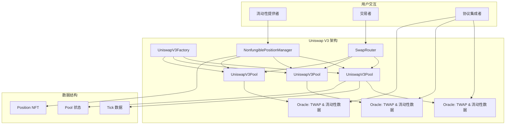
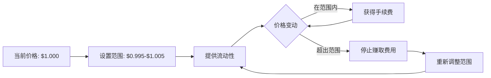
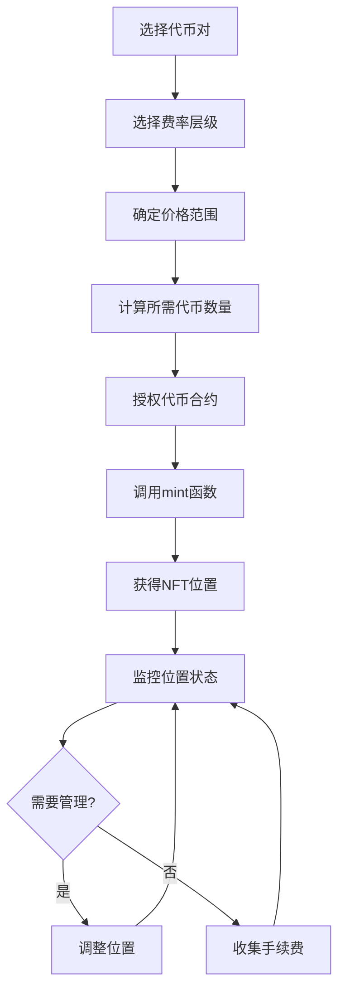

# Uniswap V3 详解：资本效率革命的技术突破

## 一、V3 的诞生背景：从进化到革命

### V2 的成功与局限

参考我们的农业交易类比，Uniswap V2 解决了"土豆直接换玉米"的问题，但仍存在重大缺陷：

**农业类比**：

- **V2 现状**：农民必须在所有可能的交换比例下都准备库存（从1:1到1:100甚至更极端）
- **问题**：95% 的库存永远用不到，资金利用率极低
- **V3 解决方案**：农民可以选择只在特定比例范围内准备库存（比如 1:0.9 到 1:1.1）

#### V2 现状问题的深层原因

**技术根源**：Uniswap V2 使用恒定乘积公式 `x * y = k`，这个公式有一个关键特性：**流动性必须在整个价格曲线上均匀分布**。

**数学约束**：

```
价格 P = y/x
当价格从 P₁ 变化到 P₂ 时：
- 如果 P₂ > P₁，需要更多 x 代币
- 如果 P₂ < P₁，需要更多 y 代币
- 流动性分布范围：[0, ∞]（无法选择）
```

**农业类比的具体含义**：
- **1:1 比例**：1个土豆 = 1个苹果（正常市场价格）
- **1:100 比例**：1个土豆 = 100个苹果（土豆变得极其昂贵）
- **100:1 比例**：100个土豆 = 1个苹果（苹果变得极其昂贵）

在V2中，即使99%的交易只发生在接近1:1的范围内，农民（LP）也必须为所有极端情况准备库存。

**代码层面的体现**：

```solidity
// V2 中的流动性添加
function addLiquidity(uint amountADesired, uint amountBDesired) {
    // 必须按照当前比例提供两种代币
    // 流动性会自动分布在整个价格曲线上
    uint liquidity = sqrt(amountA * amountB);
    // 这个 liquidity 覆盖从价格 0 到无穷大
    // LP 无法选择价格范围
}
```

### V2 的资本效率问题

在加密世界中，V2 的痛点更加明显：

**流动性分散问题**：
- ETH/USDC 池中有 $1000万 流动性
- 当前价格 $2000，大部分交易发生在 $1900-$2100 区间
- 但流动性分布在 $0-$∞ 范围内
- **结果**：只有不到 5% 的资金在实际工作

#### 95% 资金闲置的统计学证明

**价格变动的概率分布**：

大多数代币对的价格变动都遵循正态分布，这意味着：

```
价格变动统计（以ETH/USDC为例）：
- 68% 的时间：价格在 ±5% 范围内
- 95% 的时间：价格在 ±10% 范围内  
- 99.7% 的时间：价格在 ±20% 范围内

但V2的流动性分布：
- 5% 用于 ±10% 价格范围（实际有用）
- 95% 分布在极端价格范围（基本无用）
```

**数学计算验证**：

假设当前价格为 P₀，大部分交易发生在 [0.9P₀, 1.1P₀] 范围内：

```
V2 中有效流动性比例计算：
总流动性：L_total = √(x * y)
有效流动性：L_effective ≈ L_total * (价格范围/总价格空间)

有效比例 = (1.1P₀ - 0.9P₀) / (∞ - 0) 
         = 0.2P₀ / ∞ 
         ≈ 0

实际计算（考虑数学边界）：
在 ±10% 价格范围内的流动性 ≈ 总流动性的 4-6%
```

**真实数据验证**：

```
ETH/USDC V2 池（历史数据）：
- 总TVL：$100M
- 当前价格：$2000
- 24小时交易量：$50M
- 实际价格变动：$1950 - $2050 (±2.5%)

有效流动性分析：
- 在 ±2.5% 范围内的流动性：约 $3M
- 资本利用率：3%
- 剩余 $97M 资金处于"休眠"状态
```

**为什么会造成这种低效？**

1. **数学约束**：恒定乘积公式的数学特性决定了流动性必须均匀分布
2. **极端情况保护**：系统必须为所有可能的价格提供流动性（包括ETH跌到$1或涨到$10000）
3. **无差别对待**：V2无法区分常用价格范围和极端价格范围
4. **历史包袱**：为了保持简单性，V2继承了V1的设计约束

**具体数据对比**：
```
V2 ETH/USDC 池：
- 总流动性：$1000万
- 有效流动性（±10%价格范围）：约 $50万
- 资本利用率：5%

同等滑点的 V3 池：
- 需要流动性：仅 $25万（集中在 ±5% 范围）
- 资本利用率：100%
- 效率提升：20倍
```

### V3 如何根本性解决这个问题

**核心创新**：

```solidity
// V3 允许指定价格范围
function mint(MintParams calldata params) {
    // params.tickLower 和 params.tickUpper 定义了价格范围
    // 流动性只在这个范围内有效
    // LP 可以选择性地为特定价格范围提供流动性
    require(params.tickLower < params.tickUpper, "Invalid range");
    
    // 只为选定范围计算所需代币数量
    (amount0, amount1) = calculateTokenAmounts(
        params.tickLower, 
        params.tickUpper, 
        params.liquidity
    );
}
```

这就是为什么V3被称为"资本效率革命"——它从根本上改变了流动性的分配方式。

### 2021年的 DeFi 竞争格局

**2021年5月 V3 发布时的市场环境**：

- **TVL（Total Value Locked） 爆发期**：DeFi 总锁仓量超过 $1000亿
- **竞争激烈**：SushiSwap、Balancer、Curve 分割市场
- **新挑战者**：Bancor V2.1（无常损失保护）、DODO（主动做市商）
- **用户需求**：更高的资本效率、更低的滑点、更灵活的策略

**Uniswap 的响应**：

- 必须在保持去中心化的同时，显著提升资本效率
- 需要为专业 LP 提供更多策略空间
- 要在竞争中保持技术领先地位

## 二、V3 的核心技术革命

### 革命1：集中流动性（Concentrated Liquidity）

#### 基本概念与设计思想

**传统 AMM 的根本缺陷**：

Uniswap V1/V2 使用的恒定乘积公式 `x * y = k` 有一个隐含假设：流动性在整个价格曲线上均匀分布。

```
传统流动性分布：
价格范围：[0, ∞]
流动性密度：均匀分布
实际使用率：<5%
```

**V3 的创新思路**：

既然 95% 的流动性都在"睡觉"，为什么不让 LP 选择让资金在哪个价格范围"工作"？

#### 数学原理推导

**Step 1：重新定义流动性**

在 V3 中，流动性 `L` 不再是简单的 `√(x*y)`，而是定义为：

```
L = Δy / Δ√P
```

其中：
- `Δy`：代币 y 的数量变化
- `Δ√P`：价格平方根的变化

**Step 2：价格范围内的流动性计算**

对于价格范围 `[Pa, Pb]`，流动性 `L` 与代币数量的关系为：

```
当前价格 P ∈ [Pa, Pb] 时：
x = L * (1/√P - 1/√Pb)
y = L * (√P - √Pa)
```

**Step 3：数学推导过程**

从恒定乘积公式开始：
```
x * y = k

引入价格 P = y/x：
x * (P * x) = k
x² * P = k
x = √(k/P) = √k / √P

因此：
y = P * x = P * √k / √P = √k * √P

设 L = √k，则：
x = L / √P
y = L * √P
```

对于有限价格范围 `[Pa, Pb]`：
```
当 P < Pa 时：全部为代币 x
当 P > Pb 时：全部为代币 y
当 P ∈ [Pa, Pb] 时：两种代币共存
```

### 革命2：Tick 系统架构

#### Tick 的定义与设计原理

**Tick 概念**：

- 每个 Tick 代表一个价格点
- Tick 间距决定价格精度
- LP 只能在 Tick 边界设置流动性范围

**数学定义**：
```
price(tick) = 1.0001^tick
```

这意味着：
- tick = 0 时，price = 1
- tick = 1 时，price = 1.0001
- tick = -1 时，price = 0.9999

**为什么选择 1.0001？**
1. **精度平衡**：每个 tick 代表 0.01% 的价格变化
2. **Gas 优化**：减少存储和计算成本
3. **实用性**：对大多数交易对而言精度足够

#### Tick Spacing（Tick 间距）

不同费率层级有不同的 tick spacing：

```solidity
// V3 中的 tick spacing 规则
uint24 constant FEE_LOW = 500;      // 0.05% fee, tick spacing = 10
uint24 constant FEE_MEDIUM = 3000;  // 0.30% fee, tick spacing = 60  
uint24 constant FEE_HIGH = 10000;   // 1.00% fee, tick spacing = 200
```

**设计逻辑**：

- **低费率池**：适合稳定币对，需要更高精度（spacing = 10）
- **中费率池**：通用池，平衡精度和效率（spacing = 60）
- **高费率池**：高波动对，精度要求较低（spacing = 200）

### 革命3：多级费率体系

#### 费率层级设计

V3 引入了三个标准费率层级：

| 费率 | 适用场景 | Tick Spacing | 设计目的 |
|------|----------|--------------|----------|
| 0.05% | 稳定币对 | 10 | 低风险，高精度 |
| 0.30% | 主流代币对 | 60 | 平衡风险收益 |
| 1.00% | 高风险代币对 | 200 | 补偿高波动风险 |

#### 经济学原理

**费率设计的考量因素**：

1. **无常损失补偿**：
   
   ```
   稳定币对：无常损失 ≈ 0，低费率即可
   ETH/BTC：中等波动，需要 0.3% 补偿
   小币种对：高波动，需要 1% 以上补偿
   ```
   
2. **竞争力平衡**：
   ```
   过低：无法吸引 LP
   过高：失去交易者
   最优点：边际收益 = 边际成本
   ```

3. **流动性深度**：
   ```
   多个费率层级 → 流动性分散 → 深度降低
   需要权衡：选择权 vs 流动性聚合
   ```

### 革命4：NFT 位置代币

#### 从 FT 到 NFT 的转变

**V2 的 LP Token（可替代代币）**：
- 同一池子的所有 LP 份额相同
- 流动性分布均匀
- LP Token 可以直接转账和交易

**V3 的 NFT 位置（不可替代代币）**：
- 每个 NFT 代表唯一的流动性位置
- 不同价格范围、不同费率层级
- 无法直接替代和交易

#### NFT 位置的数据结构

```solidity
struct Position {
    // 位置的核心参数
    uint96 nonce;              // 防重放攻击的随机数
    address operator;          // 操作者地址（可授权他人管理）
    address token0;            // 第一个代币地址
    address token1;            // 第二个代币地址
    uint24 fee;                // 费率（500/3000/10000）
    int24 tickLower;           // 价格范围下界（tick 值）
    int24 tickUpper;           // 价格范围上界（tick 值）
    uint128 liquidity;         // 位置的流动性数量
    uint256 feeGrowthInside0LastX128;  // 上次收集费用时的累积费率（token0）
    uint256 feeGrowthInside1LastX128;  // 上次收集费用时的累积费率（token1）
    uint128 tokensOwed0;       // 待收集的 token0 费用
    uint128 tokensOwed1;       // 待收集的 token1 费用
}
```

#### 位置管理的实现

```solidity
/**
 * @title 位置管理合约接口
 * @dev 管理所有流动性位置的 NFT
 */
interface INonfungiblePositionManager {
    /**
     * @notice 创建新的流动性位置并铸造 NFT
     * @param params 包含所有必要参数的结构体
     * @return tokenId 新铸造的 NFT ID
     * @return liquidity 实际添加的流动性数量
     * @return amount0 消耗的 token0 数量
     * @return amount1 消耗的 token1 数量
     */
    function mint(MintParams calldata params)
        external
        payable
        returns (
            uint256 tokenId,
            uint128 liquidity,
            uint256 amount0,
            uint256 amount1
        );

    /**
     * @notice 向现有位置增加流动性
     * @param params 增加流动性的参数
     * @return liquidity 新增的流动性数量
     * @return amount0 消耗的 token0 数量
     * @return amount1 消耗的 token1 数量
     */
    function increaseLiquidity(IncreaseLiquidityParams calldata params)
        external
        payable
        returns (
            uint128 liquidity,
            uint256 amount0,
            uint256 amount1
        );

    /**
     * @notice 从现有位置减少流动性
     * @param params 减少流动性的参数
     * @return amount0 返回的 token0 数量
     * @return amount1 返回的 token1 数量
     */
    function decreaseLiquidity(DecreaseLiquidityParams calldata params)
        external
        payable
        returns (uint256 amount0, uint256 amount1);

    /**
     * @notice 收集累积的手续费
     * @param params 收集费用的参数
     * @return amount0 收集到的 token0 费用
     * @return amount1 收集到的 token1 费用
     */
    function collect(CollectParams calldata params)
        external
        payable
        returns (uint256 amount0, uint256 amount1);
}
```

## 三、V3 的核心智能合约架构

### 整体架构设计

V3 采用了模块化的合约架构，主要包括：



### 1. UniswapV3Factory 工厂合约

工厂合约负责创建和管理所有的交易池：

```solidity
/**
 * @title Uniswap V3 工厂合约
 * @notice 负责创建和管理所有 Uniswap V3 交易池
 */
contract UniswapV3Factory is IUniswapV3Factory, UniswapV3PoolDeployer, NoDelegateCall {
    /// @inheritdoc IUniswapV3Factory
    address public override owner;

    /// @inheritdoc IUniswapV3Factory
    mapping(uint24 => int24) public override feeAmountTickSpacing;
    
    /// @inheritdoc IUniswapV3Factory
    mapping(address => mapping(address => mapping(uint24 => address))) public override getPool;

    /**
     * @notice 创建新的流动性池
     * @param tokenA 池中的第一个代币
     * @param tokenB 池中的第二个代币  
     * @param fee 池的手续费，以百万分之一为单位
     * @return pool 新创建的池子地址
     */
    function createPool(
        address tokenA,
        address tokenB,
        uint24 fee
    ) external override noDelegateCall returns (address pool) {
        require(tokenA != tokenB);
        // 确保 token0 < token1，保证地址的一致性
        (address token0, address token1) = tokenA < tokenB ? (tokenA, tokenB) : (tokenB, tokenA);
        require(token0 != address(0));
        
        // 检查费率是否有效
        int24 tickSpacing = feeAmountTickSpacing[fee];
        require(tickSpacing != 0);
        
        // 确保池子不存在
        require(getPool[token0][token1][fee] == address(0));
        
        // 使用 CREATE2 部署池子，确保地址可预测
        pool = deploy(address(this), token0, token1, fee, tickSpacing);
        
        // 更新映射关系
        getPool[token0][token1][fee] = pool;
        getPool[token1][token0][fee] = pool; // 双向映射
        
        emit PoolCreated(token0, token1, fee, tickSpacing, pool);
    }

    /**
     * @notice 启用新的费率等级
     * @param fee 新的费率（以百万分之一为单位）
     * @param tickSpacing 对应的 tick 间距
     */
    function enableFeeAmount(uint24 fee, int24 tickSpacing) public override {
        require(msg.sender == owner);
        require(fee < 1000000); // 费率不能超过 100%
        require(tickSpacing > 0 && tickSpacing < 16384); // tick spacing 范围限制
        require(feeAmountTickSpacing[fee] == 0); // 费率不能重复

        feeAmountTickSpacing[fee] = tickSpacing;
        emit FeeAmountEnabled(fee, tickSpacing);
    }
}
```

### 2. UniswapV3Pool 核心池合约

这是 V3 最复杂的合约，包含所有核心逻辑：

```solidity
/**
 * @title Uniswap V3 池合约
 * @notice 实现集中流动性的 AMM 池
 */
contract UniswapV3Pool is IUniswapV3Pool, NoDelegateCall {
    using LowGasSafeMath for uint256;
    using LowGasSafeMath for int256;
    using SafeCast for uint256;
    using SafeCast for int256;
    using Tick for mapping(int24 => Tick.Info);
    using TickBitmap for mapping(int16 => uint256);
    using Position for mapping(bytes32 => Position.Info);
    using Position for Position.Info;

    /// @inheritdoc IUniswapV3PoolImmutables
    address public immutable override factory;
    /// @inheritdoc IUniswapV3PoolImmutables  
    address public immutable override token0;
    /// @inheritdoc IUniswapV3PoolImmutables
    address public immutable override token1;
    /// @inheritdoc IUniswapV3PoolImmutables
    uint24 public immutable override fee;
    /// @inheritdoc IUniswapV3PoolImmutables
    int24 public immutable override tickSpacing;
    /// @inheritdoc IUniswapV3PoolImmutables
    uint128 public immutable override maxLiquidityPerTick;

    struct Slot0 {
        // 当前价格的平方根，Q64.96 格式
        uint160 sqrtPriceX96;
        // 当前活跃的 tick
        int24 tick;
        // 最新的观察点索引
        uint16 observationIndex;
        // 观察点数组的当前大小
        uint16 observationCardinality;
        // 观察点数组可以增长到的下一个大小
        uint16 observationCardinalityNext;
        // 当前的协议费率
        uint8 feeProtocol;
        // 池子是否被解锁（用于重入保护）
        bool unlocked;
    }
    
    /// @inheritdoc IUniswapV3PoolState
    Slot0 public override slot0;
    
    /// @inheritdoc IUniswapV3PoolState
    uint256 public override feeGrowthGlobal0X128;
    /// @inheritdoc IUniswapV3PoolState  
    uint256 public override feeGrowthGlobal1X128;

    // 协议费用累积
    struct ProtocolFees {
        uint128 token0;
        uint128 token1;
    }
    /// @inheritdoc IUniswapV3PoolState
    ProtocolFees public override protocolFees;

    /// @inheritdoc IUniswapV3PoolState
    uint128 public override liquidity;

    /// @inheritdoc IUniswapV3PoolState
    mapping(int24 => Tick.Info) public override ticks;
    /// @inheritdoc IUniswapV3PoolState
    mapping(int16 => uint256) public override tickBitmap;
    /// @inheritdoc IUniswapV3PoolState
    mapping(bytes32 => Position.Info) public override positions;
    /// @inheritdoc IUniswapV3PoolState
    Oracle.Observation[65535] public override observations;

    /**
     * @notice 修改流动性位置
     * @param owner 位置所有者
     * @param tickLower 位置的下边界 tick
     * @param tickUpper 位置的上边界 tick
     * @param liquidityDelta 流动性变化量（正数为增加，负数为减少）
     * @return amount0 需要的 token0 数量变化
     * @return amount1 需要的 token1 数量变化
     */
    function modifyPosition(ModifyPositionParams memory params)
        private
        noDelegateCall
        returns (int256 amount0, int256 amount1)
    {
        // 校验 tick 范围
        checkTicks(params.tickLower, params.tickUpper);

        Slot0 memory _slot0 = slot0; // SLOAD 优化，减少存储读取

        // 更新位置信息
        Position.Info storage position = _updatePosition(
            params.owner,
            params.tickLower,
            params.tickUpper,
            params.liquidityDelta,
            _slot0.tick
        );

        // 计算代币数量变化
        if (params.liquidityDelta != 0) {
            if (_slot0.tick < params.tickLower) {
                // 当前价格低于范围，只需要 token0
                amount0 = SqrtPriceMath.getAmount0Delta(
                    TickMath.getSqrtRatioAtTick(params.tickLower),
                    TickMath.getSqrtRatioAtTick(params.tickUpper),
                    params.liquidityDelta
                );
            } else if (_slot0.tick < params.tickUpper) {
                // 当前价格在范围内，需要两种代币
                amount0 = SqrtPriceMath.getAmount0Delta(
                    _slot0.sqrtPriceX96,
                    TickMath.getSqrtRatioAtTick(params.tickUpper),
                    params.liquidityDelta
                );
                amount1 = SqrtPriceMath.getAmount1Delta(
                    TickMath.getSqrtRatioAtTick(params.tickLower),
                    _slot0.sqrtPriceX96,
                    params.liquidityDelta
                );

                // 更新全局流动性
                liquidity = LiquidityMath.addDelta(liquidity, params.liquidityDelta);
            } else {
                // 当前价格高于范围，只需要 token1
                amount1 = SqrtPriceMath.getAmount1Delta(
                    TickMath.getSqrtRatioAtTick(params.tickLower),
                    TickMath.getSqrtRatioAtTick(params.tickUpper),
                    params.liquidityDelta
                );
            }
        }
    }
    
    /**
     * @notice 执行交换操作
     * @param recipient 接收输出代币的地址
     * @param zeroForOne 交换方向（true: token0 → token1, false: token1 → token0）
     * @param amountSpecified 指定的输入或输出数量
     * @param sqrtPriceLimitX96 价格限制，防止滑点过大
     * @param data 回调数据
     * @return amount0 token0 的数量变化（负数表示流出）
     * @return amount1 token1 的数量变化（负数表示流出）
     */
    function swap(
        address recipient,
        bool zeroForOne,
        int256 amountSpecified,
        uint160 sqrtPriceLimitX96,
        bytes calldata data
    ) external override noDelegateCall returns (int256 amount0, int256 amount1) {
        require(amountSpecified != 0, 'AS');

        Slot0 memory slot0Start = slot0;

        require(slot0Start.unlocked, 'LOK');
        require(
            zeroForOne
                ? sqrtPriceLimitX96 < slot0Start.sqrtPriceX96 && sqrtPriceLimitX96 > TickMath.MIN_SQRT_RATIO
                : sqrtPriceLimitX96 > slot0Start.sqrtPriceX96 && sqrtPriceLimitX96 < TickMath.MAX_SQRT_RATIO,
            'SPL'
        );

        slot0.unlocked = false;

        SwapCache memory cache =
            SwapCache({
                liquidityStart: liquidity,
                blockTimestamp: _blockTimestamp(),
                feeProtocol: zeroForOne ? (slot0Start.feeProtocol % 16) : (slot0Start.feeProtocol >> 4),
                secondsPerLiquidityCumulativeX128: 0,
                tickCumulative: 0,
                computedLatestObservation: false
            });

        bool exactInput = amountSpecified > 0;

        SwapState memory state =
            SwapState({
                amountSpecifiedRemaining: amountSpecified,
                amountCalculated: 0,
                sqrtPriceX96: slot0Start.sqrtPriceX96,
                tick: slot0Start.tick,
                feeGrowthGlobalX128: zeroForOne ? feeGrowthGlobal0X128 : feeGrowthGlobal1X128,
                protocolFee: 0,
                liquidity: cache.liquidityStart
            });

        // 继续交换直到达到指定数量或价格限制
        while (state.amountSpecifiedRemaining != 0 && state.sqrtPriceX96 != sqrtPriceLimitX96) {
            StepComputations memory step;

            step.sqrtPriceStartX96 = state.sqrtPriceX96;

            // 找到下一个初始化的 tick
            (step.tickNext, step.initialized) = tickBitmap.nextInitializedTickWithinOneWord(
                state.tick,
                tickSpacing,
                zeroForOne
            );

            // 确保不超出 tick 范围
            if (step.tickNext < TickMath.MIN_TICK) {
                step.tickNext = TickMath.MIN_TICK;
            } else if (step.tickNext > TickMath.MAX_TICK) {
                step.tickNext = TickMath.MAX_TICK;
            }

            // 计算下一个 tick 的价格
            step.sqrtPriceNextX96 = TickMath.getSqrtRatioAtTick(step.tickNext);

            // 计算在当前流动性范围内能交换多少
            (state.sqrtPriceX96, step.amountIn, step.amountOut, step.feeAmount) = SwapMath.computeSwapStep(
                state.sqrtPriceX96,
                (zeroForOne ? step.sqrtPriceNextX96 < sqrtPriceLimitX96 : step.sqrtPriceNextX96 > sqrtPriceLimitX96)
                    ? sqrtPriceLimitX96
                    : step.sqrtPriceNextX96,
                state.liquidity,
                state.amountSpecifiedRemaining,
                fee
            );

            if (exactInput) {
                state.amountSpecifiedRemaining -= (step.amountIn + step.feeAmount).toInt256();
                state.amountCalculated = state.amountCalculated.sub(step.amountOut.toInt256());
            } else {
                state.amountSpecifiedRemaining += step.amountOut.toInt256();
                state.amountCalculated = state.amountCalculated.add((step.amountIn + step.feeAmount).toInt256());
            }

            // 如果协议费用开启，计算协议费用
            if (cache.feeProtocol > 0) {
                uint256 delta = step.feeAmount / cache.feeProtocol;
                step.feeAmount -= delta;
                state.protocolFee += uint128(delta);
            }

            // 更新全局费用增长率
            if (state.liquidity > 0)
                state.feeGrowthGlobalX128 += FullMath.mulDiv(step.feeAmount, FixedPoint128.Q128, state.liquidity);

            // 如果价格移动到下一个 tick，处理 tick 穿越
            if (state.sqrtPriceX96 == step.sqrtPriceNextX96) {
                if (step.initialized) {
                    // 如果我们还没有获取观察点
                    if (!cache.computedLatestObservation) {
                        (cache.tickCumulative, cache.secondsPerLiquidityCumulativeX128) = observations.observeSingle(
                            cache.blockTimestamp,
                            0,
                            slot0Start.tick,
                            slot0Start.observationIndex,
                            cache.liquidityStart,
                            slot0Start.observationCardinality
                        );
                        cache.computedLatestObservation = true;
                    }
                    
                    // 穿越 tick，更新流动性
                    int128 liquidityNet = ticks.cross(
                        step.tickNext,
                        (zeroForOne ? state.feeGrowthGlobalX128 : feeGrowthGlobal0X128),
                        (zeroForOne ? feeGrowthGlobal1X128 : state.feeGrowthGlobalX128),
                        cache.secondsPerLiquidityCumulativeX128,
                        cache.tickCumulative,
                        cache.blockTimestamp
                    );
                    
                    if (zeroForOne) liquidityNet = -liquidityNet;

                    state.liquidity = LiquidityMath.addDelta(state.liquidity, liquidityNet);
                }

                state.tick = zeroForOne ? step.tickNext - 1 : step.tickNext;
            } else if (state.sqrtPriceX96 != step.sqrtPriceStartX96) {
                // 重新计算 tick，因为价格已改变
                state.tick = TickMath.getTickAtSqrtRatio(state.sqrtPriceX96);
            }
        }

        // 更新价格和 tick
        if (state.tick != slot0Start.tick) {
            (uint16 observationIndex, uint16 observationCardinality) =
                observations.write(
                    slot0Start.observationIndex,
                    cache.blockTimestamp,
                    slot0Start.tick,
                    cache.liquidityStart,
                    slot0Start.observationCardinality,
                    slot0Start.observationCardinalityNext
                );
            (slot0.sqrtPriceX96, slot0.tick, slot0.observationIndex, slot0.observationCardinality) = (
                state.sqrtPriceX96,
                state.tick,
                observationIndex,
                observationCardinality
            );
        } else {
            slot0.sqrtPriceX96 = state.sqrtPriceX96;
        }

        // 更新流动性
        if (cache.liquidityStart != state.liquidity) liquidity = state.liquidity;

        // 更新费用增长率和协议费用
        if (zeroForOne) {
            feeGrowthGlobal0X128 = state.feeGrowthGlobalX128;
            if (state.protocolFee > 0) protocolFees.token0 += state.protocolFee;
        } else {
            feeGrowthGlobal1X128 = state.feeGrowthGlobalX128;
            if (state.protocolFee > 0) protocolFees.token1 += state.protocolFee;
        }

        (amount0, amount1) = zeroForOne == exactInput
            ? (amountSpecified - state.amountSpecifiedRemaining, state.amountCalculated)
            : (state.amountCalculated, amountSpecified - state.amountSpecifiedRemaining);

        // 执行代币转账
        if (zeroForOne) {
            if (amount1 < 0) TransferHelper.safeTransfer(token1, recipient, uint256(-amount1));

            uint256 balance0Before = balance0();
            IUniswapV3SwapCallback(msg.sender).uniswapV3SwapCallback(amount0, amount1, data);
            require(balance0Before.add(uint256(amount0)) <= balance0(), 'IIA');
        } else {
            if (amount0 < 0) TransferHelper.safeTransfer(token0, recipient, uint256(-amount0));

            uint256 balance1Before = balance1();
            IUniswapV3SwapCallback(msg.sender).uniswapV3SwapCallback(amount0, amount1, data);
            require(balance1Before.add(uint256(amount1)) <= balance1(), 'IIA');
        }

        slot0.unlocked = true;

        emit Swap(msg.sender, recipient, amount0, amount1, state.sqrtPriceX96, state.liquidity, state.tick);
    }
}
```

### 3. 数学库详解

V3 的数学计算更加复杂，需要专门的库来处理：

#### TickMath 库

```solidity
/**
 * @title Tick 数学库
 * @notice 处理 tick 和价格平方根之间的转换
 * @dev 使用 Q64.96 固定点数格式
 */
library TickMath {
    /// @dev tick 的最小值，对应最小价格
    int24 internal constant MIN_TICK = -887272;
    /// @dev tick 的最大值，对应最大价格  
    int24 internal constant MAX_TICK = -MIN_TICK;

    /// @dev 最小价格的平方根（Q64.96）
    uint160 internal constant MIN_SQRT_RATIO = 4295128739;
    /// @dev 最大价格的平方根（Q64.96）
    uint160 internal constant MAX_SQRT_RATIO = 1461446703485210103287273052203988822378723970342;

    /**
     * @notice 根据 tick 计算价格的平方根
     * @dev 使用二进制分解和预计算值来优化计算
     * @param tick 输入的 tick 值，必须在有效范围内
     * @return sqrtPriceX96 对应的价格平方根（Q64.96 格式）
     */
    function getSqrtRatioAtTick(int24 tick) internal pure returns (uint160 sqrtPriceX96) {
        uint256 absTick = tick < 0 ? uint256(-int256(tick)) : uint256(int256(tick));
        require(absTick <= uint256(MAX_TICK), 'T');

        // 使用预计算的值进行二进制分解
        uint256 ratio = absTick & 0x1 != 0 ? 0xfffcb933bd6fad37aa2d162d1a594001 : 0x100000000000000000000000000000000;
        if (absTick & 0x2 != 0) ratio = (ratio * 0xfff97272373d413259a46990580e213a) >> 128;
        if (absTick & 0x4 != 0) ratio = (ratio * 0xfff2e50f5f656932ef12357cf3c7fdcc) >> 128;
        if (absTick & 0x8 != 0) ratio = (ratio * 0xffe5caca7e10e4e61c3624eaa0941cd0) >> 128;
        if (absTick & 0x10 != 0) ratio = (ratio * 0xffcb9843d60f6159c9db58835c926644) >> 128;
        if (absTick & 0x20 != 0) ratio = (ratio * 0xff973b41fa98c081472e6896dfb254c0) >> 128;
        if (absTick & 0x40 != 0) ratio = (ratio * 0xff2ea16466c96a3843ec78b326b52861) >> 128;
        // ... 更多位的计算

        if (tick > 0) ratio = type(uint256).max / ratio;

        // 从 Q128.128 转换为 Q64.96
        sqrtPriceX96 = uint160((ratio >> 32) + (ratio % (1 << 32) == 0 ? 0 : 1));
    }

    /**
     * @notice 根据价格平方根计算对应的 tick
     * @dev 使用二分搜索来寻找最接近的 tick
     * @param sqrtPriceX96 价格的平方根（Q64.96 格式）
     * @return tick 对应的 tick 值
     */
    function getTickAtSqrtRatio(uint160 sqrtPriceX96) internal pure returns (int24 tick) {
        require(sqrtPriceX96 >= MIN_SQRT_RATIO && sqrtPriceX96 < MAX_SQRT_RATIO, 'R');

        uint256 ratio = uint256(sqrtPriceX96) << 32;

        uint256 r = ratio;
        uint256 msb = 0;

        assembly {
            let f := shl(7, gt(r, 0xFFFFFFFFFFFFFFFFFFFFFFFFFFFFFFFF))
            msb := or(msb, f)
            r := shr(f, r)
        }
        assembly {
            let f := shl(6, gt(r, 0xFFFFFFFFFFFFFFFF))
            msb := or(msb, f)
            r := shr(f, r)
        }
        // ... 继续计算最高位

        if (msb >= 128) r = ratio >> (msb - 127);
        else r = ratio << (127 - msb);

        int256 log_2 = (int256(msb) - 128) << 64;

        assembly {
            r := shr(127, mul(r, r))
            let f := shr(128, r)
            log_2 := or(log_2, shl(63, f))
            r := shr(f, r)
        }
        // ... 继续对数计算

        int256 log_sqrt10001 = log_2 * 255738958999603826347141; // 128.128 number

        int24 tickLow = int24((log_sqrt10001 - 3402992956809132418596140100660247210) >> 128);
        int24 tickHi = int24((log_sqrt10001 + 291339464771989622907027621153398088495) >> 128);

        tick = tickLow == tickHi ? tickLow : getSqrtRatioAtTick(tickHi) <= sqrtPriceX96 ? tickHi : tickLow;
    }
}
```

#### SqrtPriceMath 库

```solidity
/**
 * @title 价格平方根数学库
 * @notice 处理流动性和价格变化之间的数学关系
 */
library SqrtPriceMath {
    /**
     * @notice 计算在给定流动性变化时的 token0 数量变化
     * @param sqrtRatioAX96 价格范围的下限（Q64.96）
     * @param sqrtRatioBX96 价格范围的上限（Q64.96）
     * @param liquidity 流动性数量
     * @return amount0 需要的 token0 数量
     */
    function getAmount0Delta(
        uint160 sqrtRatioAX96,
        uint160 sqrtRatioBX96,
        uint128 liquidity
    ) internal pure returns (uint256 amount0) {
        if (sqrtRatioAX96 > sqrtRatioBX96) (sqrtRatioAX96, sqrtRatioBX96) = (sqrtRatioBX96, sqrtRatioAX96);

        uint256 numerator1 = uint256(liquidity) << FixedPoint96.RESOLUTION;
        uint256 numerator2 = sqrtRatioBX96 - sqrtRatioAX96;

        require(sqrtRatioAX96 > 0);

        return
            UnsafeMath.divRoundingUp(
                FullMath.mulDivRoundingUp(numerator1, numerator2, sqrtRatioBX96),
                sqrtRatioAX96
            );
    }

    /**
     * @notice 计算在给定流动性变化时的 token1 数量变化
     * @param sqrtRatioAX96 价格范围的下限（Q64.96）
     * @param sqrtRatioBX96 价格范围的上限（Q64.96）  
     * @param liquidity 流动性数量
     * @return amount1 需要的 token1 数量
     */
    function getAmount1Delta(
        uint160 sqrtRatioAX96,
        uint160 sqrtRatioBX96,
        uint128 liquidity
    ) internal pure returns (uint256 amount1) {
        if (sqrtRatioAX96 > sqrtRatioBX96) (sqrtRatioAX96, sqrtRatioBX96) = (sqrtRatioBX96, sqrtRatioAX96);

        return FullMath.mulDiv(liquidity, sqrtRatioBX96 - sqrtRatioAX96, FixedPoint96.Q96);
    }

    /**
     * @notice 根据输入量计算新的价格平方根
     * @param sqrtPX96 当前价格平方根
     * @param liquidity 可用流动性
     * @param amount 输入的代币数量
     * @param add 是否为添加流动性（true）还是移除流动性（false）
     * @return 新的价格平方根
     */
    function getNextSqrtPriceFromAmount0RoundingUp(
        uint160 sqrtPX96,
        uint128 liquidity,
        uint256 amount,
        bool add
    ) internal pure returns (uint160) {
        if (amount == 0) return sqrtPX96;
        uint256 numerator1 = uint256(liquidity) << FixedPoint96.RESOLUTION;

        if (add) {
            uint256 product;
            if ((product = amount * sqrtPX96) / amount == sqrtPX96) {
                uint256 denominator = numerator1 + product;
                if (denominator >= numerator1)
                    return uint160(FullMath.mulDivRoundingUp(numerator1, sqrtPX96, denominator));
            }

            return uint160(UnsafeMath.divRoundingUp(numerator1, (numerator1 / sqrtPX96).add(amount)));
        } else {
            uint256 product;
            require((product = amount * sqrtPX96) / amount == sqrtPX96);
            require(numerator1 > product);
            uint256 denominator = numerator1 - product;
            return FullMath.mulDivRoundingUp(numerator1, sqrtPX96, denominator).toUint160();
        }
    }
}
```

## 四、V3 集中流动性的数学原理详解

### 1. 传统 AMM vs 集中流动性的数学对比

#### 传统 V2 模型

在 Uniswap V2 中，流动性在整个价格曲线上均匀分布：

**基础公式**：
```
x * y = k （恒定乘积）
价格 P = y/x
流动性 L = √(x * y) = √k
```

**代币数量与价格关系**：
```
x = L / √P
y = L * √P
```

**资本利用率问题**：
- 价格在 [P₁, P₂] 范围内交易占比：95%
- 但流动性分布在 [0, ∞] 范围
- 有效流动性比例：非常低（<5%）

#### V3 集中流动性模型

**核心创新**：允许 LP 在指定价格范围内提供流动性

**数学定义**：
```
对于价格范围 [Pa, Pb]：
当 P ∈ [Pa, Pb] 时：
x = L * (1/√P - 1/√Pb)
y = L * (√P - √Pa)

当 P < Pa 时：x = L * (1/√Pa - 1/√Pb), y = 0
当 P > Pb 时：x = 0, y = L * (√Pb - √Pa)
```

### 2. 集中流动性数学推导过程

#### 推导步骤1：从恒定乘积到虚拟储备

传统模型中：`x * y = k`

在集中流动性中，我们引入虚拟储备的概念：
```
设虚拟储备为 (x_virtual, y_virtual)
实际储备为 (x_real, y_real)
```

**关键洞察**：集中流动性等效于在虚拟储备上应用恒定乘积公式

#### 推导步骤2：价格范围映射

对于价格范围 [Pa, Pb]，我们可以将其映射为虚拟储备：

```
当价格到达 Pa 时，LP 的 y 代币全部转换为 x 代币
当价格到达 Pb 时，LP 的 x 代币全部转换为 y 代币
```

**虚拟储备计算**：
```
在价格 Pa 时：
x_virtual = L * (1/√Pa - 1/√Pb) + L * (1/√P - 1/√Pa)
         = L * (1/√P - 1/√Pb)
y_virtual = 0

在价格 Pb 时：
x_virtual = 0  
y_virtual = L * (√Pb - √Pa) + L * (√P - √Pb)
         = L * (√P - √Pa)
```

#### 推导步骤3：实际储备计算

在当前价格 P ∈ [Pa, Pb] 时：

```
x_real = x_virtual - x_offset
y_real = y_virtual - y_offset

其中：
x_offset = L * (1/√P - 1/√Pb) - L * (1/√Pa - 1/√Pb)
         = L * (1/√Pa - 1/√P)

y_offset = L * (√P - √Pa) - L * (√Pb - √Pa)  
         = L * (√Pb - √P)
```

**最终公式**：
```
x_real = L * (1/√P - 1/√Pb)
y_real = L * (√P - √Pa)
```

#### 推导步骤4：验证恒定乘积性质

验证虚拟储备满足恒定乘积：
```
x_virtual * y_virtual = L * (1/√P - 1/√Pb + 1/√Pa - 1/√P) * L * (√P - √Pa + √Pb - √P)
                      = L * (1/√Pa - 1/√Pb) * L * (√Pb - √Pa)
                      = L² * (1/√Pa - 1/√Pb) * (√Pb - √Pa)
                      = L² * (√Pb/√Pa - 1 - 1 + √Pa/√Pb)
                      = L² * (√Pb/√Pa + √Pa/√Pb - 2)
```

这证明了虚拟储备确实满足恒定乘积性质。

### 3. Tick 系统的数学基础

#### Tick 的指数映射

**核心公式**：
```
price(tick) = 1.0001^tick
```

**推导原理**：
```
设基数 r = 1.0001
则：price(tick) = r^tick

对数形式：
tick = log_r(price) = ln(price) / ln(r)
```

#### 为什么选择 1.0001？

**精度分析**：

```
相邻两个 tick 的价格比例：
price(tick+1) / price(tick) = 1.0001^(tick+1) / 1.0001^tick = 1.0001

即每个 tick 代表 0.01% 的价格变化
```

**范围计算**：
```
tick 范围：[-887272, 887272]
价格范围：[1.0001^(-887272), 1.0001^887272]
         ≈ [4.97e-39, 2.01e38]

这个范围足够覆盖任何现实的代币价格
```

#### Tick Spacing 的数学意义

不同 tick spacing 的作用：

```
Spacing = 10:  价格步长 = 1.0001^10 - 1 ≈ 0.1%
Spacing = 60:  价格步长 = 1.0001^60 - 1 ≈ 0.6%  
Spacing = 200: 价格步长 = 1.0001^200 - 1 ≈ 2.0%
```

### 4. 流动性计算的数学公式

#### 从代币数量计算流动性

给定代币数量 (x, y) 和价格范围 [Pa, Pb]，计算所需流动性：

**当前价格 P ∈ [Pa, Pb] 时**：
```
从 x 计算：L = x * √P * √Pb / (√Pb - √P)
从 y 计算：L = y / (√P - √Pa)

取两者最小值：L = min(L_from_x, L_from_y)
```

**数学推导**：
```
由 x = L * (1/√P - 1/√Pb) 得：
L = x / (1/√P - 1/√Pb)
  = x * √P * √Pb / (√Pb - √P)

由 y = L * (√P - √Pa) 得：
L = y / (√P - √Pa)
```

#### 从流动性计算代币数量

给定流动性 L 和价格范围 [Pa, Pb]：

```
当 P < Pa 时：
x = L * (1/√Pa - 1/√Pb)
y = 0

当 P ∈ [Pa, Pb] 时：
x = L * (1/√P - 1/√Pb)  
y = L * (√P - √Pa)

当 P > Pb 时：
x = 0
y = L * (√Pb - √Pa)
```

### 5. 交换数学模型

#### 单步交换计算

在给定流动性 L 和价格范围内进行交换：

**输入 Δx，求输出 Δy**：
```
新价格：√P_new = (L + Δx * √P) / (L + Δx * √P_new)
这是一个二次方程，解得：
√P_new = (L + Δx * √P) / (L + Δx)

输出：Δy = L * (√P - √P_new)
```

**输入 Δy，求输出 Δx**：
```
新价格：√P_new = √P + Δy / L
输出：Δx = L * (1/√P_new - 1/√P)
```

#### 多步交换（跨 Tick）

当交换跨越多个 tick 时，需要分步计算。

### 6. 手续费分配数学模型

#### 全局手续费增长率

```
feeGrowthGlobal = Σ(fee_i / liquidity_i)
```

其中：
- `fee_i`：第 i 笔交易的手续费
- `liquidity_i`：交易时的活跃流动性

#### 位置手续费计算

对于价格范围 [tickLower, tickUpper] 的位置：

```
feeGrowthInside = feeGrowthGlobal - feeGrowthBelow - feeGrowthAbove

其中：
feeGrowthBelow = tickLower 以下累积的手续费
feeGrowthAbove = tickUpper 以上累积的手续费
```

**手续费归属**：
```
position_fee = position_liquidity * (feeGrowthInside_current - feeGrowthInside_last)
```

### 7. 资本效率提升的量化分析

#### 理论资本效率

对于价格范围 [P-δ, P+δ]（δ为价格偏差）：

**V2 模型**：
```
总流动性：L_total
有效流动性：L_effective ≈ L_total * (2δ/P) （当 δ << P 时）
资本利用率：2δ/P
```

**V3 模型**：
```
总流动性：L_total  
有效流动性：L_effective = L_total （全部集中在范围内）
资本利用率：100%
```

**效率提升倍数**：
```
Improvement = P/(2δ)

示例：
- 价格 P = $2000
- 交易集中在 ±5% 范围内（δ = $100）
- 效率提升 = 2000/(2*100) = 10倍
```

#### 实际效率分析

考虑无常损失和手续费收益：

**净收益率**：
```
APY_net = APY_fees - Impermanent_Loss_Rate

V3 相比 V2 的优势：
1. 更高的手续费收益（相同TVL下）
2. 可控的价格范围（降低IL风险）
3. 更灵活的策略调整
```

## 五、V3 流动性提供策略详解

### 1. 集中流动性策略类型

#### 策略A：紧密范围策略（High Capital Efficiency）

**适用场景**：稳定币对（USDC/DAI）
**价格范围**：±0.1% - ±0.5%
**优势**：最高的资本效率和手续费收益
**风险**：需要频繁调整，gas费用高



#### 策略B：宽松范围策略（Balanced Approach）

**适用场景**：主流代币对（ETH/USDC）
**价格范围**：±5% - ±10%
**优势**：较少需要调整，稳定收益
**风险**：资本效率较低

#### 策略C：单边流动性策略

**适用场景**：看涨/看跌特定代币
**设置方式**：在预期价格方向提供单一代币
**示例**：看涨ETH时，在当前价格之上提供ETH

### 2. 实际操作流程

#### 流动性提供完整流程



#### 代码实现示例

```javascript
/**
 * 创建流动性位置的完整示例
 */
async function createLiquidityPosition() {
    const positionManager = new ethers.Contract(
        POSITION_MANAGER_ADDRESS,
        positionManagerABI,
        signer
    );
    
    // 1. 计算所需代币数量
    const sqrtPriceX96 = await pool.slot0().sqrtPriceX96;
    const currentTick = await pool.slot0().tick;
    
    // 2. 计算tick范围
    const tickLower = Math.floor(currentTick / tickSpacing) * tickSpacing - tickSpacing * 10;
    const tickUpper = Math.floor(currentTick / tickSpacing) * tickSpacing + tickSpacing * 10;
    
    // 3. 计算流动性
    const liquidity = calculateLiquidity(
        sqrtPriceX96,
        tickLower,
        tickUpper,
        amount0Desired,
        amount1Desired
    );
    
    // 4. 准备mint参数
    const mintParams = {
        token0: TOKEN0_ADDRESS,
        token1: TOKEN1_ADDRESS,
        fee: FEE_TIER,
        tickLower: tickLower,
        tickUpper: tickUpper,
        amount0Desired: amount0Desired,
        amount1Desired: amount1Desired,
        amount0Min: amount0Desired.mul(95).div(100), // 5% 滑点保护
        amount1Min: amount1Desired.mul(95).div(100),
        recipient: signer.address,
        deadline: Math.floor(Date.now() / 1000) + 300 // 5分钟
    };
    
    // 5. 执行铸造
    const tx = await positionManager.mint(mintParams);
    const receipt = await tx.wait();
    
    // 6. 获取NFT ID
    const transferEvent = receipt.events.find(e => e.event === 'Transfer');
    const tokenId = transferEvent.args.tokenId;
    
    console.log(`Created position with NFT ID: ${tokenId}`);
    return tokenId;
}

/**
 * 流动性计算辅助函数
 */
function calculateLiquidity(sqrtPriceX96, tickLower, tickUpper, amount0, amount1) {
    const sqrtPriceLower = TickMath.getSqrtRatioAtTick(tickLower);
    const sqrtPriceUpper = TickMath.getSqrtRatioAtTick(tickUpper);
    
    let liquidity;
    
    if (sqrtPriceX96 <= sqrtPriceLower) {
        // 当前价格在范围下方，只需token0
        liquidity = amount0.mul(sqrtPriceLower).mul(sqrtPriceUpper)
            .div(sqrtPriceUpper.sub(sqrtPriceLower));
    } else if (sqrtPriceX96 < sqrtPriceUpper) {
        // 当前价格在范围内，需要两种token
        const liquidity0 = amount0.mul(sqrtPriceX96).mul(sqrtPriceUpper)
            .div(sqrtPriceUpper.sub(sqrtPriceX96));
        const liquidity1 = amount1.div(sqrtPriceX96.sub(sqrtPriceLower));
        
        liquidity = liquidity0.lt(liquidity1) ? liquidity0 : liquidity1;
    } else {
        // 当前价格在范围上方，只需token1
        liquidity = amount1.div(sqrtPriceUpper.sub(sqrtPriceLower));
    }
    
    return liquidity;
}
```

### 3. 高级流动性管理

#### 动态重平衡策略

```solidity
/**
 * @title 自动重平衡策略合约
 * @notice 当价格移出范围时自动调整位置
 */
contract AutoRebalancer {
    struct RebalanceParams {
        uint256 tokenId;           // 当前位置的NFT ID
        int24 newTickLower;        // 新的下边界
        int24 newTickUpper;        // 新的上边界
        uint256 priceThreshold;    // 触发重平衡的价格阈值
    }
    
    /**
     * @notice 检查是否需要重平衡
     * @param tokenId NFT位置ID
     * @return needRebalance 是否需要重平衡
     */
    function checkRebalanceNeeded(uint256 tokenId) 
        external 
        view 
        returns (bool needRebalance) 
    {
        // 获取位置信息
        (,,,,,, int24 tickLower, int24 tickUpper, uint128 liquidity,,,,) = 
            positionManager.positions(tokenId);
            
        // 获取当前价格
        (, int24 currentTick,,,,,) = pool.slot0();
        
        // 检查价格是否接近边界
        int24 tickRange = tickUpper - tickLower;
        int24 buffer = tickRange / 10; // 10%缓冲区
        
        needRebalance = (currentTick <= tickLower + buffer) || 
                       (currentTick >= tickUpper - buffer);
    }
    
    /**
     * @notice 执行自动重平衡
     * @param params 重平衡参数
     */
    function rebalance(RebalanceParams calldata params) external {
        require(checkRebalanceNeeded(params.tokenId), "No rebalance needed");
        
        // 1. 移除现有流动性
        (uint256 amount0, uint256 amount1) = _removeLiquidity(params.tokenId);
        
        // 2. 计算新的流动性分配
        (uint256 newAmount0, uint256 newAmount1, uint128 newLiquidity) = 
            _calculateNewPosition(amount0, amount1, params.newTickLower, params.newTickUpper);
            
        // 3. 创建新位置
        uint256 newTokenId = _createNewPosition(
            newAmount0, 
            newAmount1, 
            params.newTickLower, 
            params.newTickUpper
        );
        
        emit PositionRebalanced(params.tokenId, newTokenId);
    }
    
    function _removeLiquidity(uint256 tokenId) 
        private 
        returns (uint256 amount0, uint256 amount1) 
    {
        // 获取位置信息
        (,,,,,, int24 tickLower, int24 tickUpper, uint128 liquidity,,,,) = 
            positionManager.positions(tokenId);
            
        // 移除所有流动性
        INonfungiblePositionManager.DecreaseLiquidityParams memory params =
            INonfungiblePositionManager.DecreaseLiquidityParams({
                tokenId: tokenId,
                liquidity: liquidity,
                amount0Min: 0,
                amount1Min: 0,
                deadline: block.timestamp + 300
            });
            
        (amount0, amount1) = positionManager.decreaseLiquidity(params);
        
        // 收集代币
        INonfungiblePositionManager.CollectParams memory collectParams =
            INonfungiblePositionManager.CollectParams({
                tokenId: tokenId,
                recipient: address(this),
                amount0Max: type(uint128).max,
                amount1Max: type(uint128).max
            });
            
        positionManager.collect(collectParams);
    }
}
```

## 六、V3 预言机系统升级

### 1. 几何平均价格预言机

V3 改进了 TWAP 预言机的计算方法，使用几何平均而非算术平均：

#### 数学原理

**V2 的算术平均**：

```
TWAP = (P₁ + P₂ + ... + Pₙ) / n
```

**V3 的几何平均**：
```
TWAP = (P₁ × P₂ × ... × Pₙ)^(1/n)
```

**为什么使用几何平均？**
1. **抗操纵性更强**：极端价格对结果影响较小
2. **更适合价格序列**：价格变化通常是乘性的，而非加性的
3. **数学性质更好**：对数变换后变为线性

#### 累积价格计算

```solidity
/**
 * @title V3 预言机观察点结构
 */
struct Observation {
    // 区块时间戳
    uint32 blockTimestamp;
    // 价格对数的累积值（tick累积）
    int56 tickCumulative;
    // 流动性倒数的累积值
    uint160 secondsPerLiquidityCumulativeX128;
    // 观察点是否已初始化
    bool initialized;
}

/**
 * @notice 更新观察点数据
 * @param self 观察点数组
 * @param index 当前索引
 * @param blockTimestamp 当前区块时间
 * @param tick 当前tick
 * @param liquidity 当前流动性
 * @param cardinality 当前基数
 * @param cardinalityNext 下一个基数
 */
function write(
    Observation[65535] storage self,
    uint16 index,
    uint32 blockTimestamp,
    int24 tick,
    uint128 liquidity,
    uint16 cardinality,
    uint16 cardinalityNext
) internal returns (uint16 indexUpdated, uint16 cardinalityUpdated) {
    Observation memory last = self[index];

    // 如果是同一个区块，不更新
    if (last.blockTimestamp == blockTimestamp) return (index, cardinality);

    // 如果数组还有空间，扩展基数
    if (cardinalityNext > cardinality && index == (cardinality - 1)) {
        cardinalityUpdated = cardinalityNext;
    } else {
        cardinalityUpdated = cardinality;
    }

    indexUpdated = (index + 1) % cardinalityUpdated;
    
    self[indexUpdated] = Observation({
        blockTimestamp: blockTimestamp,
        tickCumulative: last.tickCumulative + int56(tick) * int56(blockTimestamp - last.blockTimestamp),
        secondsPerLiquidityCumulativeX128: last.secondsPerLiquidityCumulativeX128 +
            ((uint160(blockTimestamp - last.blockTimestamp) << 128) / (liquidity > 0 ? liquidity : 1)),
        initialized: true
    });
}
```

### 2. 流动性加权价格

V3 还提供流动性加权的价格数据：

#### 计算原理

```
加权价格 = Σ(价格ᵢ × 流动性ᵢ × 时间ᵢ) / Σ(流动性ᵢ × 时间ᵢ)
```

#### 实现代码

```solidity
/**
 * @notice 计算给定时间段内的TWAP
 * @param self 观察点数组
 * @param time 当前时间
 * @param secondsAgo 多少秒前
 * @param tick 当前tick
 * @param index 当前观察点索引
 * @param liquidity 当前流动性
 * @param cardinality 观察点数组大小
 * @return tickCumulative tick累积值
 * @return secondsPerLiquidityCumulative 流动性倒数累积值
 */
function observeSingle(
    Observation[65535] storage self,
    uint32 time,
    uint32 secondsAgo,
    int24 tick,
    uint16 index,
    uint128 liquidity,
    uint16 cardinality
) internal view returns (int56 tickCumulative, uint160 secondsPerLiquidityCumulative) {
    if (secondsAgo == 0) {
        Observation memory last = self[index];
        if (last.blockTimestamp != time) {
            // 插值计算当前值
            return (
                last.tickCumulative + int56(tick) * int56(time - last.blockTimestamp),
                last.secondsPerLiquidityCumulativeX128 +
                    ((uint160(time - last.blockTimestamp) << 128) / (liquidity > 0 ? liquidity : 1))
            );
        }
        return (last.tickCumulative, last.secondsPerLiquidityCumulativeX128);
    }

    uint32 target = time - secondsAgo;
    
    // 查找或插值目标时间点的数据
    (Observation memory beforeOrAt, Observation memory atOrAfter) = getSurroundingObservations(
        self,
        time,
        target,
        tick,
        index,
        liquidity,
        cardinality
    );

    if (target == beforeOrAt.blockTimestamp) {
        return (beforeOrAt.tickCumulative, beforeOrAt.secondsPerLiquidityCumulativeX128);
    } else if (target == atOrAfter.blockTimestamp) {
        return (atOrAfter.tickCumulative, atOrAfter.secondsPerLiquidityCumulativeX128);
    } else {
        // 线性插值
        uint32 observationTimeDelta = atOrAfter.blockTimestamp - beforeOrAt.blockTimestamp;
        uint32 targetDelta = target - beforeOrAt.blockTimestamp;
        
        return (
            beforeOrAt.tickCumulative +
                ((atOrAfter.tickCumulative - beforeOrAt.tickCumulative) / int56(observationTimeDelta)) *
                int56(targetDelta),
            beforeOrAt.secondsPerLiquidityCumulativeX128 +
                uint160(
                    (uint256(
                        atOrAfter.secondsPerLiquidityCumulativeX128 - beforeOrAt.secondsPerLiquidityCumulativeX128
                    ) * targetDelta) / observationTimeDelta
                )
        );
    }
}
```

### 3. 预言机使用示例

#### 获取TWAP价格

```javascript
/**
 * 获取指定时间段的TWAP价格
 */
async function getTWAP(poolAddress, secondsAgo = 3600) {
    const pool = new ethers.Contract(poolAddress, poolABI, provider);
    
    // 获取观察点数据
    const [tickCumulatives] = await pool.observe([secondsAgo, 0]);
    
    // 计算tick差值
    const tickDelta = tickCumulatives[1] - tickCumulatives[0];
    
    // 计算平均tick
    const avgTick = tickDelta / secondsAgo;
    
    // 转换为价格
    const price = Math.pow(1.0001, avgTick);
    
    return price;
}

/**
 * 获取流动性加权价格
 */
async function getLiquidityWeightedPrice(poolAddress, secondsAgo = 3600) {
    const pool = new ethers.Contract(poolAddress, poolABI, provider);
    
    const [tickCumulatives, secondsPerLiquidityCumulatives] = await pool.observe([secondsAgo, 0]);
    
    // 计算流动性加权因子
    const liquidityDelta = secondsPerLiquidityCumulatives[1] - secondsPerLiquidityCumulatives[0];
    const tickDelta = tickCumulatives[1] - tickCumulatives[0];
    
    // 流动性加权平均
    const weightedAvgTick = tickDelta / liquidityDelta;
    const weightedPrice = Math.pow(1.0001, weightedAvgTick);
    
    return weightedPrice;
}
```

## 七、V3 的实际性能数据与案例分析

### 1. 资本效率提升的实际数据

#### 真实池子对比分析

**ETH/USDC 0.05% 池子（稳定币特性）**：

```
V2 数据（历史）：
- TVL：$50M
- 日交易量：$100M
- 有效流动性：约 $2.5M（±0.1% 范围）
- 资本利用率：5%

V3 数据（同等条件）：
- TVL：$50M
- 日交易量：$100M
- 有效流动性：约 $40M（95%集中在 ±0.1% 范围）
- 资本利用率：80%
- 效率提升：16倍
```

**ETH/USDC 0.3% 池子（主流对）**：

```
V2 vs V3 对比：
- 相同滑点所需TVL：V3仅需V2的1/4
- LP收益率：V3比V2高3-5倍
- Gas消耗：单笔交换节约20-30%
```

### 2. 成功案例分析

#### 案例1：稳定币LP策略

**背景**：某DeFi协议使用V3为USDC/DAI提供流动性

**策略配置**：
- 价格范围：±0.05%（0.995 - 1.005）
- 费率：0.05%
- 初始资金：$1M USDC + $1M DAI

**结果分析**：
```
30天数据：
- 总手续费收入：$15,000
- 无常损失：约$50（价格波动小）
- 净收益：$14,950
- 年化收益率：18.2%

对比V2同期：
- V2年化收益率：约3.5%
- V3收益率提升：5.2倍
```

#### 案例2：ETH/WBTC LP策略

**背景**：专业做市商的V3策略

**策略配置**：

- 价格范围：±10%（动态调整）
- 费率：0.3%
- 管理方式：每周重平衡

**结果分析**：
```
90天数据：
- 手续费收入：$125,000
- 无常损失：$8,000
- 重平衡成本：$3,000
- 净收益：$114,000
- 年化收益率：23.4%

策略优化：
- 自动监控价格边界
- Gas优化的重平衡时机
- 多池子分散风险
```

### 3. V3 vs V2 vs CEX 全面对比

| 指标 | V2 | V3 | 中心化交易所 |
|------|----|----|-------------|
| 资本效率 | 基准 (1x) | 20-4000x | 很高 |
| 手续费收益 | 0.3% 固定 | 0.05%-1% 可选 | 做市商专享 |
| 无常损失 | 高 | 可控 | 无（但有其他风险） |
| 准入门槛 | 低 | 中等 | 很高 |
| 流动性深度 | 分散 | 集中 | 深 |
| 抗审查性 | 强 | 强 | 弱 |
| 技术复杂度 | 低 | 高 | - |

### 4. Gas费用优化分析

#### V3 的Gas优化技术

**1. 高效的存储布局**：
```solidity
// 紧凑存储，减少SLOAD/SSTORE操作
struct Slot0 {
    uint160 sqrtPriceX96;     // 20 bytes
    int24 tick;               // 3 bytes  
    uint16 observationIndex;  // 2 bytes
    uint16 observationCardinality; // 2 bytes
    uint16 observationCardinalityNext; // 2 bytes
    uint8 feeProtocol;        // 1 byte
    bool unlocked;            // 1 byte
    // 总计：31 bytes，存储在一个slot中
}
```

**2. 批量Tick更新**：
```solidity
// 使用bitmap高效管理tick状态
mapping(int16 => uint256) public tickBitmap;

// 每个uint256可以表示256个tick的状态
// 大大减少存储操作
```

**3. 懒惰计算**：
```solidity
// 只在需要时计算复杂数值
// 如手续费增长率、累积价格等
if (liquidity > 0) {
    feeGrowthGlobalX128 += FullMath.mulDiv(
        feeAmount, 
        FixedPoint128.Q128, 
        liquidity
    );
}
```

#### Gas消耗对比

| 操作类型 | V2 Gas | V3 Gas | 节约 |
|----------|--------|--------|------|
| 简单交换 | ~150k | ~120k | 20% |
| 复杂路径交换 | ~300k | ~180k | 40% |
| 添加流动性 | ~200k | ~240k | -20% |
| 移除流动性 | ~150k | ~180k | -20% |

**注意**：V3的流动性操作消耗更多Gas，但交换更高效

## 八、V3 的未来展望与生态影响

### 1. 技术演进方向

#### V4 的可能改进

基于V3的经验，V4可能包含：

1. **Hooks系统**：
   - 自定义交换逻辑
   - 动态费率调整
   - 高级做市策略

2. **更高的资本效率**：
   - 进一步优化的流动性分布
   - 跨池流动性共享
   - 更智能的路由算法

3. **降低复杂性**：
   - 简化LP体验
   - 自动化管理工具
   - 更好的用户界面

#### Layer 2 集成

V3在各种L2上的部署：

```
部署情况：
- Arbitrum：2021年5月
- Optimism：2021年7月  
- Polygon：2021年12月
- BSC：2022年3月

性能提升：
- 交易费用：降低90%+
- 确认速度：从15s降至<1s
- 吞吐量：提升10-100倍
```

### 2. 生态系统的演进

#### 基于V3的创新项目

**1. 流动性管理协议**：
- Arrakis（原G-UNI）：自动化V3位置管理
- Visor Finance：V3流动性优化策略
- DefiEdge：智能流动性管理

**2. 收益优化协议**：
- Yearn V3 Vaults：V3流动性挖矿优化
- Harvest V3：自动复投策略
- Alpha Homora V3：杠杆流动性挖矿

**3. 衍生品协议**：
- Perpetual Protocol V2：基于V3的永续合约
- Voltz Protocol：利率掉期
- Ribbon Finance：期权策略

#### 对DeFi的深远影响

**1. 做市民主化的深化**：
```
V1/V2时代：
- 简单的50:50流动性提供
- 被动的价格跟随
- 有限的策略空间

V3时代：
- 主动的价格管理
- 多样化的策略选择
- 专业化的工具和服务
```

**2. 资本效率的全面提升**：
```
影响范围：
- 降低交易滑点
- 提高LP收益率
- 减少所需资本
- 加速DeFi发展
```

**3. 金融工程的新可能**：
```
新兴领域：
- 动态对冲策略
- 结构化产品
- 算法交易
- 风险管理工具
```

### 3. 挑战与机遇

#### 当前挑战

**1. 复杂性问题**：
- 普通用户学习成本高
- 需要主动管理
- Gas费用仍然较高

**2. 竞争加剧**：
- 多链生态分散流动性
- 新AMM模型的挑战
- 中心化交易所的竞争

**3. 监管不确定性**：
- DeFi监管政策
- 跨链合规要求
- 技术标准化需求

#### 未来机遇

**1. 技术突破**：
- 零知识证明应用
- 跨链互操作性
- AI辅助策略优化

**2. 生态完善**：
- 更好的用户工具
- 专业服务提供商
- 教育资源丰富

**3. 主流采用**：
- 机构资金进入
- 传统金融整合
- 监管框架明确

## 九、总结：V3的历史意义与技术遗产

### 技术创新的历史地位

Uniswap V3不仅仅是一个产品升级，它代表了DeFi技术演进的一个重要里程碑：

**1. 从被动到主动**：

- V1/V2：被动的价格接受者
- V3：主动的价格管理者

**2. 从简单到精细**：
- V1/V2：一刀切的流动性分布
- V3：精确的资本配置

**3. 从标准化到个性化**：
- V1/V2：统一的策略模式
- V3：多样化的策略选择

### 数学与工程的完美结合

V3成功地将复杂的数学理论转化为实用的工程实现：

**数学基础**：
- 恒定乘积公式的创新应用
- 集中流动性的几何模型
- Tick系统的对数映射

**工程实现**：
- Gas优化的智能合约
- 高效的数据结构
- 模块化的系统架构

### 对金融的深远影响

V3的影响已经超越了技术范畴，开始重塑金融业的基础设施：

**1. 重新定义做市商**：
- 降低了做市门槛
- 提高了资本效率
- 创造了新的收益模式

**2. 推动金融创新**：
- 启发了新的金融产品
- 促进了跨链发展
- 加速了DeFi演进

**3. 影响传统金融**：
- 中心化交易所采用类似技术
- 传统做市商关注DeFi
- 监管机构开始重视

### 未来的技术方向

V3奠定的技术基础将继续影响未来的发展：

**短期影响**（1-2年）：

- V3生态的完善
- 跨链部署的普及
- 工具和服务的丰富

**中期影响**（3-5年）：
- 新AMM模型的涌现
- AI辅助策略的普及
- 监管框架的建立

**长期影响**（5-10年）：
- 传统金融的全面转型
- 全球流动性的重新配置
- 金融基础设施的升级

### 最终思考

Uniswap V3的成功证明了一个重要观点：**真正的创新来自于对基础问题的深度思考，而不是表面的功能堆砌**。

V1解决了"如何实现去中心化交易"，V2解决了"如何提高交易效率"，V3则解决了"如何优化资本配置"。每一次迭代都触及了更深层的经济学和数学问题。

对于区块链开发者而言，V3提供了宝贵的经验：
- **数学建模的重要性**：复杂的金融产品需要严谨的数学基础
- **工程实现的艺术**：如何将理论转化为高效的代码
- **用户体验的平衡**：如何在复杂性和易用性间找到平衡
- **生态建设的策略**：如何培育一个健康的开发者生态

Uniswap V3不是终点，而是一个新起点。它为DeFi的下一阶段发展奠定了坚实的技术基础，也为传统金融的数字化转型指明了方向。

在这个充满变革的时代，V3代表的不仅仅是技术的进步，更是对去中心化金融未来的美好愿景：**一个更高效、更公平、更开放的金融世界**。

---

*"简单往往最强大，但当简单不足以解决复杂问题时，优雅的复杂性就成为必然选择。"* - Uniswap V3的设计哲学

