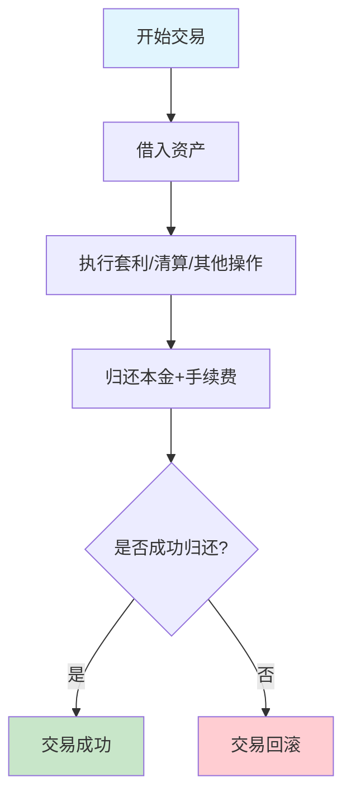
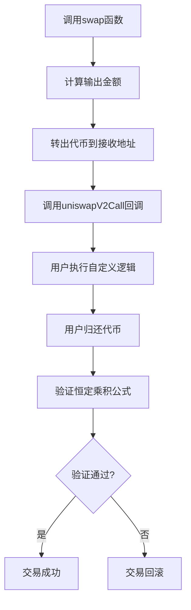

# Uniswap V2 闪电贷技术实现详解

## 目录
1. [闪电贷概念与机制](#闪电贷概念与机制)
2. [Uniswap V2中的闪电贷实现](#uniswap-v2中的闪电贷实现)
3. [技术实现原理](#技术实现原理)
4. [数学公式推导](#数学公式推导)
5. [核心代码实现](#核心代码实现)
6. [实际应用案例](#实际应用案例)
7. [风险分析与安全考量](#风险分析与安全考量)

---

## 闪电贷概念与机制

### 什么是闪电贷（Flash Loan）

闪电贷是DeFi协议中的一种创新金融工具，允许用户在**同一个交易（transaction）内**借入和归还资产，而无需提供抵押品。这种机制基于以太坊交易的原子性特性：要么整个交易成功执行，要么完全回滚。

### 核心特征

1. **无抵押**: 不需要提供任何抵押品
2. **即时执行**: 借贷和还贷在同一个区块内完成
3. **原子性**: 如果无法在交易结束前还清贷款，整个交易将回滚
4. **低成本**: 通常只收取很小的手续费（如0.09%）

### 工作流程



---

## Uniswap V2中的闪电贷实现

### 实现方式

Uniswap V2通过`swap`函数的特殊机制实现闪电贷功能。与专门的闪电贷协议不同，Uniswap V2将闪电贷功能集成在正常的交换操作中。

### 关键特性

- **集成在swap函数中**: 闪电贷通过调用`swap`函数并设置特定参数实现
- **回调机制**: 使用`uniswapV2Call`回调函数执行用户逻辑
- **恒定乘积验证**: 交易结束时必须满足恒定乘积公式

---

## 技术实现原理

### 核心机制

Uniswap V2的闪电贷基于以下技术原理：

1. **延迟验证**: 先转出代币，后验证恒定乘积公式
2. **回调执行**: 在代币转出后调用用户合约的回调函数
3. **状态检查**: 回调执行完毕后检查池子状态是否满足要求

### 执行步骤



---

## 数学公式推导

### 恒定乘积公式

Uniswap V2的核心是恒定乘积公式：

```
x * y = k
```

其中：
- `x`: 代币A的储备量
- `y`: 代币B的储备量  
- `k`: 恒定乘积常数

### 闪电贷的数学约束

设初始状态：
- 代币A储备量: `x₀`
- 代币B储备量: `y₀`
- 恒定乘积: `k = x₀ * y₀`

闪电贷后的状态必须满足：
```
(x₀ + Δx) * (y₀ + Δy) ≥ k
```

### 手续费计算

考虑手续费后的公式（手续费率为0.3%）：

```
(x₁ - 0.003 * amountIn) * y₁ ≥ x₀ * y₀
```

其中：
- `x₁`, `y₁`: 交易后的储备量
- `amountIn`: 输入的代币数量
- `0.003`: 手续费率（0.3%）

### 最小归还金额推导

对于闪电贷，如果借出金额为`amount`，则最小归还金额为：

```
minReturn = amount / 0.997

fee = 手续费 = 你需要额外支付给Uniswap V2池子的费用
fee = minReturn - amount = amount * 0.003 / 0.997
```

**详细推导过程：**

**步骤1：理解初始状态**

- 池子初始状态：代币A储备量 = `x₀`，代币B储备量 = `y₀`
- 恒定乘积：`k = x₀ * y₀`

**步骤2：闪电贷执行过程**
- 借出代币A数量：`amount`
- 池子代币A暂时减少为：`x₀ - amount`
- 用户必须归还足够的代币A来维持恒定乘积

**步骤3：手续费机制理解**
Uniswap V2的关键点：**手续费从归还金额中扣除**
- 如果用户归还`returnAmount`个代币A
- 其中只有`returnAmount * 0.997`用于维持恒定乘积
- 剩余`returnAmount * 0.003`作为手续费被池子保留

**步骤4：恒定乘积约束**
交易结束后，池子必须满足：
```
新的代币A数量 * y₀ ≥ x₀ * y₀
```

新的代币A数量 = 原储备量 - 借出量 + 有效归还量
```
(x₀ - amount + returnAmount * 0.997) * y₀ ≥ x₀ * y₀
```

**步骤5：化简求解**
```
x₀ - amount + returnAmount * 0.997 ≥ x₀
returnAmount * 0.997 ≥ amount
returnAmount ≥ amount / 0.997
```

**步骤6：手续费计算**
```
最小归还金额 = amount / 0.997
手续费 = 最小归还金额 - 本金
fee = amount / 0.997 - amount
fee = amount * (1/0.997 - 1)
fee = amount * (1 - 0.997) / 0.997
fee = amount * 0.003 / 0.997
```

**数值验证示例：**
假设借出1000个代币A：
```
最小归还金额 = 1000 / 0.997 ≈ 1003.009
手续费 = 1003.009 - 1000 = 3.009
验证：3.009 ≈ 1000 * 0.003 / 0.997 ✓
```

---

## 核心代码实现

### UniswapV2Pair合约中的swap函数

```solidity
function swap(
    uint amount0Out,    // 请求输出的token0数量
    uint amount1Out,    // 请求输出的token1数量  
    address to,         // 接收地址
    bytes calldata data // 回调数据，非空时触发闪电贷
) external lock {
    // 输入验证
    require(amount0Out > 0 || amount1Out > 0, 'UniswapV2: INSUFFICIENT_OUTPUT_AMOUNT');
    
    // 获取当前储备量
    (uint112 _reserve0, uint112 _reserve1,) = getReserves();
    require(amount0Out < _reserve0 && amount1Out < _reserve1, 'UniswapV2: INSUFFICIENT_LIQUIDITY');

    uint balance0;
    uint balance1;
    { // 避免堆栈过深错误
        address _token0 = token0;
        address _token1 = token1;
        require(to != _token0 && to != _token1, 'UniswapV2: INVALID_TO');
        
        // 先转出代币（闪电贷的关键）
        if (amount0Out > 0) _safeTransfer(_token0, to, amount0Out);
        if (amount1Out > 0) _safeTransfer(_token1, to, amount1Out);
        
        // 如果有回调数据，执行闪电贷回调
        if (data.length > 0) IUniswapV2Callee(to).uniswapV2Call(msg.sender, amount0Out, amount1Out, data);
        
        // 获取回调后的余额
        balance0 = IERC20(_token0).balanceOf(address(this));
        balance1 = IERC20(_token1).balanceOf(address(this));
    }
    
    // 计算实际输入金额
    uint amount0In = balance0 > _reserve0 - amount0Out ? balance0 - (_reserve0 - amount0Out) : 0;
    uint amount1In = balance1 > _reserve1 - amount1Out ? balance1 - (_reserve1 - amount1Out) : 0;
    require(amount0In > 0 || amount1In > 0, 'UniswapV2: INSUFFICIENT_INPUT_AMOUNT');
    
    { // 避免堆栈过深错误，验证恒定乘积
        // 调整后的余额（扣除手续费）
        uint balance0Adjusted = balance0.mul(1000).sub(amount0In.mul(3));
        uint balance1Adjusted = balance1.mul(1000).sub(amount1In.mul(3));
        
        // 验证恒定乘积公式（考虑手续费）
        require(balance0Adjusted.mul(balance1Adjusted) >= uint(_reserve0).mul(_reserve1).mul(1000**2), 'UniswapV2: K');
    }

    // 更新储备量
    _update(balance0, balance1, _reserve0, _reserve1);
    emit Swap(msg.sender, amount0In, amount1In, amount0Out, amount1Out, to);
}
```

**关键函数字段详解：**

- `amount0Out/amount1Out`: 指定要借出的代币数量，闪电贷时这些参数非零
- `to`: 接收借出代币的地址，通常是实现了回调接口的合约地址
- `data`: 回调数据，长度非零时触发`uniswapV2Call`回调
- `lock`: 防重入修饰符，确保函数执行期间不能被再次调用
- `_safeTransfer`: 安全转账函数，先转出代币再执行验证
- `balance0Adjusted/balance1Adjusted`: 扣除手续费后的调整余额，用于恒定乘积验证

### 闪电贷回调接口

```solidity
interface IUniswapV2Callee {
    /**
     * @dev 闪电贷回调函数
     * @param sender 调用swap的地址
     * @param amount0 借出的token0数量
     * @param amount1 借出的token1数量  
     * @param data 传递给swap的calldata
     */
    function uniswapV2Call(
        address sender,
        uint amount0,
        uint amount1,
        bytes calldata data
    ) external;
}
```

### 闪电贷实现合约示例

```solidity
pragma solidity ^0.6.6;

import './interfaces/IUniswapV2Callee.sol';
import './interfaces/IUniswapV2Pair.sol';
import './interfaces/IERC20.sol';

contract FlashLoanExample is IUniswapV2Callee {
    address private constant UNISWAP_V2_FACTORY = 0x5C69bEe701ef814a2B6a3EDD4B1652CB9cc5aA6f;
    
    // 闪电贷入口函数
    function startFlashLoan(
        address token0,      // 代币0地址
        address token1,      // 代币1地址 
        uint amount0,        // 借入代币0数量
        uint amount1         // 借入代币1数量
    ) external {
        // 获取交易对地址
        address pairAddress = IUniswapV2Factory(UNISWAP_V2_FACTORY).getPair(token0, token1);
        require(pairAddress != address(0), "Pool does not exist");
        
        // 构造回调数据
        bytes memory data = abi.encode(token0, token1, msg.sender);
        
        // 调用swap触发闪电贷
        IUniswapV2Pair(pairAddress).swap(
            amount0,     // amount0Out
            amount1,     // amount1Out  
            address(this), // to (接收地址为当前合约)
            data         // 触发回调的数据
        );
    }
    
    // 实现回调接口
    function uniswapV2Call(
        address sender,    // 调用者地址
        uint amount0,      // 借入的token0数量
        uint amount1,      // 借入的token1数量
        bytes calldata data
    ) external override {
        // 验证调用者是Uniswap V2 Pair
        address token0 = IUniswapV2Pair(msg.sender).token0();
        address token1 = IUniswapV2Pair(msg.sender).token1();
        assert(msg.sender == IUniswapV2Factory(UNISWAP_V2_FACTORY).getPair(token0, token1));
        
        // 解码回调数据
        (address tokenBorrow, address tokenPay, address user) = abi.decode(data, (address, address, address));
        
        // 执行套利逻辑（这里只是示例）
        // 在实际应用中，这里会执行套利、清算等操作
        executeArbitrage(token0, token1, amount0, amount1);
        
        // 计算归还金额（本金 + 手续费）
        uint fee0 = ((amount0 * 3) / 997) + 1; // 0.3%手续费，向上取整
        uint fee1 = ((amount1 * 3) / 997) + 1;
        
        uint amountToRepay0 = amount0 + fee0;
        uint amountToRepay1 = amount1 + fee1;
        
        // 归还代币
        if (amountToRepay0 > 0) {
            IERC20(token0).transfer(msg.sender, amountToRepay0);
        }
        if (amountToRepay1 > 0) {
            IERC20(token1).transfer(msg.sender, amountToRepay1);
        }
    }
    
    // 执行套利逻辑（示例）
    function executeArbitrage(
        address token0,
        address token1, 
        uint amount0,
        uint amount1
    ) internal {
        // 这里实现具体的套利逻辑
        // 例如：在其他DEX上进行交易获得利润
        
        // 示例：简单的代币交换
        if (amount0 > 0) {
            // 使用借来的token0进行某种操作
            // 最终获得足够的token0来归还本金+手续费
        }
        
        if (amount1 > 0) {
            // 使用借来的token1进行某种操作  
            // 最终获得足够的token1来归还本金+手续费
        }
    }
}
```

**详细函数解析：**

1. **startFlashLoan函数**：
   - `token0/token1`: 指定交易对的两个代币地址
   - `amount0/amount1`: 要借入的代币数量
   - `getPair()`: 从工厂合约获取交易对地址
   - `abi.encode()`: 将参数编码为bytes，传递给回调函数

2. **uniswapV2Call回调函数**：
   - **验证调用者**: 确保调用者是合法的Uniswap V2交易对合约
   - **解码数据**: 从calldata中解码出必要的参数
   - **执行逻辑**: 在这里执行套利、清算等业务逻辑
   - **计算手续费**: 使用公式`(amount * 3) / 997 + 1`计算手续费
   - **归还代币**: 将本金+手续费转回交易对合约

3. **手续费计算详解**：
   ```solidity
   uint fee = ((amount * 3) / 997) + 1;
   ```
   - `amount * 3`: 计算0.3%的手续费分子
   - `/ 997`: 除以997得到实际手续费（因为997 + 3 = 1000）
   - `+ 1`: 向上取整，确保手续费足够

---

## 实际应用案例

### 套利交易

利用不同DEX之间的价格差异进行套利：

```solidity
contract ArbitrageBot is IUniswapV2Callee {
    function executeArbitrage(
        address tokenA,
        address tokenB,
        uint amountA
    ) external {
        // 1. 从Uniswap V2借入tokenA
        // 2. 在Sushiswap上用tokenA换取tokenB
        // 3. 在Uniswap V2上用tokenB换取更多tokenA
        // 4. 归还借款并保留利润
    }
}
```

### 清算操作

在借贷协议中执行清算：

```solidity
contract LiquidationBot is IUniswapV2Callee {
    function liquidatePosition(
        address borrower,
        address collateralToken,
        address debtToken,
        uint debtAmount
    ) external {
        // 1. 借入debtToken来偿还借款人债务
        // 2. 获得抵押品collateralToken
        // 3. 出售抵押品获得足够的debtToken
        // 4. 归还闪电贷并保留清算奖励
    }
}
```

#### 清算业务场景详解

**什么是清算？**

清算是 DeFi 借贷协议中的一个重要机制。当借款人的抵押品价值下跌，导致其健康因子（Health Factor）低于某个阈值时，其头寸可以被清算人以折扣价格购买，以保护协议和贷款人的利益。

**清算机器人的工作原理：**

1. **监控阶段**：机器人持续监控借贷协议中的借款人健康因子
2. **识别机会**：当发现可清算的头寸时，立即执行清算
3. **闪电贷执行**：使用闪电贷获得足够的债务代币来偿还借款人
4. **获得奖励**：清算人获得抵押品作为奖励，通常有 5-10% 的折扣

**具体业务场景示例：**

假设在 Compound 协议中：
- 借款人 Alice 抵押了 1000 ETH（价值 $2,000,000）
- 借出了 1,000,000 DAI
- 健康因子 = 1.5（安全）
- 清算阈值 = 1.0

当 ETH 价格从 $2000 跌到 $1800 时：
- 抵押品价值 = 1000 × $1800 = $1,800,000
- 健康因子 = $1,800,000 / $1,000,000 = 1.8（仍然安全）

当 ETH 价格继续跌到 $1100 时：
- 抵押品价值 = 1000 × $1100 = $1,100,000
- 健康因子 = $1,100,000 / $1,000,000 = 1.1（接近清算阈值）

**清算机器人的执行流程：**

```solidity
contract LiquidationBot is IUniswapV2Callee {
    address private constant COMPOUND = 0x3d9819210A31b4961b30EF54bE2aeD79B9c9Cd3B;
    address private constant WETH = 0xC02aaA39b223FE8D0A0e5C4F27eAD9083C756Cc2;
    address private constant DAI = 0x6B175474E89094C44Da98b954EedeAC495271d0F;
    
    function liquidatePosition(
        address borrower,
        address collateralToken,
        address debtToken,
        uint debtAmount
    ) external {
        // 1. 通过闪电贷借入债务代币
        bytes memory data = abi.encode(
            borrower,
            collateralToken,
            debtToken,
            debtAmount
        );
        
        // 从 Uniswap 借入 DAI
        IUniswapV2Pair(DAI_WETH_PAIR).swap(
            0,              // amount0Out (DAI)
            debtAmount,     // amount1Out (WETH)
            address(this),  // to
            data           // callback data
        );
    }
    
    function uniswapV2Call(
        address sender,
        uint amount0,
        uint amount1,
        bytes calldata data
    ) external override {
        // 解析回调数据
        (address borrower, address collateralToken, address debtToken, uint debtAmount) = 
            abi.decode(data, (address, address, address, uint));
        
        // 2. 在 Compound 中执行清算
        ICompound(COMPOUND).liquidateBorrow(
            borrower,
            debtAmount,
            collateralToken
        );
        
        // 3. 获得抵押品（ETH）
        uint collateralReceived = IERC20(collateralToken).balanceOf(address(this));
        
        // 4. 在 Uniswap 上出售部分抵押品获得 DAI
        uint daiNeeded = debtAmount + 1000; // 加上手续费
        uint ethToSell = calculateEthToSell(collateralReceived, daiNeeded);
        
        // 出售 ETH 获得 DAI
        _swapExactTokensForTokens(
            ethToSell,
            daiNeeded,
            [collateralToken, debtToken]
        );
        
        // 5. 归还闪电贷
        require(
            IERC20(debtToken).balanceOf(address(this)) >= debtAmount,
            "Insufficient DAI to repay flash loan"
        );
        
        IERC20(debtToken).transfer(msg.sender, debtAmount);
        
        // 6. 保留清算奖励（剩余的 ETH）
        uint remainingEth = IERC20(collateralToken).balanceOf(address(this));
        IERC20(collateralToken).transfer(msg.sender, remainingEth);
    }
}
```

**清算的经济激励：**

1. **清算奖励**：清算人通常获得 5-10% 的抵押品作为奖励
2. **价格折扣**：清算人以低于市场价的价格获得抵押品
3. **套利机会**：可以在不同协议间寻找清算机会

**风险与挑战：**

1. **竞争激烈**：多个机器人竞争同一个清算机会
2. **Gas 费用**：需要快速执行，Gas 费用较高
3. **MEV 攻击**：可能被抢跑攻击
4. **价格波动**：在执行过程中价格可能继续下跌

**实际应用案例：**

- **2020年3月黑色星期四**：ETH 价格暴跌导致大量清算
- **2021年5月市场崩盘**：DeFi 协议中的大规模清算
- **日常清算**：专业清算机器人持续监控和执行清算

### 复杂DeFi组合操作

```solidity
contract ComplexDeFiStrategy is IUniswapV2Callee {
    function executeStrategy() external {
        // 1. 闪电贷借入ETH
        // 2. 将ETH存入Compound获得cETH
        // 3. 使用cETH作为抵押品借入DAI
        // 4. 将DAI兑换回ETH
        // 5. 归还闪电贷
        // 6. 保留杠杆收益
    }
}
```

---

## 风险分析与安全考量

### 主要风险

1. **滑点风险**
   - 大额交易可能导致严重滑点
   - 需要设置合理的滑点容忍度

2. **抢跑攻击（Front-running）**
   - MEV（最大可提取价值）攻击
   - 需要使用commit-reveal或私有内存池

3. **重入攻击**
   - 回调函数中的重入风险
   - Uniswap V2使用lock修饰符防护

4. **价格操纵**
   - 闪电贷可能被用于操纵价格
   - 需要使用时间加权平均价格（TWAP）

### 安全防护措施

```solidity
contract SecureFlashLoan is IUniswapV2Callee {
    // 防重入锁
    bool private locked;
    
    modifier noReentrant() {
        require(!locked, "ReentrancyGuard: reentrant call");
        locked = true;
        _;
        locked = false;
    }
    
    // 访问控制
    modifier onlyOwner() {
        require(msg.sender == owner, "Not authorized");
        _;
    }
    
    // 滑点保护
    function executeWithSlippageProtection(
        uint amountOut,
        uint maxSlippage
    ) internal {
        uint actualAmount = performSwap();
        uint minExpected = amountOut.mul(100 - maxSlippage).div(100);
        require(actualAmount >= minExpected, "Slippage too high");
    }
    
    // 价格验证
    function validatePrice(address token0, address token1) internal view {
        // 使用TWAP或其他价格预言机验证价格合理性
        uint twapPrice = getTWAPPrice(token0, token1);
        uint currentPrice = getCurrentPrice(token0, token1);
        require(
            currentPrice >= twapPrice.mul(95).div(100) &&
            currentPrice <= twapPrice.mul(105).div(100),
            "Price manipulation detected"
        );
    }
}
```

### 最佳实践

1. **充分测试**
   - 在测试网络上充分测试
   - 考虑各种边界条件

2. **代码审计**
   - 请专业团队进行安全审计
   - 使用静态分析工具

3. **监控系统**
   - 实时监控交易状态
   - 设置异常告警

4. **风险管理**
   - 设置合理的交易限额
   - 实施紧急暂停机制

---

## 总结

Uniswap V2的闪电贷机制是DeFi生态系统中的重要创新，它通过巧妙的设计将闪电贷功能集成在常规交换操作中。核心技术要点包括：

1. **延迟验证机制**: 先转出代币，后验证恒定乘积
2. **回调函数**: 通过`uniswapV2Call`实现用户自定义逻辑
3. **数学约束**: 基于恒定乘积公式的严格验证
4. **原子性保证**: 利用以太坊交易的原子性确保安全

闪电贷为DeFi提供了强大的流动性和套利工具，但同时也需要谨慎处理相关风险。开发者在使用时应该充分理解其机制，采取适当的安全防护措施，并进行充分的测试和审计。

通过深入理解这些技术细节，我们可以更好地利用闪电贷进行DeFi创新，同时确保系统的安全性和稳定性。


