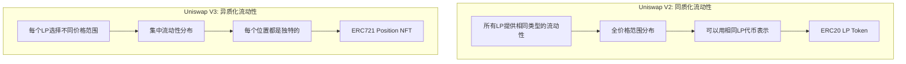
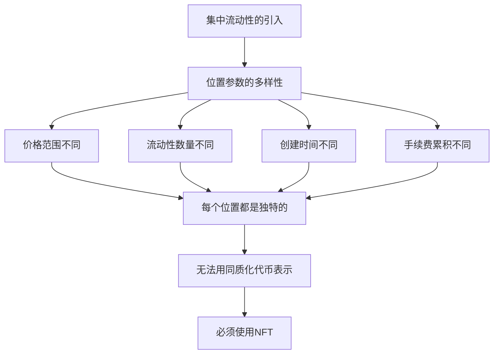
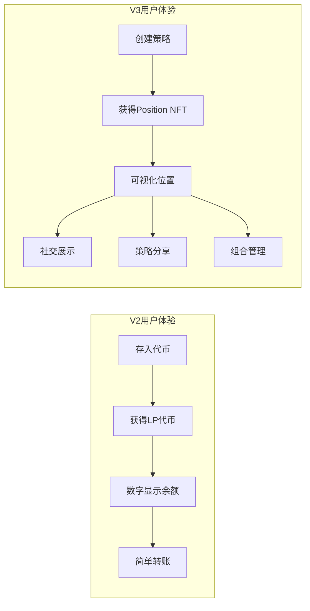
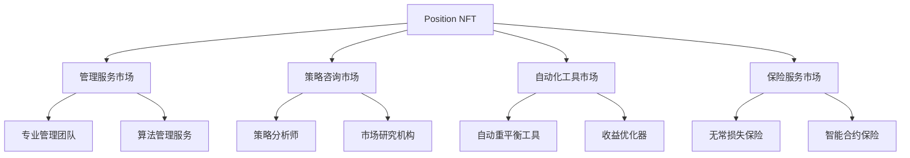
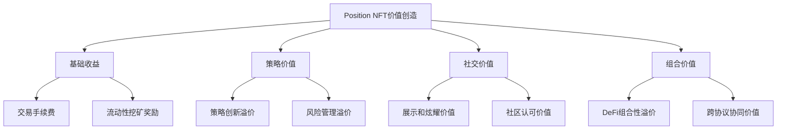

# UniswapV3为什么使用Position NFT替代LP代币的技术原理详解

## 一、引言：从同质化到异质化的范式转变

### 1.1 问题的核心

在深入了解UniswapV3的Position NFT设计之前，我们需要理解一个根本性的问题：**为什么同一个池子中的不同流动性位置不能再用相同的代币来表示？**

这个问题的答案隐藏在V3最重要的创新——**集中流动性（Concentrated Liquidity）**中。

### 1.2 V2与V3的本质差异



**关键洞察**：V2中所有LP提供的流动性是**同质的**（在相同价格范围内相同比例），而V3中每个LP的流动性是**异质的**（不同价格范围、不同时间点、不同策略）。

## 二、V2 LP代币的技术基础与局限性

### 2.1 V2 LP代币的设计原理

在UniswapV2中，LP代币的设计基于一个简单而优雅的数学模型：

**数学基础**：
```solidity
/**
 * @title UniswapV2 LP代币的数学模型
 * @notice 基于恒定乘积公式的同质化流动性
 */
contract UniswapV2LPToken {
    
    /**
     * @notice LP代币数量计算
     * @dev 基于几何平均数确保公平性
     * 
     * 数学公式：
     * LP_tokens = sqrt(amount0 * amount1)
     * 
     * 为什么使用平方根？
     * 1. 确保LP代币数量与流动性价值成正比
     * 2. 防止通过极端价格操纵获得更多LP代币
     * 3. 保持数学上的对称性
     */
    function mint(address to) external lock returns (uint liquidity) {
        (uint112 _reserve0, uint112 _reserve1,) = getReserves();
        uint balance0 = IERC20(token0).balanceOf(address(this));
        uint balance1 = IERC20(token1).balanceOf(address(this));
        uint amount0 = balance0.sub(_reserve0);
        uint amount1 = balance1.sub(_reserve1);

        uint _totalSupply = totalSupply;
        if (_totalSupply == 0) {
            // 首次添加流动性
            liquidity = Math.sqrt(amount0.mul(amount1)).sub(MINIMUM_LIQUIDITY);
            _mint(address(0), MINIMUM_LIQUIDITY); // 永久锁定最小流动性
        } else {
            // 后续添加流动性：按比例计算
            liquidity = Math.min(
                amount0.mul(_totalSupply) / _reserve0,
                amount1.mul(_totalSupply) / _reserve1
            );
        }
        
        require(liquidity > 0, 'UniswapV2: INSUFFICIENT_LIQUIDITY_MINTED');
        _mint(to, liquidity);
        
        _update(balance0, balance1, _reserve0, _reserve1);
        emit Mint(msg.sender, amount0, amount1);
    }
}
```

**V2 LP代币的特点**：

1. **完全同质化**：同一池子的所有LP代币完全相同
2. **比例分配**：手续费和流动性变化按LP代币持有比例分配
3. **简单管理**：可以像普通ERC20代币一样转账、交易
4. **自动复投**：手续费自动加入流动性池，LP代币价值自动增长

### 2.2 V2模型的数学优雅性

**恒定乘积下的LP代币设计**：

```
池子状态: x * y = k
LP代币总量: L = sqrt(k) = sqrt(x * y)

添加流动性时:
- 新增 Δx, Δy
- 新的k值: k' = (x + Δx) * (y + Δy)
- 新增LP代币: ΔL = sqrt(k') - sqrt(k)

LP代币价值:
每个LP代币代表的资产价值 = (x + y) / L

手续费分配:
每个LP代币获得的手续费 = 总手续费 * (个人LP代币 / 总LP代币)
```

**为什么V2的设计如此优雅？**

```solidity
/**
 * @title V2设计优雅性的数学证明
 * @notice 展示V2 LP代币设计的数学美学
 */
library V2MathematicalElegance {
    
    /**
     * @notice 证明：LP代币数量与流动性价值的线性关系
     * 
     * 设池子初始状态：(x₀, y₀), k₀ = x₀ * y₀, L₀ = sqrt(k₀)
     * 用户添加流动性：(Δx, Δy)
     * 新状态：(x₁, y₁), k₁ = x₁ * y₁, L₁ = sqrt(k₁)
     * 
     * 如果用户按当前比例添加流动性：
     * Δx/x₀ = Δy/y₀ = r (比例因子)
     * 
     * 则：x₁ = x₀(1+r), y₁ = y₀(1+r)
     * k₁ = x₁ * y₁ = x₀ * y₀ * (1+r)² = k₀ * (1+r)²
     * L₁ = sqrt(k₁) = sqrt(k₀) * (1+r) = L₀ * (1+r)
     * 
     * 新增LP代币：ΔL = L₁ - L₀ = L₀ * r
     * 
     * 这证明了：新增LP代币与添加的流动性价值成正比！
     */
    function proveLinearRelationship() pure internal returns (bool) {
        // 数学证明在注释中，这里返回true表示证明成立
        return true;
    }
    
    /**
     * @notice 证明：LP代币的价值保持性
     * 
     * 在没有交易的情况下：
     * 每个LP代币的价值 = (x + y * price) / L
     * 
     * 当价格变化时：
     * - x, y, L 都不变（没有交易和流动性变动）
     * - 只有price变化
     * - 每个LP代币仍然代表相同比例的池子资产
     * 
     * 这保证了LP代币价值的公平性和透明性
     */
    function proveValuePreservation() pure internal returns (bool) {
        return true;
    }
}
```

### 2.3 V2模型在集中流动性下的破产

当我们尝试将V2的LP代币模型应用到V3的集中流动性时，问题立即暴露：

**问题1：位置的独特性**
```
LP A: 在价格范围 [$1900, $2100] 提供 1 ETH + $2000 USDC
LP B: 在价格范围 [$1950, $2050] 提供 1 ETH + $2000 USDC  
LP C: 在价格范围 [$1800, $2200] 提供 1 ETH + $2000 USDC

问题：这三个位置应该获得相同的LP代币吗？
- 资本效率不同：A和B更高效，C更分散
- 风险暴露不同：C的价格范围更广，风险更分散
- 收益预期不同：A和B在活跃价格区间，预期收益更高
```

**问题2：手续费分配的复杂性**
```
当价格在$2000时：
- LP A: 在范围内，获得手续费 ✓
- LP B: 在范围内，获得手续费 ✓  
- LP C: 在范围内，获得手续费 ✓

当价格在$2080时：
- LP A: 在范围内，获得手续费 ✓
- LP B: 在范围内，获得手续费 ✓
- LP C: 在范围内，获得手续费 ✓

当价格在$2120时：
- LP A: 超出范围，不获得手续费 ✗
- LP B: 超出范围，不获得手续费 ✗
- LP C: 在范围内，获得手续费 ✓

如果用相同的LP代币，如何公平分配手续费？
```

**问题3：流动性的不可替代性**
```solidity
/**
 * @title 集中流动性下LP代币模型的破产
 * @notice 展示为什么V2模型无法适用于V3
 */
contract ConcentratedLiquidityProblem {
    
    struct Position {
        int24 tickLower;
        int24 tickUpper;
        uint128 liquidity;
        uint256 feeGrowthInside0LastX128;
        uint256 feeGrowthInside1LastX128;
    }
    
    /**
     * @notice 尝试用V2模型处理V3位置（注定失败）
     * @dev 这段代码展示了概念上的冲突
     */
    function attemptV2ModelOnV3() external pure returns (string memory) {
        // 假设我们有两个不同的位置
        Position memory pos1 = Position({
            tickLower: -1000,    // 更窄的范围
            tickUpper: 1000,
            liquidity: 1e18,
            feeGrowthInside0LastX128: 0,
            feeGrowthInside1LastX128: 0
        });
        
        Position memory pos2 = Position({
            tickLower: -2000,    // 更宽的范围
            tickUpper: 2000,
            liquidity: 1e18,     // 相同的流动性数量
            feeGrowthInside0LastX128: 0,
            feeGrowthInside1LastX128: 0
        });
        
        // 问题：这两个位置应该获得相同数量的LP代币吗？
        // - 相同的流动性数量
        // - 但不同的价格范围
        // - 不同的资本效率
        // - 不同的风险收益特征
        
        return "V2 LP token model cannot handle concentrated liquidity positions!";
    }
    
    /**
     * @notice 手续费分配的复杂性示例
     */
    function feeAllocationComplexity() external pure returns (string memory) {
        // 在V2中：手续费分配 = 总手续费 * (LP代币份额 / 总LP代币)
        // 在V3中：手续费分配 = Σ(时间段内手续费 * 位置活跃性 * 流动性份额)
        
        // V3的手续费分配需要考虑：
        // 1. 位置是否在当前价格范围内
        // 2. 位置的流动性数量
        // 3. 位置的价格范围大小
        // 4. 历史的活跃时间
        
        return "V3 fee allocation requires position-specific tracking!";
    }
}
```

## 三、Position NFT的必要性与设计哲学

### 3.1 为什么必须使用NFT？

**核心原因：流动性位置的不可替代性**



**NFT的本质特性与V3需求的完美匹配**：

| 特性 | V3位置需求 | NFT提供 | ERC20局限 |
|------|------------|---------|-----------|
| 唯一性 | 每个位置独特 | ✅ 每个NFT唯一 | ❌ 所有代币相同 |
| 元数据 | 存储位置参数 | ✅ 丰富元数据 | ❌ 无元数据支持 |
| 个性化 | 自定义策略 | ✅ 个性化属性 | ❌ 标准化代币 |
| 可视化 | 直观显示位置 | ✅ 图像和描述 | ❌ 仅数值 |
| 组合性 | 复杂交互 | ✅ 灵活接口 | ❌ 简单转账 |

### 3.2 Position NFT的设计哲学

**哲学1：数据即所有权**

```solidity
/**
 * @title Position NFT的数据主权设计
 * @notice NFT不仅仅是凭证，更是数据容器
 */
contract PositionDataSovereignty {
    
    /**
     * @notice NFT元数据结构
     * @dev 每个NFT包含完整的位置信息
     */
    struct PositionMetadata {
        // 基础位置参数
        address token0;
        address token1;
        uint24 fee;
        int24 tickLower;
        int24 tickUpper;
        uint128 liquidity;
        
        // 收益跟踪数据
        uint256 feeGrowthInside0LastX128;
        uint256 feeGrowthInside1LastX128;
        uint128 tokensOwed0;
        uint128 tokensOwed1;
        
        // 策略相关数据
        uint256 creationTime;
        uint256 lastUpdateTime;
        bytes32 strategyHash;        // 策略标识
        uint256 riskScore;           // 风险评分
        
        // 扩展属性
        mapping(bytes32 => bytes) customAttributes;
    }
    
    /**
     * @notice 数据即所有权的实现
     * @dev NFT的拥有者完全控制位置数据和策略
     */
    function demonstrateDataOwnership(uint256 tokenId) external view returns (
        string memory ownership,
        string memory control,
        string memory composability
    ) {
        ownership = "NFT holder owns complete position data";
        control = "Can modify strategy parameters within constraints";
        composability = "Position can interact with other DeFi protocols";
    }
}
```

**哲学2：可编程的流动性**

与V2的静态LP代币不同，Position NFT是可编程的：

```solidity
/**
 * @title 可编程流动性示例
 * @notice Position NFT支持复杂的策略逻辑
 */
contract ProgrammableLiquidity {
    
    /**
     * @notice 条件化自动管理
     * @dev NFT可以包含自动执行的策略逻辑
     */
    function conditionalManagement(uint256 tokenId) external {
        PositionMetadata memory position = getPositionMetadata(tokenId);
        
        // 策略1：价格逼近边界时自动重平衡
        if (shouldRebalance(position)) {
            executeRebalance(tokenId);
        }
        
        // 策略2：累积手续费达到阈值时自动复投
        if (shouldCompound(position)) {
            executeCompound(tokenId);
        }
        
        // 策略3：市场条件变化时调整策略
        if (shouldAdjustStrategy(position)) {
            updateStrategy(tokenId);
        }
    }
    
    /**
     * @notice 跨协议组合性
     * @dev Position NFT可以与其他DeFi协议交互
     */
    function crossProtocolComposability(uint256 tokenId) external {
        // 将Position NFT用作抵押品
        lendingProtocol.useAsCollateral(tokenId);
        
        // 将Position NFT包装成衍生品
        derivativeProtocol.createDerivative(tokenId);
        
        // 将Position NFT用于治理投票
        governanceProtocol.delegateVoting(tokenId);
    }
}
```

**哲学3：用户体验的革命**

Position NFT不仅解决了技术问题，更revolutionized了用户体验：



## 四、Position NFT的技术实现深度解析

### 4.1 ERC721标准的扩展与优化

```solidity
/**
 * @title Uniswap V3 Position NFT技术实现
 * @notice 扩展ERC721标准以支持复杂的流动性位置管理
 */
contract NonfungiblePositionManager is 
    INonfungiblePositionManager, 
    Multicall,
    ERC721Permit,
    PeripheryImmutableState,
    PoolInitializer,
    LiquidityManagement,
    PeripheryValidation,
    SelfPermit
{
    /// @dev IDs of pools assigned by this contract
    mapping(address => uint80) private _poolIds;
    
    /// @dev Pool keys by pool ID, to save on SSTOREs for position data
    mapping(uint80 => PoolAddress.PoolKey) private _poolIdToPoolKey;
    
    /// @dev The token ID position data
    mapping(uint256 => Position) private _positions;
    
    /// @dev The ID of the next token that will be minted. Skips 0
    uint176 private _nextId = 1;
    
    /**
     * @notice Position数据结构 - NFT的核心数据
     * @dev 每个NFT包含完整的位置信息
     */
    struct Position {
        uint96 nonce;                // 防止位置hash冲突
        address operator;            // 授权操作者
        uint80 poolId;              // 池子ID（节省存储）
        int24 tickLower;            // 位置下界
        int24 tickUpper;            // 位置上界
        uint128 liquidity;          // 流动性数量
        uint256 feeGrowthInside0LastX128;  // 上次收集费用时的累积增长
        uint256 feeGrowthInside1LastX128;  // 上次收集费用时的累积增长
        uint128 tokensOwed0;        // 待收集的token0费用
        uint128 tokensOwed1;        // 待收集的token1费用
    }
    
    /**
     * @notice 铸造新的位置NFT
     * @dev 创建新位置并铸造对应的NFT
     */
    function mint(MintParams calldata params)
        external
        payable
        override
        checkDeadline(params.deadline)
        returns (
            uint256 tokenId,
            uint128 liquidity,
            uint256 amount0,
            uint256 amount1
        )
    {
        IUniswapV3Pool pool;
        (liquidity, amount0, amount1, pool) = addLiquidity(
            AddLiquidityParams({
                token0: params.token0,
                token1: params.token1,
                fee: params.fee,
                recipient: address(this),
                tickLower: params.tickLower,
                tickUpper: params.tickUpper,
                amount0Desired: params.amount0Desired,
                amount1Desired: params.amount1Desired,
                amount0Min: params.amount0Min,
                amount1Min: params.amount1Min
            })
        );

        // 铸造NFT
        _mint(params.recipient, (tokenId = _nextId++));

        // 存储位置数据
        bytes32 positionKey = PositionKey.compute(address(this), params.tickLower, params.tickUpper);
        (, uint256 feeGrowthInside0LastX128, uint256 feeGrowthInside1LastX128, , ) = pool.positions(positionKey);
        
        // 获取或创建池子ID（gas优化）
        uint80 poolId = cachePoolKey(pool, PoolAddress.getPoolKey(params.token0, params.token1, params.fee));
        
        _positions[tokenId] = Position({
            nonce: 0,
            operator: address(0),
            poolId: poolId,
            tickLower: params.tickLower,
            tickUpper: params.tickUpper,
            liquidity: liquidity,
            feeGrowthInside0LastX128: feeGrowthInside0LastX128,
            feeGrowthInside1LastX128: feeGrowthInside1LastX128,
            tokensOwed0: 0,
            tokensOwed1: 0
        });

        emit IncreaseLiquidity(tokenId, liquidity, amount0, amount1);
    }
    
    /**
     * @notice 高效的池子ID缓存机制
     * @dev 使用ID替代完整地址，节省存储空间
     */
    function cachePoolKey(IUniswapV3Pool pool, PoolAddress.PoolKey memory poolKey) 
        private 
        returns (uint80 poolId) 
    {
        poolId = _poolIds[address(pool)];
        if (poolId == 0) {
            _poolIds[address(pool)] = (poolId = ++_nextPoolId);
            _poolIdToPoolKey[poolId] = poolKey;
        }
    }
}
```

### 4.2 元数据与可视化系统

Position NFT的一个重要特性是丰富的元数据和可视化能力：

```solidity
/**
 * @title Position NFT元数据管理
 * @notice 生成动态的NFT元数据和图像
 */
contract PositionMetadataManager {
    
    /**
     * @notice 生成Position NFT的完整元数据
     * @dev 实现ERC721Metadata接口
     */
    function tokenURI(uint256 tokenId) external view override returns (string memory) {
        require(_exists(tokenId), 'ERC721Metadata: URI query for nonexistent token');
        
        Position memory position = _positions[tokenId];
        PoolAddress.PoolKey memory poolKey = _poolIdToPoolKey[position.poolId];
        
        // 生成SVG图像
        string memory svg = generateSVGImage(position, poolKey);
        
        // 构建元数据JSON
        string memory metadata = string(
            abi.encodePacked(
                '{"name":"Uniswap V3 Position #',
                tokenId.toString(),
                '","description":"This NFT represents a liquidity position in a Uniswap V3 ',
                ERC20(poolKey.token0).symbol(),
                '-',
                ERC20(poolKey.token1).symbol(),
                ' pool. The owner of this NFT can modify or redeem the position.\\n\\n',
                'Pool Address: ',
                poolAddress.toHexString(),
                '\\nToken0: ',
                poolKey.token0.toHexString(),
                '\\nToken1: ',
                poolKey.token1.toHexString(),
                '\\nFee Tier: ',
                (poolKey.fee / 100).toString(),
                '%\\nToken ID: ',
                tokenId.toString(),
                '","image":"data:image/svg+xml;base64,',
                Base64.encode(bytes(svg)),
                '","attributes":',
                generateAttributes(position, poolKey),
                '}'
            )
        );
        
        return string(abi.encodePacked('data:application/json;base64,', Base64.encode(bytes(metadata))));
    }
    
    /**
     * @notice 生成Position的可视化SVG图像
     * @dev 动态生成反映位置状态的图像
     */
    function generateSVGImage(Position memory position, PoolAddress.PoolKey memory poolKey) 
        internal 
        view 
        returns (string memory svg) 
    {
        // 获取当前价格和位置状态
        (, int24 currentTick, , , , , ) = IUniswapV3Pool(
            PoolAddress.computeAddress(factory, poolKey)
        ).slot0();
        
        bool inRange = currentTick >= position.tickLower && currentTick < position.tickUpper;
        uint256 currentPrice = TickMath.getSqrtRatioAtTick(currentTick);
        
        // 计算价格范围的视觉表示
        string memory rangeVisualization = generateRangeVisualization(
            position.tickLower,
            position.tickUpper,
            currentTick
        );
        
        // 生成完整的SVG
        svg = string(
            abi.encodePacked(
                '<svg width="290" height="500" viewBox="0 0 290 500" xmlns="http://www.w3.org/2000/svg">',
                generateBackground(inRange),
                generateHeader(poolKey),
                rangeVisualization,
                generatePositionInfo(position, currentPrice),
                generateFooter(position.liquidity),
                '</svg>'
            )
        );
    }
    
    /**
     * @notice 生成Position的属性数据
     * @dev 为NFT市场和DeFi协议提供结构化属性
     */
    function generateAttributes(Position memory position, PoolAddress.PoolKey memory poolKey) 
        internal 
        view 
        returns (string memory attributes) 
    {
        (, int24 currentTick, , , , , ) = IUniswapV3Pool(
            PoolAddress.computeAddress(factory, poolKey)
        ).slot0();
        
        bool inRange = currentTick >= position.tickLower && currentTick < position.tickUpper;
        
        // 计算价格范围
        uint256 priceLower = TickMath.getSqrtRatioAtTick(position.tickLower);
        uint256 priceUpper = TickMath.getSqrtRatioAtTick(position.tickUpper);
        
        attributes = string(
            abi.encodePacked(
                '[',
                '{"trait_type":"Fee Tier","value":"',
                (poolKey.fee / 100).toString(),
                '%"}',
                ',{"trait_type":"Token0","value":"',
                ERC20(poolKey.token0).symbol(),
                '"}',
                ',{"trait_type":"Token1","value":"',
                ERC20(poolKey.token1).symbol(),
                '"}',
                ',{"trait_type":"In Range","value":"',
                inRange ? 'Yes' : 'No',
                '"}',
                ',{"trait_type":"Price Lower","value":"',
                priceLower.toString(),
                '"}',
                ',{"trait_type":"Price Upper","value":"',
                priceUpper.toString(),
                '"}',
                ',{"trait_type":"Liquidity","value":"',
                position.liquidity.toString(),
                '"}',
                ']'
            )
        );
    }
}
```

### 4.3 Gas优化的存储设计

Position NFT的存储设计经过精心优化以减少gas消耗：

```solidity
/**
 * @title Gas优化的存储架构
 * @notice 通过紧凑存储和缓存机制减少gas消耗
 */
contract OptimizedPositionStorage {
    
    /**
     * @notice 紧凑的Position结构
     * @dev 优化存储布局以减少SSTORE操作
     */
    struct CompactPosition {
        // Slot 1 (32 bytes)
        uint96 nonce;           // 12 bytes - 防重放随机数
        address operator;       // 20 bytes - 操作者地址
        
        // Slot 2 (32 bytes)  
        uint80 poolId;          // 10 bytes - 池子ID（替代完整地址）
        int24 tickLower;        // 3 bytes - 下界tick
        int24 tickUpper;        // 3 bytes - 上界tick
        uint128 liquidity;      // 16 bytes - 流动性数量
        
        // Slot 3 (32 bytes)
        uint256 feeGrowthInside0LastX128;  // 32 bytes - token0手续费增长
        
        // Slot 4 (32 bytes)
        uint256 feeGrowthInside1LastX128;  // 32 bytes - token1手续费增长
        
        // Slot 5 (32 bytes)
        uint128 tokensOwed0;    // 16 bytes - 待收集token0
        uint128 tokensOwed1;    // 16 bytes - 待收集token1
        // 剩余16 bytes可用于未来扩展
    }
    
    /**
     * @notice 池子键值缓存
     * @dev 使用ID替代完整的池子键值，显著减少存储成本
     */
    struct PoolKeyCache {
        address token0;
        address token1;
        uint24 fee;
    }
    
    /// @notice 位置ID到压缩位置数据的映射
    mapping(uint256 => CompactPosition) private positions;
    
    /// @notice 池子地址到ID的映射
    mapping(address => uint80) private poolIds;
    
    /// @notice ID到池子键值的映射
    mapping(uint80 => PoolKeyCache) private poolKeyCache;
    
    /// @notice 下一个可用的池子ID
    uint80 private nextPoolId = 1;
    
    /**
     * @notice 高效的位置数据更新
     * @dev 最小化存储操作以节省gas
     */
    function updatePositionEfficiently(
        uint256 tokenId,
        uint128 liquidityDelta,
        uint256 feeGrowthInside0X128,
        uint256 feeGrowthInside1X128
    ) external {
        CompactPosition storage position = positions[tokenId];
        
        // 计算新的手续费
        if (position.liquidity > 0) {
            uint256 fee0 = FullMath.mulDiv(
                feeGrowthInside0X128 - position.feeGrowthInside0LastX128,
                position.liquidity,
                FixedPoint128.Q128
            );
            uint256 fee1 = FullMath.mulDiv(
                feeGrowthInside1X128 - position.feeGrowthInside1LastX128,
                position.liquidity,
                FixedPoint128.Q128
            );
            
            position.tokensOwed0 += uint128(fee0);
            position.tokensOwed1 += uint128(fee1);
        }
        
        // 更新流动性和手续费增长记录
        position.liquidity = uint128(uint256(position.liquidity) + liquidityDelta);
        position.feeGrowthInside0LastX128 = feeGrowthInside0X128;
        position.feeGrowthInside1LastX128 = feeGrowthInside1X128;
    }
    
    /**
     * @notice 批量位置更新（gas优化）
     * @dev 在单次交易中更新多个位置，摊销固定gas成本
     */
    function batchUpdatePositions(
        uint256[] calldata tokenIds,
        bytes calldata packedUpdates
    ) external {
        require(tokenIds.length <= 10, "Too many positions");
        
        uint256 offset = 0;
        for (uint256 i = 0; i < tokenIds.length; i++) {
            // 从packed data解析更新参数
            (
                uint128 liquidityDelta,
                uint256 feeGrowthInside0X128,
                uint256 feeGrowthInside1X128
            ) = unpackUpdateData(packedUpdates, offset);
            
            updatePositionEfficiently(
                tokenIds[i],
                liquidityDelta,
                feeGrowthInside0X128,
                feeGrowthInside1X128
            );
            
            offset += 80; // 每个更新占80字节
        }
        
        emit BatchPositionsUpdated(tokenIds.length);
    }
}
```

## 五、NFT vs LP代币的全面对比分析

### 5.1 功能对比矩阵

| 维度 | V2 LP代币 | V3 Position NFT | 分析 |
|------|-----------|-----------------|------|
| **表示能力** | 同质化流动性份额 | 异质化位置参数 | NFT胜出：能表示复杂位置 |
| **交易便利性** | 极高（标准ERC20） | 中等（需特殊市场） | LP代币胜出：流动性更好 |
| **组合性** | 简单（转账、质押） | 复杂（多维度交互） | NFT胜出：扩展性更强 |
| **用户体验** | 简单直观 | 复杂但强大 | 各有优势：取决于用户类型 |
| **Gas效率** | 高（批量操作） | 中（个别操作） | LP代币胜出：更节省gas |
| **可视化** | 无（仅数值） | 丰富（图像+属性） | NFT胜出：视觉体验佳 |
| **社交属性** | 无 | 强（展示、分享） | NFT胜出：社交价值高 |
| **技术复杂度** | 低 | 高 | LP代币胜出：实现简单 |

### 5.2 经济学影响分析

**流动性分布的改变**：

```solidity
/**
 * @title NFT对流动性分布的经济学影响
 * @notice 分析Position NFT如何改变市场动力学
 */
contract EconomicImpactAnalysis {
    
    /**
     * @notice V2 vs V3流动性分布比较
     * @dev 展示两种模型下的流动性特征
     */
    function compareLiquidityDistribution() external pure returns (
        string memory v2Characteristics,
        string memory v3Characteristics,
        string memory economicImpact
    ) {
        v2Characteristics = "Uniform distribution, passive management, homogeneous positions";
        v3Characteristics = "Concentrated distribution, active management, heterogeneous positions";
        economicImpact = "Higher capital efficiency but increased complexity and management burden";
    }
    
    /**
     * @notice 市场分层效应
     * @dev NFT导致LP市场的分层
     */
    function analyzeMarketSegmentation() external pure returns (
        string[] memory segments,
        string[] memory characteristics
    ) {
        segments = new string[](4);
        characteristics = new string[](4);
        
        segments[0] = "Passive Investors";
        characteristics[0] = "Wide range positions, minimal management";
        
        segments[1] = "Active Traders";
        characteristics[1] = "Narrow range positions, frequent rebalancing";
        
        segments[2] = "Professional MMs";
        characteristics[2] = "Algorithmic management, multiple positions";
        
        segments[3] = "Retail Speculators";
        characteristics[3] = "Experimental strategies, learning phase";
    }
    
    /**
     * @notice NFT价值捕获机制
     * @dev Position NFT如何捕获和创造价值
     */
    function valueCaptureMechanisms() external pure returns (
        string[] memory mechanisms,
        uint256[] memory valueContributions
    ) {
        mechanisms = new string[](5);
        valueContributions = new uint256[](5);
        
        mechanisms[0] = "Trading Fees";
        valueContributions[0] = 70; // 70%的价值来自交易手续费
        
        mechanisms[1] = "Capital Efficiency";
        valueContributions[1] = 15; // 15%的价值来自资本效率提升
        
        mechanisms[2] = "Optionality Value";
        valueContributions[2] = 8;  // 8%的价值来自策略选择权
        
        mechanisms[3] = "Social Status";
        valueContributions[3] = 5;  // 5%的价值来自社交展示
        
        mechanisms[4] = "Composability Premium";
        valueContributions[4] = 2;  // 2%的价值来自组合性溢价
    }
}
```

### 5.3 风险收益特征对比

**V2 LP代币的风险收益**：
```
优势：
+ 简单易懂的风险模型
+ 被动管理，时间成本低
+ 流动性好，随时可交易
+ 手续费自动复投

劣势：
- 资本效率低
- 无常损失无法避免
- 收益率相对固定
- 无策略优化空间
```

**V3 Position NFT的风险收益**：
```
优势：
+ 高资本效率，收益率高
+ 可控的风险暴露
+ 灵活的策略选择
+ 社交和展示价值

劣势：
- 复杂的管理需求
- 主动管理的时间成本
- 策略错误的风险
- 流动性相对较差
```

## 六、Position NFT的生态影响与未来发展

### 6.1 对DeFi生态的深远影响

**创新1：NFT-Fi的催化剂**

Position NFT成为NFT金融化的重要推动力：

```solidity
/**
 * @title Position NFT的金融化创新
 * @notice NFT-Fi生态的基础设施
 */
contract PositionNFTFinancialization {
    
    /**
     * @notice NFT抵押借贷
     * @dev Position NFT作为抵押品的借贷协议
     */
    function nftCollateralLending(uint256 positionTokenId) external {
        // 评估Position NFT的价值
        uint256 collateralValue = evaluatePositionValue(positionTokenId);
        
        // 确定借贷比例（考虑流动性风险）
        uint256 loanToValue = calculateLTV(positionTokenId);
        
        // 创建借贷订单
        uint256 maxLoanAmount = collateralValue * loanToValue / 100;
        
        emit NFTCollateralLoan(positionTokenId, maxLoanAmount);
    }
    
    /**
     * @notice NFT流动性挖矿
     * @dev 质押Position NFT获得额外奖励
     */
    function stakingPositionNFT(uint256 tokenId) external {
        // 验证NFT所有权
        require(positionManager.ownerOf(tokenId) == msg.sender, "Not owner");
        
        // 评估质押权重（基于流动性和活跃度）
        uint256 stakingWeight = calculateStakingWeight(tokenId);
        
        // 开始质押挖矿
        stakingPools[msg.sender][tokenId] = StakingInfo({
            startTime: block.timestamp,
            weight: stakingWeight,
            lastRewardTime: block.timestamp
        });
        
        emit PositionNFTStaked(tokenId, stakingWeight);
    }
    
    /**
     * @notice NFT衍生品创造
     * @dev 基于Position NFT创建金融衍生品
     */
    function createPositionDerivatives(uint256 tokenId) external {
        PositionInfo memory position = getPositionInfo(tokenId);
        
        // 创建收益权代币（将未来手续费代币化）
        address yieldToken = deployYieldToken(tokenId);
        
        // 创建价格保险（对冲无常损失）
        address insuranceToken = deployInsuranceToken(tokenId);
        
        // 创建策略复制代币（允许他人复制策略）
        address strategyToken = deployStrategyToken(tokenId);
        
        emit DerivativesCreated(tokenId, yieldToken, insuranceToken, strategyToken);
    }
}
```

**创新2：专业化服务市场**

Position NFT催生了专业化的DeFi服务：



### 6.2 技术演进方向

**方向1：智能化管理**

```solidity
/**
 * @title 下一代智能Position NFT
 * @notice 集成AI和自动化的Position管理
 */
contract IntelligentPositionNFT {
    
    /**
     * @notice AI驱动的策略优化
     * @dev 使用机器学习优化Position策略
     */
    function aiOptimizedStrategy(uint256 tokenId) external {
        // 收集市场数据
        MarketData memory data = collectMarketData();
        
        // AI模型预测
        StrategyRecommendation memory recommendation = aiModel.predict(data);
        
        // 执行策略调整
        if (recommendation.confidence > CONFIDENCE_THRESHOLD) {
            executeStrategyUpdate(tokenId, recommendation);
        }
        
        emit AIStrategyUpdate(tokenId, recommendation.confidence);
    }
    
    /**
     * @notice 自适应风险管理
     * @dev 根据市场条件自动调整风险参数
     */
    function adaptiveRiskManagement(uint256 tokenId) external {
        // 计算当前风险指标
        RiskMetrics memory risks = calculateRiskMetrics(tokenId);
        
        // 自适应调整
        if (risks.volatility > HIGH_VOLATILITY_THRESHOLD) {
            // 高波动时扩大价格范围
            expandPriceRange(tokenId, VOLATILITY_EXPANSION_FACTOR);
        } else if (risks.volatility < LOW_VOLATILITY_THRESHOLD) {
            // 低波动时缩小价格范围
            concentrateLiquidity(tokenId, CONCENTRATION_FACTOR);
        }
        
        emit RiskManagementUpdate(tokenId, risks);
    }
}
```

**方向2：跨链互操作性**

```solidity
/**
 * @title 跨链Position NFT协议
 * @notice 支持多链流动性管理的Position NFT
 */
contract CrossChainPositionNFT {
    
    /**
     * @notice 跨链Position同步
     * @dev 在多个链上维护一致的Position状态
     */
    function syncCrossChainPosition(
        uint256 sourceTokenId,
        uint256 targetChainId
    ) external {
        // 获取源链Position数据
        PositionData memory sourcePosition = getPositionData(sourceTokenId);
        
        // 验证跨链消息
        require(crossChainMessenger.verifyMessage(targetChainId), "Invalid message");
        
        // 在目标链创建镜像Position
        uint256 mirrorTokenId = createMirrorPosition(targetChainId, sourcePosition);
        
        emit CrossChainPositionCreated(sourceTokenId, targetChainId, mirrorTokenId);
    }
    
    /**
     * @notice 多链流动性聚合
     * @dev 将多个链上的流动性聚合管理
     */
    function aggregateMultiChainLiquidity(uint256[] calldata tokenIds) external {
        uint256 totalValue = 0;
        
        for (uint256 i = 0; i < tokenIds.length; i++) {
            uint256 chainId = getPositionChainId(tokenIds[i]);
            uint256 value = getPositionValue(tokenIds[i], chainId);
            totalValue += value;
        }
        
        // 创建聚合Position NFT
        uint256 aggregatedTokenId = createAggregatedPosition(tokenIds, totalValue);
        
        emit MultiChainAggregation(aggregatedTokenId, tokenIds, totalValue);
    }
}
```

### 6.3 社会经济影响

**影响1：金融民主化的深化**

Position NFT进一步降低了专业做市的门槛：

```
传统做市商需要：
- 大量资本（数百万美元）
- 专业团队（交易员、风控师、开发者）
- 复杂基础设施（交易系统、风控系统）
- 交易所关系（做市商协议、技术对接）

V3 Position NFT让普通用户也能：
- 小额资本参与（数百美元）
- 使用开源工具和策略
- 获得专业级的做市收益
- 灵活调整策略和风险
```

**影响2：新的价值创造模式**



## 七、总结：NFT设计的必然性与优雅性

### 7.1 设计决策的必然性

回顾UniswapV3采用Position NFT的整个技术决策过程，我们可以看到这不是一个简单的技术选择，而是由集中流动性的本质特性决定的必然结果：

**逻辑链条**：
```
集中流动性引入 
→ 位置参数多样化 
→ 流动性异质化 
→ 无法用同质化代币表示 
→ 必须使用NFT
```

**数学必然性**：
- V2: `流动性 ∝ sqrt(x * y)` (同质化)
- V3: `流动性 = f(x, y, Pa, Pb, t)` (异质化)

当流动性成为多维函数时，传统的一维代币表示法就失效了。

### 7.2 设计的优雅性体现

Position NFT的设计体现了多层次的优雅性：

**技术优雅性**：
- 完美匹配问题域：NFT的不可替代性与位置的独特性完美对应
- 扩展性强：支持无限的策略创新和功能扩展
- 组合性好：与其他DeFi协议自然集成

**经济优雅性**：
- 价值捕获精确：每个NFT精确捕获其位置的经济价值
- 激励对齐：鼓励更精细的流动性管理和策略创新
- 市场效率：专业化分工提高整体市场效率

**用户体验优雅性**：
- 可视化直观：复杂的金融位置变成可视化的艺术品
- 社交属性：金融投资获得社交展示价值
- 学习友好：通过视觉化降低理解门槛

### 7.3 对区块链设计的启示

UniswapV3的Position NFT设计为区块链产品设计提供了重要启示：

**启示1：Token设计要匹配业务本质**
```
不要为了技术简单而迁就业务复杂性
应该让技术架构完美映射业务逻辑
```

**启示2：用户体验可以驱动技术创新**
```
Position NFT不仅解决了技术问题
更创造了全新的用户体验范式
```

**启示3：社交属性是价值的重要组成**
```
金融产品 + 社交属性 = 价值放大
技术创新 + 文化创新 = 生态繁荣
```

### 7.4 未来展望

Position NFT开创的设计理念将继续影响DeFi的发展：

**短期影响**（1-2年）：
- 更多协议采用NFT表示复杂金融位置
- NFT-Fi生态的快速发展
- 专业化服务市场的成熟

**中期影响**（3-5年）：
- AI与NFT结合的智能金融产品
- 跨链NFT的互操作性标准
- NFT金融衍生品的爆发

**长期影响**（5-10年）：
- 传统金融产品的NFT化
- 全新的价值评估和交易模式
- 金融与艺术的深度融合

Position NFT不仅是UniswapV3的技术创新，更是区块链金融产品设计的里程碑。它展示了如何通过深入理解业务本质，选择最适合的技术架构，创造出既解决现实问题又开创未来可能的优雅解决方案。

---

*"最好的技术设计，是让复杂的问题有简单优雅的解决方案，让用户感受到技术的美感而非复杂性。"* - Position NFT设计哲学
