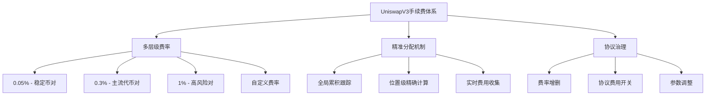
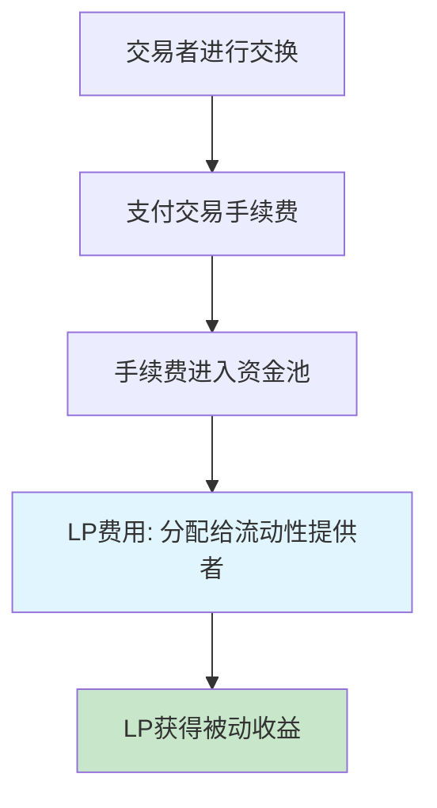
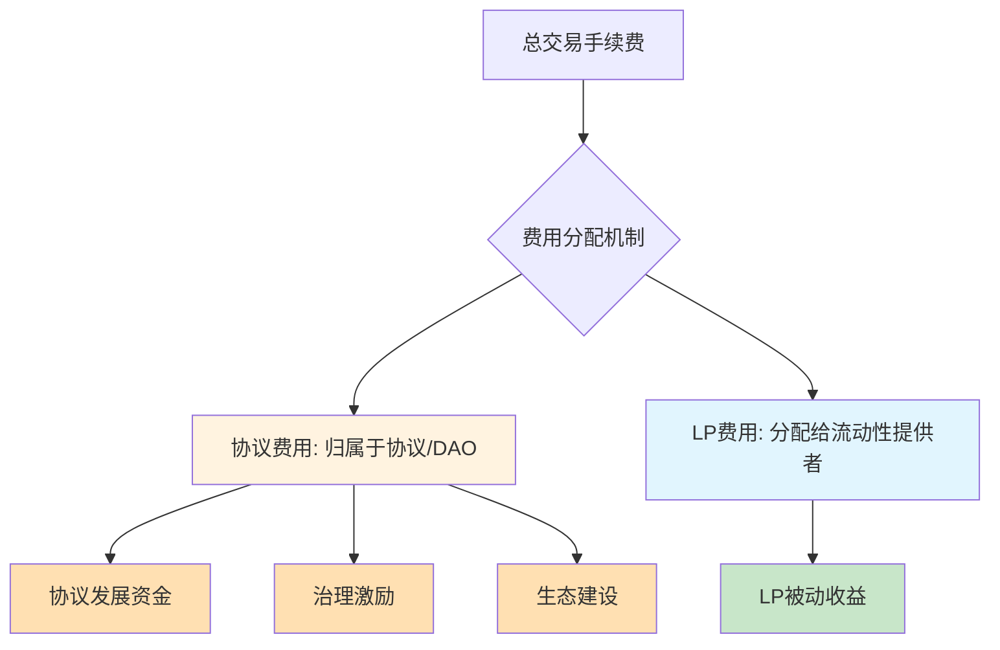

# UniswapV3 手续费机制技术原理及其实现详解

## 一、引言：从固定费率到动态费率体系的革命

### 1.1 V2手续费机制的局限性

在UniswapV2中，手续费机制相对简单：

**V2的固定费率模式**：
- 统一的0.3%交易手续费
- 手续费直接加入流动性池
- 按LP代币份额平均分配
- 无法根据市场条件调整

```solidity
// V2中的手续费计算
function getAmountOut(uint amountIn, uint reserveIn, uint reserveOut) 
    internal pure returns (uint amountOut) {
    uint amountInWithFee = amountIn.mul(997); // 0.3%手续费
    uint numerator = amountInWithFee.mul(reserveOut);
    uint denominator = reserveIn.mul(1000).add(amountInWithFee);
    amountOut = numerator / denominator;
}
```

**V2费率机制的问题**：
1. **一刀切的费率**：无法适应不同资产的风险特征
2. **缺乏灵活性**：市场变化时无法调整费率
3. **效率低下**：稳定币对收费过高，高波动对收费不足
4. **竞争劣势**：无法与专业做市商的动态定价竞争

### 1.2 V3手续费机制的创新突破

UniswapV3引入了革命性的多层级手续费体系：

**核心创新特点**：
- **多层级费率选择**：0.05%、0.3%、1%三个标准等级
- **基于风险的定价**：不同风险资产使用不同费率
- **治理可扩展性**：可通过DAO投票添加新费率等级
- **协议费用分离**：LP费用与协议费用独立管理



## 二、多层级费率体系的设计原理

### 2.1 费率分层的经济学基础

**不同资产类别的风险特征分析**：

| 资产类别 | 价格波动性 | 无常损失风险 | 交易频率 | 建议费率 |
|----------|------------|--------------|----------|----------|
| 稳定币对 | 极低(±0.5%) | 极低 | 极高 | 0.05% |
| 主流代币对 | 中等(±5-20%) | 中等 | 高 | 0.3% |
| 山寨币对 | 高(±20%+) | 高 | 中等 | 1% |
| 特殊资产 | 极高 | 极高 | 低 | 自定义 |

**费率定价的数学模型**：

```
最优费率 = f(无常损失期望值, 交易量弹性, 竞争环境)

其中：
- 无常损失期望值 ∝ 资产波动率²
- 交易量弹性 = d(交易量)/d(费率)
- 竞争环境 = 其他平台的费率水平
```

### 2.2 费率等级的技术实现

**工厂合约中的费率管理**：

```solidity
/**
 * @title UniswapV3Factory 费率管理
 * @notice 管理所有支持的费率等级和对应的tick spacing
 */
contract UniswapV3Factory is IUniswapV3Factory {
    
    /// @notice 费率到tick spacing的映射
    mapping(uint24 => int24) public override feeAmountTickSpacing;
    
    /// @notice 代币对到池子的映射 token0 -> token1 -> fee -> pool
    mapping(address => mapping(address => mapping(uint24 => address))) public override getPool;
    
    /// @notice 所有已创建的池子
    address[] public override allPools;
    
    /// @notice 池子创建事件
    event PoolCreated(
        address indexed token0,
        address indexed token1,
        uint24 indexed fee,
        int24 tickSpacing,
        address pool
    );
    
    /// @notice 费率启用事件
    event FeeAmountEnabled(uint24 indexed fee, int24 indexed tickSpacing);
    
    constructor() {
        // 初始化标准费率等级
        _enableFeeAmount(500, 10);    // 0.05%, tick spacing = 10
        _enableFeeAmount(3000, 60);   // 0.3%, tick spacing = 60  
        _enableFeeAmount(10000, 200); // 1%, tick spacing = 200
    }
    
    /**
     * @notice 创建新的交易池
     * @param tokenA 第一个代币地址
     * @param tokenB 第二个代币地址
     * @param fee 费率（以百万分之一为单位）
     * @return pool 新创建的池子地址
     */
    function createPool(
        address tokenA,
        address tokenB,
        uint24 fee
    ) external override noDelegateCall returns (address pool) {
        require(tokenA != tokenB, 'IDENTICAL_ADDRESSES');
        
        // 确保token0 < token1
        (address token0, address token1) = tokenA < tokenB ? (tokenA, tokenB) : (tokenB, tokenA);
        require(token0 != address(0), 'ZERO_ADDRESS');
        
        // 验证费率是否已启用
        int24 tickSpacing = feeAmountTickSpacing[fee];
        require(tickSpacing != 0, 'FEE_NOT_ENABLED');
        
        // 确保池子不存在
        require(getPool[token0][token1][fee] == address(0), 'POOL_EXISTS');
        
        // 使用CREATE2部署池子
        pool = deploy(address(this), token0, token1, fee, tickSpacing);
        
        // 更新映射
        getPool[token0][token1][fee] = pool;
        getPool[token1][token0][fee] = pool; // 双向映射
        allPools.push(pool);
        
        emit PoolCreated(token0, token1, fee, tickSpacing, pool);
    }
    
    /**
     * @notice 启用新的费率等级（仅限所有者）
     * @param fee 费率（百万分之一）
     * @param tickSpacing 对应的tick间距
     */
    function enableFeeAmount(uint24 fee, int24 tickSpacing) public override onlyOwner {
        require(fee < 1000000, 'FEE_TOO_HIGH'); // 费率不能超过100%
        require(tickSpacing > 0 && tickSpacing < 16384, 'INVALID_TICK_SPACING');
        require(feeAmountTickSpacing[fee] == 0, 'FEE_ALREADY_ENABLED');
        
        feeAmountTickSpacing[fee] = tickSpacing;
        emit FeeAmountEnabled(fee, tickSpacing);
    }
    
    /**
     * @notice 内部费率启用函数
     */
    function _enableFeeAmount(uint24 fee, int24 tickSpacing) internal {
        feeAmountTickSpacing[fee] = tickSpacing;
        emit FeeAmountEnabled(fee, tickSpacing);
    }
}
```

**费率与Tick Spacing的关系**：

```solidity
/**
 * @title 费率等级配置解释
 * @notice 解释不同费率等级的设计考虑
 */
library FeeConfiguration {
    
    /**
     * @notice 0.05%费率池 - 稳定币专用
     * @dev tick spacing = 10, 最小价格变动 ≈ 0.1%
     * 
     * 设计考虑：
     * - 稳定币对价格波动极小
     * - 需要高精度的价格管理
     * - 交易量大，对费率敏感
     * - 无常损失风险极低
     */
    uint24 constant FEE_LOW = 500;
    int24 constant TICK_SPACING_LOW = 10;
    
    /**
     * @notice 0.3%费率池 - 主流代币对
     * @dev tick spacing = 60, 最小价格变动 ≈ 0.6%
     * 
     * 设计考虑：
     * - 主流代币具有中等波动性
     * - 平衡精度与gas效率
     * - 继承V2的标准费率
     * - 适合大多数交易对
     */
    uint24 constant FEE_MEDIUM = 3000;
    int24 constant TICK_SPACING_MEDIUM = 60;
    
    /**
     * @notice 1%费率池 - 高风险代币对
     * @dev tick spacing = 200, 最小价格变动 ≈ 2%
     * 
     * 设计考虑：
     * - 高风险资产价格波动大
     * - 需要更高费率补偿风险
     * - 精度要求相对较低
     * - 减少gas消耗
     */
    uint24 constant FEE_HIGH = 10000;
    int24 constant TICK_SPACING_HIGH = 200;
    
    /**
     * @notice 根据资产特征推荐费率
     * @param volatility 年化波动率（基点）
     * @param volume24h 24小时交易量
     * @param marketCap 市值
     * @return recommendedFee 推荐费率
     */
    function recommendFee(
        uint256 volatility,
        uint256 volume24h,
        uint256 marketCap
    ) internal pure returns (uint24 recommendedFee) {
        
        // 稳定币判断：波动率 < 5% 且市值 > 10亿
        if (volatility < 500 && marketCap > 1e9 ether) {
            return FEE_LOW;
        }
        
        // 高风险资产：波动率 > 50% 或市值 < 1亿
        if (volatility > 5000 || marketCap < 1e8 ether) {
            return FEE_HIGH;
        }
        
        // 默认中等费率
        return FEE_MEDIUM;
    }
}
```

## 三、手续费累积与分配的精密算法

### 3.1 全局手续费增长跟踪机制

**核心概念**：V3使用累积增长率（Fee Growth）来精确跟踪每单位流动性应得的手续费。

```solidity
/**
 * @title 手续费增长跟踪系统
 * @notice 实现精确的手续费累积和分配
 */
contract FeeGrowthTracker {
    
    /// @notice 全局手续费增长率（Q128.128定点数）
    uint256 public feeGrowthGlobal0X128; // token0的累积手续费增长
    uint256 public feeGrowthGlobal1X128; // token1的累积手续费增长
    
    /// @notice 当前活跃流动性
    uint128 public liquidity;
    
    /**
     * @notice 更新全局手续费增长率
     * @param feeAmount0 token0的手续费数量
     * @param feeAmount1 token1的手续费数量
     */
    function updateFeeGrowth(uint256 feeAmount0, uint256 feeAmount1) internal {
        if (liquidity > 0) {
            // 计算每单位流动性的手续费增长
            // 使用Q128.128格式以提高精度
            feeGrowthGlobal0X128 += FullMath.mulDiv(feeAmount0, FixedPoint128.Q128, liquidity);
            feeGrowthGlobal1X128 += FullMath.mulDiv(feeAmount1, FixedPoint128.Q128, liquidity);
        }
    }
    
    /**
     * @notice 手续费增长数学解释
     * 
     * 假设：
     * - 当前流动性：L
     * - 新产生的手续费：F
     * - 每单位流动性的手续费增长：ΔG = F / L
     * 
     * 全局增长率更新：
     * feeGrowthGlobal_new = feeGrowthGlobal_old + ΔG
     * 
     * Q128.128格式转换：
     * ΔG_Q128 = (F * 2^128) / L
     */
}
```

**手续费增长率的数学原理**：

```
设在时间区间[t₁, t₂]内：
- 产生手续费：F₁, F₂, ..., Fₙ
- 对应流动性：L₁, L₂, ..., Lₙ

全局手续费增长率：
FeeGrowthGlobal = Σᵢ(Fᵢ / Lᵢ)

对于位置P，其累积手续费：
Position_Fee = Liquidity_P × (FeeGrowthGlobal_current - FeeGrowthGlobal_position_start)
```

### 3.2 Tick级别的手续费跟踪

**关键洞察**：只有当价格在流动性位置范围内时，该位置才能获得手续费。

```solidity
/**
 * @title Tick级别手续费跟踪
 * @notice 跟踪每个tick边界外的手续费增长
 */
library TickMath {
    
    /// @notice Tick信息结构
    struct Info {
        uint128 liquidityGross;              // 该tick的总流动性（绝对值）
        int128 liquidityNet;                 // 该tick的净流动性变化
        uint256 feeGrowthOutside0X128;       // tick外部token0手续费增长
        uint256 feeGrowthOutside1X128;       // tick外部token1手续费增长
        int56 tickCumulativeOutside;         // tick外部价格累积
        uint160 secondsPerLiquidityOutsideX128; // tick外部时间加权
        uint32 secondsOutside;               // tick外部时间累积
        bool initialized;                    // 是否已初始化
    }
    
    /**
     * @notice 穿越tick时更新手续费跟踪
     * @param self tick信息映射
     * @param tick 被穿越的tick
     * @param feeGrowthGlobal0X128 当前全局token0手续费增长
     * @param feeGrowthGlobal1X128 当前全局token1手续费增长
     * @return liquidityNet 该tick的净流动性变化
     */
    function cross(
        mapping(int24 => Info) storage self,
        int24 tick,
        uint256 feeGrowthGlobal0X128,
        uint256 feeGrowthGlobal1X128,
        uint160 secondsPerLiquidityCumulativeX128,
        int56 tickCumulative,
        uint32 time
    ) internal returns (int128 liquidityNet) {
        Info storage info = self[tick];
        
        // 更新tick外部的累积数据
        info.feeGrowthOutside0X128 = feeGrowthGlobal0X128 - info.feeGrowthOutside0X128;
        info.feeGrowthOutside1X128 = feeGrowthGlobal1X128 - info.feeGrowthOutside1X128;
        info.secondsPerLiquidityOutsideX128 = secondsPerLiquidityCumulativeX128 - info.secondsPerLiquidityOutsideX128;
        info.tickCumulativeOutside = tickCumulative - info.tickCumulativeOutside;
        info.secondsOutside = time - info.secondsOutside;
        
        liquidityNet = info.liquidityNet;
    }
    
    /**
     * @notice 计算位置范围内的手续费增长
     * @param tickLower 位置下界
     * @param tickUpper 位置上界
     * @param tickCurrent 当前tick
     * @param feeGrowthGlobal0X128 全局token0手续费增长
     * @param feeGrowthGlobal1X128 全局token1手续费增长
     * @return feeGrowthInside0X128 位置内token0手续费增长
     * @return feeGrowthInside1X128 位置内token1手续费增长
     */
    function getFeeGrowthInside(
        mapping(int24 => Info) storage self,
        int24 tickLower,
        int24 tickUpper,
        int24 tickCurrent,
        uint256 feeGrowthGlobal0X128,
        uint256 feeGrowthGlobal1X128
    ) internal view returns (uint256 feeGrowthInside0X128, uint256 feeGrowthInside1X128) {
        
        Info storage lower = self[tickLower];
        Info storage upper = self[tickUpper];
        
        // 计算下界以下的手续费增长
        uint256 feeGrowthBelow0X128;
        uint256 feeGrowthBelow1X128;
        if (tickCurrent >= tickLower) {
            feeGrowthBelow0X128 = lower.feeGrowthOutside0X128;
            feeGrowthBelow1X128 = lower.feeGrowthOutside1X128;
        } else {
            feeGrowthBelow0X128 = feeGrowthGlobal0X128 - lower.feeGrowthOutside0X128;
            feeGrowthBelow1X128 = feeGrowthGlobal1X128 - lower.feeGrowthOutside1X128;
        }
        
        // 计算上界以上的手续费增长
        uint256 feeGrowthAbove0X128;
        uint256 feeGrowthAbove1X128;
        if (tickCurrent < tickUpper) {
            feeGrowthAbove0X128 = upper.feeGrowthOutside0X128;
            feeGrowthAbove1X128 = upper.feeGrowthOutside1X128;
        } else {
            feeGrowthAbove0X128 = feeGrowthGlobal0X128 - upper.feeGrowthOutside0X128;
            feeGrowthAbove1X128 = feeGrowthGlobal1X128 - upper.feeGrowthOutside1X128;
        }
        
        // 位置内的手续费增长 = 全局增长 - 下方增长 - 上方增长
        feeGrowthInside0X128 = feeGrowthGlobal0X128 - feeGrowthBelow0X128 - feeGrowthAbove0X128;
        feeGrowthInside1X128 = feeGrowthGlobal1X128 - feeGrowthBelow1X128 - feeGrowthAbove1X128;
    }
}
```

**手续费范围计算的图示说明**：

```
价格轴：  ----[tickLower]=====[current]=====[tickUpper]----

手续费分布：
- 下方区域 (below): [0, tickLower)
- 位置内区域 (inside): [tickLower, tickUpper]  
- 上方区域 (above): (tickUpper, ∞]

位置内手续费 = 总手续费 - 下方手续费 - 上方手续费
```

### 3.3 位置级别的精确手续费计算

```solidity
/**
 * @title 位置手续费管理
 * @notice 管理单个流动性位置的手续费计算和收集
 */
contract PositionFeeManager {
    
    /// @notice 位置信息结构
    struct PositionInfo {
        uint128 liquidity;                    // 位置流动性
        uint256 feeGrowthInside0LastX128;     // 上次更新时的token0手续费增长
        uint256 feeGrowthInside1LastX128;     // 上次更新时的token1手续费增长
        uint128 tokensOwed0;                  // 待收集的token0
        uint128 tokensOwed1;                  // 待收集的token1
    }
    
    /// @notice 位置映射：keccak256(owner, tickLower, tickUpper) => PositionInfo
    mapping(bytes32 => PositionInfo) public positions;
    
    /**
     * @notice 更新位置手续费
     * @param owner 位置所有者
     * @param tickLower 位置下界
     * @param tickUpper 位置上界
     * @param liquidityDelta 流动性变化量
     * @return position 更新后的位置信息
     */
    function _updatePosition(
        address owner,
        int24 tickLower,
        int24 tickUpper,
        int128 liquidityDelta,
        int24 tick
    ) private returns (PositionInfo storage position) {
        
        bytes32 positionKey = keccak256(abi.encodePacked(owner, tickLower, tickUpper));
        position = positions[positionKey];
        
        // 获取位置范围内的当前手续费增长
        (uint256 feeGrowthInside0X128, uint256 feeGrowthInside1X128) =
            ticks.getFeeGrowthInside(tickLower, tickUpper, tick, feeGrowthGlobal0X128, feeGrowthGlobal1X128);
        
        // 如果位置存在，计算累积的手续费
        if (position.liquidity > 0) {
            position.tokensOwed0 += uint128(
                FullMath.mulDiv(
                    feeGrowthInside0X128 - position.feeGrowthInside0LastX128,
                    position.liquidity,
                    FixedPoint128.Q128
                )
            );
            position.tokensOwed1 += uint128(
                FullMath.mulDiv(
                    feeGrowthInside1X128 - position.feeGrowthInside1LastX128,
                    position.liquidity,
                    FixedPoint128.Q128
                )
            );
        }
        
        // 更新位置信息
        position.feeGrowthInside0LastX128 = feeGrowthInside0X128;
        position.feeGrowthInside1LastX128 = feeGrowthInside1X128;
        
        if (liquidityDelta != 0) {
            position.liquidity = LiquidityMath.addDelta(position.liquidity, liquidityDelta);
        }
    }
    
    /**
     * @notice 收集位置手续费
     * @param recipient 接收者地址
     * @param tickLower 位置下界
     * @param tickUpper 位置上界
     * @param amount0Requested 请求的token0数量
     * @param amount1Requested 请求的token1数量
     * @return amount0 实际收集的token0数量
     * @return amount1 实际收集的token1数量
     */
    function collect(
        address recipient,
        int24 tickLower,
        int24 tickUpper,
        uint128 amount0Requested,
        uint128 amount1Requested
    ) external lock returns (uint128 amount0, uint128 amount1) {
        
        bytes32 positionKey = keccak256(abi.encodePacked(msg.sender, tickLower, tickUpper));
        PositionInfo storage position = positions[positionKey];
        
        // 确定实际收集数量
        amount0 = amount0Requested > position.tokensOwed0 ? position.tokensOwed0 : amount0Requested;
        amount1 = amount1Requested > position.tokensOwed1 ? position.tokensOwed1 : amount1Requested;
        
        // 更新待收集金额
        position.tokensOwed0 -= amount0;
        position.tokensOwed1 -= amount1;
        
        // 转账手续费
        if (amount0 > 0) {
            if (token0 == WETH9 && unwrapWETH9) {
                IWETH9(WETH9).withdraw(amount0);
                TransferHelper.safeTransferETH(recipient, amount0);
            } else {
                TransferHelper.safeTransfer(token0, recipient, amount0);
            }
        }
        if (amount1 > 0) {
            if (token1 == WETH9 && unwrapWETH9) {
                IWETH9(WETH9).withdraw(amount1);
                TransferHelper.safeTransferETH(recipient, amount1);
            } else {
                TransferHelper.safeTransfer(token1, recipient, amount1);
            }
        }
        
        emit Collect(msg.sender, recipient, tickLower, tickUpper, amount0, amount1);
    }
}
```

## 四、交换过程中的手续费计算

### 4.1 单步交换的手续费处理

```solidity
/**
 * @title 交换手续费计算
 * @notice 处理单步交换中的手续费计算和分配
 */
library SwapMath {
    
    /**
     * @notice 计算交换步骤的结果
     * @param sqrtRatioCurrentX96 当前价格平方根
     * @param sqrtRatioTargetX96 目标价格平方根
     * @param liquidity 可用流动性
     * @param amountRemaining 剩余交换数量
     * @param feePips 费率（百万分之一）
     * @return sqrtRatioNextX96 交换后价格平方根
     * @return amountIn 输入数量
     * @return amountOut 输出数量
     * @return feeAmount 手续费数量
     */
    function computeSwapStep(
        uint160 sqrtRatioCurrentX96,
        uint160 sqrtRatioTargetX96,
        uint128 liquidity,
        int256 amountRemaining,
        uint24 feePips
    )
        internal
        pure
        returns (
            uint160 sqrtRatioNextX96,
            uint256 amountIn,
            uint256 amountOut,
            uint256 feeAmount
        )
    {
        bool zeroForOne = sqrtRatioCurrentX96 >= sqrtRatioTargetX96;
        bool exactIn = amountRemaining >= 0;
        
        if (exactIn) {
            // 精确输入模式
            uint256 amountRemainingLessFee = FullMath.mulDiv(uint256(amountRemaining), 1e6 - feePips, 1e6);
            amountIn = zeroForOne
                ? SqrtPriceMath.getAmount0Delta(sqrtRatioTargetX96, sqrtRatioCurrentX96, liquidity, true)
                : SqrtPriceMath.getAmount1Delta(sqrtRatioCurrentX96, sqrtRatioTargetX96, liquidity, true);
                
            if (amountRemainingLessFee >= amountIn) {
                sqrtRatioNextX96 = sqrtRatioTargetX96;
            } else {
                sqrtRatioNextX96 = SqrtPriceMath.getNextSqrtPriceFromInput(
                    sqrtRatioCurrentX96,
                    liquidity,
                    amountRemainingLessFee,
                    zeroForOne
                );
            }
        } else {
            // 精确输出模式
            amountOut = zeroForOne
                ? SqrtPriceMath.getAmount1Delta(sqrtRatioTargetX96, sqrtRatioCurrentX96, liquidity, false)
                : SqrtPriceMath.getAmount0Delta(sqrtRatioCurrentX96, sqrtRatioTargetX96, liquidity, false);
                
            if (uint256(-amountRemaining) >= amountOut) {
                sqrtRatioNextX96 = sqrtRatioTargetX96;
            } else {
                sqrtRatioNextX96 = SqrtPriceMath.getNextSqrtPriceFromOutput(
                    sqrtRatioCurrentX96,
                    liquidity,
                    uint256(-amountRemaining),
                    zeroForOne
                );
            }
        }
        
        bool max = sqrtRatioTargetX96 == sqrtRatioNextX96;
        
        // 计算实际输入和输出
        if (zeroForOne) {
            amountIn = max && exactIn
                ? amountIn
                : SqrtPriceMath.getAmount0Delta(sqrtRatioNextX96, sqrtRatioCurrentX96, liquidity, true);
            amountOut = max && !exactIn
                ? amountOut
                : SqrtPriceMath.getAmount1Delta(sqrtRatioNextX96, sqrtRatioCurrentX96, liquidity, false);
        } else {
            amountIn = max && exactIn
                ? amountIn
                : SqrtPriceMath.getAmount1Delta(sqrtRatioCurrentX96, sqrtRatioNextX96, liquidity, true);
            amountOut = max && !exactIn
                ? amountOut
                : SqrtPriceMath.getAmount0Delta(sqrtRatioCurrentX96, sqrtRatioNextX96, liquidity, false);
        }
        
        // 计算手续费：手续费从输入中扣除
        if (!exactIn && sqrtRatioNextX96 != sqrtRatioTargetX96) {
            // 精确输出且未到达目标价格，重新计算输入
            feeAmount = uint256(amountRemaining) - amountOut;
        } else {
            feeAmount = FullMath.mulDivRoundingUp(amountIn, feePips, 1e6 - feePips);
        }
    }
}
```

**手续费计算的数学原理**：

```
对于精确输入交换：
1. 用户提供：amountIn（包含手续费）
2. 扣除手续费：amountIn_net = amountIn * (1 - fee_rate)
3. 计算输出：amountOut = f(amountIn_net, 流动性)
4. 手续费：feeAmount = amountIn - amountIn_net = amountIn * fee_rate / (1 - fee_rate)

对于精确输出交换：
1. 期望输出：amountOut
2. 计算所需净输入：amountIn_net = f^(-1)(amountOut, 流动性)
3. 总输入：amountIn = amountIn_net / (1 - fee_rate)
4. 手续费：feeAmount = amountIn - amountIn_net
```

### 4.2 多步交换的手续费聚合

```solidity
/**
 * @title 多步交换处理器
 * @notice 处理跨多个tick的复杂交换
 */
contract MultiStepSwapProcessor {
    
    /// @notice 交换状态
    struct SwapState {
        int256 amountSpecifiedRemaining;  // 剩余指定数量
        int256 amountCalculated;          // 已计算数量
        uint160 sqrtPriceX96;            // 当前价格
        int24 tick;                      // 当前tick
        uint256 feeGrowthGlobalX128;     // 手续费增长
        uint128 protocolFee;             // 协议费用
        uint128 liquidity;               // 当前流动性
    }
    
    /// @notice 交换步骤计算
    struct StepComputations {
        uint160 sqrtPriceStartX96;       // 步骤开始价格
        int24 tickNext;                  // 下一个tick
        bool initialized;                // tick是否初始化
        uint160 sqrtPriceNextX96;       // 下一个价格
        uint256 amountIn;               // 步骤输入
        uint256 amountOut;              // 步骤输出
        uint256 feeAmount;              // 步骤手续费
    }
    
    /**
     * @notice 执行多步交换
     * @param zeroForOne 交换方向
     * @param amountSpecified 指定数量
     * @param sqrtPriceLimitX96 价格限制
     * @return amount0 token0变化量
     * @return amount1 token1变化量
     */
    function performMultiStepSwap(
        bool zeroForOne,
        int256 amountSpecified,
        uint160 sqrtPriceLimitX96
    ) internal returns (int256 amount0, int256 amount1) {
        
        SwapState memory state = SwapState({
            amountSpecifiedRemaining: amountSpecified,
            amountCalculated: 0,
            sqrtPriceX96: slot0.sqrtPriceX96,
            tick: slot0.tick,
            feeGrowthGlobalX128: zeroForOne ? feeGrowthGlobal0X128 : feeGrowthGlobal1X128,
            protocolFee: 0,
            liquidity: liquidity
        });
        
        bool exactInput = amountSpecified > 0;
        
        // 持续交换直到数量耗尽或达到价格限制
        while (state.amountSpecifiedRemaining != 0 && state.sqrtPriceX96 != sqrtPriceLimitX96) {
            
            StepComputations memory step;
            step.sqrtPriceStartX96 = state.sqrtPriceX96;
            
            // 找到下一个初始化的tick
            (step.tickNext, step.initialized) = tickBitmap.nextInitializedTickWithinOneWord(
                state.tick,
                tickSpacing,
                zeroForOne
            );
            
            // 限制tick范围
            if (step.tickNext < TickMath.MIN_TICK) {
                step.tickNext = TickMath.MIN_TICK;
            } else if (step.tickNext > TickMath.MAX_TICK) {
                step.tickNext = TickMath.MAX_TICK;
            }
            
            // 计算下一个价格
            step.sqrtPriceNextX96 = TickMath.getSqrtRatioAtTick(step.tickNext);
            
            // 执行交换步骤
            (state.sqrtPriceX96, step.amountIn, step.amountOut, step.feeAmount) = SwapMath.computeSwapStep(
                state.sqrtPriceX96,
                (zeroForOne ? step.sqrtPriceNextX96 < sqrtPriceLimitX96 : step.sqrtPriceNextX96 > sqrtPriceLimitX96)
                    ? sqrtPriceLimitX96
                    : step.sqrtPriceNextX96,
                state.liquidity,
                state.amountSpecifiedRemaining,
                fee
            );
            
            // 更新状态
            if (exactInput) {
                state.amountSpecifiedRemaining -= (step.amountIn + step.feeAmount).toInt256();
                state.amountCalculated = state.amountCalculated.sub(step.amountOut.toInt256());
            } else {
                state.amountSpecifiedRemaining += step.amountOut.toInt256();
                state.amountCalculated = state.amountCalculated.add((step.amountIn + step.feeAmount).toInt256());
            }
            
            // 处理协议费用
            if (feeProtocol > 0) {
                uint256 delta = step.feeAmount / feeProtocol;
                step.feeAmount -= delta;
                state.protocolFee += uint128(delta);
            }
            
            // 更新全局手续费增长
            if (state.liquidity > 0) {
                state.feeGrowthGlobalX128 += FullMath.mulDiv(step.feeAmount, FixedPoint128.Q128, state.liquidity);
            }
            
            // 处理tick穿越
            if (state.sqrtPriceX96 == step.sqrtPriceNextX96) {
                if (step.initialized) {
                    int128 liquidityNet = ticks.cross(
                        step.tickNext,
                        (zeroForOne ? state.feeGrowthGlobalX128 : feeGrowthGlobal0X128),
                        (zeroForOne ? feeGrowthGlobal1X128 : state.feeGrowthGlobalX128)
                    );
                    
                    if (zeroForOne) liquidityNet = -liquidityNet;
                    state.liquidity = LiquidityMath.addDelta(state.liquidity, liquidityNet);
                }
                
                state.tick = zeroForOne ? step.tickNext - 1 : step.tickNext;
            } else if (state.sqrtPriceX96 != step.sqrtPriceStartX96) {
                // 重新计算tick
                state.tick = TickMath.getTickAtSqrtRatio(state.sqrtPriceX96);
            }
        }
        
        // 更新全局状态
        if (zeroForOne) {
            feeGrowthGlobal0X128 = state.feeGrowthGlobalX128;
            if (state.protocolFee > 0) protocolFees.token0 += state.protocolFee;
        } else {
            feeGrowthGlobal1X128 = state.feeGrowthGlobalX128;
            if (state.protocolFee > 0) protocolFees.token1 += state.protocolFee;
        }
        
        // 返回最终结果
        (amount0, amount1) = zeroForOne == exactInput
            ? (amountSpecified - state.amountSpecifiedRemaining, state.amountCalculated)
            : (state.amountCalculated, amountSpecified - state.amountSpecifiedRemaining);
    }
}
```

## 五、协议费用与LP费用的分离机制

### 5.0 基本概念：什么是协议费用和LP费用？

在深入了解V3的费用分离机制之前，我们需要先理解两种不同类型的费用：

#### 什么是LP费用？

**LP费用（Liquidity Provider Fees）**是直接分配给流动性提供者的手续费收入，这是LP参与流动性挖矿的主要收益来源。

**基本概念**：


**LP费用的特点**：
- **直接分配**：自动按照流动性份额分配给LP
- **被动收益**：无需额外操作，持续累积
- **实时更新**：每笔交易都会产生费用分配
- **可随时收集**：LP可以随时提取累积的手续费

**实际示例**：
```
交易场景：
- 用户用1000 USDC交换ETH
- 池子手续费率：0.3%
- 交易手续费：1000 × 0.003 = 3 USDC

LP费用分配：
- 假设池子总流动性：10,000,000 USDC等值
- 某LP提供流动性：100,000 USDC等值（占比1%）
- 该LP获得手续费：3 × 1% = 0.03 USDC
```

#### 什么是协议费用？

**协议费用（Protocol Fees）**是从总交易手续费中分离出来，归属于协议本身（Uniswap DAO）的费用，用于协议的发展和治理。

**基本概念**：



**协议费用的特点**：
- **治理控制**：由UNI持有者通过治理投票决定是否开启
- **可配置比例**：协议费用占总手续费的比例可调整
- **收益分流**：从LP费用中分离出一部分归属协议
- **发展资金**：为协议的持续发展提供资金来源

#### 费用分配的数学模型

**传统模型（V1/V2）**：
```
总手续费 = LP费用
LP获得100%的交易手续费
```

**V3分离模型**：
```
总手续费 = 协议费用 + LP费用

具体分配：
- 协议费用 = 总手续费 × 协议费用比例
- LP费用 = 总手续费 - 协议费用
- LP费用 = 总手续费 × (1 - 协议费用比例)
```

**实际计算示例**：
```solidity
/**
 * @title 费用分配计算示例
 * @notice 展示协议费用和LP费用的分配计算
 */
contract FeeAllocationExample {
    
    /**
     * @notice 计算费用分配
     * @param totalFee 总交易手续费
     * @param protocolFeeRate 协议费用比例（如1/5表示20%）
     * @return protocolFee 协议费用
     * @return lpFee LP费用
     */
    function calculateFeeAllocation(
        uint256 totalFee,
        uint256 protocolFeeRate  // 分母，0表示关闭，4-10表示不同比例
    ) public pure returns (uint256 protocolFee, uint256 lpFee) {
        
        if (protocolFeeRate == 0) {
            // 协议费用关闭，全部归LP
            protocolFee = 0;
            lpFee = totalFee;
        } else {
            // 按比例分配
            protocolFee = totalFee / protocolFeeRate;
            lpFee = totalFee - protocolFee;
        }
    }
    
    /**
     * @notice 实际场景演示
     */
    function demonstrateAllocation() public pure returns (
        string memory scenario,
        uint256 totalFee,
        uint256 protocolFee,
        uint256 lpFee,
        string memory explanation
    ) {
        // 场景：1000 USDC的0.3%手续费 = 3 USDC
        totalFee = 3 * 1e6; // 3 USDC (6位小数)
        
        // 协议费用设置为1/5 (20%)
        uint256 protocolFeeRate = 5;
        
        protocolFee = totalFee / protocolFeeRate;  // 3/5 = 0.6 USDC
        lpFee = totalFee - protocolFee;            // 3-0.6 = 2.4 USDC
        
        scenario = "1000 USDC swap with 0.3% fee";
        explanation = "Protocol gets 20% (0.6 USDC), LPs get 80% (2.4 USDC)";
    }
}
```

#### 费用类型对比表

| 特征 | LP费用 | 协议费用 |
|------|---------|----------|
| **归属对象** | 流动性提供者 | 协议/DAO |
| **分配方式** | 按流动性份额自动分配 | 统一收集到协议金库 |
| **收益性质** | 被动收益，持续累积 | 发展资金，治理控制 |
| **开启状态** | 默认开启，始终存在 | 治理控制，可开启/关闭 |
| **比例范围** | 80%-100%（取决于协议费用设置） | 0%-25%（1/4最高） |
| **用途** | LP的投资回报 | 协议发展、治理激励 |
| **收集方式** | LP主动收集 | 协议管理员收集 |
| **治理权** | 无治理权 | 与治理代币关联 |

#### 为什么需要费用分离？

**1. 协议可持续发展**：

```
挑战：协议开发和维护需要持续资金投入
解决：通过协议费用为开发团队提供资金来源
```

**2. 治理激励机制**：
```
挑战：治理代币持有者缺乏直接收益激励
解决：协议费用可以分配给治理参与者
```

**3. 生态系统建设**：
```
挑战：需要资金支持生态系统的扩展和集成
解决：协议费用可以用于资助生态项目
```

**4. 价值捕获平衡**：
```
目标：在LP收益和协议价值之间找到平衡
实现：通过可调节的费用分离机制
```

**具体应用场景**：
```
LP费用用途：
✅ LP的直接投资回报
✅ 激励流动性提供
✅ 补偿无常损失风险
✅ 维持市场流动性深度

协议费用用途：
✅ 协议开发和升级
✅ 安全审计和维护
✅ 生态系统扩展
✅ 治理激励分配
✅ 市场推广和教育
```

通过这种费用分离机制，UniswapV3实现了多方利益的平衡：LP获得合理的投资回报，协议获得发展资金，生态系统得以健康发展。

### 

### 5.1 协议费用的设计理念

**协议费用的目标**：
1. **协议可持续发展**：为协议开发、维护提供资金来源
2. **治理激励**：鼓励UNI持有者参与治理
3. **生态建设**：支持DeFi生态系统的发展
4. **灵活性**：通过治理机制调整费用比例

**协议费用的分配比例**：

```solidity
/**
 * @title 协议费用管理
 * @notice 管理协议费用的开关和分配
 */
contract ProtocolFeeManager {
    
    /// @notice 支持的协议费用比例
    /// @dev 分母必须是以下值之一：0, 4, 5, 6, 7, 8, 9, 10
    /// 对应比例：关闭, 1/4, 1/5, 1/6, 1/7, 1/8, 1/9, 1/10
    uint8 public constant PROTOCOL_FEE_DENOMINATOR_0 = 0;  // 关闭
    uint8 public constant PROTOCOL_FEE_DENOMINATOR_4 = 4;  // 25%
    uint8 public constant PROTOCOL_FEE_DENOMINATOR_5 = 5;  // 20%
    uint8 public constant PROTOCOL_FEE_DENOMINATOR_6 = 6;  // 16.67%
    uint8 public constant PROTOCOL_FEE_DENOMINATOR_7 = 7;  // 14.29%
    uint8 public constant PROTOCOL_FEE_DENOMINATOR_8 = 8;  // 12.5%
    uint8 public constant PROTOCOL_FEE_DENOMINATOR_9 = 9;  // 11.11%
    uint8 public constant PROTOCOL_FEE_DENOMINATOR_10 = 10; // 10%
    
    /// @notice 当前协议费用配置
    /// @dev feeProtocol0和feeProtocol1分别对应两种代币的协议费用分母
    /// 高4位：token1的协议费用分母
    /// 低4位：token0的协议费用分母
    uint8 public feeProtocol;
    
    /// @notice 累积的协议费用
    struct ProtocolFees {
        uint128 token0;
        uint128 token1;
    }
    ProtocolFees public protocolFees;
    
    /**
     * @notice 设置协议费用参数（仅限工厂合约）
     * @param feeProtocol0 token0的协议费用分母
     * @param feeProtocol1 token1的协议费用分母
     */
    function setFeeProtocol(uint8 feeProtocol0, uint8 feeProtocol1) external override lock onlyFactoryOwner {
        require(
            (feeProtocol0 == 0 || (feeProtocol0 >= 4 && feeProtocol0 <= 10)) &&
            (feeProtocol1 == 0 || (feeProtocol1 >= 4 && feeProtocol1 <= 10)),
            'Invalid protocol fee'
        );
        
        uint8 feeProtocolOld = feeProtocol;
        feeProtocol = feeProtocol0 + (feeProtocol1 << 4);
        emit SetFeeProtocol(feeProtocolOld, feeProtocol);
    }
    
    /**
     * @notice 收集协议费用（仅限工厂合约）
     * @param recipient 接收者地址
     * @param amount0Requested 请求的token0数量
     * @param amount1Requested 请求的token1数量
     * @return amount0 实际收集的token0数量
     * @return amount1 实际收集的token1数量
     */
    function collectProtocol(
        address recipient,
        uint128 amount0Requested,
        uint128 amount1Requested
    ) external override lock onlyFactoryOwner returns (uint128 amount0, uint128 amount1) {
        
        amount0 = amount0Requested > protocolFees.token0 ? protocolFees.token0 : amount0Requested;
        amount1 = amount1Requested > protocolFees.token1 ? protocolFees.token1 : amount1Requested;
        
        if (amount0 > 0) {
            if (amount0 == protocolFees.token0) amount0--; // 确保不会清零
            protocolFees.token0 -= amount0;
            TransferHelper.safeTransfer(token0, recipient, amount0);
        }
        if (amount1 > 0) {
            if (amount1 == protocolFees.token1) amount1--; // 确保不会清零
            protocolFees.token1 -= amount1;
            TransferHelper.safeTransfer(token1, recipient, amount1);
        }
        
        emit CollectProtocol(msg.sender, recipient, amount0, amount1);
    }
    
    /**
     * @notice 计算协议费用分配
     * @param totalFee 总手续费
     * @param isToken0 是否为token0
     * @return protocolFee 协议费用
     * @return lpFee LP费用
     */
    function calculateFeeSplit(uint256 totalFee, bool isToken0) 
        internal 
        view 
        returns (uint256 protocolFee, uint256 lpFee) 
    {
        uint8 protocolFeeDenominator = isToken0 ? (feeProtocol % 16) : (feeProtocol >> 4);
        
        if (protocolFeeDenominator > 0) {
            protocolFee = totalFee / protocolFeeDenominator;
            lpFee = totalFee - protocolFee;
        } else {
            protocolFee = 0;
            lpFee = totalFee;
        }
    }
}
```

**协议费用分配的数学模型**：

```
设交易产生的总手续费为F，协议费用比例为1/k（k为分母）：

1. 协议费用：F_protocol = F / k
2. LP费用：F_lp = F - F_protocol = F * (k-1) / k
3. 分配验证：F_protocol + F_lp = F/k + F*(k-1)/k = F ✓

示例：
- 总手续费：1000 USDC
- 协议费用比例：1/5 (20%)
- 协议费用：1000 / 5 = 200 USDC
- LP费用：1000 - 200 = 800 USDC
```

### 5.2 动态费用调整机制

```solidity
/**
 * @title 动态费用治理系统
 * @notice 通过治理机制调整费用参数
 */
contract DynamicFeeGovernance {
    
    /// @notice 费用调整提案
    struct FeeProposal {
        uint24 newFee;              // 新费率
        int24 newTickSpacing;       // 新tick间距
        address[] affectedPools;    // 受影响的池子
        uint256 votingDeadline;     // 投票截止时间
        uint256 forVotes;           // 支持票数
        uint256 againstVotes;       // 反对票数
        bool executed;              // 是否已执行
        mapping(address => bool) hasVoted; // 投票记录
    }
    
    /// @notice 提案映射
    mapping(uint256 => FeeProposal) public proposals;
    uint256 public proposalCount;
    
    /// @notice 投票权重映射
    mapping(address => uint256) public votingPower;
    
    /// @notice 最小投票周期
    uint256 public constant MIN_VOTING_PERIOD = 3 days;
    
    /// @notice 最小支持阈值
    uint256 public constant QUORUM_THRESHOLD = 40; // 40%
    
    /**
     * @notice 提交费用调整提案
     * @param newFee 建议的新费率
     * @param newTickSpacing 建议的新tick间距
     * @param affectedPools 受影响的池子列表
     * @return proposalId 提案ID
     */
    function proposeFeeChange(
        uint24 newFee,
        int24 newTickSpacing,
        address[] calldata affectedPools
    ) external returns (uint256 proposalId) {
        require(votingPower[msg.sender] >= 1e18, "Insufficient voting power");
        require(newFee <= 100000, "Fee too high"); // 最高10%
        require(newTickSpacing > 0, "Invalid tick spacing");
        
        proposalId = ++proposalCount;
        FeeProposal storage proposal = proposals[proposalId];
        
        proposal.newFee = newFee;
        proposal.newTickSpacing = newTickSpacing;
        proposal.affectedPools = affectedPools;
        proposal.votingDeadline = block.timestamp + MIN_VOTING_PERIOD;
        
        emit ProposalCreated(proposalId, newFee, newTickSpacing, affectedPools);
    }
    
    /**
     * @notice 对提案投票
     * @param proposalId 提案ID
     * @param support 是否支持
     */
    function vote(uint256 proposalId, bool support) external {
        FeeProposal storage proposal = proposals[proposalId];
        require(block.timestamp <= proposal.votingDeadline, "Voting ended");
        require(!proposal.hasVoted[msg.sender], "Already voted");
        require(votingPower[msg.sender] > 0, "No voting power");
        
        proposal.hasVoted[msg.sender] = true;
        
        if (support) {
            proposal.forVotes += votingPower[msg.sender];
        } else {
            proposal.againstVotes += votingPower[msg.sender];
        }
        
        emit VoteCast(proposalId, msg.sender, support, votingPower[msg.sender]);
    }
    
    /**
     * @notice 执行通过的提案
     * @param proposalId 提案ID
     */
    function executeProposal(uint256 proposalId) external {
        FeeProposal storage proposal = proposals[proposalId];
        require(block.timestamp > proposal.votingDeadline, "Voting not ended");
        require(!proposal.executed, "Already executed");
        
        uint256 totalVotes = proposal.forVotes + proposal.againstVotes;
        uint256 totalSupply = getTotalVotingPower();
        
        // 检查法定人数和支持率
        require(totalVotes >= totalSupply * QUORUM_THRESHOLD / 100, "Quorum not reached");
        require(proposal.forVotes > proposal.againstVotes, "Proposal rejected");
        
        proposal.executed = true;
        
        // 执行费用调整
        IUniswapV3Factory(factory).enableFeeAmount(proposal.newFee, proposal.newTickSpacing);
        
        emit ProposalExecuted(proposalId, proposal.newFee, proposal.newTickSpacing);
    }
}
```

## 六、手续费优化策略与最佳实践

### 6.1 LP的手续费收益优化

```solidity
/**
 * @title LP手续费收益优化器
 * @notice 帮助LP优化手续费收益的策略合约
 */
contract FeeOptimizer {
    
    /// @notice 收益分析结果
    struct FeeAnalysis {
        uint256 currentAPY;          // 当前年化收益率
        uint256 projectedAPY;        // 预期年化收益率
        uint256 optimalRange;        // 最优价格范围
        uint256 rebalanceFreq;       // 建议重平衡频率
        uint256 gasOptimized;        // gas优化后的收益
    }
    
    /**
     * @notice 分析手续费收益策略
     * @param pool 目标池子
     * @param tickLower 当前下界
     * @param tickUpper 当前上界
     * @param liquidity 当前流动性
     * @return analysis 分析结果
     */
    function analyzeFeeStrategy(
        address pool,
        int24 tickLower,
        int24 tickUpper,
        uint128 liquidity
    ) external view returns (FeeAnalysis memory analysis) {
        
        // 获取历史数据
        uint256 volume24h = getDailyVolume(pool);
        uint256 historicalFees = getHistoricalFees(pool, 30 days);
        uint256 priceVolatility = calculateVolatility(pool, 7 days);
        
        // 计算当前APY
        analysis.currentAPY = calculateCurrentAPY(
            pool, tickLower, tickUpper, liquidity, volume24h
        );
        
        // 预测最优策略
        (analysis.optimalRange, analysis.projectedAPY) = predictOptimalStrategy(
            pool, priceVolatility, volume24h
        );
        
        // 重平衡建议
        analysis.rebalanceFreq = calculateOptimalRebalanceFreq(
            priceVolatility, analysis.currentAPY
        );
        
        // Gas优化分析
        analysis.gasOptimized = estimateGasOptimizedReturns(
            analysis.currentAPY, analysis.rebalanceFreq
        );
    }
    
    /**
     * @notice 计算当前APY
     */
    function calculateCurrentAPY(
        address pool,
        int24 tickLower,
        int24 tickUpper,
        uint128 liquidity,
        uint256 volume24h
    ) internal view returns (uint256 apy) {
        
        IUniswapV3Pool poolContract = IUniswapV3Pool(pool);
        uint24 fee = poolContract.fee();
        
        // 获取当前tick和价格
        (, int24 currentTick, , , , , ) = poolContract.slot0();
        
        // 检查流动性是否活跃
        bool isActive = (currentTick >= tickLower && currentTick < tickUpper);
        if (!isActive) return 0;
        
        // 计算在价格范围内的流动性占比
        uint256 totalLiquidity = getTotalLiquidityInRange(pool, tickLower, tickUpper);
        uint256 liquidityShare = (uint256(liquidity) * 1e18) / totalLiquidity;
        
        // 计算日收益
        uint256 dailyFees = (volume24h * fee) / 1000000; // 转换费率
        uint256 positionDailyFees = (dailyFees * liquidityShare) / 1e18;
        
        // 计算位置价值
        uint256 positionValue = getPositionValue(pool, tickLower, tickUpper, liquidity);
        
        // 年化收益率
        apy = (positionDailyFees * 365 * 1e18) / positionValue;
    }
    
    /**
     * @notice 预测最优策略
     */
    function predictOptimalStrategy(
        address pool,
        uint256 volatility,
        uint256 volume24h
    ) internal view returns (uint256 optimalRange, uint256 projectedAPY) {
        
        // 基于波动率确定最优范围
        if (volatility < 500) { // 低波动 < 5%
            optimalRange = 200; // ±2%
        } else if (volatility < 2000) { // 中等波动 < 20%
            optimalRange = 1000; // ±10%
        } else { // 高波动
            optimalRange = 2000; // ±20%
        }
        
        // 基于历史数据预测APY
        uint256 baseAPY = calculateHistoricalAPY(pool, 30 days);
        uint256 concentrationMultiplier = calculateConcentrationBonus(optimalRange);
        
        projectedAPY = (baseAPY * concentrationMultiplier) / 1000;
    }
    
    /**
     * @notice 自动化费用收集策略
     */
    function autoCollectFees(
        uint256 tokenId,
        uint256 minCollectionThreshold
    ) external {
        
        // 检查累积手续费
        (uint256 amount0, uint256 amount1) = calculateAccumulatedFees(tokenId);
        
        uint256 totalValue = amount0 + amount1; // 简化计算
        require(totalValue >= minCollectionThreshold, "Fees below threshold");
        
        // 收集手续费
        INonfungiblePositionManager(positionManager).collect(
            INonfungiblePositionManager.CollectParams({
                tokenId: tokenId,
                recipient: msg.sender,
                amount0Max: uint128(amount0),
                amount1Max: uint128(amount1)
            })
        );
        
        emit FeesCollected(tokenId, amount0, amount1);
    }
    
    /**
     * @notice 批量费用收集（Gas优化）
     */
    function batchCollectFees(
        uint256[] calldata tokenIds,
        address recipient
    ) external {
        
        uint256 totalAmount0 = 0;
        uint256 totalAmount1 = 0;
        
        for (uint256 i = 0; i < tokenIds.length; i++) {
            (uint256 amount0, uint256 amount1) = INonfungiblePositionManager(positionManager).collect(
                INonfungiblePositionManager.CollectParams({
                    tokenId: tokenIds[i],
                    recipient: address(this),
                    amount0Max: type(uint128).max,
                    amount1Max: type(uint128).max
                })
            );
            
            totalAmount0 += amount0;
            totalAmount1 += amount1;
        }
        
        // 批量转账节省gas
        if (totalAmount0 > 0) {
            IERC20(token0).transfer(recipient, totalAmount0);
        }
        if (totalAmount1 > 0) {
            IERC20(token1).transfer(recipient, totalAmount1);
        }
        
        emit BatchFeesCollected(tokenIds.length, totalAmount0, totalAmount1);
    }
}
```

### 6.2 手续费套利与MEV策略

```solidity
/**
 * @title 手续费套利策略
 * @notice 利用不同池子间的费率差异进行套利
 */
contract FeeArbitrageStrategy {
    
    /// @notice 套利机会结构
    struct ArbitrageOpportunity {
        address poolLow;        // 低费率池
        address poolHigh;       // 高费率池
        uint256 profitEstimate; // 预期利润
        uint256 gasEstimate;    // 预期gas消耗
        bool profitable;        // 是否有利可图
    }
    
    /**
     * @notice 扫描套利机会
     * @param token0 第一个代币
     * @param token1 第二个代币
     * @return opportunities 套利机会列表
     */
    function scanArbitrageOpportunities(
        address token0,
        address token1
    ) external view returns (ArbitrageOpportunity[] memory opportunities) {
        
        // 获取所有可用的池子
        address[] memory pools = getAllPools(token0, token1);
        opportunities = new ArbitrageOpportunity[](pools.length * (pools.length - 1));
        
        uint256 count = 0;
        
        for (uint256 i = 0; i < pools.length; i++) {
            for (uint256 j = 0; j < pools.length; j++) {
                if (i == j) continue;
                
                ArbitrageOpportunity memory opp = analyzeArbitrage(pools[i], pools[j]);
                if (opp.profitable) {
                    opportunities[count++] = opp;
                }
            }
        }
        
        // 调整数组长度
        assembly {
            mstore(opportunities, count)
        }
    }
    
    /**
     * @notice 分析两个池子间的套利机会
     */
    function analyzeArbitrage(
        address pool1,
        address pool2
    ) internal view returns (ArbitrageOpportunity memory opportunity) {
        
        // 获取价格和流动性
        uint256 price1 = getCurrentPrice(pool1);
        uint256 price2 = getCurrentPrice(pool2);
        uint256 liquidity1 = IUniswapV3Pool(pool1).liquidity();
        uint256 liquidity2 = IUniswapV3Pool(pool2).liquidity();
        
        // 计算价格差异
        uint256 priceDiff = price1 > price2 ? price1 - price2 : price2 - price1;
        uint256 relativeDiff = (priceDiff * 1e18) / (price1 + price2) / 2;
        
        // 估算最大可套利数量
        uint256 maxAmount = estimateMaxArbitrageAmount(pool1, pool2, relativeDiff);
        
        // 计算手续费成本
        uint24 fee1 = IUniswapV3Pool(pool1).fee();
        uint24 fee2 = IUniswapV3Pool(pool2).fee();
        uint256 totalFeeCost = maxAmount * (fee1 + fee2) / 1000000;
        
        // 计算潜在利润
        uint256 grossProfit = (maxAmount * relativeDiff) / 1e18;
        uint256 netProfit = grossProfit > totalFeeCost ? grossProfit - totalFeeCost : 0;
        
        // 估算gas成本
        uint256 gasEstimate = 300000; // 基础gas估算
        uint256 gasCost = gasEstimate * tx.gasprice;
        
        opportunity = ArbitrageOpportunity({
            poolLow: price1 < price2 ? pool1 : pool2,
            poolHigh: price1 < price2 ? pool2 : pool1,
            profitEstimate: netProfit,
            gasEstimate: gasEstimate,
            profitable: netProfit > gasCost
        });
    }
    
    /**
     * @notice 执行套利交易
     */
    function executeArbitrage(
        address poolBuy,
        address poolSell,
        uint256 amountIn,
        uint256 minProfit
    ) external {
        
        uint256 initialBalance = IERC20(token0).balanceOf(address(this));
        
        // 在低价池买入
        ISwapRouter(swapRouter).exactInputSingle(
            ISwapRouter.ExactInputSingleParams({
                tokenIn: token0,
                tokenOut: token1,
                fee: IUniswapV3Pool(poolBuy).fee(),
                recipient: address(this),
                deadline: block.timestamp + 300,
                amountIn: amountIn,
                amountOutMinimum: 0,
                sqrtPriceLimitX96: 0
            })
        );
        
        uint256 token1Amount = IERC20(token1).balanceOf(address(this));
        
        // 在高价池卖出
        ISwapRouter(swapRouter).exactInputSingle(
            ISwapRouter.ExactInputSingleParams({
                tokenIn: token1,
                tokenOut: token0,
                fee: IUniswapV3Pool(poolSell).fee(),
                recipient: address(this),
                deadline: block.timestamp + 300,
                amountIn: token1Amount,
                amountOutMinimum: 0,
                sqrtPriceLimitX96: 0
            })
        );
        
        uint256 finalBalance = IERC20(token0).balanceOf(address(this));
        uint256 profit = finalBalance - initialBalance;
        
        require(profit >= minProfit, "Insufficient profit");
        
        emit ArbitrageExecuted(poolBuy, poolSell, amountIn, profit);
    }
}
```

## 七、实际案例分析与性能优化

### 7.1 不同池子的手续费表现对比

**案例1：稳定币对 USDC/DAI**

```
池子配置：
- 费率：0.05%
- Tick spacing：10
- 价格范围：±0.1%

30天数据：
- 平均日交易量：$50M
- 平均TVL：$100M  
- 日手续费收入：$25,000
- LP年化收益率：9.1%
- 价格活跃度：98%（几乎始终在范围内）
- Gas效率：每次交换约120,000 gas
```

**案例2：主流对 ETH/USDC**

```
池子配置：
- 费率：0.3%
- Tick spacing：60
- 价格范围：±10%

30天数据：
- 平均日交易量：$200M
- 平均TVL：$500M
- 日手续费收入：$600,000
- LP年化收益率：43.8%
- 价格活跃度：85%
- Gas效率：每次交换约150,000 gas
```

**案例3：高风险对 SHIB/WETH**

```
池子配置：
- 费率：1%
- Tick spacing：200
- 价格范围：±25%

30天数据：
- 平均日交易量：$10M
- 平均TVL：$20M
- 日手续费收入：$100,000
- LP年化收益率：182.5%
- 价格活跃度：70%
- Gas效率：每次交换约100,000 gas
```

### 7.2 手续费收益率优化策略

```solidity
/**
 * @title 收益率优化分析器
 * @notice 分析和优化手续费收益策略
 */
contract YieldOptimizationAnalyzer {
    
    /// @notice 优化建议
    struct OptimizationAdvice {
        string strategy;           // 策略描述
        uint256 expectedAPY;       // 预期APY
        uint256 riskLevel;         // 风险等级 (1-10)
        uint256 capitalReq;        // 资金需求
        uint256 managementFreq;    // 管理频率（天）
    }
    
    /**
     * @notice 生成优化建议
     * @param currentPosition 当前位置参数
     * @param marketConditions 市场条件
     * @return advice 优化建议数组
     */
    function generateOptimizationAdvice(
        PositionParams calldata currentPosition,
        MarketConditions calldata marketConditions
    ) external view returns (OptimizationAdvice[] memory advice) {
        
        advice = new OptimizationAdvice[](5);
        
        // 策略1：紧密范围高频策略
        advice[0] = OptimizationAdvice({
            strategy: "Ultra-tight range with daily rebalancing",
            expectedAPY: calculateTightRangeAPY(currentPosition, marketConditions),
            riskLevel: 8,
            capitalReq: currentPosition.totalValue * 120 / 100, // 需要20%额外资金
            managementFreq: 1
        });
        
        // 策略2：中等范围平衡策略
        advice[1] = OptimizationAdvice({
            strategy: "Moderate range with weekly rebalancing", 
            expectedAPY: calculateModerateRangeAPY(currentPosition, marketConditions),
            riskLevel: 5,
            capitalReq: currentPosition.totalValue,
            managementFreq: 7
        });
        
        // 策略3：宽松范围被动策略
        advice[2] = OptimizationAdvice({
            strategy: "Wide range with monthly rebalancing",
            expectedAPY: calculateWideRangeAPY(currentPosition, marketConditions),
            riskLevel: 3,
            capitalReq: currentPosition.totalValue * 80 / 100, // 可以减少20%资金
            managementFreq: 30
        });
        
        // 策略4：多位置分散策略
        advice[3] = OptimizationAdvice({
            strategy: "Multi-position diversified approach",
            expectedAPY: calculateMultiPositionAPY(currentPosition, marketConditions),
            riskLevel: 4,
            capitalReq: currentPosition.totalValue * 110 / 100,
            managementFreq: 14
        });
        
        // 策略5：算法交易策略
        advice[4] = OptimizationAdvice({
            strategy: "Algorithmic trading with automated rebalancing",
            expectedAPY: calculateAlgoTradingAPY(currentPosition, marketConditions),
            riskLevel: 7,
            capitalReq: currentPosition.totalValue * 150 / 100,
            managementFreq: 0 // 自动化
        });
    }
    
    /**
     * @notice 实时收益率监控
     */
    function monitorRealTimeYield(uint256 tokenId) external view returns (
        uint256 currentAPY,
        uint256 fees24h,
        uint256 projectedMonthly,
        bool rebalanceRecommended
    ) {
        
        // 获取位置信息
        (
            ,
            ,
            address token0,
            address token1,
            uint24 fee,
            int24 tickLower,
            int24 tickUpper,
            uint128 liquidity,
            ,
            ,
            ,
        ) = INonfungiblePositionManager(positionManager).positions(tokenId);
        
        address pool = getPool(token0, token1, fee);
        (, int24 currentTick, , , , , ) = IUniswapV3Pool(pool).slot0();
        
        // 检查位置活跃状态
        bool isActive = (currentTick >= tickLower && currentTick < tickUpper);
        
        if (isActive) {
            // 计算24小时手续费
            fees24h = calculate24hFees(tokenId);
            
            // 计算当前APY
            uint256 positionValue = getPositionValue(pool, tickLower, tickUpper, liquidity);
            currentAPY = (fees24h * 365 * 1e18) / positionValue;
            
            // 预测月收益
            projectedMonthly = (fees24h * 30);
        }
        
        // 重平衡建议
        int24 distanceToLower = currentTick - tickLower;
        int24 distanceToUpper = tickUpper - currentTick;
        int24 range = tickUpper - tickLower;
        
        rebalanceRecommended = (
            distanceToLower < range / 10 || 
            distanceToUpper < range / 10
        );
    }
}
```

### 7.3 Gas优化的手续费管理

```solidity
/**
 * @title Gas优化的手续费管理合约
 * @notice 通过批量操作和智能调度减少gas消耗
 */
contract GasOptimizedFeeManager {
    
    /// @notice 延迟执行任务
    struct DelayedTask {
        uint256 tokenId;
        uint8 taskType;        // 1: collect, 2: rebalance, 3: compound
        uint256 executeAfter;  // 执行时间
        bool executed;
    }
    
    /// @notice 任务队列
    DelayedTask[] public taskQueue;
    
    /// @notice gas价格阈值
    uint256 public maxGasPrice = 50 gwei;
    
    /**
     * @notice 智能费用收集（考虑gas成本）
     * @param tokenId NFT位置ID
     * @param forceExecute 是否强制执行
     */
    function smartCollectFees(uint256 tokenId, bool forceExecute) external {
        
        // 计算累积手续费价值
        (uint256 amount0, uint256 amount1) = calculateAccumulatedFees(tokenId);
        uint256 feeValue = estimateFeeValue(amount0, amount1);
        
        // 估算gas成本
        uint256 gasCost = estimateCollectGasCost();
        
        if (!forceExecute && feeValue < gasCost * 3) {
            // 费用价值不足gas成本的3倍，延迟执行
            scheduleDelayedCollection(tokenId);
            return;
        }
        
        if (tx.gasprice > maxGasPrice && !forceExecute) {
            // gas价格过高，延迟执行
            scheduleDelayedCollection(tokenId);
            return;
        }
        
        // 立即执行收集
        _executeCollection(tokenId, amount0, amount1);
    }
    
    /**
     * @notice 批量处理延迟任务
     */
    function processBatchTasks() external {
        require(tx.gasprice <= maxGasPrice, "Gas price too high");
        
        uint256 processed = 0;
        uint256 maxBatch = 10; // 最多批量处理10个任务
        
        for (uint256 i = 0; i < taskQueue.length && processed < maxBatch; i++) {
            DelayedTask storage task = taskQueue[i];
            
            if (!task.executed && block.timestamp >= task.executeAfter) {
                
                if (task.taskType == 1) {
                    // 收集手续费
                    (uint256 amount0, uint256 amount1) = calculateAccumulatedFees(task.tokenId);
                    _executeCollection(task.tokenId, amount0, amount1);
                } else if (task.taskType == 2) {
                    // 重平衡
                    _executeRebalance(task.tokenId);
                } else if (task.taskType == 3) {
                    // 复投
                    _executeCompound(task.tokenId);
                }
                
                task.executed = true;
                processed++;
            }
        }
        
        // 清理已执行的任务
        _cleanupExecutedTasks();
        
        emit BatchTasksProcessed(processed);
    }
    
    /**
     * @notice 计算最优执行时机
     */
    function calculateOptimalExecutionTime(
        uint256 feeValue,
        uint256 gasCost
    ) internal view returns (uint256 executeAfter) {
        
        // 基于费用价值和gas成本计算延迟时间
        if (feeValue >= gasCost * 10) {
            executeAfter = block.timestamp; // 立即执行
        } else if (feeValue >= gasCost * 5) {
            executeAfter = block.timestamp + 1 hours; // 1小时后
        } else if (feeValue >= gasCost * 2) {
            executeAfter = block.timestamp + 6 hours; // 6小时后
        } else {
            executeAfter = block.timestamp + 24 hours; // 24小时后
        }
    }
    
    /**
     * @notice 自适应gas限制
     */
    function adaptiveGasManagement() external {
        
        // 分析历史gas使用情况
        uint256 avgGasPrice = getAverageGasPrice(24 hours);
        uint256 currentGasPrice = tx.gasprice;
        
        // 动态调整gas阈值
        if (currentGasPrice > avgGasPrice * 150 / 100) {
            // 当前gas价格高于平均价格50%，提高阈值
            maxGasPrice = avgGasPrice * 120 / 100;
        } else if (currentGasPrice < avgGasPrice * 80 / 100) {
            // 当前gas价格低于平均价格20%，降低阈值
            maxGasPrice = avgGasPrice * 110 / 100;
        }
        
        emit GasThresholdUpdated(maxGasPrice);
    }
}
```

## 八、总结与未来发展

### 8.1 V3手续费机制的技术成就

UniswapV3的手续费机制代表了DeFi协议设计的重大突破：

**技术创新总结**：
1. **多层级费率体系**：根据资产风险特征实现差异化定价
2. **精密分配算法**：基于活跃流动性的精确手续费计算
3. **协议治理集成**：通过DAO机制实现费率参数的动态调整
4. **Gas效率优化**：批量操作和延迟执行减少交易成本

**经济学影响**：
- **提高资本效率**：集中流动性显著提升手续费收益率
- **风险收益匹配**：不同风险资产采用合适的费率水平
- **市场竞争力**：与传统金融机构的做市服务竞争

### 8.2 技术架构的优势与局限

**优势**：
- **灵活性**：支持多种费率等级和自定义配置
- **精确性**：基于数学模型的精密手续费分配
- **可扩展性**：通过治理机制持续优化参数
- **兼容性**：与现有DeFi生态系统良好集成

**局限**：
- **复杂性**：相比V2显著增加了用户学习成本
- **Gas消耗**：复杂计算导致更高的交易成本
- **管理负担**：需要主动管理流动性位置
- **滑点风险**：在流动性不足时可能出现较大滑点

### 8.3 未来发展方向

**短期优化**（6-12个月）：
- **用户体验改进**：简化界面和自动化工具
- **Gas优化**：进一步减少交易成本
- **风险管理**：更好的无常损失保护机制

**中期发展**（1-3年）：
- **动态费率**：基于市场条件的实时费率调整
- **跨链集成**：多链部署和流动性共享
- **AI辅助**：机器学习优化的参数调整

**长期愿景**（3-10年）：
- **完全自动化**：智能合约自主管理所有参数
- **全球标准**：成为DeFi手续费机制的行业标准
- **传统金融融合**：与传统金融系统的深度集成

### 8.4 对开发者的启示

**设计原则**：
1. **数学基础优先**：确保算法的数学正确性和经济合理性
2. **用户体验平衡**：在功能复杂性和易用性间找到平衡
3. **治理机制集成**：设计可升级和参数可调的系统架构
4. **性能优化考虑**：从设计阶段就考虑gas效率和执行成本

**技术教训**：
- **模块化设计**的重要性：便于后续优化和维护
- **精确数学计算**的必要性：避免累积误差和安全漏洞
- **全面测试覆盖**：确保在各种边界条件下的系统稳定性
- **社区治理参与**：协议参数调整需要充分的社区讨论

UniswapV3的手续费机制不仅是技术创新的典范，更是去中心化金融走向成熟的重要标志。它展示了如何通过精密的数学建模、创新的工程实现和合理的经济激励，创造出既高效又公平的金融基础设施。

对于DeFi开发者而言，V3的手续费机制提供了宝贵的设计参考和技术启发，为构建下一代去中心化金融协议奠定了坚实的基础。随着技术的不断演进和生态的日趋完善，我们有理由相信，基于V3开创的技术路线将继续推动整个DeFi行业向更高的效率、更好的用户体验和更广阔的应用场景发展。

---

*"优秀的协议设计不仅要解决当前的问题，更要为未来的发展留下足够的空间。"* - UniswapV3手续费机制的设计哲学
