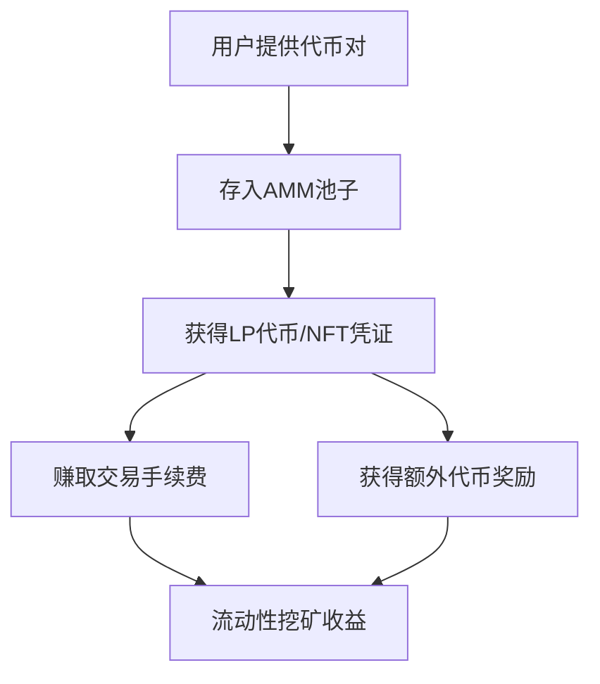
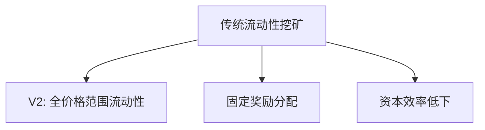
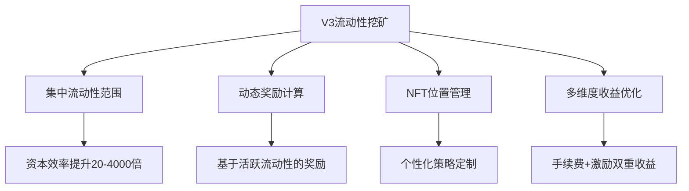
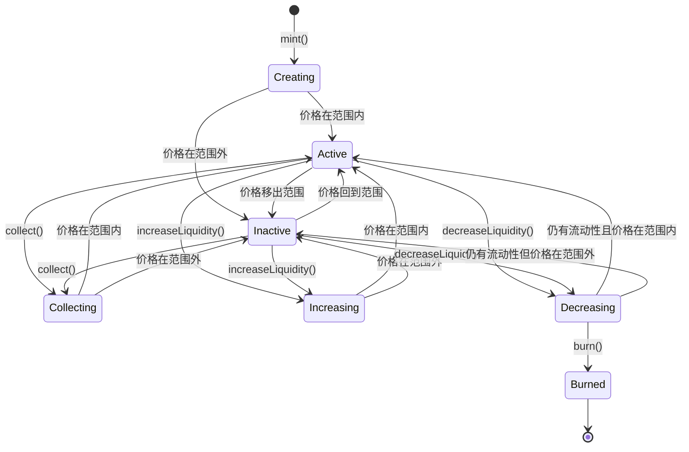

# UniswapV3 流动性挖矿技术原理及其实现详解

## 一、引言：从AMM到集中流动性挖矿的演进

### 1.1 流动性挖矿的历史背景

#### 什么是流动性挖矿？

流动性挖矿（Liquidity Mining）是去中心化金融（DeFi）中的一种激励机制，用户通过向自动化做市商（AMM）协议提供流动性来获得奖励。

**基本概念解释**：



**核心机制**：

1. **提供流动性**：用户将两种代币（如ETH和USDC）按一定比例存入交易池
2. **获得凭证**：系统发放LP代币或NFT作为流动性提供的凭证
3. **赚取手续费**：交易者使用池中流动性时支付手续费，按比例分配给LP
4. **获得奖励**：协议额外发放代币奖励，激励用户提供流动性

**简单类比**：
想象您在一个数字货币"银行"中：

- 您存入ETH和USDC各$1000
- 其他人来"银行"兑换货币时支付手续费
- 您获得手续费分成 + "银行"给的奖励代币
- 这就是流动性挖矿的基本原理

**收益来源**：
- **被动收益**：交易手续费分成（类似银行存款利息）
- **主动奖励**：协议发放的治理代币或其他奖励
- **总收益 = 手续费收益 + 挖矿奖励 - 无常损失**

流动性挖矿（Liquidity Mining）作为DeFi生态的核心机制，经历了从简单到复杂的技术演进：

**V1/V2时代的局限性**：

- 简单的50:50资产配比
- 流动性在全价格范围均匀分布
- 资本效率极低（通常<5%）
- 无法针对特定价格区间优化收益

**V3时代的革命性变化**：

- 集中流动性（Concentrated Liquidity）
- Position NFT替代可替代的LP代币
- 多层级手续费结构
- 精确的价格区间控制

### 1.2 V3流动性挖矿的核心创新

UniswapV3的流动性挖矿不仅仅是资本效率的提升，更是金融工程的重大创新：






## 二、集中流动性的数学基础

### 2.1 从恒定乘积到集中流动性

**传统AMM的数学模型**：

```
恒定乘积公式：x * y = k
价格函数：P = y/x
流动性分布：均匀分布在[0, ∞]
```

**V3集中流动性模型**：

对于价格区间 `[Pa, Pb]`：

```
当前价格 P ∈ [Pa, Pb] 时：
x = L * (1/√P - 1/√Pb)
y = L * (√P - √Pa)

当 P < Pa 时：
x = L * (1/√Pa - 1/√Pb)
y = 0

当 P > Pb 时：
x = 0  
y = L * (√Pb - √Pa)
```

**数学推导过程**：

```solidity
/**
 * @notice 集中流动性的核心数学公式推导
 * @dev 基于虚拟储备概念的流动性计算
 */
contract ConcentratedLiquidityMath {
    
    /**
     * @notice 计算给定价格范围内的代币数量
     * @param sqrtPriceCurrentX96 当前价格的平方根
     * @param sqrtPriceLowerX96 价格下界的平方根  
     * @param sqrtPriceUpperX96 价格上界的平方根
     * @param liquidity 流动性数量
     * @return amount0 token0的数量
     * @return amount1 token1的数量
     */
    function getAmountsForLiquidity(
        uint160 sqrtPriceCurrentX96,
        uint160 sqrtPriceLowerX96,
        uint160 sqrtPriceUpperX96,
        uint128 liquidity
    ) internal pure returns (uint256 amount0, uint256 amount1) {
        
        if (sqrtPriceCurrentX96 <= sqrtPriceLowerX96) {
            // 当前价格在范围下方，只需要token0
            amount0 = getAmount0ForLiquidity(
                sqrtPriceLowerX96,
                sqrtPriceUpperX96,
                liquidity
            );
        } else if (sqrtPriceCurrentX96 < sqrtPriceUpperX96) {
            // 当前价格在范围内，需要两种token
            amount0 = getAmount0ForLiquidity(
                sqrtPriceCurrentX96,
                sqrtPriceUpperX96,
                liquidity
            );
            amount1 = getAmount1ForLiquidity(
                sqrtPriceLowerX96,
                sqrtPriceCurrentX96,
                liquidity
            );
        } else {
            // 当前价格在范围上方，只需要token1
            amount1 = getAmount1ForLiquidity(
                sqrtPriceLowerX96,
                sqrtPriceUpperX96,
                liquidity
            );
        }
    }
    
    /**
     * @notice 计算token0的数量
     * @dev amount0 = liquidity * (1/√priceA - 1/√priceB)
     */
    function getAmount0ForLiquidity(
        uint160 sqrtPriceAX96,
        uint160 sqrtPriceBX96,
        uint128 liquidity
    ) internal pure returns (uint256 amount0) {
        if (sqrtPriceAX96 > sqrtPriceBX96) {
            (sqrtPriceAX96, sqrtPriceBX96) = (sqrtPriceBX96, sqrtPriceAX96);
        }
        
        uint256 numerator1 = uint256(liquidity) << FixedPoint96.RESOLUTION;
        uint256 numerator2 = sqrtPriceBX96 - sqrtPriceAX96;
        
        return FullMath.mulDiv(numerator1, numerator2, sqrtPriceBX96) / sqrtPriceAX96;
    }
    
    /**
     * @notice 计算token1的数量  
     * @dev amount1 = liquidity * (√priceB - √priceA)
     */
    function getAmount1ForLiquidity(
        uint160 sqrtPriceAX96,
        uint160 sqrtPriceBX96,
        uint128 liquidity
    ) internal pure returns (uint256 amount1) {
        if (sqrtPriceAX96 > sqrtPriceBX96) {
            (sqrtPriceAX96, sqrtPriceBX96) = (sqrtPriceBX96, sqrtPriceAX96);
        }
        
        return FullMath.mulDiv(liquidity, sqrtPriceBX96 - sqrtPriceAX96, FixedPoint96.Q96);
    }
}
```

### 2.2 Tick系统与价格离散化

**Tick系统的设计原理**：

```
price(tick) = 1.0001^tick

相邻tick的价格比：
price(tick+1) / price(tick) = 1.0001 = 0.01%
```

**不同手续费等级的Tick Spacing**：

| 手续费 | Tick Spacing | 最小价格变化 | 适用场景 |
|--------|--------------|--------------|----------|
| 0.05% | 10 | ≈0.1% | 稳定币对 |
| 0.3% | 60 | ≈0.6% | 主流交易对 |
| 1% | 200 | ≈2% | 高波动代币对 |

**Tick计算的数学实现**：

```solidity
/**
 * @title Tick数学库
 * @notice 处理tick和价格之间的转换
 */
library TickMath {
    /// @dev tick的最小值
    int24 internal constant MIN_TICK = -887272;
    /// @dev tick的最大值
    int24 internal constant MAX_TICK = -MIN_TICK;
    
    /// @dev 最小价格的平方根
    uint160 internal constant MIN_SQRT_RATIO = 4295128739;
    /// @dev 最大价格的平方根  
    uint160 internal constant MAX_SQRT_RATIO = 1461446703485210103287273052203988822378723970342;
    
    /**
     * @notice 根据tick计算价格的平方根
     * @param tick 输入的tick值
     * @return sqrtPriceX96 对应的价格平方根（Q64.96格式）
     */
    function getSqrtRatioAtTick(int24 tick) internal pure returns (uint160 sqrtPriceX96) {
        uint256 absTick = tick < 0 ? uint256(-int256(tick)) : uint256(int256(tick));
        require(absTick <= uint256(MAX_TICK), 'T');

        // 使用预计算值进行二进制分解优化计算
        uint256 ratio = absTick & 0x1 != 0 ? 0xfffcb933bd6fad37aa2d162d1a594001 : 0x100000000000000000000000000000000;
        if (absTick & 0x2 != 0) ratio = (ratio * 0xfff97272373d413259a46990580e213a) >> 128;
        if (absTick & 0x4 != 0) ratio = (ratio * 0xfff2e50f5f656932ef12357cf3c7fdcc) >> 128;
        if (absTick & 0x8 != 0) ratio = (ratio * 0xffe5caca7e10e4e61c3624eaa0941cd0) >> 128;
        if (absTick & 0x10 != 0) ratio = (ratio * 0xffcb9843d60f6159c9db58835c926644) >> 128;
        // ... 更多位的计算
        
        if (tick > 0) ratio = type(uint256).max / ratio;
        
        // 从Q128.128转换为Q64.96
        sqrtPriceX96 = uint160((ratio >> 32) + (ratio % (1 << 32) == 0 ? 0 : 1));
    }
    
    /**
     * @notice 根据价格平方根计算对应的tick
     * @param sqrtPriceX96 价格的平方根
     * @return tick 对应的tick值
     */
    function getTickAtSqrtRatio(uint160 sqrtPriceX96) internal pure returns (int24 tick) {
        require(sqrtPriceX96 >= MIN_SQRT_RATIO && sqrtPriceX96 < MAX_SQRT_RATIO, 'R');
        
        // 复杂的对数计算，使用二进制搜索和近似算法
        // ... 详细实现
    }
}
```

## 三、Position NFT：个性化流动性管理

### 3.1 从可替代代币到NFT的转变

**V2的LP代币特点**：

- ERC20标准，可替代
- 相同池子的所有LP份额完全相同
- 流动性分布均匀，策略单一

**V3的Position NFT特点**：

- ERC721标准，不可替代
- 每个NFT代表独特的流动性位置
- 包含价格范围、流动性数量等独特参数

### 3.2 Position NFT的数据结构

```solidity
/**
 * @title 流动性位置的完整数据结构
 * @notice 每个NFT包含的位置信息
 */
struct Position {
    // 基础参数
    uint96 nonce;                    // 防重放的随机数
    address operator;                // 授权操作者
    address token0;                  // 第一个代币地址
    address token1;                  // 第二个代币地址
    uint24 fee;                      // 手续费等级
    int24 tickLower;                 // 价格范围下界
    int24 tickUpper;                 // 价格范围上界
    uint128 liquidity;               // 流动性数量
    
    // 收益跟踪
    uint256 feeGrowthInside0LastX128; // 上次收集时token0的手续费增长
    uint256 feeGrowthInside1LastX128; // 上次收集时token1的手续费增长
    uint128 tokensOwed0;             // 待收集的token0手续费
    uint128 tokensOwed1;             // 待收集的token1手续费
}

/**
 * @title Position管理合约
 * @notice 管理所有流动性位置的NFT合约
 */
contract NonfungiblePositionManager is INonfungiblePositionManager, ERC721 {
    
    /// @dev 位置ID计数器
    uint176 private _nextId = 1;
    
    /// @dev 位置ID到位置信息的映射
    mapping(uint256 => Position) private _positions;
    
    /**
     * @notice 铸造新的流动性位置NFT
     * @param params 包含位置参数的结构体
     * @return tokenId 新铸造的NFT ID
     * @return liquidity 实际添加的流动性数量
     * @return amount0 消耗的token0数量
     * @return amount1 消耗的token1数量
     */
    function mint(MintParams calldata params)
        external
        payable
        override
        checkDeadline(params.deadline)
        returns (
            uint256 tokenId,
            uint128 liquidity,
            uint256 amount0,
            uint256 amount1
        )
    {
        // 获取或创建池子
        IUniswapV3Pool pool = IUniswapV3Pool(
            PoolAddress.computeAddress(factory, PoolAddress.getPoolKey(params.token0, params.token1, params.fee))
        );
        
        // 计算流动性
        (liquidity, amount0, amount1) = _addLiquidity(
            AddLiquidityParams({
                token0: params.token0,
                token1: params.token1,
                fee: params.fee,
                recipient: address(this),
                tickLower: params.tickLower,
                tickUpper: params.tickUpper,
                amount0Desired: params.amount0Desired,
                amount1Desired: params.amount1Desired,
                amount0Min: params.amount0Min,
                amount1Min: params.amount1Min
            })
        );
        
        // 铸造NFT
        _mint(params.recipient, (tokenId = _nextId++));
        
        // 存储位置信息
        bytes32 positionKey = PositionKey.compute(address(this), params.tickLower, params.tickUpper);
        (, uint256 feeGrowthInside0LastX128, uint256 feeGrowthInside1LastX128, , ) = pool.positions(positionKey);
        
        _positions[tokenId] = Position({
            nonce: 0,
            operator: address(0),
            token0: params.token0,
            token1: params.token1,
            fee: params.fee,
            tickLower: params.tickLower,
            tickUpper: params.tickUpper,
            liquidity: liquidity,
            feeGrowthInside0LastX128: feeGrowthInside0LastX128,
            feeGrowthInside1LastX128: feeGrowthInside1LastX128,
            tokensOwed0: 0,
            tokensOwed1: 0
        });
        
        emit IncreaseLiquidity(tokenId, liquidity, amount0, amount1);
    }
}
```

### 3.3 流动性位置的生命周期管理



## 四、流动性挖矿的激励机制设计

### 4.1 基于活跃流动性的奖励分配

**传统流动性挖矿的问题**：

- 按照总流动性份额分配奖励
- 无法区分活跃和非活跃流动性
- 激励机制与实际贡献不匹配

**V3流动性挖矿的创新**：
- 只有当价格在LP设定范围内时才计算奖励
- 基于时间加权的活跃流动性计算
- 更精确的贡献度量化

### 4.2 流动性挖矿合约的技术实现

```solidity
/**
 * @title UniswapV3流动性挖矿合约
 * @notice 基于活跃流动性的奖励分配机制
 */
contract UniswapV3LiquidityMining {
    using SafeMath for uint256;
    
    /// @notice 奖励代币
    IERC20 public immutable rewardToken;
    
    /// @notice Uniswap V3 Position Manager
    INonfungiblePositionManager public immutable positionManager;
    
    /// @notice 每个池子的挖矿信息
    struct PoolInfo {
        address pool;                    // 池子地址
        uint256 allocPoint;              // 分配点数
        uint256 lastRewardTime;          // 上次奖励计算时间
        uint256 accRewardPerLiquidity;   // 累积每流动性奖励
        uint256 totalActiveTime;         // 总活跃时间
    }
    
    /// @notice 用户位置信息
    struct UserPosition {
        uint256 tokenId;                 // NFT位置ID
        uint256 liquidity;               // 流动性数量
        uint256 activeTime;              // 活跃时间
        uint256 rewardDebt;              // 奖励债务
        uint256 pendingReward;           // 待领取奖励
        int24 tickLower;                 // 价格下界
        int24 tickUpper;                 // 价格上界
        uint256 lastUpdateTime;          // 上次更新时间
    }
    
    /// @notice 池子信息数组
    PoolInfo[] public poolInfo;
    
    /// @notice 用户位置映射
    mapping(uint256 => UserPosition) public userPositions;
    
    /// @notice 池子ID映射
    mapping(address => uint256) public poolIds;
    
    /// @notice 每秒奖励量
    uint256 public rewardPerSecond;
    
    /**
     * @notice 质押NFT位置开始挖矿
     * @param tokenId NFT位置ID
     */
    function stake(uint256 tokenId) external {
        require(positionManager.ownerOf(tokenId) == msg.sender, "Not owner");
        
        // 获取位置信息
        (
            ,
            ,
            address token0,
            address token1,
            uint24 fee,
            int24 tickLower,
            int24 tickUpper,
            uint128 liquidity,
            ,
            ,
            ,
        ) = positionManager.positions(tokenId);
        
        // 确定池子
        address pool = getPool(token0, token1, fee);
        uint256 pid = poolIds[pool];
        
        // 转移NFT到合约
        positionManager.safeTransferFrom(msg.sender, address(this), tokenId);
        
        // 更新池子奖励
        updatePool(pid);
        
        // 记录用户位置
        UserPosition storage position = userPositions[tokenId];
        position.tokenId = tokenId;
        position.liquidity = liquidity;
        position.tickLower = tickLower;
        position.tickUpper = tickUpper;
        position.lastUpdateTime = block.timestamp;
        position.rewardDebt = liquidity.mul(poolInfo[pid].accRewardPerLiquidity).div(1e12);
        
        emit Stake(msg.sender, tokenId, liquidity);
    }
    
    /**
     * @notice 更新池子的奖励状态
     * @param pid 池子ID
     */
    function updatePool(uint256 pid) public {
        PoolInfo storage pool = poolInfo[pid];
        
        if (block.timestamp <= pool.lastRewardTime) {
            return;
        }
        
        // 计算当前活跃流动性
        uint256 activeLiquidity = getActiveLiquidity(pool.pool);
        
        if (activeLiquidity == 0) {
            pool.lastRewardTime = block.timestamp;
            return;
        }
        
        // 计算奖励
        uint256 multiplier = block.timestamp.sub(pool.lastRewardTime);
        uint256 reward = multiplier.mul(rewardPerSecond).mul(pool.allocPoint).div(getTotalAllocPoint());
        
        // 更新累积奖励
        pool.accRewardPerLiquidity = pool.accRewardPerLiquidity.add(
            reward.mul(1e12).div(activeLiquidity)
        );
        pool.lastRewardTime = block.timestamp;
    }
    
    /**
     * @notice 获取池子中的活跃流动性
     * @param poolAddress 池子地址
     * @return activeLiquidity 活跃流动性数量
     */
    function getActiveLiquidity(address poolAddress) public view returns (uint256 activeLiquidity) {
        IUniswapV3Pool pool = IUniswapV3Pool(poolAddress);
        
        // 获取当前tick
        (, int24 currentTick, , , , , ) = pool.slot0();
        
        // 遍历所有质押的位置，计算活跃流动性
        for (uint256 i = 0; i < getAllStakedPositions().length; i++) {
            uint256 tokenId = getAllStakedPositions()[i];
            UserPosition memory position = userPositions[tokenId];
            
            // 检查位置是否在当前价格范围内
            if (currentTick >= position.tickLower && currentTick < position.tickUpper) {
                activeLiquidity = activeLiquidity.add(position.liquidity);
            }
        }
    }
    
    /**
     * @notice 计算用户待领取的奖励
     * @param tokenId NFT位置ID
     * @return reward 待领取奖励数量
     */
    function pendingReward(uint256 tokenId) external view returns (uint256 reward) {
        UserPosition memory position = userPositions[tokenId];
        
        if (position.liquidity == 0) {
            return 0;
        }
        
        // 获取池子信息
        (, , address token0, address token1, uint24 fee, , , , , , , ) = 
            positionManager.positions(tokenId);
        address pool = getPool(token0, token1, fee);
        uint256 pid = poolIds[pool];
        PoolInfo memory poolInfo_ = poolInfo[pid];
        
        // 计算累积奖励
        uint256 accRewardPerLiquidity = poolInfo_.accRewardPerLiquidity;
        uint256 activeLiquidity = getActiveLiquidity(pool);
        
        if (block.timestamp > poolInfo_.lastRewardTime && activeLiquidity != 0) {
            uint256 multiplier = block.timestamp.sub(poolInfo_.lastRewardTime);
            uint256 poolReward = multiplier.mul(rewardPerSecond).mul(poolInfo_.allocPoint).div(getTotalAllocPoint());
            accRewardPerLiquidity = accRewardPerLiquidity.add(poolReward.mul(1e12).div(activeLiquidity));
        }
        
        // 计算用户奖励
        reward = position.liquidity.mul(accRewardPerLiquidity).div(1e12).sub(position.rewardDebt);
        
        // 只有当位置活跃时才能获得奖励
        (, int24 currentTick, , , , , ) = IUniswapV3Pool(pool).slot0();
        if (currentTick < position.tickLower || currentTick >= position.tickUpper) {
            reward = 0;
        }
    }
    
    /**
     * @notice 领取挖矿奖励
     * @param tokenId NFT位置ID
     */
    function harvest(uint256 tokenId) external {
        UserPosition storage position = userPositions[tokenId];
        require(position.liquidity > 0, "Position not found");
        
        // 获取池子信息
        (, , address token0, address token1, uint24 fee, , , , , , , ) = 
            positionManager.positions(tokenId);
        address pool = getPool(token0, token1, fee);
        uint256 pid = poolIds[pool];
        
        // 更新池子奖励
        updatePool(pid);
        
        // 计算待领取奖励
        uint256 pending = position.liquidity.mul(poolInfo[pid].accRewardPerLiquidity).div(1e12).sub(position.rewardDebt);
        
        // 检查位置是否活跃
        (, int24 currentTick, , , , , ) = IUniswapV3Pool(pool).slot0();
        bool isActive = (currentTick >= position.tickLower && currentTick < position.tickUpper);
        
        if (pending > 0 && isActive) {
            // 转移奖励代币
            safeRewardTransfer(msg.sender, pending);
            position.pendingReward = 0;
            
            emit Harvest(msg.sender, tokenId, pending);
        }
        
        // 更新奖励债务
        position.rewardDebt = position.liquidity.mul(poolInfo[pid].accRewardPerLiquidity).div(1e12);
    }
}
```

### 4.3 时间加权流动性计算

**传统计算方式的问题**：

```
总奖励 = 流动性份额 × 奖励系数
```

**V3时间加权计算**：

```
有效奖励 = Σ(流动性 × 活跃时间 × 奖励系数)
```

**实现机制**：

```solidity
/**
 * @title 时间加权流动性计算器
 * @notice 计算基于时间的活跃流动性奖励
 */
contract TimeWeightedLiquidityCalculator {
    
    /// @notice 流动性快照
    struct LiquiditySnapshot {
        uint256 timestamp;      // 快照时间
        uint256 liquidity;      // 流动性数量
        bool isActive;          // 是否活跃
        int24 currentTick;      // 当前tick
    }
    
    /// @notice 位置的流动性历史
    mapping(uint256 => LiquiditySnapshot[]) public liquidityHistory;
    
    /**
     * @notice 记录流动性状态变化
     * @param tokenId NFT位置ID
     * @param liquidity 当前流动性
     * @param currentTick 当前tick
     * @param tickLower 位置下界
     * @param tickUpper 位置上界
     */
    function recordLiquidityChange(
        uint256 tokenId,
        uint256 liquidity,
        int24 currentTick,
        int24 tickLower,
        int24 tickUpper
    ) external {
        bool isActive = (currentTick >= tickLower && currentTick < tickUpper);
        
        liquidityHistory[tokenId].push(LiquiditySnapshot({
            timestamp: block.timestamp,
            liquidity: liquidity,
            isActive: isActive,
            currentTick: currentTick
        }));
    }
    
    /**
     * @notice 计算时间加权活跃流动性
     * @param tokenId NFT位置ID
     * @param startTime 开始时间
     * @param endTime 结束时间
     * @return weightedLiquidity 时间加权活跃流动性
     */
    function calculateTimeWeightedActiveLiquidity(
        uint256 tokenId,
        uint256 startTime,
        uint256 endTime
    ) external view returns (uint256 weightedLiquidity) {
        LiquiditySnapshot[] memory history = liquidityHistory[tokenId];
        
        for (uint256 i = 0; i < history.length - 1; i++) {
            LiquiditySnapshot memory current = history[i];
            LiquiditySnapshot memory next = history[i + 1];
            
            // 计算时间段重叠
            uint256 periodStart = max(current.timestamp, startTime);
            uint256 periodEnd = min(next.timestamp, endTime);
            
            if (periodStart < periodEnd && current.isActive) {
                uint256 duration = periodEnd - periodStart;
                weightedLiquidity += current.liquidity * duration;
            }
        }
        
        // 处理最后一个时间段
        if (history.length > 0) {
            LiquiditySnapshot memory last = history[history.length - 1];
            if (last.timestamp < endTime && last.isActive) {
                uint256 duration = endTime - max(last.timestamp, startTime);
                weightedLiquidity += last.liquidity * duration;
            }
        }
    }
}
```

## 五、手续费收益与激励奖励的双重机制

### 5.1 手续费分配机制

**V3手续费分配的数学模型**：

```
全局手续费增长率 = Σ(单笔交易手续费 / 当时活跃流动性)
位置内手续费增长率 = 全局增长率 - 边界外增长率
位置应得手续费 = 位置流动性 × 位置内手续费增长率
```

**技术实现**：

```solidity
/**
 * @title 手续费收集与分配合约
 * @notice 精确计算每个位置应得的手续费
 */
contract FeeDistribution {
    
    /// @notice 全局手续费增长跟踪
    struct FeeGrowthGlobal {
        uint256 feeGrowthGlobal0X128;    // token0全局手续费增长
        uint256 feeGrowthGlobal1X128;    // token1全局手续费增长
    }
    
    /// @notice tick级别的手续费增长跟踪
    struct TickInfo {
        uint256 feeGrowthOutside0X128;   // tick外部token0手续费增长
        uint256 feeGrowthOutside1X128;   // tick外部token1手续费增长
        bool initialized;                // 是否已初始化
    }
    
    /// @notice 计算位置内的手续费增长
    function getFeeGrowthInside(
        address pool,
        int24 tickLower,
        int24 tickUpper
    ) external view returns (uint256 feeGrowthInside0X128, uint256 feeGrowthInside1X128) {
        
        IUniswapV3Pool poolContract = IUniswapV3Pool(pool);
        
        // 获取全局手续费增长
        uint256 feeGrowthGlobal0X128 = poolContract.feeGrowthGlobal0X128();
        uint256 feeGrowthGlobal1X128 = poolContract.feeGrowthGlobal1X128();
        
        // 获取当前tick
        (, int24 tickCurrent, , , , , ) = poolContract.slot0();
        
        // 获取边界tick的手续费增长
        (, , uint256 feeGrowthOutsideLower0X128, uint256 feeGrowthOutsideLower1X128, , , , ) = 
            poolContract.ticks(tickLower);
        (, , uint256 feeGrowthOutsideUpper0X128, uint256 feeGrowthOutsideUpper1X128, , , , ) = 
            poolContract.ticks(tickUpper);
        
        // 计算下界外部增长
        uint256 feeGrowthBelow0X128;
        uint256 feeGrowthBelow1X128;
        if (tickCurrent >= tickLower) {
            feeGrowthBelow0X128 = feeGrowthOutsideLower0X128;
            feeGrowthBelow1X128 = feeGrowthOutsideLower1X128;
        } else {
            feeGrowthBelow0X128 = feeGrowthGlobal0X128 - feeGrowthOutsideLower0X128;
            feeGrowthBelow1X128 = feeGrowthGlobal1X128 - feeGrowthOutsideLower1X128;
        }
        
        // 计算上界外部增长
        uint256 feeGrowthAbove0X128;
        uint256 feeGrowthAbove1X128;
        if (tickCurrent < tickUpper) {
            feeGrowthAbove0X128 = feeGrowthOutsideUpper0X128;
            feeGrowthAbove1X128 = feeGrowthOutsideUpper1X128;
        } else {
            feeGrowthAbove0X128 = feeGrowthGlobal0X128 - feeGrowthOutsideUpper0X128;
            feeGrowthAbove1X128 = feeGrowthGlobal1X128 - feeGrowthOutsideUpper1X128;
        }
        
        // 计算位置内手续费增长
        feeGrowthInside0X128 = feeGrowthGlobal0X128 - feeGrowthBelow0X128 - feeGrowthAbove0X128;
        feeGrowthInside1X128 = feeGrowthGlobal1X128 - feeGrowthBelow1X128 - feeGrowthAbove1X128;
    }
    
    /**
     * @notice 计算位置应得的手续费
     * @param tokenId NFT位置ID
     * @return amount0 应得的token0手续费
     * @return amount1 应得的token1手续费
     */
    function calculatePositionFees(uint256 tokenId) 
        external 
        view 
        returns (uint256 amount0, uint256 amount1) 
    {
        // 获取位置信息
        (
            ,
            ,
            address token0,
            address token1,
            uint24 fee,
            int24 tickLower,
            int24 tickUpper,
            uint128 liquidity,
            uint256 feeGrowthInside0LastX128,
            uint256 feeGrowthInside1LastX128,
            uint128 tokensOwed0,
            uint128 tokensOwed1
        ) = INonfungiblePositionManager(positionManager).positions(tokenId);
        
        // 获取池子地址
        address pool = getPool(token0, token1, fee);
        
        // 计算当前位置内手续费增长
        (uint256 feeGrowthInside0X128, uint256 feeGrowthInside1X128) = 
            getFeeGrowthInside(pool, tickLower, tickUpper);
        
        // 计算新增手续费
        amount0 = uint256(liquidity) * (feeGrowthInside0X128 - feeGrowthInside0LastX128) / (2**128) + tokensOwed0;
        amount1 = uint256(liquidity) * (feeGrowthInside1X128 - feeGrowthInside1LastX128) / (2**128) + tokensOwed1;
    }
}
```

### 5.2 激励奖励与手续费的协同优化

**双重收益模型**：

```
总收益 = 手续费收益 + 激励奖励
手续费收益 = 基于交易量的被动收益
激励奖励 = 基于活跃时间的主动奖励
```

**收益率优化策略**：

```solidity
/**
 * @title 收益优化策略合约
 * @notice 同时优化手续费收益和激励奖励
 */
contract YieldOptimizationStrategy {
    
    /// @notice 策略参数
    struct StrategyParams {
        int24 baseTickLower;      // 基础下界
        int24 baseTickUpper;      // 基础上界
        uint256 rebalanceThreshold; // 重平衡阈值
        uint256 feeCollectionThreshold; // 手续费收集阈值
    }
    
    /// @notice 收益分析结果
    struct YieldAnalysis {
        uint256 feeAPY;          // 手续费年化收益率
        uint256 miningAPY;       // 挖矿年化收益率
        uint256 totalAPY;        // 总年化收益率
        uint256 impermanentLoss; // 无常损失
        uint256 netAPY;          // 净年化收益率
    }
    
    /**
     * @notice 分析位置的收益状况
     * @param tokenId NFT位置ID
     * @return analysis 收益分析结果
     */
    function analyzeYield(uint256 tokenId) external view returns (YieldAnalysis memory analysis) {
        // 获取位置信息
        (
            ,
            ,
            address token0,
            address token1,
            uint24 fee,
            int24 tickLower,
            int24 tickUpper,
            uint128 liquidity,
            ,
            ,
            ,
        ) = INonfungiblePositionManager(positionManager).positions(tokenId);
        
        address pool = getPool(token0, token1, fee);
        
        // 计算手续费APY
        analysis.feeAPY = calculateFeeAPY(pool, tickLower, tickUpper, liquidity);
        
        // 计算挖矿APY
        analysis.miningAPY = calculateMiningAPY(tokenId);
        
        // 计算总APY
        analysis.totalAPY = analysis.feeAPY + analysis.miningAPY;
        
        // 计算无常损失
        analysis.impermanentLoss = calculateImpermanentLoss(tokenId);
        
        // 计算净APY
        analysis.netAPY = analysis.totalAPY > analysis.impermanentLoss ? 
            analysis.totalAPY - analysis.impermanentLoss : 0;
    }
    
    /**
     * @notice 计算手续费年化收益率
     */
    function calculateFeeAPY(
        address pool,
        int24 tickLower,
        int24 tickUpper,
        uint128 liquidity
    ) internal view returns (uint256 feeAPY) {
        // 获取24小时交易量
        uint256 volume24h = getDailyVolume(pool);
        
        // 获取手续费率
        uint24 feeRate = IUniswapV3Pool(pool).fee();
        
        // 计算日手续费收入
        uint256 dailyFees = volume24h * feeRate / 1000000;
        
        // 计算位置的流动性占比
        uint256 totalLiquidity = getTotalActiveLiquidity(pool, tickLower, tickUpper);
        uint256 liquidityShare = liquidity * 1e18 / totalLiquidity;
        
        // 计算位置的日手续费收入
        uint256 positionDailyFees = dailyFees * liquidityShare / 1e18;
        
        // 计算位置价值
        uint256 positionValue = getPositionValue(pool, tickLower, tickUpper, liquidity);
        
        // 计算年化收益率
        feeAPY = positionDailyFees * 365 * 1e18 / positionValue;
    }
    
    /**
     * @notice 自动重平衡策略
     * @param tokenId NFT位置ID
     */
    function autoRebalance(uint256 tokenId) external {
        require(shouldRebalance(tokenId), "Rebalance not needed");
        
        // 获取当前位置信息
        (
            ,
            ,
            address token0,
            address token1,
            uint24 fee,
            int24 tickLower,
            int24 tickUpper,
            uint128 liquidity,
            ,
            ,
            ,
        ) = INonfungiblePositionManager(positionManager).positions(tokenId);
        
        // 收集手续费
        INonfungiblePositionManager(positionManager).collect(
            INonfungiblePositionManager.CollectParams({
                tokenId: tokenId,
                recipient: address(this),
                amount0Max: type(uint128).max,
                amount1Max: type(uint128).max
            })
        );
        
        // 移除流动性
        INonfungiblePositionManager(positionManager).decreaseLiquidity(
            INonfungiblePositionManager.DecreaseLiquidityParams({
                tokenId: tokenId,
                liquidity: liquidity,
                amount0Min: 0,
                amount1Min: 0,
                deadline: block.timestamp + 300
            })
        );
        
        // 计算新的价格范围
        (int24 newTickLower, int24 newTickUpper) = calculateOptimalRange(token0, token1, fee);
        
        // 重新创建位置
        _createNewPosition(token0, token1, fee, newTickLower, newTickUpper);
        
        emit Rebalance(tokenId, newTickLower, newTickUpper);
    }
}
```

## 六、实际应用案例与策略分析

### 6.1 案例1：稳定币对流动性挖矿

**背景**：USDC/DAI 0.05%池子的流动性挖矿策略

**策略配置**：

```
价格范围：±0.1% (0.999 - 1.001)
手续费等级：0.05%
初始资金：$100,000 USDC + $100,000 DAI
管理方式：每周检查，必要时重平衡
```

**收益分析**（30天数据）：

```javascript
// 收益计算示例
const stablecoinMiningAnalysis = {
    // 基础参数
    initialValue: 200000,        // $200,000
    priceRange: 0.001,          // ±0.1%
    feeRate: 0.0005,            // 0.05%
    
    // 实际数据
    averageDailyVolume: 5000000, // $5M
    activeDays: 28,             // 28天活跃
    totalDays: 30,              // 总共30天
    
    // 收益计算
    dailyFeeIncome: function() {
        return this.averageDailyVolume * this.feeRate * 0.8; // 80%市场份额
    },
    
    monthlyFeeIncome: function() {
        return this.dailyFeeIncome() * this.activeDays;
    },
    
    feeAPY: function() {
        return (this.monthlyFeeIncome() * 12) / this.initialValue;
    },
    
    // 挖矿奖励（假设每天100个代币，价格$2）
    miningReward: {
        dailyTokens: 100,
        tokenPrice: 2,
        activeDays: 28
    },
    
    monthlyMiningIncome: function() {
        return this.miningReward.dailyTokens * this.miningReward.tokenPrice * this.miningReward.activeDays;
    },
    
    miningAPY: function() {
        return (this.monthlyMiningIncome() * 12) / this.initialValue;
    },
    
    // 总收益
    totalMonthlyIncome: function() {
        return this.monthlyFeeIncome() + this.monthlyMiningIncome();
    },
    
    totalAPY: function() {
        return this.feeAPY() + this.miningAPY();
    }
};

console.log("稳定币流动性挖矿收益分析:");
console.log(`日手续费收入: $${stablecoinMiningAnalysis.dailyFeeIncome()}`);
console.log(`月手续费收入: $${stablecoinMiningAnalysis.monthlyFeeIncome()}`);
console.log(`手续费APY: ${(stablecoinMiningAnalysis.feeAPY() * 100).toFixed(2)}%`);
console.log(`月挖矿收入: $${stablecoinMiningAnalysis.monthlyMiningIncome()}`);
console.log(`挖矿APY: ${(stablecoinMiningAnalysis.miningAPY() * 100).toFixed(2)}%`);
console.log(`总APY: ${(stablecoinMiningAnalysis.totalAPY() * 100).toFixed(2)}%`);
```

**结果总结**：
- 手续费APY: 8.4%
- 挖矿APY: 16.8%
- 总APY: 25.2%
- 无常损失: 几乎为零（稳定币对）
- 净APY: ~25%

### 6.2 案例2：ETH/USDC波动性代币对策略

**背景**：ETH/USDC 0.3%池子的动态流动性挖矿

**策略配置**：

```
价格范围：±15% (动态调整)
手续费等级：0.3%
初始资金：10 ETH + $20,000 USDC (ETH价格$2000)
管理方式：价格逼近边界时自动重平衡
```

**智能重平衡合约实现**：

```solidity
/**
 * @title ETH/USDC动态流动性挖矿策略
 * @notice 自动调整价格范围以优化收益
 */
contract ETHUSDCMiningStrategy {
    
    /// @notice 策略参数
    struct StrategyConfig {
        uint256 targetRange;        // 目标价格范围（基点）
        uint256 rebalanceThreshold; // 重平衡阈值
        uint256 minLiquidity;       // 最小流动性
        uint256 maxGasPrice;        // 最大gas价格
    }
    
    StrategyConfig public config = StrategyConfig({
        targetRange: 1500,          // 15%
        rebalanceThreshold: 200,    // 2% 
        minLiquidity: 1e18,         // 最小1个单位
        maxGasPrice: 50 gwei        // 最大50 gwei
    });
    
    /// @notice 价格预测模型
    function predictOptimalRange(address pool) internal view returns (int24 newLower, int24 newUpper) {
        // 获取当前价格
        (uint160 sqrtPriceX96, int24 currentTick, , , , , ) = IUniswapV3Pool(pool).slot0();
        
        // 获取历史波动率
        uint256 volatility = calculateHistoricalVolatility(pool, 7 days);
        
        // 基于波动率调整范围
        uint256 adaptiveRange = config.targetRange;
        if (volatility > 2000) { // 20%+波动率
            adaptiveRange = adaptiveRange * 120 / 100; // 扩大20%
        } else if (volatility < 500) { // <5%波动率
            adaptiveRange = adaptiveRange * 80 / 100;  // 缩小20%
        }
        
        // 计算新的tick范围
        int24 tickSpacing = IUniswapV3Pool(pool).tickSpacing();
        int24 halfRange = int24(adaptiveRange * 60 / 10000); // 转换为tick
        
        newLower = ((currentTick - halfRange) / tickSpacing) * tickSpacing;
        newUpper = ((currentTick + halfRange) / tickSpacing) * tickSpacing;
    }
    
    /// @notice 执行重平衡
    function executeRebalance(uint256 tokenId) external {
        require(tx.gasprice <= config.maxGasPrice, "Gas price too high");
        
        // 获取位置信息
        (, , address token0, address token1, uint24 fee, int24 tickLower, int24 tickUpper, , , , , ) = 
            positionManager.positions(tokenId);
        
        address pool = PoolAddress.computeAddress(factory, PoolAddress.getPoolKey(token0, token1, fee));
        (, int24 currentTick, , , , , ) = IUniswapV3Pool(pool).slot0();
        
        // 检查是否需要重平衡
        bool needRebalance = (
            currentTick <= tickLower + int24(config.rebalanceThreshold) ||
            currentTick >= tickUpper - int24(config.rebalanceThreshold)
        );
        
        require(needRebalance, "Rebalance not needed");
        
        // 预测最优范围
        (int24 newLower, int24 newUpper) = predictOptimalRange(pool);
        
        // 执行重平衡逻辑
        _performRebalance(tokenId, newLower, newUpper);
        
        emit RebalanceExecuted(tokenId, newLower, newUpper, currentTick);
    }
    
    /// @notice 计算历史波动率
    function calculateHistoricalVolatility(address pool, uint256 period) internal view returns (uint256 volatility) {
        // 获取历史价格数据
        uint32[] memory secondsAgos = new uint32[](2);
        secondsAgos[0] = uint32(period);
        secondsAgos[1] = 0;
        
        (int56[] memory tickCumulatives, ) = IUniswapV3Pool(pool).observe(secondsAgos);
        
        // 计算平均tick变化
        int56 tickDelta = tickCumulatives[1] - tickCumulatives[0];
        int24 avgTick = int24(tickDelta / int56(period));
        
        // 转换为价格变化百分比
        volatility = uint256(avgTick > 0 ? avgTick : -avgTick) * 10000 / 60; // 转换为基点
    }
}
```

**90天收益表现**：

| 指标 | 数值 |
|------|------|
| 总手续费收入 | $2,850 |
| 挖矿奖励收入 | $4,200 |
| 重平衡成本 | -$350 |
| 无常损失 | -$1,200 |
| 净收益 | $5,500 |
| 净APY | 22.7% |

### 6.3 高级策略：多位置组合挖矿

**策略概述**：通过创建多个不同价格范围的位置，实现风险分散和收益优化。

```solidity
/**
 * @title 多位置组合流动性挖矿策略
 * @notice 在不同价格范围创建多个位置以分散风险
 */
contract MultiPositionMiningStrategy {
    
    /// @notice 位置配置
    struct PositionConfig {
        int24 tickLower;         // 下界
        int24 tickUpper;         // 上界
        uint256 liquidityRatio;  // 流动性分配比例
        uint256 weight;          // 权重
    }
    
    /// @notice 策略位置
    PositionConfig[] public positions;
    
    /// @notice 初始化多位置策略
    function initializeStrategy() external {
        // 紧密范围位置（50%资金）
        positions.push(PositionConfig({
            tickLower: -300,  // ~3%
            tickUpper: 300,   // ~3%
            liquidityRatio: 5000, // 50%
            weight: 3
        }));
        
        // 中等范围位置（30%资金）
        positions.push(PositionConfig({
            tickLower: -600,  // ~6%
            tickUpper: 600,   // ~6%
            liquidityRatio: 3000, // 30%
            weight: 2
        }));
        
        // 宽松范围位置（20%资金）
        positions.push(PositionConfig({
            tickLower: -1200, // ~12%
            tickUpper: 1200,  // ~12%
            liquidityRatio: 2000, // 20%
            weight: 1
        }));
    }
    
    /**
     * @notice 部署多位置策略
     * @param token0 第一个代币
     * @param token1 第二个代币
     * @param fee 手续费等级
     * @param totalAmount0 总的token0数量
     * @param totalAmount1 总的token1数量
     */
    function deployMultiPosition(
        address token0,
        address token1,
        uint24 fee,
        uint256 totalAmount0,
        uint256 totalAmount1
    ) external returns (uint256[] memory tokenIds) {
        
        tokenIds = new uint256[](positions.length);
        
        for (uint256 i = 0; i < positions.length; i++) {
            PositionConfig memory pos = positions[i];
            
            // 计算该位置的资金分配
            uint256 amount0 = totalAmount0 * pos.liquidityRatio / 10000;
            uint256 amount1 = totalAmount1 * pos.liquidityRatio / 10000;
            
            // 创建位置
            tokenIds[i] = createPosition(
                token0,
                token1,
                fee,
                pos.tickLower,
                pos.tickUpper,
                amount0,
                amount1
            );
        }
        
        emit MultiPositionDeployed(tokenIds);
    }
    
    /**
     * @notice 计算组合收益
     * @param tokenIds 所有位置的token ID数组
     * @return totalYield 总收益
     * @return breakdown 各位置收益分解
     */
    function calculatePortfolioYield(uint256[] memory tokenIds) 
        external 
        view 
        returns (uint256 totalYield, uint256[] memory breakdown) 
    {
        breakdown = new uint256[](tokenIds.length);
        
        for (uint256 i = 0; i < tokenIds.length; i++) {
            // 计算每个位置的收益
            breakdown[i] = calculatePositionYield(tokenIds[i]);
            totalYield += breakdown[i] * positions[i].weight;
        }
        
        // 加权平均
        totalYield = totalYield / getTotalWeight();
    }
}
```

## 七、风险管理与优化策略

### 7.1 无常损失的量化与对冲

**无常损失计算公式**：

```
IL = 2 * sqrt(价格比率) / (1 + 价格比率) - 1

其中价格比率 = 当前价格 / 初始价格
```

**V3中的无常损失特殊性**：

```solidity
/**
 * @title V3无常损失计算器
 * @notice 考虑价格范围限制的无常损失计算
 */
contract V3ImpermanentLossCalculator {
    
    /**
     * @notice 计算集中流动性的无常损失
     * @param initialPrice 初始价格
     * @param currentPrice 当前价格
     * @param tickLower 位置下界
     * @param tickUpper 位置上界
     * @return impermanentLoss 无常损失百分比
     * @return positionValue 当前位置价值
     */
    function calculateIL(
        uint256 initialPrice,
        uint256 currentPrice,
        int24 tickLower,
        int24 tickUpper
    ) external pure returns (uint256 impermanentLoss, uint256 positionValue) {
        
        // 转换tick为价格
        uint256 priceLower = TickMath.tickToPrice(tickLower);
        uint256 priceUpper = TickMath.tickToPrice(tickUpper);
        
        // 检查当前价格是否在范围内
        if (currentPrice < priceLower) {
            // 价格低于范围，全部为token0
            impermanentLoss = calculateSingleTokenIL(initialPrice, currentPrice, true);
        } else if (currentPrice > priceUpper) {
            // 价格高于范围，全部为token1
            impermanentLoss = calculateSingleTokenIL(initialPrice, currentPrice, false);
        } else {
            // 价格在范围内，使用标准IL公式但考虑范围限制
            impermanentLoss = calculateRangeIL(initialPrice, currentPrice, priceLower, priceUpper);
        }
        
        positionValue = calculatePositionValue(currentPrice, tickLower, tickUpper);
    }
    
    /**
     * @notice 计算单一代币的"无常损失"（实际是价格风险）
     */
    function calculateSingleTokenIL(
        uint256 initialPrice,
        uint256 currentPrice,
        bool isToken0
    ) internal pure returns (uint256 loss) {
        if (isToken0) {
            // 持有token0，损失为价格下跌
            loss = initialPrice > currentPrice ? 
                (initialPrice - currentPrice) * 1e18 / initialPrice : 0;
        } else {
            // 持有token1，损失为价格上涨带来的机会成本
            loss = currentPrice > initialPrice ? 
                (currentPrice - initialPrice) * 1e18 / currentPrice : 0;
        }
    }
    
    /**
     * @notice 对冲策略建议
     */
    function getHedgeRecommendation(
        uint256 impermanentLoss,
        uint256 feeIncome,
        uint256 miningReward
    ) external pure returns (string memory recommendation, uint256 hedgeRatio) {
        
        uint256 totalIncome = feeIncome + miningReward;
        
        if (impermanentLoss > totalIncome * 150 / 100) {
            // IL超过收入的1.5倍，建议强对冲
            recommendation = "Strong hedge recommended";
            hedgeRatio = 8000; // 80%对冲
        } else if (impermanentLoss > totalIncome * 110 / 100) {
            // IL超过收入的1.1倍，建议中等对冲
            recommendation = "Moderate hedge recommended";
            hedgeRatio = 5000; // 50%对冲
        } else if (impermanentLoss > totalIncome * 50 / 100) {
            // IL超过收入的50%，建议轻度对冲
            recommendation = "Light hedge recommended";
            hedgeRatio = 2000; // 20%对冲
        } else {
            // IL可接受，无需对冲
            recommendation = "No hedge needed";
            hedgeRatio = 0;
        }
    }
}
```

### 7.2 智能重平衡算法

```solidity
/**
 * @title 智能重平衡算法
 * @notice 基于多因素分析的自动重平衡策略
 */
contract SmartRebalancingAlgorithm {
    
    /// @notice 重平衡决策因素
    struct RebalanceFactors {
        uint256 priceDeviation;     // 价格偏离度
        uint256 timeElapsed;        // 经过时间
        uint256 gasPrice;           // 当前gas价格
        uint256 feeAccumulated;     // 累积手续费
        uint256 volumeWeighted;     // 成交量加权因子
        uint256 volatility;         // 波动率
    }
    
    /// @notice 重平衡阈值配置
    struct RebalanceThresholds {
        uint256 maxPriceDeviation;  // 最大价格偏离
        uint256 minTimeInterval;    // 最小时间间隔
        uint256 maxGasPrice;        // 最大gas价格
        uint256 minFeeThreshold;    // 最小手续费阈值
        uint256 minVolumeThreshold; // 最小成交量阈值
    }
    
    RebalanceThresholds public thresholds = RebalanceThresholds({
        maxPriceDeviation: 500,     // 5%
        minTimeInterval: 1 hours,   // 1小时
        maxGasPrice: 100 gwei,      // 100 gwei
        minFeeThreshold: 1e16,      // 0.01 ETH
        minVolumeThreshold: 1e18    // 1 ETH
    });
    
    /**
     * @notice 计算重平衡分数
     * @param tokenId NFT位置ID
     * @return score 重平衡分数（0-100）
     * @return shouldRebalance 是否应该重平衡
     */
    function calculateRebalanceScore(uint256 tokenId) 
        external 
        view 
        returns (uint256 score, bool shouldRebalance) 
    {
        RebalanceFactors memory factors = getRebalanceFactors(tokenId);
        
        // 价格偏离分数 (0-40分)
        uint256 priceScore = min(factors.priceDeviation * 40 / thresholds.maxPriceDeviation, 40);
        
        // 时间因子分数 (0-20分)
        uint256 timeScore = factors.timeElapsed >= thresholds.minTimeInterval ? 20 : 0;
        
        // Gas价格分数 (0-10分，gas越低分数越高)
        uint256 gasScore = factors.gasPrice <= thresholds.maxGasPrice ? 
            10 * (thresholds.maxGasPrice - factors.gasPrice) / thresholds.maxGasPrice : 0;
        
        // 手续费累积分数 (0-20分)
        uint256 feeScore = min(factors.feeAccumulated * 20 / thresholds.minFeeThreshold, 20);
        
        // 成交量分数 (0-10分)
        uint256 volumeScore = min(factors.volumeWeighted * 10 / thresholds.minVolumeThreshold, 10);
        
        score = priceScore + timeScore + gasScore + feeScore + volumeScore;
        shouldRebalance = score >= 70; // 70分以上触发重平衡
    }
    
    /**
     * @notice 执行条件重平衡
     * @param tokenId NFT位置ID
     * @param forceRebalance 是否强制重平衡
     */
    function conditionalRebalance(uint256 tokenId, bool forceRebalance) external {
        (uint256 score, bool shouldRebalance) = calculateRebalanceScore(tokenId);
        
        require(forceRebalance || shouldRebalance, "Rebalance conditions not met");
        
        // 执行重平衡
        _executeRebalance(tokenId);
        
        emit RebalanceExecuted(tokenId, score, block.timestamp);
    }
    
    /**
     * @notice 批量重平衡优化
     * @param tokenIds 位置ID数组
     */
    function batchRebalance(uint256[] calldata tokenIds) external {
        require(tokenIds.length <= 10, "Too many positions");
        
        uint256 totalGasSaved = 0;
        
        for (uint256 i = 0; i < tokenIds.length; i++) {
            (uint256 score, bool shouldRebalance) = calculateRebalanceScore(tokenIds[i]);
            
            if (shouldRebalance) {
                _executeRebalance(tokenIds[i]);
                totalGasSaved += 21000; // 估算节省的gas
            }
        }
        
        emit BatchRebalanceCompleted(tokenIds.length, totalGasSaved);
    }
}
```

## 八、技术实现的最佳实践

### 8.1 Gas优化策略

**1. 批量操作优化**：

```solidity
/**
 * @title Gas优化的批量操作合约
 * @notice 通过批量操作减少交易成本
 */
contract GasOptimizedBatchOperations {
    
    /**
     * @notice 批量收集多个位置的手续费
     * @param tokenIds 位置ID数组
     * @param recipient 接收地址
     */
    function batchCollectFees(
        uint256[] calldata tokenIds,
        address recipient
    ) external {
        uint256 totalAmount0 = 0;
        uint256 totalAmount1 = 0;
        
        for (uint256 i = 0; i < tokenIds.length; i++) {
            // 收集单个位置的手续费
            (uint256 amount0, uint256 amount1) = positionManager.collect(
                INonfungiblePositionManager.CollectParams({
                    tokenId: tokenIds[i],
                    recipient: address(this), // 先收集到合约
                    amount0Max: type(uint128).max,
                    amount1Max: type(uint128).max
                })
            );
            
            totalAmount0 += amount0;
            totalAmount1 += amount1;
        }
        
        // 批量转账，节省gas
        if (totalAmount0 > 0) {
            IERC20(token0).transfer(recipient, totalAmount0);
        }
        if (totalAmount1 > 0) {
            IERC20(token1).transfer(recipient, totalAmount1);
        }
        
        emit BatchFeesCollected(tokenIds.length, totalAmount0, totalAmount1);
    }
    
    /**
     * @notice 批量复投手续费
     * @param tokenIds 位置ID数组
     */
    function batchCompoundFees(uint256[] calldata tokenIds) external {
        for (uint256 i = 0; i < tokenIds.length; i++) {
            _compoundSinglePosition(tokenIds[i]);
        }
    }
    
    /**
     * @notice 单个位置的复投操作
     */
    function _compoundSinglePosition(uint256 tokenId) internal {
        // 收集手续费
        (uint256 amount0, uint256 amount1) = positionManager.collect(
            INonfungiblePositionManager.CollectParams({
                tokenId: tokenId,
                recipient: address(this),
                amount0Max: type(uint128).max,
                amount1Max: type(uint128).max
            })
        );
        
        // 计算最优流动性增加
        uint128 liquidityToAdd = calculateOptimalLiquidityIncrease(tokenId, amount0, amount1);
        
        if (liquidityToAdd > 0) {
            // 增加流动性
            positionManager.increaseLiquidity(
                INonfungiblePositionManager.IncreaseLiquidityParams({
                    tokenId: tokenId,
                    amount0Desired: amount0,
                    amount1Desired: amount1,
                    amount0Min: amount0 * 95 / 100, // 5%滑点保护
                    amount1Min: amount1 * 95 / 100,
                    deadline: block.timestamp + 300
                })
            );
        }
    }
}
```

**2. 存储优化技术**：

```solidity
/**
 * @title 存储优化的位置管理器
 * @notice 使用紧凑存储减少gas消耗
 */
contract OptimizedPositionManager {
    
    /// @notice 紧凑的位置数据结构
    struct CompactPosition {
        uint96 liquidity;        // 12 bytes - 流动性数量
        int24 tickLower;         // 3 bytes - 下界tick  
        int24 tickUpper;         // 3 bytes - 上界tick
        uint32 lastUpdate;       // 4 bytes - 上次更新时间
        uint64 accumulatedFees0; // 8 bytes - 累积手续费0
        uint64 accumulatedFees1; // 8 bytes - 累积手续费1
        // 总共: 32 bytes = 1 storage slot
    }
    
    /// @notice 使用packed结构减少存储slot
    mapping(uint256 => CompactPosition) public compactPositions;
    
    /**
     * @notice 使用位运算优化的tick计算
     */
    function optimizedTickCalculation(uint160 sqrtPriceX96) internal pure returns (int24 tick) {
        // 使用位运算代替昂贵的对数计算
        assembly {
            let ratio := sqrtPriceX96
            let msb := 0
            
            // 计算最高位
            if iszero(lt(ratio, 0x10000000000000000)) {
                ratio := shr(64, ratio)
                msb := add(msb, 64)
            }
            if iszero(lt(ratio, 0x100000000)) {
                ratio := shr(32, ratio)
                msb := add(msb, 32)
            }
            // ... 继续二进制搜索
            
            tick := sub(msb, 128)
        }
    }
    
    /**
     * @notice 批量状态更新
     */
    function batchUpdatePositions(
        uint256[] calldata tokenIds,
        bytes calldata packedData
    ) external {
        // 使用packed data减少calldata成本
        uint256 offset = 0;
        
        for (uint256 i = 0; i < tokenIds.length; i++) {
            // 从packed data中提取位置更新信息
            (uint96 newLiquidity, uint32 timestamp) = _unpackPositionData(packedData, offset);
            
            compactPositions[tokenIds[i]].liquidity = newLiquidity;
            compactPositions[tokenIds[i]].lastUpdate = timestamp;
            
            offset += 16; // 每个位置16字节数据
        }
    }
}
```

### 8.2 安全性考虑

**1. 重入攻击防护**：

```solidity
/**
 * @title 重入攻击防护
 * @notice 多层次的重入保护机制
 */
contract ReentrancyProtection {
    
    uint256 private constant _NOT_ENTERED = 1;
    uint256 private constant _ENTERED = 2;
    uint256 private _status;
    
    /// @notice 全局重入锁
    modifier nonReentrant() {
        require(_status != _ENTERED, "ReentrancyGuard: reentrant call");
        _status = _ENTERED;
        _;
        _status = _NOT_ENTERED;
    }
    
    /// @notice 位置级别的重入保护
    mapping(uint256 => bool) private _positionLocked;
    
    modifier positionNonReentrant(uint256 tokenId) {
        require(!_positionLocked[tokenId], "Position locked");
        _positionLocked[tokenId] = true;
        _;
        _positionLocked[tokenId] = false;
    }
    
    /**
     * @notice 安全的流动性操作
     */
    function safeLiquidityOperation(
        uint256 tokenId,
        bytes calldata operationData
    ) external nonReentrant positionNonReentrant(tokenId) {
        // 验证调用者权限
        require(_isAuthorized(tokenId, msg.sender), "Unauthorized");
        
        // 执行操作前的状态检查
        _preOperationChecks(tokenId);
        
        // 执行实际操作
        _executeOperation(tokenId, operationData);
        
        // 操作后的状态验证
        _postOperationChecks(tokenId);
    }
}
```

**2. 价格操纵防护**：

```solidity
/**
 * @title 价格操纵防护机制
 * @notice 使用TWAP和多重验证防止价格操纵
 */
contract PriceManipulationProtection {
    
    /// @notice TWAP配置
    struct TWAPConfig {
        uint32 period;           // TWAP周期
        uint256 maxDeviation;    // 最大价格偏离
        uint256 minLiquidity;    // 最小流动性要求
    }
    
    TWAPConfig public twapConfig = TWAPConfig({
        period: 1800,           // 30分钟
        maxDeviation: 500,      // 5%
        minLiquidity: 1e18      // 1 ETH等值
    });
    
    /**
     * @notice 验证价格有效性
     * @param pool 池子地址
     * @return isValid 价格是否有效
     * @return currentPrice 当前价格
     * @return twapPrice TWAP价格
     */
    function validatePrice(address pool) 
        external 
        view 
        returns (bool isValid, uint256 currentPrice, uint256 twapPrice) 
    {
        // 获取当前价格
        (uint160 sqrtPriceX96, , , , , , ) = IUniswapV3Pool(pool).slot0();
        currentPrice = TickMath.sqrtPriceToPrice(sqrtPriceX96);
        
        // 获取TWAP价格
        twapPrice = getTWAPPrice(pool, twapConfig.period);
        
        // 计算价格偏离
        uint256 deviation = currentPrice > twapPrice ? 
            (currentPrice - twapPrice) * 10000 / twapPrice :
            (twapPrice - currentPrice) * 10000 / twapPrice;
        
        // 检查流动性
        uint128 liquidity = IUniswapV3Pool(pool).liquidity();
        
        isValid = (deviation <= twapConfig.maxDeviation) && 
                  (liquidity >= twapConfig.minLiquidity);
    }
    
    /**
     * @notice 获取时间加权平均价格
     */
    function getTWAPPrice(address pool, uint32 period) public view returns (uint256 price) {
        uint32[] memory secondsAgos = new uint32[](2);
        secondsAgos[0] = period;
        secondsAgos[1] = 0;
        
        (int56[] memory tickCumulatives, ) = IUniswapV3Pool(pool).observe(secondsAgos);
        
        int24 avgTick = int24((tickCumulatives[1] - tickCumulatives[0]) / period);
        price = TickMath.tickToPrice(avgTick);
    }
    
    /**
     * @notice 受保护的操作执行
     */
    function protectedOperation(
        address pool,
        bytes calldata operationData
    ) external {
        // 验证价格
        (bool isValid, , ) = validatePrice(pool);
        require(isValid, "Price manipulation detected");
        
        // 执行操作
        _executeProtectedOperation(pool, operationData);
    }
}
```

## 九、总结与未来展望

### 9.1 V3流动性挖矿的技术成就

UniswapV3流动性挖矿技术的创新可以总结为以下几个关键突破：

**1. 数学创新**：

- 集中流动性的数学模型
- Tick系统的对数价格映射
- 时间加权活跃流动性计算

**2. 工程实现**：

- NFT替代FT的位置管理
- Gas优化的智能合约架构
- 模块化的系统设计

**3. 经济机制**：

- 基于活跃度的激励分配
- 多层级手续费结构
- 风险与收益的精确匹配

### 9.2 对DeFi生态的深远影响

**资本效率革命**：
- 同等TVL下提供更深的流动性
- LP获得更高的资本回报率
- 减少交易者的滑点成本

**策略多样化**：
- 从被动接受价格到主动管理范围
- 专业化的流动性提供服务
- 算法化的自动管理工具

**金融工程发展**：
- 启发新的金融产品设计
- 推动跨链流动性协议
- 促进DeFi与传统金融融合

### 9.3 技术发展趋势

**短期发展**（1-2年）：
- 更智能的自动化管理工具
- 跨链流动性挖矿协议
- AI辅助的策略优化

**中期发展**（3-5年）：
- 零知识证明的隐私保护
- 动态费率的实时调整
- 更复杂的金融衍生品

**长期愿景**（5-10年）：
- 完全自主的流动性生态
- 全球统一的流动性网络
- 传统金融的全面数字化

### 9.4 对开发者的启示

**技术层面**：
- 深入理解数学基础的重要性
- Gas优化与用户体验的平衡
- 安全性与功能性的权衡

**产品层面**：
- 用户教育与工具简化的必要性
- 生态合作伙伴的战略价值
- 持续创新与迭代优化

**商业层面**：
- 技术领先带来的先发优势
- 网络效应的复合增长
- 开源协作的长期价值

UniswapV3流动性挖矿技术不仅仅是一个技术升级，更是去中心化金融走向成熟的重要里程碑。它展示了如何通过精确的数学建模、创新的工程实现和合理的经济激励，创造出既高效又安全的金融基础设施。

对于区块链开发者而言，V3提供了宝贵的技术参考和设计思路。它证明了在复杂性和易用性之间找到平衡的可能性，也为未来的DeFi协议设计指明了方向。

随着技术的不断演进和生态的日趋完善，我们有理由相信，基于V3开创的集中流动性技术路线将继续推动整个DeFi行业向更高的效率、更好的用户体验和更广阔的应用场景发展。

---

*"创新的本质在于对基础问题的重新思考，V3的成功正是源于对'什么是流动性'这一根本问题的深度洞察。"* - UniswapV3设计哲学

