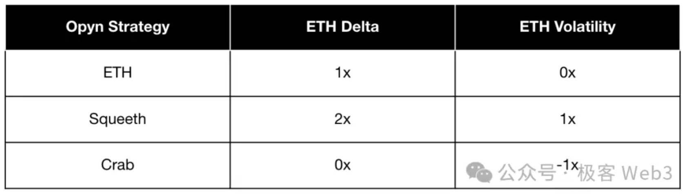

# 永续合约

## 导读
- **概念综述**：梳理永续合约的定义、核心特征与传统衍生品差异。
- **机制拆解**：涵盖资金费率、保证金、杠杆、指数价格/标记价格的完整运作逻辑。
- **生态观察**：系统整理永续合约DEX的市场格局、定价与撮合模型、流动性基础设施及代表协议迭代。
- **产品创新**：汇集方差永续、Pre-Launch、RWA、ETP等新兴产品与预测市场的新玩法。

---

## 第一部分 基础认知

### 1.1 永续合约是什么
永续合约（Perpetual Contract，简称“永续”）是一种没有到期日、可长期持有的衍生品合约，本质上是永不交割的期货。它通过资金费率（Funding Rate）机制把合约价格锚定现货价格，让交易者无需实物交割就能进行高杠杆多空双向交易。

### 1.2 核心特征
- **无到期日**：传统期货每周或每季度交割，永续合约永不交割，想持有多久就多久。
- **资金费率（Funding）**：每1～8小时多空双方互相支付一次利息。
  - 合约价 > 现货价 → 多头付空头，鼓励做空压价；
  - 合约价 < 现货价 → 空头付多头，鼓励做多抬价。
  通过资金费率把溢价/折价“掰”回现货价，实现软锚定。
- **高杠杆**：主流平台支持1～100倍杠杆，保证金亏损触及维持保证金即触发强制平仓（清算）。
- **盈亏结算币本位**：绝大多数永续合约以USDT/USDC等稳定币计价、结算，盈亏直接增减账户余额，无需交割实物资产。
- **指数价格 + 标记价格**：指数价格来自多家现货交易所的加权，防止单点操纵；标记价格通过指数价格与资金费率推算，用于计算未实现盈亏与强平价格，减少极端行情下的“插针”。

### 1.3 一句话总结
永续合约 = “永久持仓的杠杆押注”，用资金费率代替交割，把合约价格持续“拧”回现货，是当前加密世界成交量最大的衍生品。

### 1.4 加密衍生品基础
衍生品是从现实世界资产（如债券或股票）中衍生出价值的工具。合同在两个或多个各方之间进行，允许他们对资产未来的价值进行投机。这些法律协议在不需要实际持有资产的情况下，使交易者能够接触到基础资产的价格变动。投资者可以使用衍生品来缓解损失（“对冲”）或承担风险以期望获得利润（“投机”）。根据衍生品的不同，交易者可能有选择或义务在将来的某个时候以预定价格交易基础资产。

加密衍生品将其价值与数字资产（例如BTC）挂钩——在这种情况下，衍生品的价格随着BTC的价格上涨或下跌。加密投资者通常使用这些合同进行投机，而非现货交易。然而，如果某人预计他们持有的数字货币会贬值，他们也可能会使用衍生品来降低风险。

### 1.5 什么是加密永续合约
加密永续合约（crypto perps）是一种被称为“期货”的特定类型的衍生品。顾名思义，这些合同对未来某个日期数字货币的价格进行投机。期货的买家押注某资产在协议到期时将高于或低于预定价格：
- 看涨者买入“多头”期货；
- 看跌者买入“空头”期货。

例如，两名衍生品交易者可能在BTC价格为25,000美元时签订一份期货合约。A认为在一个月后BTC将超过25,000，而B确信它会低于这个价格。A同意在一个月后（合同到期日）以25,000美元从B那里购买1 BTC。如果到期日BTC的价格高于约定价格，则A获利；如果下降，则B获利。

传统期货与永续合约之间的区别在于，后者没有到期日期。当交易者买入加密永续合约头寸时，它将无限期保持开放——关闭永续合约的唯一方法是手动退出该位置。延续上例，若A在BTC价格为25,000美元时通过永续合约建仓，他们可以持有该头寸直到满意为止；若希望获得10,000美元利润，只需在BTC达到35,000美元时下达平仓订单，无论这发生在六个月、一年或更久之后。

### 1.6 永续合约如何运作
加密交易所（如dYdX）允许用户以最低抵押保证金购买多头或空头永续头寸，这种最低抵押称为“初始保证金”。在dYdX平台上，比特币永续合约的初始保证金为5%，以稳定币USDC支付——换句话说，用户至少需要目标BTC永续头寸面值的5%才能开仓。

由于永续合约永不到期，因此有一些独特的机制影响其定价：

#### 维护保证金
每份永续合约都有一个“维护保证金”率，即交易者保持其头寸活跃所需的最低抵押金额。在dYdX的比特币永续合约中，交易者需要保持3%的维护保证金。如果账户抵押低于3%的阈值，就会失去整个头寸，触发“清算”。

#### 杠杆
交易者可以选择使用借入资金（杠杆）来放大仓位。在dYdX上，永续头寸最高可以使用20倍杠杆。20倍杠杆意味着仅投入5%的保证金即可撬动整整一倍的仓位名义价值；在这种杠杆水平下，每当标的资产价格上涨1%，永续合约的价值就会增加20%，反之亦然。但杠杆越高，资金费率和价格波动带来的风险越大，稍有不利变动即可能触发清算，因此更适合熟悉保证金管理与止损机制的经验型交易者。

### 1.7 指数价格、标记价格与结算货币
永续合约通常使用外部指数价格衡量公允价值，再通过资金费率修正得到标记价格，用于未实现盈亏与强平计算，以减少极端行情的“插针”。绝大多数平台采用稳定币本位的盈亏结算方式，直接在账户中增减USDT/USDC余额，无需交割实物资产。

### 1.8 永续合约在加密生态中的PMF
永续合约允许交易者无限期持有头寸，与传统金融市场多年来的场外期货交易类似。不同的是，永续合约通过资金费率将期货这种本向机构开放的产品普及给散户，形成“欠阻尼效应”，在一定程度上防止多空结构过度失衡。

当前永续合约市场的月交易量已超过1200亿美元，得益于交易所提供的用户体验、订单簿机制带来的撮合效率，以及垂直整合清算系统确保清算快速且安全。垂直整合清算系统指由单一实体或平台全面控制清算流程，不依赖第三方清算机构；相对的分离清算系统强调透明与监管。Ethena等项目进一步利用永续合约作为底层机制，拓展了除投机以外的多元化用途。

与传统期货相比，永续合约具备四个显著优势：
1. **免展期成本**：没有到期日，交易者无需在合约到期时平仓再买新合约，避免展期费用与价差。
2. **避免远期升水压力**：资金费率机制让永续合约在正向市场结构下也能保持成本可控。
3. **实时结算与资金管理简化**：业内标准为8小时结算一次资金费率（币安、Bybit等遵循该标准），每个周期自动扣除或补贴资金，提供实时盈亏并减轻后台处理压力。
4. **平滑的价格发现**：资金费率反映多空力量并持续拉拢合约价到现货价，避免展期或交割带来的价格震荡。

### 1.9 交易流程示例
考虑一个经典的多空对手盘：当BTC价格处于25,000美元时，交易者A与B签订永续合约。A看涨选择多头，B看跌选择空头。与传统期货不同，永续合约没有固定到期日，双方可以根据自身策略在任意时间平仓。若BTC上涨至35,000美元，A平仓即可获得10,000美元利润；若价格下跌，B获得收益。整个过程中，A与B需要持续关注初始保证金、维持保证金与资金费率，以免触发清算。

### 1.10 资金费率机制
永续合约还带有“资金费率机制”，会定期对持仓账户扣除或增加费用。资金费率机制的目的是根据基础资产价格调整永续合约的价值。如果比特币现货价格高于永续合约价格，资金费率机制将向多头收取费用以支付给空头；反之，当BTC现货价低于永续价时，空头向多头支付返款。

例如，交易者可以在15,000美元价格买入一个比特币永续合约。当BTC高于15,000美元时，多头永续持有者虽然获利，但需要向空头支付费用以维持溢价头寸；当BTC低于15,000美元时，合约价值下降，但多头会从空头处收取返款。资金费率的结算周期取决于交易所，币安、Bybit等通常每8小时结算一次。

### 1.11 永续合约的好处
永续合约并不适合每位投资者，但对了解其机制的交易者而言具有独特优势：
- **无需托管基础资产**：衍生品适合希望获得价格敞口却不想承担数字资产保管风险的交易者；无需持有标的即可参与价格变动。
- **多空双向交易**：现货市场只能做多，永续合约让投资者可以轻松做空，便于对价格上涨或下跌进行投机。
- **便于对冲现有头寸**：持有现货的投资者可通过反向永续合约对冲风险，例如ETH持有者开设空头ETH永续以抵消下跌损失。
- **易于获得杠杆**：永续提供便捷的杠杆工具，让交易者以较少的抵押品放大头寸；虽然增加风险，但同时提高潜在收益。
- **横盘市场中的收益来源**：资金费率机制在市场对交易者不利时仍可能支付费用，即便合约价值处于亏损，所获资金费率也能提升总体回报。

### 1.12 永续合约的风险
与任何持仓一样，永续合约可能带来不利结果。由于容易使用杠杆，永续合约对缺乏经验的交易者而言风险较高。不熟悉保证金监控或止损的交易者，可能很快在高杠杆头寸中亏损并被清算。因此，考虑使用永续合约的投资者应密切关注维护保证金、资金费率与费用要求，确保在亏损扩大前及时平仓或追加抵押，以降低清算风险。

---

## 第二部分 市场定位与发展趋势

### 2.1 永续合约DEX市场份额演进
自BitMEX于2016年首创永续合约以来，去中心化永续合约DEX迅速生长，如今已有超过100家平台支持永续交易。早期永续DEX规模很小，2017年上线以太坊的dYdX长期主导市场；如今各条公链上都能看到活跃的永续合约DEX，永续交易已成为加密生态系统不可或缺的一部分。多项研究表明，随着永续交易规模增长，在现货市场不活跃时，永续市场已具备价格发现功能。DEX永续合约月度成交量从2021年7月的10亿美元增长到2024年7月的1200亿美元，年复合增长率约393%。

### 2.2 链上性能与流动性瓶颈
永续合约DEX仍受限于链上低流动性与高延迟。要推动市场进一步发展，必须解决流动性组织、撮合性能与用户体验三大核心问题。高流动性可以降低滑点，使交易过程更顺畅并减少用户损失；低延迟意味着做市商能报出更紧凑的价格、交易得以及时执行，从而提升市场流畅性。达到足够的交易量与流动性“临界规模”（critical mass）是关键，否则难以提供稳定的交易环境并留住用户。

---

## 第三部分 定价与撮合模型

### 3.1 模型概览
在永续合约DEX中，定价与撮合模型决定了市场能否准确反映供需动态、降低波动性并提升资本效率。常见模型包括预言机模式、虚拟自动做市商（vAMM）、链下订单簿结合链上结算、全链订单簿、RFQ以及基于LP衍生品的LPDFi等。

### 3.2 预言机模式
预言机模式指永续合约DEX从交易量较大的头部交易所中获取价格数据，并基于该数据提供服务。虽然存在价格被操纵的风险，但能显著降低定价成本。例如GMX使用Chainlink预言机获取价格数据，确保价格的准确性和完整性，为价格接受者（小机构和个人）创造友好的交易环境，同时向价格制定者（大机构和做市商）提供丰厚奖励。然而，这种模式严重依赖头部交易所的价格数据，只能作为价格接受者，难以自主进行价格发现。

### 3.3 虚拟自动做市商（vAMM）
虚拟自动做市商模型受到Uniswap AMM的启发。AMM通过实际资金池提供流动性与定价，而vAMM的资金池是虚拟的，通过数学公式模拟交易对的买卖行为，实现永续合约定价。vAMM无需投入大量资金，也不必与现货直接关联，已被Perpetual Protocol、Drift Protocol等永续合约DEX采用。尽管vAMM存在高滑点和无常损失等问题，但因其透明和去中心化特性，仍是一套重要的链上定价机制。

### 3.4 链下订单簿结合链上结算
为克服链上订单匹配的性能限制，一些DEX采用链下订单簿与链上结算的混合模式。交易匹配在链下完成，而结算和资产托管仍然在链上，用户资产始终自托管。由于撮合在链下进行，MEV等风险显著降低。这种设计既保留了DeFi的安全性和透明性，又提升了性能，与Rollup理念相通。dYdX v3、Aevo、Paradex等项目均采用这一方案。

### 3.5 全链订单簿
全链订单簿将与交易订单相关的数据和操作完全放在链上，是维护交易完整性的最安全方案之一。缺点在于受区块链延迟和吞吐量限制，同时面临“前置交易”和“市场操纵”等风险：订单数据完全公开，MEV参与者可以抢跑交易，或利用大额订单影响价格。尽管如此，全链订单簿在去中心化与安全性方面极具吸引力。Solana、Monad等公链正在改进基础设施以承载全链订单簿，Hyperliquid、dYdX v4、Zeta Markets、LogX、Kuru Labs等项目也在推动高性能全链订单簿系统的发展。

### 3.6 RFQ（报价请求）模型
RFQ模型为去中心化交易带来范式转变。一大优势是LP无需提前锁定流动性，LP只在收到请求时才承诺资本，从而最大化资本利用率。RFQ聚焦于减少滑点交易，并提供防三明治攻击和MEV的保护。资本效率是RFQ模型的关键元素，可用更少的资本完成大额交易。

比较总未平仓头寸余额与总锁仓价值（TVL）/LP存款，可以看出Symmio在RFQ模型下的效率更高：在240,431美元的LP存款支持下即可支撑6,005,000美元的比特币空头未平仓头寸；而采用vAMM模型的Gains (GNS)在38,847,672美元的LP存款情况下只能支持约10,000,000美元的未平仓头寸。差距的原因在于高波动市场下，vAMM可能对LP造成严重损失，因此需要大量储备资本。对比之下，Symmio的RFQ模型既是预防措施，也让更多资本得以高效分配。RFQ的挑战在于必须保持报价方的多样性与去中心化，激烈竞争才能维持效率。

### 3.7 vAMM与基于池的模型再探
基于池的DEX从供需角度看对永续平台仍具吸引力，但也伴随复杂缺点：未平仓头寸有限导致大量资本闲置；LP需承担对手方头寸风险，协议在极端亏损场景下的支付能力受限；依赖预言机限制了可交易资产数量，预言机被攻击时平台脆弱；在牛市等极端波动期，LP可能遭遇重大损失，触发“死亡螺旋”，造成流动性减少、用户参与度下降以及进一步的LP提款。

### 3.8 订单簿模型
订单簿模型主要由中心化交易所使用，但去中心化永续平台领导者如dYdX同样基于订单簿运营。其优势在于提供与CEX相似的用户体验，具备透明度、费用与流动性效率、价格发现能力。然而链上订单簿需要极低延迟与高吞吐，链上基础设施尚难满足。dYdX通过从StarkEx迁移到Cosmos链来改善这些缺点。链上订单簿通常依赖机构做市商提供流动性，资本利用率偏低，因为挂单需要持续被资金支持。

### 3.9 LPDFi（Liquidity Provider Derivatives Finance）
LPDFi是流动性提供衍生品领域的新概念，利用Uniswap V3 LP头寸创建包括期权与永续合约在内的创新产品，打破传统DeFi产品框架。LPDFi的关键特征是由协议自动管理流动性并保护资产，避免交易者因价格波动被清算：
- 当市场价格大幅下跌时，LPDFi通过逐步消耗保证金来覆盖保护头寸成本，让交易者避免被立即清算；
- 持仓将每个交易者与流动性在单一价格上直接关联，消除对手方风险；
- LP承受的无常损失被转化为交易者的“无常收益”，配合平台费用有望提高LP回报。

---

## 第四部分 流动性获取与用户体验演进

流动性是交易所赖以生存的根本，但如何获取初始流动性长期困扰新平台。DeFi 早期，DEX通常通过高APY或空投激励流动性提供者（LP），或为交易者提供跨市场套利机会。然而随着DEX数量增长，单一平台难以吸引足够多的交易者达到流动性的“critical mass”。

Critical mass即“有效规模”，指某种事物达到足够规模后，突破维持运营的最低成本，实现长期最大利润。如下图所示，横轴为产品规模，纵轴为总成本。

在DEX场景中，critical mass指交易量和流动性的阈值，只有达到该阈值，才能提供稳定的交易环境，吸引更多用户。永续合约DEX通常通过以下策略提升流动性基础：

- **社区支持的活跃流动性金库**：以Arbitrum上的Hyperliquid为例，HLP金库整合Hyperliquid及其他交易所的数据计算公允价格，在多资产间执行流动性策略，并将收益和损失按金库份额分配给参与者。（Hyperliquid 产品界面）

  

- **跨链流动性调配**：Orderly Network、LogX Network等允许在任意链上创建永续前端，实现市场间流动性的杠杆化。LogX结合链上原生流动性、跨链聚合流动性及离散资产市场中性（DAMN）AMM池（使用USDT、USDC、wUSDM等稳定资产并依赖预言机），在剧烈波动期间仍能维持流动性。（LogX Network 跨链流动性调配）

  

- **智能路由与跨链聚合器**：Vooi.io 等DEX聚合器研发智能路由系统，将多个DEX与跨链桥整合到单一界面，帮助用户找到最优交易对与最低滑点，同时压缩操作复杂度与交易成本，可将其理解为链上“交易路由器”。

- **交易机器人与新式UX**：Telegram交易机器人提供实时提醒、自动交易、组合管理等功能，在聊天界面直接完成交易，显著提升便利性与参与度。但用户需将私钥托管给机器人，存在安全风险。

实际上，CEX通常在生态中承担更深层的入口与跨链桥角色，而DEX则往往局限在单一生态。随着跨链DEX的出现，这一界限被逐步打破，跨链聚合器将多个市场的流动性与价格信息整合到同一界面，让用户在多链之间以更低成本完成复杂交易路径。

---

## 第五部分 创新型永续合约与金融产品

永续合约DEX持续推出新型金融产品或优化现有机制，以更好地满足交易者不断变化的需求。

### 5.1 方差永续合约
方差是常见的统计学指标，用于反映数据的离散程度。方差永续合约的标的不再是价格，而是波动率。若交易者认为BTC价格会剧烈波动但不确定方向，可买入BTC方差永续合约对波动率下注，无论上涨、下跌或震荡，都能在波动加剧时获利；同时也能在价格暴跌时对冲部分损失。

去中心化永续交易所Opyn利用现有市场资源开发多种方差永续产品，包括Stable Perps（0-perps）、Uniswap LP Perps（0.5-perps）、Normal Perps（1-perps）与Squared Perps（2-perps，也称Squeeth）：
- Stable Perps为交易策略提供稳固基础；
- Uniswap LP Perps可在不直接提供流动性的情况下反映LP收益；
- Normal Perps是最普通的永续合约类型；
- Squared Perps通过二次敞口放大收益潜力。

这些永续可以组合成更复杂的策略。例如“螃蟹策略”：做空2-perps同时做多1-perps，可在震荡盘赚取资金费率并保持方向中性；“禅牛策略”结合做空2-perps、做多1-perps和做空0-perps，在保持多头敞口的同时赚取资金费率收益。

（去中心化永续合约交易所 Opyn）

### 5.2 Pre-Launch 永续合约
Pre-Launch 永续让交易者在代币正式上线前就其未来价格进行投机，可理解为IPO场外交易的链上版本，帮助投资者基于预期价值提前建仓。Aevo、Helix、Hyperliquid等多个永续DEX已推出该模式，凭借独家资产吸引并留住用户。

### 5.3 RWA 永续合约
现实资产（RWA）上链的一个重要方式是先通过永续合约形式呈现。相比直接将RWA现货代币化，永续合约只需流动性和价格预言机即可启动市场。即使链上不存在现货市场，也可构建流动性良好的永续市场，为后续现货代币化积累关注度与流动性，并支持预测市场情绪、事件驱动交易或跨资产套利。Ostium Labs、Sphinx Protocol等团队正在该领域崭露头角。

### 5.4 ETP 永续合约
ETP（交易所交易产品）会跟踪基础资产或指数的表现，如股票、债券、大宗商品、货币或资产组合。常见ETP包括ETF（追踪特定指数/行业）、ETN（与债券类似但收益与指数挂钩）、ETC（专注大宗商品）。

ETP永续合约可用于构建长期持有的期货敞口而无需展期，例如ETF USO（WTI原油期货）或ETN VXX（VIX期货）。永续合约降低展期成本与净资产值（NAV）贬值风险，更适合需要长期敞口但无需实物交割的机构。对于传统30/90天的场外远期合约，也可使用美元结算的永续合约替代，简化操作并降低对手风险。

### 5.5 预测市场新形态
预测市场允许参与者对未来事件结果进行交易和下注，如选举结果、体育赛事胜负、经济指标变化等。永续合约DEX通过提供灵活且持续的交易机制，有望彻底改变预测市场，尤其适合选举或不定期天气预报等不规则事件。与依赖真实事件或预言机的传统预测市场不同，永续合约可以基于市场自身不断更新的数据创建预测市场。

持续更新的数据可在长期预测市场中生成多个子市场，例如在大选期间围绕某候选人在特定辩论后的支持率变化开展交易。用户无需等待长期事件的最终结果即可根据短期波动（新闻影响、数据发布等）进行买卖，提供即时交易机会与反馈。永续合约的实时结算保障市场活动稳定，增强流动性与参与度。由社区控制的永续市场还可通过声誉与代币奖励机制激励参与，为去中心化预测市场奠定基础，使市场创建更民主、可扩展。

---

## 第六部分 主流协议最新进展

### 6.1 dYdX
dYdX的上线提高了代币效用，并通过与代币持有人分享利润创造更多价值。作为永续衍生品领域的领导者，dYdX长期保持最高交易量，也面临以下问题：
- 缺乏代币效用；
- 可扩展性有限；
- 订单簿机制仍具中心化属性。

dYdX v4的发布旨在解决这些痛点。
- **代币价值捕获**：dYdX代币最初主要用于治理与质押折扣，社区质疑持有价值。dYdX v4将链上产生的手续费分发给验证者和矿工，增强代币价值捕获。
- **可扩展性**：v4迁移到基于StarkWare技术、使用Cosmos SDK与Tendermint权益证明共识的独立dYdX链，提升订单簿扩展性与长期吞吐量。
- **进一步去中心化**：dYdX的订单簿与撮合引擎完全上链，强化协议的去中心化程度。

### 6.2 GMX
GMX v2重新思考流动性处理方式，并提供合成头寸扩展资产范围。在GMX v1中，GLP由50%稳定币与50%波动资产组成；v2通过引入GM池改变结构。GM池只包含多头与空头两类资产，存款者可选择存入多头/空头或两者组合，若存款改变池子平衡则需承担价格影响。

GMX v2的关键变化包括：
- **转向独立市场**：LP对所提供流动性拥有更高自主权与风险控制，但长期需警惕流动性碎片化，特别是长尾资产。
- **价格影响与资金费用**：为缓解价格操纵与多空不平衡问题，引入价格影响与资金费用，均匀分散风险。不过大型交易者习惯v1的零滑点体验，可能对新增费用感到不适。GMX计划让v1与v2并行，以满足不同用户需求。
- **费用削减策略**：v2将交易费用降至0.05%（约为v1初始费用的一半），平衡新增费用带来的成本感知。

---

## 第七部分 衍生品成功要素

### 7.1 高流动性与效率
在需要快速执行交易的去中心化期货市场，流动性规模是吸引交易者的关键。平台需要鼓励流动性提供、减轻LP风险，并确保包括长尾资产在内的足够流动性。GMX v2等升级预计将优化LP环境，但长尾资产因流动性碎片化仍面临挑战。总体来看，交易者倾向选择提供最高流动性的永续平台，以获得优质体验。

### 7.2 低费用结构
为了优化交易盈利能力，平台需提供具有竞争力的费用率。当前市场中，去中心化永续平台的费用已显著下降，与CEX越来越接近。

跨平台的做市商/交易者费用比较显示，费用竞争愈演愈烈。低费用有助于吸引和留住新用户，但仅凭费用难以建立壁垒，平台还需要在体验、资产丰富度等方面不断创新。

### 7.3 长尾资产上市
无许可地上市长尾资产是DEX相较CEX的重要优势。理论上，只要确保足够流动性，永续DEX即可不断添加满足不同需求的资产，这是CEX难以做到的。GMX v2的独立资产池即旨在扩大无许可永续DEX的叙事，利用先发优势快速上架新交易对或协议，争夺市场份额。然而，流动性不足与市场操纵风险意味着平台必须采取额外措施保护LP。

---

## 参考资料
https://learnblockchain.cn/article/9209
https://learnblockchain.cn/article/20390
https://research.opyn.co/everything-is-a-perp
https://www.youtube.com/watch?v=gqjX6xfNxdU
