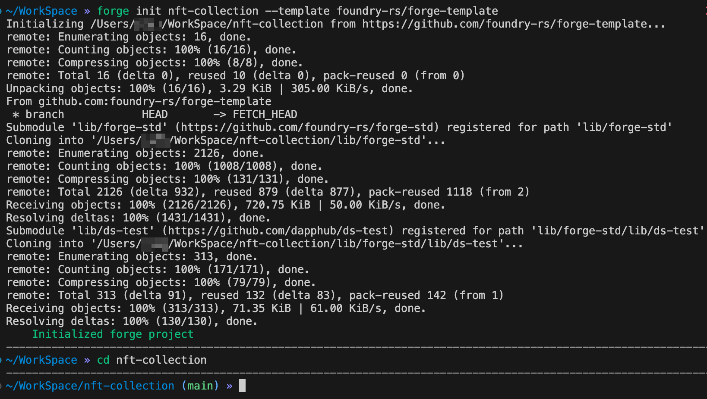
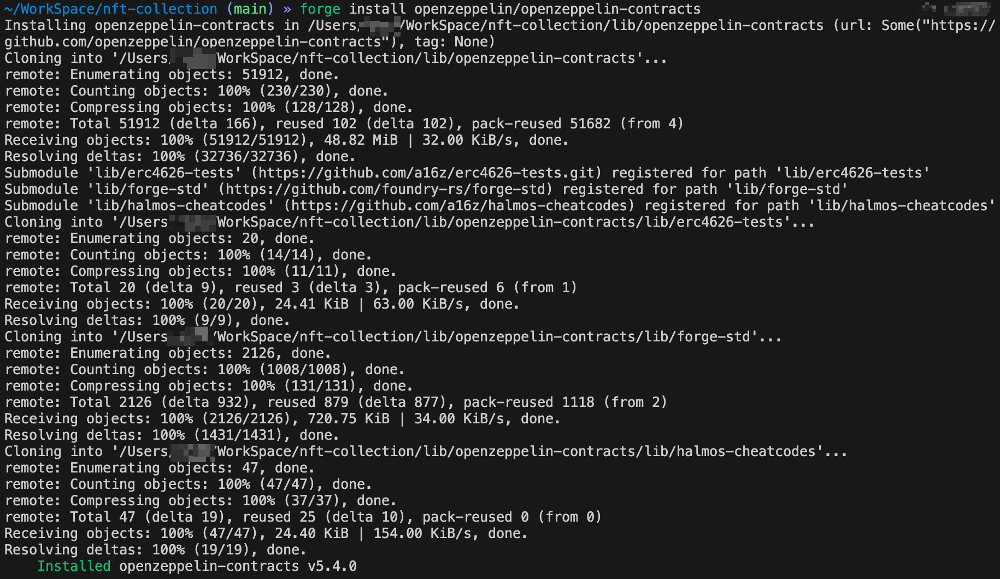
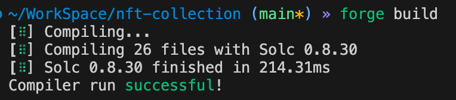
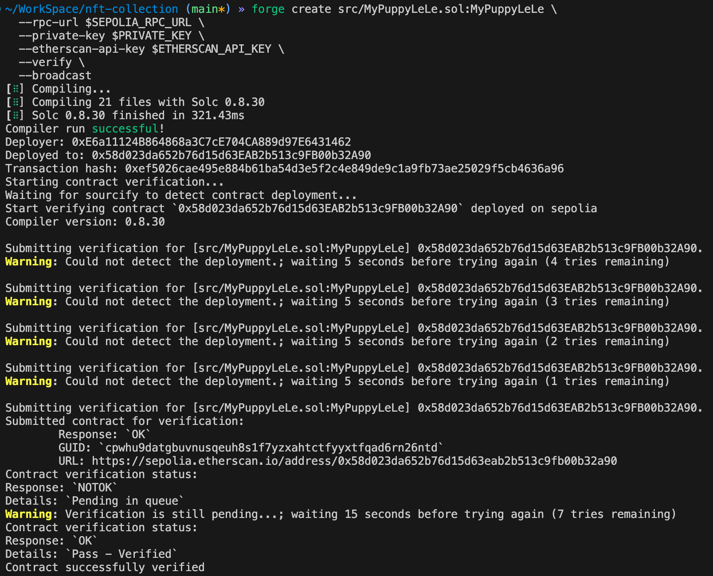
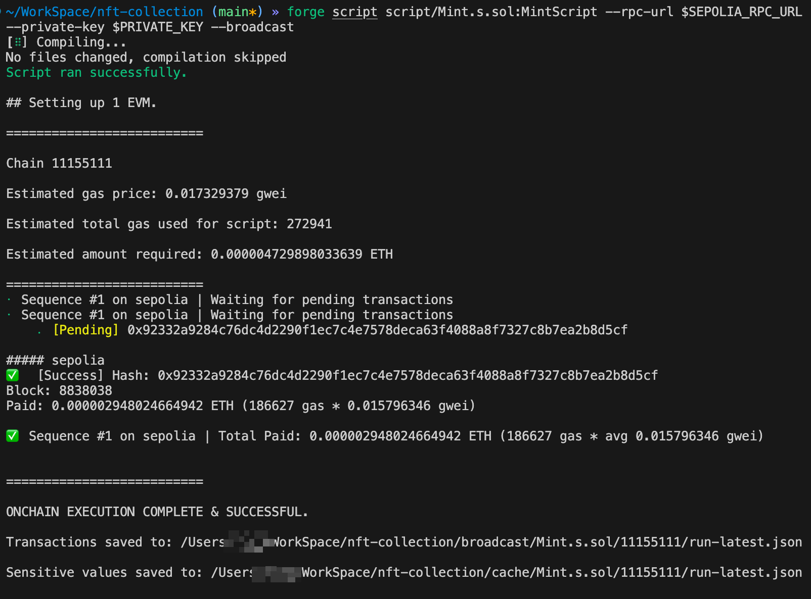
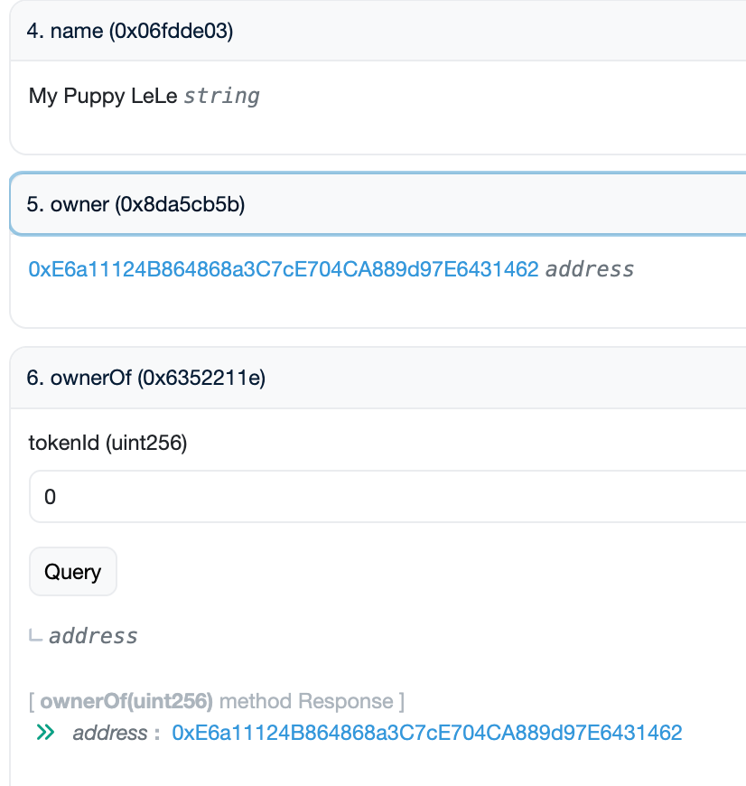

# 在Sepolia发行 ERC721 NFT 

以下是使用 Foundry 框架和 OpenZeppelin 库在Sepolia发行 NFT 合约的完整操作指南：

#### 1. 环境准备

首先需要安装以下工具：

- Foundry (v1.0.0+) - 合约开发与部署框架
- Node.js (v16+) - 用于处理图片和元数据
- Git - 版本控制

安装 Foundry：

```bash
curl -L https://foundry.paradigm.xyz | bash
foundryup
```

#### 2. 创建项目

```bash
forge init nft-collection --template foundry-rs/forge-template
cd nft-collection
```



#### 3. 添加 OpenZeppelin 依赖

```bash
forge install openzeppelin/openzeppelin-contracts
```



#### 4. 编写 NFT 合约

创建`src/MyPuppyLeLe.sol`文件：

```solidity
// SPDX-License-Identifier: MIT
pragma solidity ^0.8.20;

import "@openzeppelin/contracts/token/ERC721/ERC721.sol";
import "@openzeppelin/contracts/token/ERC721/extensions/ERC721URIStorage.sol";
import "@openzeppelin/contracts/access/Ownable.sol";

contract MyPuppyLeLe is ERC721, ERC721URIStorage, Ownable {
    uint256 private _nextTokenId;

    constructor() ERC721("My Puppy LeLe", "MPLL") Ownable(msg.sender){}

    function safeMint(address to, string memory uri) public onlyOwner {
        uint256 tokenId = _nextTokenId++;
        _safeMint(to, tokenId);
        _setTokenURI(tokenId, uri);
    }

    function tokenURI(uint256 tokenId) public view override(ERC721, ERC721URIStorage) returns (string memory) {
        return super.tokenURI(tokenId);
    }

    function supportsInterface(bytes4 interfaceId) public view override(ERC721, ERC721URIStorage) returns (bool) {
        return super.supportsInterface(interfaceId);
    }
}

```

#### 5. 配置环境变量

创建`.env`文件：

```env
PRIVATE_KEY=你的私钥
SEPOLIA_RPC_URL=https://sepolia.infura.io/v3/你的项目ID
ETHERSCAN_API_KEY=你的Etherscan API密钥
```

加载环境变量：

```bash
source .env
```

#### 6. 编译合约

```bash
forge build
```



#### 7. 部署合约到测试网

使用以下命令部署到 Sepolia 测试网：

```bash
forge create src/MyPuppyLeLe.sol:MyPuppyLeLe \
  --rpc-url $SEPOLIA_RPC_URL \
  --private-key $PRIVATE_KEY \
  --etherscan-api-key $ETHERSCAN_API_KEY \
  --verify \
  --broadcast
```



看到上面的输出，即代表已经部署并验证合约成功了！

关键信息如下：

- Deployed to:

0x58d023da652b76d15d63EAB2b513c9FB00b32A90

这就是你的合约地址。

- Etherscan 链接：

https://sepolia.etherscan.io/address/0x58d023da652b76d15d63eab2b513c9fb00b32a90

- Contract successfully verified

合约已经在 Etherscan 上通过验证。


#### 8. 准备图片和元数据

创建以下目录结构：

```plaintext
metadata/
├── images/
│   ├── 1.png
│   ├── 2.png
│   └── 3.png
└── json/
```

#### 9. 编写元数据 JSON

`metadata/json/1.json`示例：

```json
{
  "name": "NFT #1",
  "description": "My first NFT collection",
  "image": "ipfs://CID_OF_IMAGE_1.png",
  "attributes": [
    { "trait_type": "Color", "value": "Blue" },
    { "trait_type": "Rarity", "value": "Common" }
  ]
}
```

#### 10. 上传到 IPFS

用 Pinata 官网上传 CAR 文件

1. 登录 Pinata 官网

打开 https://app.pinata.cloud/ 并登录你的账号。

2. 进入 Upload 页面

在左侧菜单点击“Upload”，选择“File”。

3. 选择 CAR 文件

在弹出的窗口中，点击“Select File”，选择你本地的 images.car 文件。

4. 开始上传

选好文件后，点击“Upload”按钮，等待上传完成即可。

5. 获取 CID

上传完成后，Pinata 会显示该 CAR 文件的 CID，你可以复制并使用它。


#### 11. 更新元数据中的图片链接

将 JSON 文件中的`image`字段替换为实际的 IPFS CID。

#### 12. 铸造 NFT

编写脚本`script/Mint.s.sol`：

```solidity
// SPDX-License-Identifier: UNLICENSED
pragma solidity ^0.8.19;

import "forge-std/Script.sol";
import "../src/MyNFT.sol";

contract MintScript is Script {
    MyNFT public nft;

    function run() external {
        address nftAddress = 0x你的合约地址; // 替换为实际合约地址
        nft = MyNFT(nftAddress);
        
        uint256 deployerPrivateKey = vm.envUint("PRIVATE_KEY");
        vm.startBroadcast(deployerPrivateKey);

        // 铸造NFT，替换为实际的IPFS URI
        nft.safeMint(msg.sender, "ipfs://CID_OF_METADATA_1.json");

        vm.stopBroadcast();
    }
}
```

执行铸造：

```bash
forge script script/Mint.s.sol:MintScript --rpc-url $SEPOLIA_RPC_URL --private-key $PRIVATE_KEY --broadcast
```




#### 13.. 查看 NFT

https://sepolia.etherscan.io/token/0x58d023da652b76d15d63eab2b513c9fb00b32a90



### 源码：

https://github.com/RyanWeb31110/nft-collection

### 注意事项

1. 确保在部署和铸造前测试网络连接
2. 私钥和 API 密钥不要上传到GITHUB
3. 测试网 NFT 没有实际价值，仅用于练习
4. 主网部署需要真实 ETH，操作前请充分测试

按照以上步骤，你可以成功发行自己的 NFT 。