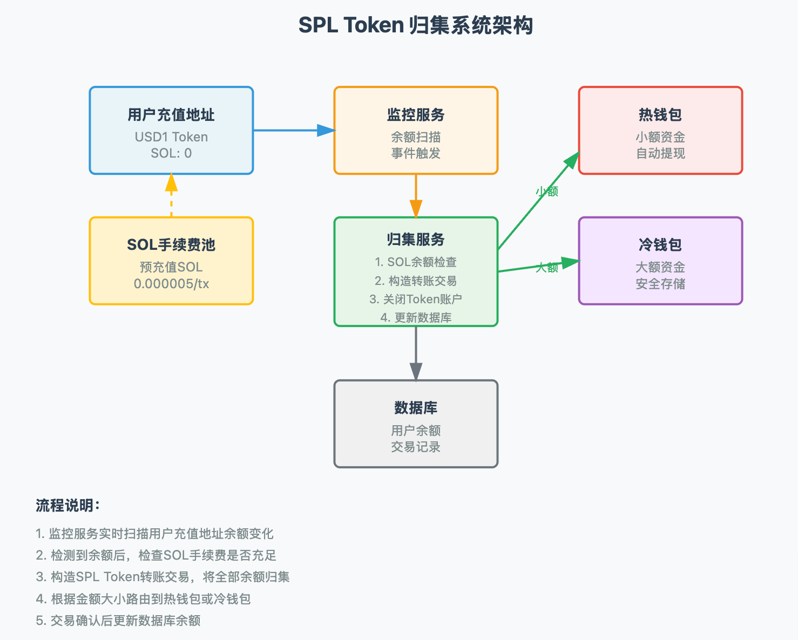
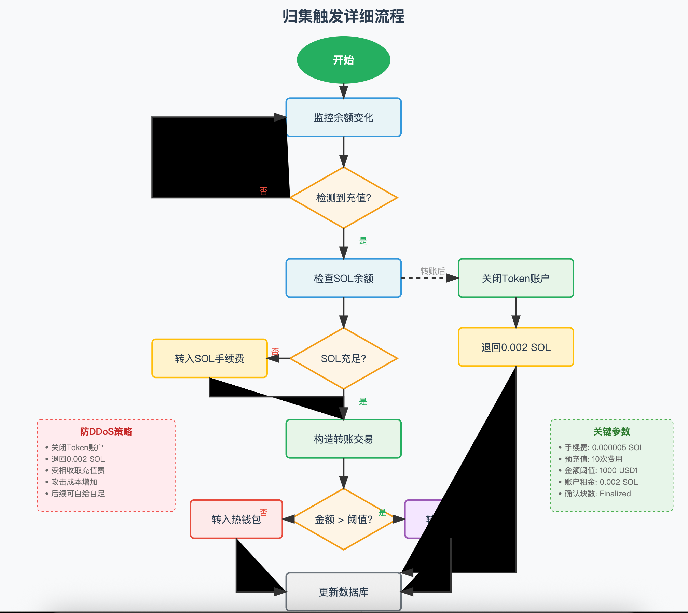

# SPL Token 归集系统设计详解

## 归集思路

1. 归集的本质是构造交易做 spl token 转账。这个之前在 delulu 有现成代码可以移植。
2. 用户充值地址可能只充入了 usd1，没有 sol 用于构造交易
   1. 可以做前置检测，如果没有 sol 余额就先转一些过去。spl 转账可以不需要加额外的 fee，基础手续费是 0.000005 sol。可以一次转够多次的。
3. 建议扫描到余额变化就立刻触发归集转账，把所有余额都转走。归集转账交易成功且 finalize 后才修改数据库的余额。这样对我们健壮性更高，不会有资损。而且可以减少资金停留在用户热钱包的时长，增加安全性。
   1. 参考中心化交易所，转出可以收取手续费，但充值一般不收，就按钱包地址到账金额到账。如果采用每有余额变化就转走的策略，有潜在的 ddos 风险（不断对一个充值账号做小额转账，攻击成本和我们的花费一致）。一个可以考虑的策略是，每次归集转出用户所有余额后，把 token account 给关掉，里面沉淀的约 0.002 sol 退回用户账号。这样相当于变相收取了 0.002 sol 充值手续费，只有第一次需要我们给用户账号打手续费，后面可以自给自足。
4. 归集的目标地址。感觉可以设个资金分界线，小额的直接转给热钱包循环，大额的先进冷钱包。


## 一、系统架构概览



```
<svg viewBox="0 0 800 600" xmlns="http://www.w3.org/2000/svg">
  <!-- 背景 -->
  <rect width="800" height="600" fill="#f8f9fa"/>
  
  <!-- 标题 -->
  <text x="400" y="30" text-anchor="middle" font-size="20" font-weight="bold" fill="#2c3e50">
    SPL Token 归集系统架构
  </text>
  
  <!-- 用户充值地址 -->
  <g transform="translate(100, 80)">
    <rect x="0" y="0" width="150" height="80" rx="5" fill="#e8f4f8" stroke="#3498db" stroke-width="2"/>
    <text x="75" y="30" text-anchor="middle" font-size="14" font-weight="bold" fill="#2c3e50">用户充值地址</text>
    <text x="75" y="50" text-anchor="middle" font-size="12" fill="#7f8c8d">USD1 Token</text>
    <text x="75" y="65" text-anchor="middle" font-size="12" fill="#7f8c8d">SOL: 0</text>
  </g>
  
  <!-- 监控服务 -->
  <g transform="translate(325, 80)">
    <rect x="0" y="0" width="150" height="80" rx="5" fill="#fef5e7" stroke="#f39c12" stroke-width="2"/>
    <text x="75" y="30" text-anchor="middle" font-size="14" font-weight="bold" fill="#2c3e50">监控服务</text>
    <text x="75" y="50" text-anchor="middle" font-size="12" fill="#7f8c8d">余额扫描</text>
    <text x="75" y="65" text-anchor="middle" font-size="12" fill="#7f8c8d">事件触发</text>
  </g>
  
  <!-- 归集服务 -->
  <g transform="translate(325, 200)">
    <rect x="0" y="0" width="150" height="100" rx="5" fill="#e8f5e8" stroke="#27ae60" stroke-width="2"/>
    <text x="75" y="25" text-anchor="middle" font-size="14" font-weight="bold" fill="#2c3e50">归集服务</text>
    <text x="75" y="45" text-anchor="middle" font-size="11" fill="#7f8c8d">1. SOL余额检查</text>
    <text x="75" y="62" text-anchor="middle" font-size="11" fill="#7f8c8d">2. 构造转账交易</text>
    <text x="75" y="79" text-anchor="middle" font-size="11" fill="#7f8c8d">3. 关闭Token账户</text>
    <text x="75" y="96" text-anchor="middle" font-size="11" fill="#7f8c8d">4. 更新数据库</text>
  </g>
  
  <!-- 热钱包 -->
  <g transform="translate(550, 80)">
    <rect x="0" y="0" width="150" height="80" rx="5" fill="#fdeaea" stroke="#e74c3c" stroke-width="2"/>
    <text x="75" y="30" text-anchor="middle" font-size="14" font-weight="bold" fill="#2c3e50">热钱包</text>
    <text x="75" y="50" text-anchor="middle" font-size="12" fill="#7f8c8d">小额资金</text>
    <text x="75" y="65" text-anchor="middle" font-size="12" fill="#7f8c8d">自动提现</text>
  </g>
  
  <!-- 冷钱包 -->
  <g transform="translate(550, 200)">
    <rect x="0" y="0" width="150" height="80" rx="5" fill="#f4e7ff" stroke="#9b59b6" stroke-width="2"/>
    <text x="75" y="30" text-anchor="middle" font-size="14" font-weight="bold" fill="#2c3e50">冷钱包</text>
    <text x="75" y="50" text-anchor="middle" font-size="12" fill="#7f8c8d">大额资金</text>
    <text x="75" y="65" text-anchor="middle" font-size="12" fill="#7f8c8d">安全存储</text>
  </g>
  
  <!-- SOL手续费池 -->
  <g transform="translate(100, 200)">
    <rect x="0" y="0" width="150" height="80" rx="5" fill="#fff3cd" stroke="#ffc107" stroke-width="2"/>
    <text x="75" y="30" text-anchor="middle" font-size="14" font-weight="bold" fill="#2c3e50">SOL手续费池</text>
    <text x="75" y="50" text-anchor="middle" font-size="12" fill="#7f8c8d">预充值SOL</text>
    <text x="75" y="65" text-anchor="middle" font-size="12" fill="#7f8c8d">0.000005/tx</text>
  </g>
  
  <!-- 数据库 -->
  <g transform="translate(325, 350)">
    <rect x="0" y="0" width="150" height="80" rx="5" fill="#f0f0f0" stroke="#6c757d" stroke-width="2"/>
    <text x="75" y="30" text-anchor="middle" font-size="14" font-weight="bold" fill="#2c3e50">数据库</text>
    <text x="75" y="50" text-anchor="middle" font-size="12" fill="#7f8c8d">用户余额</text>
    <text x="75" y="65" text-anchor="middle" font-size="12" fill="#7f8c8d">交易记录</text>
  </g>
  
  <!-- 箭头连接 -->
  <!-- 用户充值地址 -> 监控服务 -->
  <path d="M 250 120 L 325 120" stroke="#3498db" stroke-width="2" marker-end="url(#arrowblue)"/>
  
  <!-- 监控服务 -> 归集服务 -->
  <path d="M 400 160 L 400 200" stroke="#f39c12" stroke-width="2" marker-end="url(#arroworange)"/>
  
  <!-- SOL手续费池 -> 用户充值地址 -->
  <path d="M 175 200 L 175 160" stroke="#ffc107" stroke-width="2" marker-end="url(#arrowyellow)" stroke-dasharray="5,5"/>
  
  <!-- 归集服务 -> 热钱包 -->
  <path d="M 475 230 L 550 140" stroke="#27ae60" stroke-width="2" marker-end="url(#arrowgreen)"/>
  <text x="510" y="180" font-size="11" fill="#27ae60">小额</text>
  
  <!-- 归集服务 -> 冷钱包 -->
  <path d="M 475 250 L 550 240" stroke="#27ae60" stroke-width="2" marker-end="url(#arrowgreen)"/>
  <text x="510" y="250" font-size="11" fill="#27ae60">大额</text>
  
  <!-- 归集服务 -> 数据库 -->
  <path d="M 400 300 L 400 350" stroke="#6c757d" stroke-width="2" marker-end="url(#arrowgray)"/>
  
  <!-- 定义箭头标记 -->
  <defs>
    <marker id="arrowblue" markerWidth="10" markerHeight="10" refX="8" refY="3" orient="auto" markerUnits="strokeWidth">
      <path d="M0,0 L0,6 L9,3 z" fill="#3498db"/>
    </marker>
    <marker id="arroworange" markerWidth="10" markerHeight="10" refX="8" refY="3" orient="auto" markerUnits="strokeWidth">
      <path d="M0,0 L0,6 L9,3 z" fill="#f39c12"/>
    </marker>
    <marker id="arrowyellow" markerWidth="10" markerHeight="10" refX="8" refY="3" orient="auto" markerUnits="strokeWidth">
      <path d="M0,0 L0,6 L9,3 z" fill="#ffc107"/>
    </marker>
    <marker id="arrowgreen" markerWidth="10" markerHeight="10" refX="8" refY="3" orient="auto" markerUnits="strokeWidth">
      <path d="M0,0 L0,6 L9,3 z" fill="#27ae60"/>
    </marker>
    <marker id="arrowgray" markerWidth="10" markerHeight="10" refX="8" refY="3" orient="auto" markerUnits="strokeWidth">
      <path d="M0,0 L0,6 L9,3 z" fill="#6c757d"/>
    </marker>
  </defs>
  
  <!-- 流程说明 -->
  <g transform="translate(50, 470)">
    <text x="0" y="0" font-size="14" font-weight="bold" fill="#2c3e50">流程说明：</text>
    <text x="0" y="25" font-size="12" fill="#7f8c8d">1. 监控服务实时扫描用户充值地址余额变化</text>
    <text x="0" y="45" font-size="12" fill="#7f8c8d">2. 检测到余额后，检查SOL手续费是否充足</text>
    <text x="0" y="65" font-size="12" fill="#7f8c8d">3. 构造SPL Token转账交易，将全部余额归集</text>
    <text x="0" y="85" font-size="12" fill="#7f8c8d">4. 根据金额大小路由到热钱包或冷钱包</text>
    <text x="0" y="105" font-size="12" fill="#7f8c8d">5. 交易确认后更新数据库余额</text>
  </g>
</svg>
```


## 二、核心流程详解

### 2.1 归集触发流程



```
<svg viewBox="0 0 900 800" xmlns="http://www.w3.org/2000/svg">
  <!-- 背景 -->
  <rect width="900" height="800" fill="#f8f9fa"/>
  
  <!-- 标题 -->
  <text x="450" y="30" text-anchor="middle" font-size="20" font-weight="bold" fill="#2c3e50">
    归集触发详细流程
  </text>
  
  <!-- 开始 -->
  <ellipse cx="450" cy="80" rx="60" ry="30" fill="#27ae60" stroke="#27ae60" stroke-width="2"/>
  <text x="450" y="85" text-anchor="middle" font-size="14" fill="white" font-weight="bold">开始</text>
  
  <!-- 监控余额变化 -->
  <rect x="375" y="130" width="150" height="50" rx="5" fill="#e8f4f8" stroke="#3498db" stroke-width="2"/>
  <text x="450" y="160" text-anchor="middle" font-size="13" fill="#2c3e50">监控余额变化</text>
  
  <!-- 检测到充值？ -->
  <path d="M 450 220 L 520 260 L 450 300 L 380 260 Z" fill="#fef5e7" stroke="#f39c12" stroke-width="2"/>
  <text x="450" y="265" text-anchor="middle" font-size="13" fill="#2c3e50">检测到充值?</text>
  
  <!-- 检查SOL余额 -->
  <rect x="375" y="340" width="150" height="50" rx="5" fill="#e8f4f8" stroke="#3498db" stroke-width="2"/>
  <text x="450" y="370" text-anchor="middle" font-size="13" fill="#2c3e50">检查SOL余额</text>
  
  <!-- SOL充足？ -->
  <path d="M 450 430 L 520 470 L 450 510 L 380 470 Z" fill="#fef5e7" stroke="#f39c12" stroke-width="2"/>
  <text x="450" y="475" text-anchor="middle" font-size="13" fill="#2c3e50">SOL充足?</text>
  
  <!-- 转入SOL手续费 -->
  <rect x="200" y="445" width="150" height="50" rx="5" fill="#fff3cd" stroke="#ffc107" stroke-width="2"/>
  <text x="275" y="475" text-anchor="middle" font-size="13" fill="#2c3e50">转入SOL手续费</text>
  
  <!-- 构造转账交易 -->
  <rect x="375" y="550" width="150" height="50" rx="5" fill="#e8f5e8" stroke="#27ae60" stroke-width="2"/>
  <text x="450" y="580" text-anchor="middle" font-size="13" fill="#2c3e50">构造转账交易</text>
  
  <!-- 金额判断 -->
  <path d="M 450 640 L 520 680 L 450 720 L 380 680 Z" fill="#fef5e7" stroke="#f39c12" stroke-width="2"/>
  <text x="450" y="685" text-anchor="middle" font-size="13" fill="#2c3e50">金额 > 阈值?</text>
  
  <!-- 转入热钱包 -->
  <rect x="250" y="655" width="120" height="50" rx="5" fill="#fdeaea" stroke="#e74c3c" stroke-width="2"/>
  <text x="310" y="685" text-anchor="middle" font-size="13" fill="#2c3e50">转入热钱包</text>
  
  <!-- 转入冷钱包 -->
  <rect x="530" y="655" width="120" height="50" rx="5" fill="#f4e7ff" stroke="#9b59b6" stroke-width="2"/>
  <text x="590" y="685" text-anchor="middle" font-size="13" fill="#2c3e50">转入冷钱包</text>
  
  <!-- 关闭Token账户 -->
  <rect x="600" y="340" width="150" height="50" rx="5" fill="#e8f5e8" stroke="#27ae60" stroke-width="2"/>
  <text x="675" y="370" text-anchor="middle" font-size="13" fill="#2c3e50">关闭Token账户</text>
  
  <!-- 退回0.002 SOL -->
  <rect x="600" y="430" width="150" height="50" rx="5" fill="#fff3cd" stroke="#ffc107" stroke-width="2"/>
  <text x="675" y="460" text-anchor="middle" font-size="13" fill="#2c3e50">退回0.002 SOL</text>
  
  <!-- 更新数据库 -->
  <rect x="375" y="750" width="150" height="50" rx="5" fill="#f0f0f0" stroke="#6c757d" stroke-width="2"/>
  <text x="450" y="780" text-anchor="middle" font-size="13" fill="#2c3e50">更新数据库</text>
  
  <!-- 连接线 -->
  <path d="M 450 110 L 450 130" stroke="#333" stroke-width="2" marker-end="url(#arrow)"/>
  <path d="M 450 180 L 450 220" stroke="#333" stroke-width="2" marker-end="url(#arrow)"/>
  
  <!-- 检测到充值-是 -->
  <path d="M 450 300 L 450 340" stroke="#333" stroke-width="2" marker-end="url(#arrow)"/>
  <text x="470" y="320" font-size="11" fill="#27ae60">是</text>
  
  <!-- 检测到充值-否 -->
  <path d="M 380 260 L 200 260 L 200 155 L 375 155" stroke="#333" stroke-width="2" marker-end="url(#arrow)"/>
  <text x="340" y="255" font-size="11" fill="#e74c3c">否</text>
  
  <!-- SOL余额检查 -->
  <path d="M 450 390 L 450 430" stroke="#333" stroke-width="2" marker-end="url(#arrow)"/>
  
  <!-- SOL不足 -->
  <path d="M 380 470 L 350 470" stroke="#333" stroke-width="2" marker-end="url(#arrow)"/>
  <text x="355" y="465" font-size="11" fill="#e74c3c">否</text>
  
  <!-- 转入SOL后 -->
  <path d="M 275 495 L 275 520 L 450 520 L 450 550" stroke="#333" stroke-width="2" marker-end="url(#arrow)"/>
  
  <!-- SOL充足 -->
  <path d="M 450 510 L 450 550" stroke="#333" stroke-width="2" marker-end="url(#arrow)"/>
  <text x="470" y="530" font-size="11" fill="#27ae60">是</text>
  
  <!-- 构造交易后 -->
  <path d="M 450 600 L 450 640" stroke="#333" stroke-width="2" marker-end="url(#arrow)"/>
  
  <!-- 小额转热钱包 -->
  <path d="M 380 680 L 370 680" stroke="#333" stroke-width="2" marker-end="url(#arrow)"/>
  <text x="340" y="675" font-size="11" fill="#e74c3c">否</text>
  
  <!-- 大额转冷钱包 -->
  <path d="M 520 680 L 530 680" stroke="#333" stroke-width="2" marker-end="url(#arrow)"/>
  <text x="495" y="675" font-size="11" fill="#27ae60">是</text>
  
  <!-- 转账后关闭账户 -->
  <path d="M 525 365 L 600 365" stroke="#333" stroke-width="2" marker-end="url(#arrow)" stroke-dasharray="5,5"/>
  <text x="550" y="360" font-size="11" fill="#999">转账后</text>
  
  <!-- 关闭账户后退SOL -->
  <path d="M 675 390 L 675 430" stroke="#333" stroke-width="2" marker-end="url(#arrow)"/>
  
  <!-- 退SOL后更新数据库 -->
  <path d="M 675 480 L 675 750 L 525 750" stroke="#333" stroke-width="2" marker-end="url(#arrow)"/>
  
  <!-- 热钱包后更新数据库 -->
  <path d="M 310 705 L 310 775 L 375 775" stroke="#333" stroke-width="2" marker-end="url(#arrow)"/>
  
  <!-- 冷钱包后更新数据库 -->
  <path d="M 590 705 L 590 775 L 525 775" stroke="#333" stroke-width="2" marker-end="url(#arrow)"/>
  
  <!-- 定义箭头 -->
  <defs>
    <marker id="arrow" markerWidth="10" markerHeight="10" refX="8" refY="3" orient="auto" markerUnits="strokeWidth">
      <path d="M0,0 L0,6 L9,3 z" fill="#333"/>
    </marker>
  </defs>
  
  <!-- 防DDoS策略说明 -->
  <g transform="translate(50, 550)">
    <rect x="0" y="0" width="180" height="120" rx="5" fill="#ffebee" stroke="#ef5350" stroke-width="1" stroke-dasharray="3,3"/>
    <text x="90" y="20" text-anchor="middle" font-size="12" font-weight="bold" fill="#c62828">防DDoS策略</text>
    <text x="10" y="40" font-size="10" fill="#666">• 关闭Token账户</text>
    <text x="10" y="55" font-size="10" fill="#666">• 退回0.002 SOL</text>
    <text x="10" y="70" font-size="10" fill="#666">• 变相收取充值费</text>
    <text x="10" y="85" font-size="10" fill="#666">• 攻击成本增加</text>
    <text x="10" y="100" font-size="10" fill="#666">• 后续可自给自足</text>
  </g>
  
  <!-- 关键参数 -->
  <g transform="translate(720, 550)">
    <rect x="0" y="0" width="160" height="120" rx="5" fill="#e8f5e9" stroke="#4caf50" stroke-width="1" stroke-dasharray="3,3"/>
    <text x="80" y="20" text-anchor="middle" font-size="12" font-weight="bold" fill="#2e7d32">关键参数</text>
    <text x="10" y="40" font-size="10" fill="#666">• 手续费: 0.000005 SOL</text>
    <text x="10" y="55" font-size="10" fill="#666">• 预充值: 10次费用</text>
    <text x="10" y="70" font-size="10" fill="#666">• 金额阈值: 1000 USD1</text>
    <text x="10" y="85" font-size="10" fill="#666">• 账户租金: 0.002 SOL</text>
    <text x="10" y="100" font-size="10" fill="#666">• 确认块数: Finalized</text>
  </g>
</svg>
```


###  三、核心代码实现

### 3.1 SPL Token 转账实现

```typescript
import {
  Connection,
  PublicKey,
  Transaction,
  sendAndConfirmTransaction,
  Keypair,
  SystemProgram,
  LAMPORTS_PER_SOL
} from '@solana/web3.js';
import {
  getAssociatedTokenAddress,
  createTransferInstruction,
  createCloseAccountInstruction,
  TOKEN_PROGRAM_ID,
  getAccount
} from '@solana/spl-token';

// 配置参数
const CONFIG = {
  // 手续费配置
  BASE_FEE: 0.000005 * LAMPORTS_PER_SOL,  // 基础手续费
  PREFUND_MULTIPLIER: 10,                  // 预充值倍数
  TOKEN_ACCOUNT_RENT: 0.002 * LAMPORTS_PER_SOL, // Token账户租金
  
  // 金额阈值
  HOT_WALLET_THRESHOLD: 1000,  // USD1，小于此值进热钱包
  
  // 钱包地址
  HOT_WALLET: new PublicKey('HotWallet...'),
  COLD_WALLET: new PublicKey('ColdWallet...'),
  FEE_PAYER_WALLET: new PublicKey('FeePayer...'), // SOL手续费支付账户
};

// 归集服务主类
class CollectionService {
  private connection: Connection;
  private feePayerKeypair: Keypair;  // 手续费支付账户密钥对
  
  constructor(rpcUrl: string, feePayerKey: Uint8Array) {
    this.connection = new Connection(rpcUrl, 'finalized');
    this.feePayerKeypair = Keypair.fromSecretKey(feePayerKey);
  }
  
  /**
   * 执行归集流程
   * @param userAddress 用户充值地址
   * @param tokenMint Token mint地址
   * @param amount 检测到的充值金额
   */
  async collectTokens(
    userAddress: PublicKey,
    tokenMint: PublicKey,
    amount: number
  ): Promise<string> {
    try {
      // 1. 获取用户的Token账户地址
      const userTokenAccount = await getAssociatedTokenAddress(
        tokenMint,
        userAddress
      );
      
      // 2. 检查SOL余额是否充足
      const userBalance = await this.connection.getBalance(userAddress);
      const requiredSol = CONFIG.BASE_FEE * 2; // 需要2笔交易的手续费
      
      if (userBalance < requiredSol) {
        // 转入SOL手续费
        await this.fundUserAccount(userAddress, requiredSol * CONFIG.PREFUND_MULTIPLIER);
      }
      
      // 3. 获取Token账户余额（再次确认）
      const tokenAccount = await getAccount(this.connection, userTokenAccount);
      const tokenBalance = Number(tokenAccount.amount);
      
      if (tokenBalance === 0) {
        console.log('Token账户余额为0，跳过归集');
        return '';
      }
      
      // 4. 决定目标钱包（热钱包或冷钱包）
      const targetWallet = amount > CONFIG.HOT_WALLET_THRESHOLD 
        ? CONFIG.COLD_WALLET 
        : CONFIG.HOT_WALLET;
      
      const targetTokenAccount = await getAssociatedTokenAddress(
        tokenMint,
        targetWallet
      );
      
      // 5. 构造归集交易
      const transaction = new Transaction();
      
      // 添加转账指令 - 转移所有余额
      transaction.add(
        createTransferInstruction(
          userTokenAccount,     // 源Token账户
          targetTokenAccount,   // 目标Token账户
          userAddress,         // 源账户所有者
          tokenBalance,        // 转账金额（全部余额）
          [],                  // 多签账户（如果有）
          TOKEN_PROGRAM_ID
        )
      );
      
      // 6. 关闭Token账户，回收租金
      transaction.add(
        createCloseAccountInstruction(
          userTokenAccount,    // 要关闭的账户
          userAddress,        // 租金接收地址
          userAddress,        // 账户所有者
          [],                 // 多签账户（如果有）
          TOKEN_PROGRAM_ID
        )
      );
      
      // 7. 发送并确认交易
      const signature = await sendAndConfirmTransaction(
        this.connection,
        transaction,
        [/* 需要用户地址的私钥来签名 */],
        {
          commitment: 'finalized',
          preflightCommitment: 'finalized'
        }
      );
      
      // 8. 更新数据库
      await this.updateDatabase(userAddress, tokenMint, tokenBalance, signature);
      
      console.log(`归集成功: ${signature}`);
      console.log(`金额: ${tokenBalance}, 目标: ${targetWallet.toString()}`);
      
      return signature;
      
    } catch (error) {
      console.error('归集失败:', error);
      throw error;
    }
  }
  
  /**
   * 为用户账户充值SOL手续费
   */
  private async fundUserAccount(userAddress: PublicKey, amount: number): Promise<string> {
    const transaction = new Transaction().add(
      SystemProgram.transfer({
        fromPubkey: this.feePayerKeypair.publicKey,
        toPubkey: userAddress,
        lamports: amount,
      })
    );
    
    const signature = await sendAndConfirmTransaction(
      this.connection,
      transaction,
      [this.feePayerKeypair],
      {
        commitment: 'finalized',
        preflightCommitment: 'finalized'
      }
    );
    
    console.log(`已为用户账户充值SOL: ${amount / LAMPORTS_PER_SOL} SOL`);
    return signature;
  }
  
  /**
   * 更新数据库余额
   */
  private async updateDatabase(
    userAddress: PublicKey,
    tokenMint: PublicKey,
    amount: number,
    txSignature: string
  ): Promise<void> {
    // 实现数据库更新逻辑
    // 注意：只有在交易finalized后才更新数据库
    console.log('更新数据库:', {
      user: userAddress.toString(),
      token: tokenMint.toString(),
      amount,
      tx: txSignature
    });
  }
}

// 监控服务
class MonitorService {
  private connection: Connection;
  private collectionService: CollectionService;
  private watchedAddresses: Map<string, PublicKey> = new Map();
  
  constructor(connection: Connection, collectionService: CollectionService) {
    this.connection = connection;
    this.collectionService = collectionService;
  }
  
  /**
   * 添加监控地址
   */
  addWatchAddress(userAddress: string, tokenMint: PublicKey) {
    this.watchedAddresses.set(userAddress, tokenMint);
  }
  
  /**
   * 开始监控（使用WebSocket订阅）
   */
  async startMonitoring() {
    for (const [userAddress, tokenMint] of this.watchedAddresses) {
      const userPubkey = new PublicKey(userAddress);
      const tokenAccount = await getAssociatedTokenAddress(tokenMint, userPubkey);
      
      // 订阅账户变化
      this.connection.onAccountChange(
        tokenAccount,
        async (accountInfo, context) => {
          if (accountInfo) {
            // 解析Token账户数据
            const tokenAccountData = await getAccount(
              this.connection, 
              tokenAccount
            );
            
            const balance = Number(tokenAccountData.amount);
            
            if (balance > 0) {
              console.log(`检测到充值: ${userAddress}, 金额: ${balance}`);
              
              // 触发归集
              await this.collectionService.collectTokens(
                userPubkey,
                tokenMint,
                balance
              );
            }
          }
        },
        'finalized'
      );
    }
  }
  
  /**
   * 轮询方式监控（备选方案）
   */
  async startPolling(intervalMs: number = 5000) {
    setInterval(async () => {
      for (const [userAddress, tokenMint] of this.watchedAddresses) {
        try {
          const userPubkey = new PublicKey(userAddress);
          const tokenAccount = await getAssociatedTokenAddress(tokenMint, userPubkey);
          
          const accountInfo = await getAccount(this.connection, tokenAccount);
          const balance = Number(accountInfo.amount);
          
          if (balance > 0) {
            console.log(`[轮询] 检测到充值: ${userAddress}, 金额: ${balance}`);
            
            // 触发归集
            await this.collectionService.collectTokens(
              userPubkey,
              tokenMint,
              balance
            );
          }
        } catch (error) {
          // Token账户不存在时会抛出错误，忽略即可
          if (error.message?.includes('Account does not exist')) {
            continue;
          }
          console.error(`监控${userAddress}时出错:`, error);
        }
      }
    }, intervalMs);
  }
}

// 使用示例
async function main() {
  // 初始化连接
  const connection = new Connection('https://api.mainnet-beta.solana.com', 'finalized');
  
  // 初始化归集服务（需要提供手续费支付账户的私钥）
  const feePayerKey = new Uint8Array([/* ... */]);
  const collectionService = new CollectionService(
    'https://api.mainnet-beta.solana.com',
    feePayerKey
  );
  
  // 初始化监控服务
  const monitorService = new MonitorService(connection, collectionService);
  
  // 添加要监控的地址
  const USD1_MINT = new PublicKey('USD1TokenMintAddress...');
  monitorService.addWatchAddress('User1Address...', USD1_MINT);
  monitorService.addWatchAddress('User2Address...', USD1_MINT);
  
  // 开始监控
  await monitorService.startMonitoring();
  // 或使用轮询方式
  // await monitorService.startPolling(3000);
  
  console.log('归集服务已启动...');
}

// 错误处理和重试机制
class RetryableCollectionService extends CollectionService {
  async collectTokensWithRetry(
    userAddress: PublicKey,
    tokenMint: PublicKey,
    amount: number,
    maxRetries: number = 3
  ): Promise<string> {
    let lastError: Error;
    
    for (let i = 0; i < maxRetries; i++) {
      try {
        return await this.collectTokens(userAddress, tokenMint, amount);
      } catch (error) {
        lastError = error;
        console.error(`归集尝试 ${i + 1} 失败:`, error);
        
        // 等待后重试
        await new Promise(resolve => setTimeout(resolve, 2000 * (i + 1)));
      }
    }
    
    throw lastError;
  }
}

export { CollectionService, MonitorService, RetryableCollectionService, CONFIG };
```


### 四、关键设计要点详解

### 4.1 手续费管理策略

**核心思路：**

- **预充值机制**：一次性充值多次交易所需的 SOL，减少充值频率
- **计算公式**：`预充值金额 = 0.000005 SOL × 10次 = 0.00005 SOL`
- **自给自足**：通过关闭 Token 账户回收 0.002 SOL 租金，覆盖后续手续费

### 4.2 防 DDoS 攻击策略

**攻击场景分析：** 攻击者可能通过不断向充值地址发送小额转账，触发频繁的归集操作，消耗系统资源和手续费。

**防御措施：**

1. **关闭 Token 账户**：每次归集后关闭账户，攻击者需要重新创建账户（成本 0.002 SOL）
2. **变相收费**：首次充值需要系统垫付手续费，但后续通过回收租金实现自给自足
3. **提高攻击成本**：攻击者每次攻击至少损失 0.002 SOL，而系统只需支付 0.000005 SOL 手续费

### 4.3 资金路由策略

```
if 充值金额 <= 1000 USD1:
    → 热钱包（用于日常提现）
else:
    → 冷钱包（安全存储）
```

**优势：**

- 热钱包保持适量流动性
- 大额资金得到更好保护
- 减少冷钱包操作频率

### 4.4 数据一致性保证

**关键原则：**

1. **先转账，后入账**：只有交易 finalized 后才更新数据库
2. **幂等性设计**：同一笔充值即使重复处理也不会造成资损
3. **原子性操作**：转账和关闭账户在同一交易中完成

## 五、监控方式对比

| 方式         | WebSocket 订阅   | 轮询扫描   |
| ------------ | ---------------- | ---------- |
| **实时性**   | 高（毫秒级）     | 中（秒级） |
| **资源消耗** | 低               | 高         |
| **可靠性**   | 需要断线重连机制 | 简单可靠   |
| **适用场景** | 主要监控方式     | 备用方案   |

## 六、特殊情况处理

### 6.1 交易失败处理

- 实现重试机制（指数退避）
- 记录失败日志
- 人工介入阈值设置

### 6.2 网络拥堵应对

- 动态调整 Gas 费用
- 批量处理小额充值
- 设置优先级队列

### 6.3 安全考虑

- 用户充值地址私钥安全存储（使用 HSM 或密钥管理服务）
- 手续费账户余额监控和自动补充
- 异常交易检测和告警

## 七、优化建议

1. **批量归集**：对同一用户的多笔小额充值可以合并处理
2. **智能阈值**：根据历史数据动态调整热/冷钱包分配阈值
3. **缓存优化**：缓存 Token 账户地址，减少 RPC 调用
4. **监控告警**：建立完善的监控体系，包括余额异常、归集失败率等指标

这套归集系统设计充分考虑了安全性、效率和成本控制，通过巧妙的账户管理策略实现了防 DDoS 和手续费自给自足，是一个相对完善的解决方案。