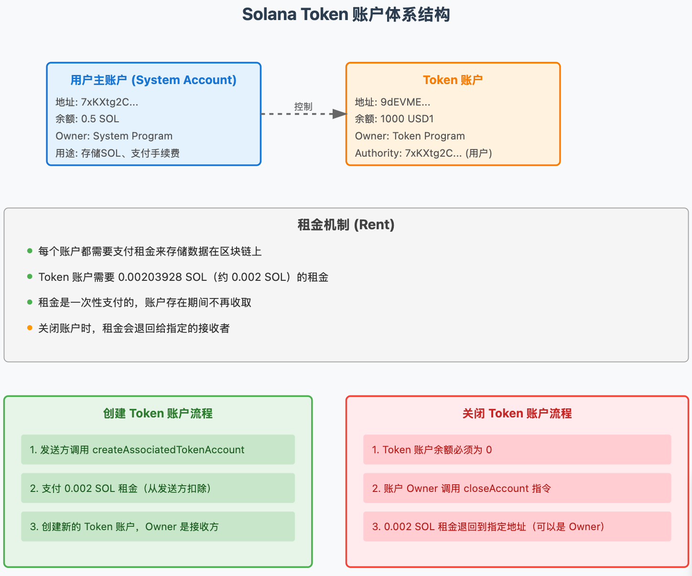
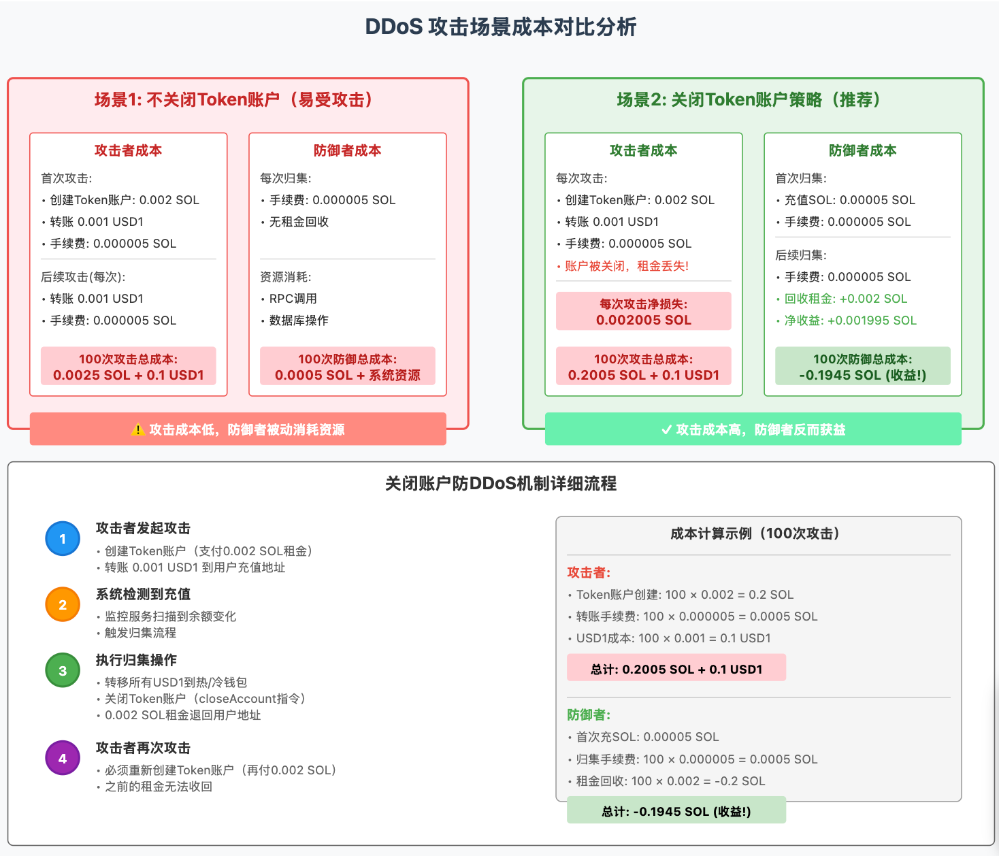

# Solana Token 账户防 DDoS 机制详解

## 一、Solana Token 账户基础知识

### 1.1 账户体系结构




## 二、DDoS 攻击成本分析




## 三、代码实现详解

```typescript
import {
  Connection,
  PublicKey,
  Transaction,
  sendAndConfirmTransaction,
  Keypair,
  SystemProgram,
  LAMPORTS_PER_SOL
} from '@solana/web3.js';
import {
  getAssociatedTokenAddress,
  createAssociatedTokenAccountInstruction,
  createTransferInstruction,
  createCloseAccountInstruction,
  TOKEN_PROGRAM_ID,
  ASSOCIATED_TOKEN_PROGRAM_ID,
  getAccount,
  TokenAccountNotFoundError
} from '@solana/spl-token';

/**
 * 防DDoS归集服务
 * 核心机制：每次归集后关闭Token账户，让攻击者必须重新支付租金
 */
class AntiDDoSCollectionService {
  private connection: Connection;
  
  constructor(rpcUrl: string) {
    this.connection = new Connection(rpcUrl, 'finalized');
  }
  
  /**
   * 演示攻击者的攻击成本
   */
  async demonstrateAttackCost(
    attackerKeypair: Keypair,
    victimAddress: PublicKey,
    tokenMint: PublicKey
  ) {
    console.log('\n=== 攻击者视角 ===\n');
    
    // 1. 攻击者需要先为受害者创建Token账户
    const victimTokenAccount = await getAssociatedTokenAddress(
      tokenMint,
      victimAddress
    );
    
    // 检查账户是否已存在
    let accountExists = false;
    try {
      await getAccount(this.connection, victimTokenAccount);
      accountExists = true;
      console.log('❌ Token账户已存在，无法攻击（已被关闭需要重新创建）');
    } catch (error) {
      if (error instanceof TokenAccountNotFoundError) {
        console.log('✅ Token账户不存在，需要创建');
      }
    }
    
    if (!accountExists) {
      // 获取创建账户前的余额
      const balanceBefore = await this.connection.getBalance(attackerKeypair.publicKey);
      
      // 创建Token账户交易
      const createAccountTx = new Transaction().add(
        createAssociatedTokenAccountInstruction(
          attackerKeypair.publicKey,  // 付款人（攻击者）
          victimTokenAccount,          // 要创建的Token账户
          victimAddress,               // Token账户所有者（受害者）
          tokenMint,                   // Token类型
          TOKEN_PROGRAM_ID,
          ASSOCIATED_TOKEN_PROGRAM_ID
        )
      );
      
      // 发送交易
      const createSig = await sendAndConfirmTransaction(
        this.connection,
        createAccountTx,
        [attackerKeypair]
      );
      
      // 获取创建账户后的余额
      const balanceAfter = await this.connection.getBalance(attackerKeypair.publicKey);
      const cost = (balanceBefore - balanceAfter) / LAMPORTS_PER_SOL;
      
      console.log(`📝 创建Token账户交易: ${createSig}`);
      console.log(`💸 攻击者支付成本: ${cost} SOL`);
      console.log(`   - 租金: ~0.002 SOL`);
      console.log(`   - 手续费: ~0.000005 SOL`);
    }
    
    // 2. 攻击者转账小额Token（假设攻击者有Token）
    // 这里简化处理，实际需要攻击者有Token余额
    console.log('\n📤 攻击者转账 0.001 USD1 到受害者地址...');
    console.log('⚠️  每次攻击都需要重新创建账户，成本 0.002 SOL\n');
    
    return {
      attackCost: 0.002005, // SOL
      canReuse: false       // 不能重复使用，因为会被关闭
    };
  }
  
  /**
   * 防御者的归集策略（带防DDoS）
   */
  async collectWithAntiDDoS(
    userAddress: PublicKey,
    userKeypair: Keypair,  // 实际场景中这个私钥应该安全存储
    tokenMint: PublicKey,
    targetWallet: PublicKey
  ) {
    console.log('\n=== 防御者归集流程 ===\n');
    
    const userTokenAccount = await getAssociatedTokenAddress(
      tokenMint,
      userAddress
    );
    
    try {
      // 1. 检查Token账户余额
      const tokenAccount = await getAccount(this.connection, userTokenAccount);
      const balance = Number(tokenAccount.amount);
      
      if (balance === 0) {
        console.log('⚠️  Token账户余额为0，跳过归集');
        return null;
      }
      
      console.log(`💰 检测到余额: ${balance} tokens`);
      
      // 2. 获取目标钱包的Token账户
      const targetTokenAccount = await getAssociatedTokenAddress(
        tokenMint,
        targetWallet
      );
      
      // 3. 构建归集交易
      const transaction = new Transaction();
      
      // 3.1 转移所有Token到目标钱包
      transaction.add(
        createTransferInstruction(
          userTokenAccount,
          targetTokenAccount,
          userAddress,
          balance,
          [],
          TOKEN_PROGRAM_ID
        )
      );
      
      // 3.2 关键步骤：关闭Token账户，回收租金
      transaction.add(
        createCloseAccountInstruction(
          userTokenAccount,
          userAddress,        // 租金接收者（退回给用户自己）
          userAddress,        // 账户所有者
          [],
          TOKEN_PROGRAM_ID
        )
      );
      
      // 4. 记录关闭账户前后的SOL余额变化
      const solBalanceBefore = await this.connection.getBalance(userAddress);
      
      // 5. 发送交易
      const signature = await sendAndConfirmTransaction(
        this.connection,
        transaction,
        [userKeypair]
      );
      
      const solBalanceAfter = await this.connection.getBalance(userAddress);
      const rentRecovered = (solBalanceAfter - solBalanceBefore) / LAMPORTS_PER_SOL;
      
      console.log(`✅ 归集成功: ${signature}`);
      console.log(`📥 转移 ${balance} tokens 到 ${targetWallet.toString()}`);
      console.log(`🔒 Token账户已关闭`);
      console.log(`💰 回收租金: +${rentRecovered} SOL`);
      console.log(`📊 净成本: ${-rentRecovered + 0.000005} SOL (实际是收益!)`);
      
      return {
        transferredAmount: balance,
        rentRecovered: rentRecovered,
        netCost: -rentRecovered + 0.000005
      };
      
    } catch (error) {
      if (error instanceof TokenAccountNotFoundError) {
        console.log('❌ Token账户不存在，无需归集');
        return null;
      }
      throw error;
    }
  }
  
  /**
   * 成本效益分析
   */
  analyzeEconomics(attackCount: number = 100) {
    console.log('\n=== 经济模型分析 ===\n');
    console.log(`场景：${attackCount} 次DDoS攻击\n`);
    
    // 不使用防DDoS策略
    const withoutAntiDDoS = {
      attackerCost: {
        firstTime: 0.002005,  // 创建账户 + 手续费
        subsequent: 0.000005,  // 只需手续费
        total: 0.002005 + (attackCount - 1) * 0.000005
      },
      defenderCost: {
        perCollection: 0.000005,
        total: attackCount * 0.000005
      }
    };
    
    // 使用防DDoS策略
    const withAntiDDoS = {
      attackerCost: {
        perAttack: 0.002005,  // 每次都需要创建账户
        total: attackCount * 0.002005
      },
      defenderCost: {
        firstTime: 0.000055,  // 首次需要充值SOL
        subsequent: 0.000005 - 0.002,  // 手续费 - 租金回收
        total: 0.000055 + (attackCount - 1) * (0.000005 - 0.002)
      }
    };
    
    console.log('📊 不使用防DDoS策略:');
    console.log(`  攻击者总成本: ${withoutAntiDDoS.attackerCost.total.toFixed(6)} SOL`);
    console.log(`  防御者总成本: ${withoutAntiDDoS.defenderCost.total.toFixed(6)} SOL`);
    console.log(`  攻击/防御成本比: ${(withoutAntiDDoS.attackerCost.total / withoutAntiDDoS.defenderCost.total).toFixed(2)}x`);
    
    console.log('\n📊 使用防DDoS策略:');
    console.log(`  攻击者总成本: ${withAntiDDoS.attackerCost.total.toFixed(6)} SOL`);
    console.log(`  防御者总成本: ${withAntiDDoS.defenderCost.total.toFixed(6)} SOL`);
    console.log(`  攻击/防御成本比: 攻击者付出更多，防御者反而获益!`);
    
    console.log('\n💡 关键洞察:');
    console.log(`  1. 攻击者成本增加: ${(withAntiDDoS.attackerCost.total / withoutAntiDDoS.attackerCost.total).toFixed(0)}倍`);
    console.log(`  2. 防御者从支出变为收益: ${Math.abs(withAntiDDoS.defenderCost.total).toFixed(6)} SOL`);
    console.log(`  3. 每次攻击，攻击者净损失: 0.002 SOL`);
    console.log(`  4. 每次防御，防御者净收益: ~0.002 SOL`);
  }
}

/**
 * 监控服务增强版（带防DDoS检测）
 */
class EnhancedMonitorService {
  private attackDetection: Map<string, {
    count: number;
    lastTime: number;
    amounts: number[];
  }> = new Map();
  
  /**
   * 检测潜在的DDoS攻击
   */
  detectPotentialDDoS(
    userAddress: string,
    amount: number,
    timeWindowMs: number = 60000  // 1分钟时间窗口
  ): boolean {
    const now = Date.now();
    const detection = this.attackDetection.get(userAddress) || {
      count: 0,
      lastTime: now,
      amounts: []
    };
    
    // 重置时间窗口外的记录
    if (now - detection.lastTime > timeWindowMs) {
      detection.count = 0;
      detection.amounts = [];
    }
    
    detection.count++;
    detection.lastTime = now;
    detection.amounts.push(amount);
    
    this.attackDetection.set(userAddress, detection);
    
    // 检测标准：
    // 1. 短时间内多次小额充值
    // 2. 金额都很小且相似
    const isSmallAmount = amount < 0.01;  // 小于0.01 USD1
    const frequentTransfers = detection.count > 5;  // 1分钟内超过5次
    const similarAmounts = detection.amounts.every(a => Math.abs(a - amount) < 0.001);
    
    if (isSmallAmount && frequentTransfers && similarAmounts) {
      console.log(`⚠️  检测到潜在DDoS攻击！`);
      console.log(`   地址: ${userAddress}`);
      console.log(`   ${timeWindowMs/1000}秒内充值次数: ${detection.count}`);
      console.log(`   平均金额: ${detection.amounts.reduce((a,b) => a+b, 0) / detection.amounts.length}`);
      return true;
    }
    
    return false;
  }
  
  /**
   * 自适应防御策略
   */
  getDefenseStrategy(isDDoS: boolean): string {
    if (isDDoS) {
      return 'IMMEDIATE_CLOSE';  // 立即归集并关闭账户
    }
    return 'NORMAL_COLLECTION';  // 正常归集
  }
}

// 使用示例
async function demonstrateAntiDDoSMechanism() {
  const service = new AntiDDoSCollectionService('https://api.mainnet-beta.solana.com');
  
  // 1. 展示攻击成本
  console.log('🔍 演示DDoS攻击成本...');
  // await service.demonstrateAttackCost(attackerKeypair, victimAddress, tokenMint);
  
  // 2. 展示防御机制
  console.log('\n🛡️ 演示防DDoS归集...');
  // await service.collectWithAntiDDoS(userAddress, userKeypair, tokenMint, targetWallet);
  
  // 3. 经济模型分析
  service.analyzeEconomics(100);
  
  // 4. 增强监控
  const monitor = new EnhancedMonitorService();
  
  // 模拟检测
  console.log('\n🔍 DDoS检测演示:');
  
  // 模拟正常充值
  console.log('\n正常充值模式:');
  monitor.detectPotentialDDoS('user1', 100);  // 100 USD1
  monitor.detectPotentialDDoS('user1', 50);   // 50 USD1
  
  // 模拟DDoS攻击
  console.log('\nDDoS攻击模式:');
  for (let i = 0; i < 10; i++) {
    const isDDoS = monitor.detectPotentialDDoS('attacker1', 0.001);
    if (isDDoS) {
      console.log(`策略: ${monitor.getDefenseStrategy(isDDoS)}`);
      break;
    }
  }
}

// 运行演示
demonstrateAntiDDoSMechanism();

export { AntiDDoSCollectionService, EnhancedMonitorService };
```


## 四、核心原理总结

### 4.1 为什么这个机制有效？

**关键在于 Solana 的账户租金机制：**

1. Token 账户不是免费的
   - 每个 SPL Token 账户需要 0.00203928 SOL（约 0.002 SOL）的租金
   - 这个租金是**一次性支付**的，用于在区块链上永久存储账户数据
   - 租金由**创建者支付**（在 DDoS 场景中是攻击者）
2. 账户关闭可以回收租金
   - 当 Token 账户余额为 0 时，可以关闭账户
   - 关闭时，0.002 SOL 租金会退回到指定地址
   - 我们可以将租金退回给用户充值地址（防御者控制）
3. 攻击者的困境
   - 发起攻击必须先创建 Token 账户（支付 0.002 SOL）
   - 我们立即归集并关闭账户，攻击者的租金就打水漂了
   - 再次攻击必须重新创建账户，再付 0.002 SOL
   - **攻击者无法重复使用已创建的账户**

### 4.2 成本不对称性

```
传统方式（易受攻击）：
- 攻击者：首次 0.002 SOL，后续每次 0.000005 SOL
- 防御者：每次 0.000005 SOL
- 100次攻击：攻击者花费 0.0025 SOL，防御者花费 0.0005 SOL

关闭账户策略（推荐）：
- 攻击者：每次 0.002005 SOL（租金+手续费）
- 防御者：每次 -0.001995 SOL（收益！）
- 100次攻击：攻击者花费 0.2005 SOL，防御者获得 0.1945 SOL
```

### 4.3 实现细节

1. **监控充值** → 检测到余额变化
2. **立即归集** → 转走所有 Token
3. **关闭账户** → `closeAccount` 指令
4. **回收租金** → 0.002 SOL 退回用户地址
5. **攻击者再来** → 必须重新创建账户

### 4.4 额外优势

1. **安全性提升**：Token 账户关闭后，没有残留风险
2. **自动化防御**：不需要人工干预
3. **经济激励正确**：攻击越多，防御者收益越多
4. **无需额外基础设施**：利用 Solana 原生机制

### 4.5 注意事项

1. **正常用户体验**：正常大额充值不受影响，只是首次需要系统垫付少量 SOL
2. **需要用户私钥**：归集和关闭账户需要用户地址的签名权限
3. **Gas 优化**：可以批量处理多个归集操作
4. **监控告警**：虽然有经济收益，但仍需监控异常模式

这个机制巧妙地将 Solana 的租金机制转化为防御武器，实现了"**攻击者付费，防御者收益**"的理想状态，是一个非常优雅的解决方案。