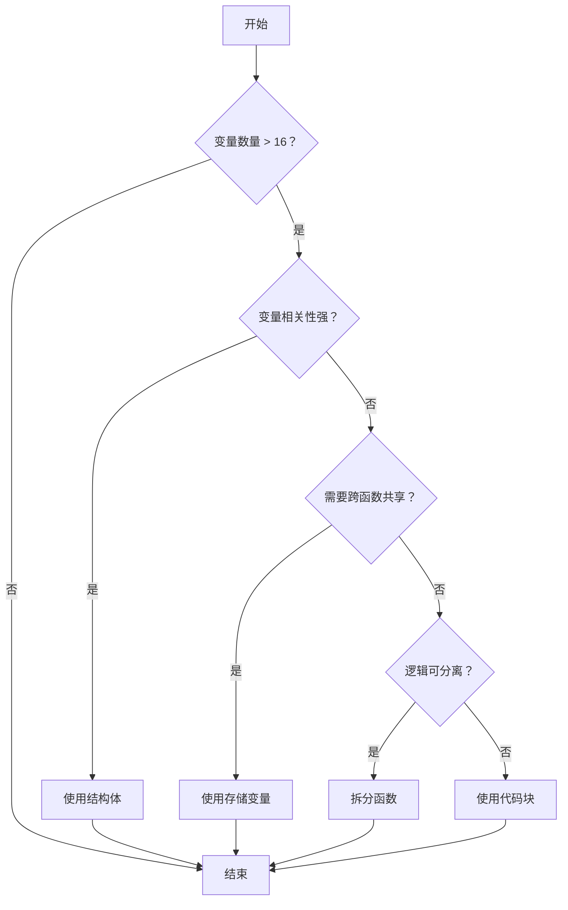

# Solidity 堆栈过深错误解决方案完全指南

在 Solidity 智能合约开发中，"Stack too deep" 错误是开发者经常遇到的编译问题。本文档详细介绍了该错误的产生原因、解决方案以及最佳实践，帮助开发者编写更高效、更稳定的智能合约。

## 目录

1. [什么是堆栈过深错误](#什么是堆栈过深错误)
2. [EVM 堆栈机制](#evm-堆栈机制)
3. [解决方案详解](#解决方案详解)
4. [实际应用案例](#实际应用案例)
5. [性能对比分析](#性能对比分析)
6. [最佳实践](#最佳实践)
7. [常见问题](#常见问题)

## 什么是堆栈过深错误

在 Solidity 中，EVM（以太坊虚拟机）有一个**堆栈深度限制**，最多只能有 **16 个局部变量**同时存在于堆栈中。

当函数中的局部变量数量超过这个限制时，编译器会抛出 "Stack too deep" 错误。

### 错误示例

```solidity
function complexFunction() public {
    uint256 var1 = 1;
    uint256 var2 = 2;
    uint256 var3 = 3;
    // ... 继续声明更多变量
    uint256 var17 = 17; // 这里会触发 Stack too deep 错误
}
```

## EVM 堆栈机制

### 堆栈结构

EVM 使用基于堆栈的架构：
- **堆栈大小限制**：最多 1024 个元素
- **局部变量限制**：最多 16 个同时存在的局部变量
- **访问限制**：只能访问堆栈顶部的 16 个元素

### 变量存储位置

```solidity
contract StackExample {
    uint256 public stateVar; // 存储在 storage 中
    
    function example() public {
        uint256 localVar;     // 存储在堆栈中
        uint256[] memory arr; // 存储在 memory 中
        uint256[] storage storageArr = someStorageArray; // 引用 storage
    }
}
```

## 解决方案详解

### 1. 代码块（Block Scope）- 推荐方案

代码块是最简洁有效的解决方案，通过创建局部作用域来管理变量生命周期。

#### 基本语法

```solidity
uint balance0;
uint balance1;
{ // 创建新的作用域
    address _token0 = token0;
    address _token1 = token1;
    require(to != _token0 && to != _token1, 'INVALID_TO');
    
    // 执行业务逻辑
    if (amount0Out > 0) _safeTransfer(_token0, to, amount0Out);
    if (amount1Out > 0) _safeTransfer(_token1, to, amount1Out);
    
    // 将结果传递给外部变量
    balance0 = IERC20(_token0).balanceOf(address(this));
    balance1 = IERC20(_token1).balanceOf(address(this));
} // _token0, _token1 在此处自动释放
```

#### 实现原理

**代码块（Block Scope）的作用机制：**

1. **局部变量生命周期管理**：在代码块 `{}` 内声明的变量只在块内有效
2. **堆栈自动清理**：当代码块结束时，块内的局部变量会自动从堆栈中释放
3. **内存优化**：避免同时有太多变量占用堆栈空间
4. **作用域隔离**：不同代码块之间的变量互不干扰

**变量生命周期示例：**

```solidity
function demonstrateScope() public {
    uint256 outerVar = 1; // 占用堆栈位置 1
    
    { // 第一个代码块
        uint256 innerVar1 = 2; // 占用堆栈位置 2
        uint256 innerVar2 = 3; // 占用堆栈位置 3
        // 在这里 outerVar, innerVar1, innerVar2 都存在
    } // innerVar1, innerVar2 被释放
    
    { // 第二个代码块
        uint256 innerVar3 = 4; // 可以重用之前释放的堆栈位置
        uint256 innerVar4 = 5;
        // 在这里只有 outerVar, innerVar3, innerVar4 存在
    } // innerVar3, innerVar4 被释放
    
    // 最后只有 outerVar 存在
}
```

### 2. 结构体方案

将相关变量组织到结构体中，可以有效减少堆栈变量数量。

#### 基本实现

```solidity
struct SwapVars {
    address token0;
    address token1;
    uint256 balance0;
    uint256 balance1;
    uint256 amount0In;
    uint256 amount1In;
}

function swap(
    uint amount0Out,
    uint amount1Out,
    address to,
    bytes calldata data
) external {
    SwapVars memory vars; // 只占用 1 个堆栈位置
    vars.token0 = token0;
    vars.token1 = token1;
    
    // 使用结构体成员
    require(to != vars.token0 && to != vars.token1, 'INVALID_TO');
    
    if (amount0Out > 0) _safeTransfer(vars.token0, to, amount0Out);
    if (amount1Out > 0) _safeTransfer(vars.token1, to, amount1Out);
    
    vars.balance0 = IERC20(vars.token0).balanceOf(address(this));
    vars.balance1 = IERC20(vars.token1).balanceOf(address(this));
}
```

#### 嵌套结构体

```solidity
struct TokenInfo {
    address addr;
    uint256 balance;
    uint256 reserve;
}

struct SwapParams {
    TokenInfo token0;
    TokenInfo token1;
    uint256 amount0Out;
    uint256 amount1Out;
    address to;
}

function complexSwap(SwapParams memory params) external {
    // 整个参数集合只占用 1 个堆栈位置
    require(params.to != params.token0.addr, 'INVALID_TO');
    // ... 其他逻辑
}
```

### 3. 存储变量方案

将临时变量存储在合约状态中，适用于需要跨函数调用保持状态的场景。

```solidity
contract StackOptimized {
    // 临时存储变量
    struct TempVars {
        address token0;
        address token1;
        uint256 balance0;
        uint256 balance1;
    }
    
    TempVars private temp;
    
    function swap(...) external {
        temp.token0 = token0;
        temp.token1 = token1;
        
        _executeSwap();
        _validateSwap();
        
        // 清理临时变量（可选）
        delete temp;
    }
    
    function _executeSwap() internal {
        // 使用 temp.token0, temp.token1
    }
    
    function _validateSwap() internal {
        // 验证逻辑
    }
}
```

### 4. 函数拆分方案

将复杂函数拆分为多个小函数，每个函数处理特定的逻辑。

```solidity
function swap(
    uint amount0Out,
    uint amount1Out,
    address to,
    bytes calldata data
) external {
    (uint256 balance0, uint256 balance1) = _executeTransfers(amount0Out, amount1Out, to, data);
    _validateSwap(balance0, balance1, amount0Out, amount1Out);
    _updateReserves(balance0, balance1);
}

function _executeTransfers(
    uint amount0Out,
    uint amount1Out,
    address to,
    bytes calldata data
) internal returns (uint256 balance0, uint256 balance1) {
    address _token0 = token0;
    address _token1 = token1;
    
    require(to != _token0 && to != _token1, 'INVALID_TO');
    
    if (amount0Out > 0) _safeTransfer(_token0, to, amount0Out);
    if (amount1Out > 0) _safeTransfer(_token1, to, amount1Out);
    
    if (data.length > 0) {
        IUniswapV2Callee(to).uniswapV2Call(msg.sender, amount0Out, amount1Out, data);
    }
    
    balance0 = IERC20(_token0).balanceOf(address(this));
    balance1 = IERC20(_token1).balanceOf(address(this));
}

function _validateSwap(
    uint256 balance0,
    uint256 balance1,
    uint256 amount0Out,
    uint256 amount1Out
) internal view {
    // 验证逻辑
}

function _updateReserves(uint256 balance0, uint256 balance1) internal {
    // 更新储备量
}
```

## 实际应用案例

### Uniswap V2 闪电贷实现

在 Uniswap V2 的 `swap` 函数中，代码块被广泛用于管理复杂的变量集合：

```solidity
function swap(uint amount0Out, uint amount1Out, address to, bytes calldata data) external lock {
    require(amount0Out > 0 || amount1Out > 0, 'UniswapV2: INSUFFICIENT_OUTPUT_AMOUNT');
    
    (uint112 _reserve0, uint112 _reserve1,) = getReserves();
    require(amount0Out < _reserve0 && amount1Out < _reserve1, 'UniswapV2: INSUFFICIENT_LIQUIDITY');

    uint balance0;
    uint balance1;
    { // 避免堆栈过深错误的关键代码块
        address _token0 = token0;
        address _token1 = token1;
        require(to != _token0 && to != _token1, 'UniswapV2: INVALID_TO');
        
        // 先转出代币（闪电贷的关键步骤）
        if (amount0Out > 0) _safeTransfer(_token0, to, amount0Out);
        if (amount1Out > 0) _safeTransfer(_token1, to, amount1Out);
        
        // 执行闪电贷回调
        if (data.length > 0) IUniswapV2Callee(to).uniswapV2Call(msg.sender, amount0Out, amount1Out, data);
        
        // 获取回调后的余额
        balance0 = IERC20(_token0).balanceOf(address(this));
        balance1 = IERC20(_token1).balanceOf(address(this));
    }
    
    // 计算实际输入量
    uint amount0In = balance0 > _reserve0 - amount0Out ? balance0 - (_reserve0 - amount0Out) : 0;
    uint amount1In = balance1 > _reserve1 - amount1Out ? balance1 - (_reserve1 - amount1Out) : 0;
    
    require(amount0In > 0 || amount1In > 0, 'UniswapV2: INSUFFICIENT_INPUT_AMOUNT');
    
    { // 第二个代码块用于验证
        uint balance0Adjusted = balance0.mul(1000).sub(amount0In.mul(3));
        uint balance1Adjusted = balance1.mul(1000).sub(amount1In.mul(3));
        require(balance0Adjusted.mul(balance1Adjusted) >= uint(_reserve0).mul(_reserve1).mul(1000**2), 'UniswapV2: K');
    }

    _update(balance0, balance1, _reserve0, _reserve1);
    emit Swap(msg.sender, amount0In, amount1In, amount0Out, amount1Out, to);
}
```

**变量分析：**
- 函数参数：4 个
- 外部变量：6 个（`_reserve0`, `_reserve1`, `balance0`, `balance1`, `amount0In`, `amount1In`）
- 第一个代码块内：2 个（`_token0`, `_token1`）
- 第二个代码块内：2 个（`balance0Adjusted`, `balance1Adjusted`）

如果不使用代码块，总共需要 14 个堆栈位置，接近 16 个的限制。

### 复杂 DeFi 协议示例

```solidity
contract ComplexDeFiProtocol {
    struct LiquidationVars {
        uint256 collateralValue;
        uint256 debtValue;
        uint256 liquidationThreshold;
        uint256 healthFactor;
    }
    
    function liquidate(
        address user,
        address collateralAsset,
        address debtAsset,
        uint256 debtToCover
    ) external {
        // 第一阶段：验证和准备
        {
            require(user != msg.sender, "Cannot liquidate self");
            require(debtToCover > 0, "Invalid debt amount");
            
            address oracle = addressProvider.getPriceOracle();
            uint256 userDebt = getUserDebt(user, debtAsset);
            require(debtToCover <= userDebt, "Debt to cover exceeds user debt");
        }
        
        // 第二阶段：计算清算参数
        LiquidationVars memory vars;
        {
            uint256 collateralPrice = IPriceOracle(oracle).getAssetPrice(collateralAsset);
            uint256 debtPrice = IPriceOracle(oracle).getAssetPrice(debtAsset);
            
            vars.collateralValue = getUserCollateral(user, collateralAsset) * collateralPrice;
            vars.debtValue = getUserDebt(user, debtAsset) * debtPrice;
            vars.liquidationThreshold = getAssetLiquidationThreshold(collateralAsset);
            vars.healthFactor = calculateHealthFactor(user);
            
            require(vars.healthFactor < 1e18, "User position is healthy");
        }
        
        // 第三阶段：执行清算
        {
            uint256 maxLiquidatable = (vars.collateralValue * vars.liquidationThreshold) / 1e18;
            uint256 actualLiquidation = debtToCover > maxLiquidatable ? maxLiquidatable : debtToCover;
            
            uint256 liquidationBonus = getAssetLiquidationBonus(collateralAsset);
            uint256 collateralToSeize = (actualLiquidation * liquidationBonus) / 1e18;
            
            _executeTransfers(user, collateralAsset, debtAsset, actualLiquidation, collateralToSeize);
        }
    }
}
```

## 性能对比分析

### Gas 消耗对比

| 方案 | Gas 消耗 | 代码复杂度 | 可读性 | 维护性 |
|------|----------|------------|--------|--------|
| 代码块 | 最低 | 低 | 高 | 高 |
| 结构体 | 中等 | 中等 | 高 | 高 |
| 存储变量 | 最高 | 高 | 中等 | 中等 |
| 函数拆分 | 中等 | 中等 | 高 | 高 |

### 编译时间对比

```solidity
// 测试合约：包含 20 个局部变量的函数

// 方案 1：代码块（编译成功）
function testBlockScope() public {
    uint256 result;
    {
        uint256 a = 1; uint256 b = 2; uint256 c = 3; uint256 d = 4; uint256 e = 5;
        uint256 f = 6; uint256 g = 7; uint256 h = 8; uint256 i = 9; uint256 j = 10;
        result = a + b + c + d + e + f + g + h + i + j;
    }
    {
        uint256 k = 11; uint256 l = 12; uint256 m = 13; uint256 n = 14; uint256 o = 15;
        uint256 p = 16; uint256 q = 17; uint256 r = 18; uint256 s = 19; uint256 t = 20;
        result += k + l + m + n + o + p + q + r + s + t;
    }
}

// 方案 2：直接声明（编译失败 - Stack too deep）
function testDirectDeclaration() public {
    uint256 a = 1; uint256 b = 2; uint256 c = 3; uint256 d = 4; uint256 e = 5;
    uint256 f = 6; uint256 g = 7; uint256 h = 8; uint256 i = 9; uint256 j = 10;
    uint256 k = 11; uint256 l = 12; uint256 m = 13; uint256 n = 14; uint256 o = 15;
    uint256 p = 16; uint256 q = 17; // 编译错误：Stack too deep
}
```

## 最佳实践

### 1. 选择合适的解决方案

**代码块适用场景：**
- 临时变量较多的函数
- 需要分阶段处理的逻辑
- 不需要跨函数共享变量

**结构体适用场景：**
- 相关变量需要组织在一起
- 需要传递给其他函数
- 提高代码可读性

**函数拆分适用场景：**
- 函数逻辑过于复杂
- 需要提高代码复用性
- 便于单元测试

### 2. 代码组织原则

```solidity
contract BestPracticeExample {
    // 1. 合理使用结构体组织相关数据
    struct TradeParams {
        address tokenIn;
        address tokenOut;
        uint256 amountIn;
        uint256 minAmountOut;
        address recipient;
    }
    
    function executeTrade(TradeParams memory params) external {
        // 2. 使用代码块管理临时变量
        uint256 amountOut;
        {
            address pool = getPool(params.tokenIn, params.tokenOut);
            uint256 fee = getPoolFee(pool);
            uint256 reserves0 = getReserves(pool, params.tokenIn);
            uint256 reserves1 = getReserves(pool, params.tokenOut);
            
            amountOut = calculateAmountOut(params.amountIn, reserves0, reserves1, fee);
            require(amountOut >= params.minAmountOut, "Insufficient output");
        }
        
        // 3. 分离验证逻辑
        {
            require(params.amountIn > 0, "Invalid input amount");
            require(params.recipient != address(0), "Invalid recipient");
            require(IERC20(params.tokenIn).balanceOf(msg.sender) >= params.amountIn, "Insufficient balance");
        }
        
        // 4. 执行交易
        _executeSwap(params, amountOut);
    }
    
    // 5. 拆分复杂逻辑到独立函数
    function _executeSwap(TradeParams memory params, uint256 amountOut) internal {
        // 交易执行逻辑
    }
}
```

### 3. 调试和优化技巧

```solidity
// 使用事件记录中间状态
contract DebuggableContract {
    event DebugInfo(string stage, uint256 value);
    
    function complexFunction() public {
        uint256 result;
        
        { // 第一阶段
            uint256 temp1 = calculateStep1();
            uint256 temp2 = calculateStep2();
            result = temp1 + temp2;
            emit DebugInfo("Stage1", result);
        }
        
        { // 第二阶段
            uint256 temp3 = calculateStep3(result);
            uint256 temp4 = calculateStep4(result);
            result = temp3 * temp4;
            emit DebugInfo("Stage2", result);
        }
    }
}
```

### 4. 编译器优化建议

```solidity
// 启用优化器
// solc --optimize --optimize-runs 200 contract.sol

pragma solidity ^0.8.0;

contract OptimizedContract {
    // 使用 immutable 减少存储读取
    address public immutable token0;
    address public immutable token1;
    
    constructor(address _token0, address _token1) {
        token0 = _token0;
        token1 = _token1;
    }
    
    function optimizedFunction() external view {
        // 缓存状态变量到局部变量
        address _token0 = token0;
        address _token1 = token1;
        
        // 使用代码块管理临时变量
        {
            uint256 balance0 = IERC20(_token0).balanceOf(address(this));
            uint256 balance1 = IERC20(_token1).balanceOf(address(this));
            // 处理逻辑...
        }
    }
}
```

## 常见问题

### Q1: 代码块会增加 Gas 消耗吗？

**A:** 不会。代码块只是编译时的作用域管理，不会产生额外的运行时开销。实际上，通过减少堆栈操作，可能会略微降低 Gas 消耗。

### Q2: 什么时候应该使用结构体而不是代码块？

**A:** 当变量需要：
- 传递给其他函数
- 在多个代码块之间共享
- 提高代码的语义清晰度
- 组织相关的数据

### Q3: 存储变量方案的安全风险？

**A:** 主要风险包括：
- **重入攻击**：临时变量可能被恶意合约修改
- **状态污染**：多个函数调用可能互相影响
- **Gas 消耗增加**：存储操作比内存操作昂贵

**缓解措施：**
```solidity
contract SafeStorage {
    struct TempVars {
        uint256 value;
        bool inUse;
    }
    
    TempVars private temp;
    
    modifier noReentrancy() {
        require(!temp.inUse, "Reentrant call");
        temp.inUse = true;
        _;
        temp.inUse = false;
    }
    
    function safeFunction() external noReentrancy {
        // 使用 temp 变量
    }
}
```

### Q4: 如何选择最适合的解决方案？

**决策流程图：**



### Q5: 如何测试堆栈深度优化？

```solidity
// 测试合约
contract StackDepthTest {
    function testStackDepth() public pure returns (uint256) {
        // 故意创建接近限制的变量数量
        uint256 v1 = 1; uint256 v2 = 2; uint256 v3 = 3; uint256 v4 = 4;
        uint256 v5 = 5; uint256 v6 = 6; uint256 v7 = 7; uint256 v8 = 8;
        uint256 v9 = 9; uint256 v10 = 10; uint256 v11 = 11; uint256 v12 = 12;
        uint256 v13 = 13; uint256 v14 = 14; uint256 v15 = 15;
        
        // 第 16 个变量 - 应该仍然可以编译
        uint256 v16 = 16;
        
        return v1 + v2 + v3 + v4 + v5 + v6 + v7 + v8 + 
               v9 + v10 + v11 + v12 + v13 + v14 + v15 + v16;
    }
}
```

## 总结

堆栈过深错误是 Solidity 开发中的常见问题，但通过合理的代码组织和优化技巧，可以有效避免。代码块方案因其简洁性和零开销特性，是大多数场景下的首选解决方案。在复杂的 DeFi 协议开发中，结合使用多种技术可以实现最佳的代码质量和性能表现。

**关键要点：**
1. **预防为主**：在设计阶段就考虑堆栈限制
2. **选择合适的方案**：根据具体场景选择最优解决方案
3. **保持代码清晰**：优化不应以牺牲可读性为代价
4. **充分测试**：确保优化后的代码功能正确
5. **持续监控**：在代码演进过程中保持对堆栈深度的关注