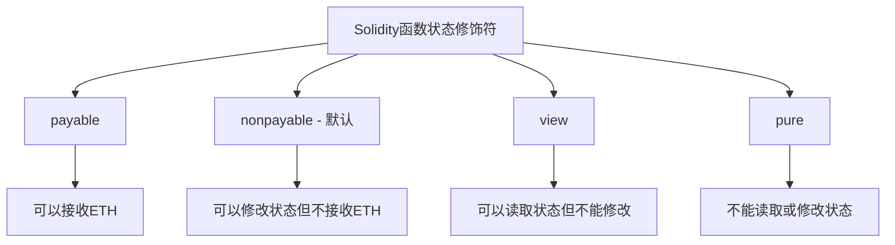
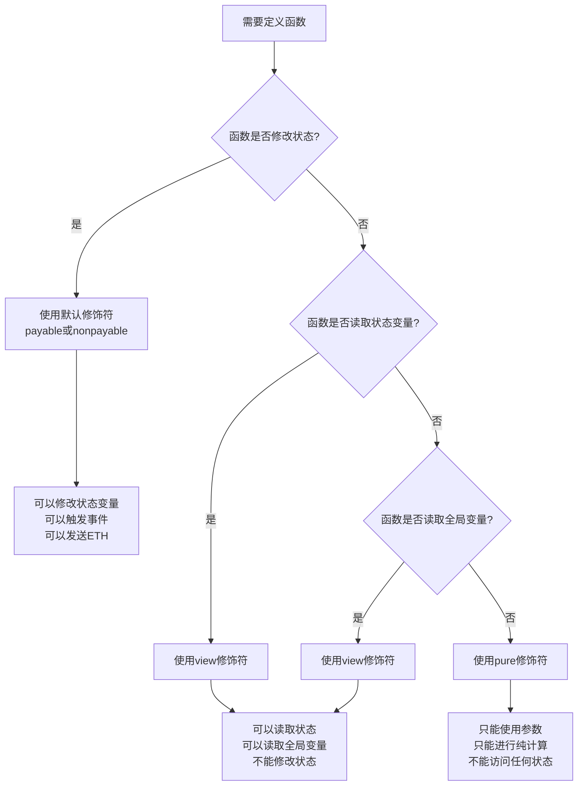

# Solidity函数状态修饰符pure和view详解

## 一、引言：函数状态可变性的重要性

### 1.1 为什么需要状态修饰符？

在Solidity中，函数的状态修饰符（State Mutability）是编译器和开发者之间的一种约定，用于明确函数对合约状态的访问权限。这不仅能提高代码的可读性和安全性，还能在某些情况下优化Gas消耗。



### 1.2 状态修饰符的演进历史

**Solidity版本演进**：

- **0.4.17之前**：只有`constant`修饰符
- **0.4.17-0.5.0**：引入`view`和`pure`，`constant`被弃用
- **0.5.0+**：`constant`完全移除，必须使用`view`或`pure`

```solidity
// 旧版本（已弃用）
function getValue() constant returns (uint256) {
    return myValue;
}

// 新版本（推荐）
function getValue() view returns (uint256) {
    return myValue;
}
```

## 二、view修饰符详解

### 2.1 view的基本概念和用途

`view`修饰符表示函数**只读取**合约状态，但**不修改**任何状态变量。

**核心特征**：
- ✅ 可以读取状态变量
- ✅ 可以读取全局变量（`msg.sender`, `block.timestamp`等）
- ✅ 可以调用其他`view`或`pure`函数
- ❌ 不能修改状态变量
- ❌ 不能触发事件
- ❌ 不能创建合约

### 2.2 view函数的实际应用场景

```solidity
/**
 * @title View函数应用示例
 * @notice 展示view修饰符的各种使用场景
 */
contract ViewFunctionExamples {
    
    // 状态变量
    uint256 public totalSupply = 1000000;
    mapping(address => uint256) public balances;
    address public owner;
    
    constructor() {
        owner = msg.sender;
        balances[msg.sender] = totalSupply;
    }
    
    /**
     * @notice 基本的状态读取
     * @dev 读取单个状态变量
     */
    function getTotalSupply() public view returns (uint256) {
        return totalSupply;
    }
    
    /**
     * @notice 读取映射数据
     * @param account 要查询的账户地址
     * @return balance 账户余额
     */
    function getBalance(address account) public view returns (uint256 balance) {
        return balances[account];
    }
    
    /**
     * @notice 复杂的状态查询
     * @dev 结合多个状态变量进行计算
     */
    function getAccountInfo(address account) public view returns (
        uint256 balance,
        uint256 percentage,
        bool isOwner
    ) {
        balance = balances[account];
        percentage = totalSupply > 0 ? (balance * 100) / totalSupply : 0;
        isOwner = (account == owner);
    }
    
    /**
     * @notice 使用全局变量
     * @dev view函数可以访问区块链全局变量
     */
    function getCurrentBlockInfo() public view returns (
        uint256 blockNumber,
        uint256 timestamp,
        address sender,
        uint256 gasLeft
    ) {
        blockNumber = block.number;
        timestamp = block.timestamp;
        sender = msg.sender;
        gasLeft = gasleft();
    }
    
    /**
     * @notice 调用其他view函数
     * @dev view函数可以调用其他view或pure函数
     */
    function getDetailedBalance(address account) public view returns (
        uint256 balance,
        string memory status
    ) {
        balance = getBalance(account); // 调用其他view函数
        
        if (balance == 0) {
            status = "Empty";
        } else if (balance < 1000) {
            status = "Low";
        } else {
            status = "Normal";
        }
    }
    
    /**
     * @notice 数组和结构体查询
     * @dev 展示复杂数据结构的查询
     */
    struct UserInfo {
        string name;
        uint256 score;
        bool active;
    }
    
    mapping(address => UserInfo) public userInfos;
    address[] public userList;
    
    function getUserInfo(address user) public view returns (UserInfo memory) {
        return userInfos[user];
    }
    
    function getAllUsers() public view returns (address[] memory) {
        return userList;
    }
    
    function getUserCount() public view returns (uint256) {
        return userList.length;
    }
    
    /**
     * @notice 条件查询示例
     * @dev 基于条件过滤数据
     */
    function getActiveUsers() public view returns (address[] memory activeUsers) {
        uint256 count = 0;
        
        // 第一次遍历：计算活跃用户数量
        for (uint256 i = 0; i < userList.length; i++) {
            if (userInfos[userList[i]].active) {
                count++;
            }
        }
        
        // 创建结果数组
        activeUsers = new address[](count);
        uint256 index = 0;
        
        // 第二次遍历：填充结果数组
        for (uint256 i = 0; i < userList.length; i++) {
            if (userInfos[userList[i]].active) {
                activeUsers[index] = userList[i];
                index++;
            }
        }
    }
}
```

### 2.3 view函数的限制和错误示例

```solidity
/**
 * @title View函数限制示例
 * @notice 展示view函数中不能执行的操作
 */
contract ViewFunctionLimitations {
    
    uint256 public value = 100;
    
    event ValueChanged(uint256 newValue);
    
    /**
     * @notice ❌ 错误：view函数不能修改状态变量
     */
    function incorrectViewFunction1() public view returns (uint256) {
        // value = 200; // 编译错误：Cannot modify state in view function
        return value;
    }
    
    /**
     * @notice ❌ 错误：view函数不能触发事件
     */
    function incorrectViewFunction2() public view returns (uint256) {
        // emit ValueChanged(value); // 编译错误：Cannot emit events in view function
        return value;
    }
    
    /**
     * @notice ❌ 错误：view函数不能调用状态修改函数
     */
    function modifyValue(uint256 newValue) public {
        value = newValue;
        emit ValueChanged(newValue);
    }
    
    function incorrectViewFunction3() public view returns (uint256) {
        // modifyValue(300); // 编译错误：Cannot call state-modifying function
        return value;
    }
    
    /**
     * @notice ❌ 错误：view函数不能发送ETH
     */
    function incorrectViewFunction4() public view returns (uint256) {
        // payable(msg.sender).transfer(1 ether); // 编译错误
        return address(this).balance;
    }
    
    /**
     * @notice ✅ 正确：view函数可以执行的操作
     */
    function correctViewFunction() public view returns (
        uint256 currentValue,
        uint256 doubled,
        address sender,
        uint256 blockTime
    ) {
        currentValue = value;           // 读取状态变量 ✅
        doubled = value * 2;           // 进行计算 ✅
        sender = msg.sender;           // 读取全局变量 ✅
        blockTime = block.timestamp;   // 读取区块信息 ✅
    }
}
```

## 三、pure修饰符详解

### 3.1 pure的基本概念和用途

`pure`修饰符表示函数**既不读取也不修改**合约状态，是完全"纯净"的函数。

**核心特征**：

- ✅ 可以使用函数参数
- ✅ 可以进行数学计算
- ✅ 可以处理字符串和字节
- ✅ 可以调用其他`pure`函数
- ❌ 不能读取状态变量
- ❌ 不能读取全局变量
- ❌ 不能修改任何状态

### 3.2 pure函数的实际应用场景

```solidity
/**
 * @title Pure函数应用示例
 * @notice 展示pure修饰符的各种使用场景
 */
contract PureFunctionExamples {
    
    /**
     * @notice 基础数学计算
     * @dev 纯数学运算，不依赖任何外部状态
     */
    function add(uint256 a, uint256 b) public pure returns (uint256) {
        return a + b;
    }
    
    function multiply(uint256 a, uint256 b) public pure returns (uint256) {
        return a * b;
    }
    
    function max(uint256 a, uint256 b) public pure returns (uint256) {
        return a > b ? a : b;
    }
    
    /**
     * @notice 复杂数学计算
     * @dev 实现更复杂的数学算法
     */
    function factorial(uint256 n) public pure returns (uint256) {
        if (n <= 1) return 1;
        return n * factorial(n - 1);
    }
    
    function power(uint256 base, uint256 exponent) public pure returns (uint256) {
        if (exponent == 0) return 1;
        
        uint256 result = 1;
        for (uint256 i = 0; i < exponent; i++) {
            result *= base;
        }
        return result;
    }
    
    function sqrt(uint256 x) public pure returns (uint256) {
        if (x == 0) return 0;
        
        uint256 z = (x + 1) / 2;
        uint256 y = x;
        
        while (z < y) {
            y = z;
            z = (x / z + z) / 2;
        }
        
        return y;
    }
    
    /**
     * @notice 字符串处理
     * @dev pure函数可以处理字符串和字节数据
     */
    function concatenateStrings(string memory a, string memory b) 
        public 
        pure 
        returns (string memory) 
    {
        return string(abi.encodePacked(a, b));
    }
    
    function stringLength(string memory str) public pure returns (uint256) {
        return bytes(str).length;
    }
    
    function compareStrings(string memory a, string memory b) 
        public 
        pure 
        returns (bool) 
    {
        return keccak256(abi.encodePacked(a)) == keccak256(abi.encodePacked(b));
    }
    
    /**
     * @notice 数据转换和编码
     * @dev 各种数据类型之间的转换
     */
    function uint256ToString(uint256 value) public pure returns (string memory) {
        if (value == 0) return "0";
        
        uint256 temp = value;
        uint256 digits;
        
        while (temp != 0) {
            digits++;
            temp /= 10;
        }
        
        bytes memory buffer = new bytes(digits);
        
        while (value != 0) {
            digits -= 1;
            buffer[digits] = bytes1(uint8(48 + uint256(value % 10)));
            value /= 10;
        }
        
        return string(buffer);
    }
    
    function bytesToHex(bytes memory data) public pure returns (string memory) {
        bytes memory alphabet = "0123456789abcdef";
        bytes memory str = new bytes(2 + data.length * 2);
        
        str[0] = "0";
        str[1] = "x";
        
        for (uint256 i = 0; i < data.length; i++) {
            str[2 + i * 2] = alphabet[uint256(uint8(data[i] >> 4))];
            str[3 + i * 2] = alphabet[uint256(uint8(data[i] & 0x0f))];
        }
        
        return string(str);
    }
    
    /**
     * @notice 数组处理
     * @dev pure函数可以处理和操作数组
     */
    function sum(uint256[] memory numbers) public pure returns (uint256 total) {
        for (uint256 i = 0; i < numbers.length; i++) {
            total += numbers[i];
        }
    }
    
    function average(uint256[] memory numbers) public pure returns (uint256) {
        require(numbers.length > 0, "Array cannot be empty");
        return sum(numbers) / numbers.length;
    }
    
    function findMax(uint256[] memory numbers) public pure returns (uint256 maxValue) {
        require(numbers.length > 0, "Array cannot be empty");
        
        maxValue = numbers[0];
        for (uint256 i = 1; i < numbers.length; i++) {
            if (numbers[i] > maxValue) {
                maxValue = numbers[i];
            }
        }
    }
    
    function sortArray(uint256[] memory arr) public pure returns (uint256[] memory) {
        uint256 length = arr.length;
        
        // 冒泡排序
        for (uint256 i = 0; i < length - 1; i++) {
            for (uint256 j = 0; j < length - i - 1; j++) {
                if (arr[j] > arr[j + 1]) {
                    uint256 temp = arr[j];
                    arr[j] = arr[j + 1];
                    arr[j + 1] = temp;
                }
            }
        }
        
        return arr;
    }
    
    /**
     * @notice 加密学函数
     * @dev 实现各种哈希和加密计算
     */
    function keccak256Hash(bytes memory data) public pure returns (bytes32) {
        return keccak256(data);
    }
    
    function sha256Hash(bytes memory data) public pure returns (bytes32) {
        return sha256(data);
    }
    
    function ripemd160Hash(bytes memory data) public pure returns (bytes20) {
        return ripemd160(data);
    }
    
    /**
     * @notice 数据结构操作
     * @dev 操作结构体和复杂数据类型
     */
    struct Point {
        uint256 x;
        uint256 y;
    }
    
    function createPoint(uint256 x, uint256 y) public pure returns (Point memory) {
        return Point(x, y);
    }
    
    function distance(Point memory a, Point memory b) public pure returns (uint256) {
        uint256 dx = a.x > b.x ? a.x - b.x : b.x - a.x;
        uint256 dy = a.y > b.y ? a.y - b.y : b.y - a.y;
        return sqrt(dx * dx + dy * dy);
    }
}
```

### 3.3 pure函数的限制和错误示例

```solidity
/**
 * @title Pure函数限制示例
 * @notice 展示pure函数中不能执行的操作
 */
contract PureFunctionLimitations {
    
    uint256 public stateVariable = 100;
    
    /**
     * @notice ❌ 错误：pure函数不能读取状态变量
     */
    function incorrectPureFunction1() public pure returns (uint256) {
        // return stateVariable; // 编译错误：Cannot read state in pure function
        return 100; // 必须使用字面量或参数
    }
    
    /**
     * @notice ❌ 错误：pure函数不能读取全局变量
     */
    function incorrectPureFunction2() public pure returns (address) {
        // return msg.sender; // 编译错误：Cannot read global variables in pure function
        return address(0); // 必须返回字面量
    }
    
    /**
     * @notice ❌ 错误：pure函数不能读取区块信息
     */
    function incorrectPureFunction3() public pure returns (uint256) {
        // return block.timestamp; // 编译错误：Cannot read block info in pure function
        return 0;
    }
    
    /**
     * @notice ❌ 错误：pure函数不能调用view函数
     */
    function viewFunction() public view returns (uint256) {
        return stateVariable;
    }
    
    function incorrectPureFunction4() public pure returns (uint256) {
        // return viewFunction(); // 编译错误：Cannot call view function from pure function
        return 0;
    }
    
    /**
     * @notice ✅ 正确：pure函数可以执行的操作
     */
    function correctPureFunction(uint256 a, uint256 b) 
        public 
        pure 
        returns (uint256 sum, uint256 product) 
    {
        sum = a + b;           // 使用参数 ✅
        product = a * b;       // 进行计算 ✅
        // 可以使用字面量 ✅
        // 可以调用其他pure函数 ✅
    }
}
```

## 四、view与pure的详细对比分析

### 4.1 功能对比表

| 操作类型 | view | pure | 说明 |
|----------|------|------|------|
| 读取状态变量 | ✅ | ❌ | view可以读取存储在区块链上的数据 |
| 修改状态变量 | ❌ | ❌ | 都不能修改合约状态 |
| 读取msg.sender | ✅ | ❌ | view可以访问交易相关信息 |
| 读取block.timestamp | ✅ | ❌ | view可以访问区块相关信息 |
| 读取address(this).balance | ✅ | ❌ | view可以查询合约余额 |
| 使用函数参数 | ✅ | ✅ | 都可以使用传入的参数 |
| 进行数学计算 | ✅ | ✅ | 都可以执行计算操作 |
| 字符串处理 | ✅ | ✅ | 都可以处理字符串和字节 |
| 调用view函数 | ✅ | ❌ | pure只能调用其他pure函数 |
| 调用pure函数 | ✅ | ✅ | 都可以调用pure函数 |
| 触发事件 | ❌ | ❌ | 都不能触发事件 |
| 发送ETH | ❌ | ❌ | 都不能进行转账操作 |

### 4.2 使用场景决策指南

```solidity
/**
 * @title 函数修饰符决策指南
 * @notice 帮助开发者选择正确的函数修饰符
 */
contract FunctionModifierGuide {
    
    uint256 public totalSupply = 1000000;
    mapping(address => uint256) public balances;
    
    // ✅ 使用view：需要读取状态变量
    function getBalance(address account) public view returns (uint256) {
        return balances[account]; // 读取状态变量
    }
    
    // ✅ 使用view：需要读取全局变量
    function getCurrentInfo() public view returns (address sender, uint256 timestamp) {
        sender = msg.sender;        // 读取全局变量
        timestamp = block.timestamp; // 读取区块信息
    }
    
    // ✅ 使用pure：只依赖参数，不读取任何状态
    function calculateInterest(uint256 principal, uint256 rate, uint256 time) 
        public 
        pure 
        returns (uint256) 
    {
        return (principal * rate * time) / 100; // 纯计算
    }
    
    // ✅ 使用view：组合状态读取和计算
    function getBalanceWithBonus(address account) public view returns (uint256) {
        uint256 balance = balances[account]; // 读取状态
        return balance + (balance * 5 / 100); // 加上5%奖励
    }
    
    // ✅ 使用pure：数据处理和转换
    function formatNumber(uint256 number) public pure returns (string memory) {
        if (number == 0) return "zero";
        // 纯数据转换逻辑
        return "non-zero";
    }
    
    /**
     * @notice 决策流程图的代码实现
     * @dev 根据函数需求选择合适的修饰符
     */
    function chooseModifier() public pure returns (string memory guide) {
        // 决策流程：
        // 1. 是否需要读取状态变量？YES -> view
        // 2. 是否需要读取全局变量？YES -> view  
        // 3. 只使用参数和进行计算？YES -> pure
        // 4. 需要修改状态？YES -> 不使用修饰符（payable/nonpayable）
        
        return "Follow the decision tree to choose between view, pure, or no modifier";
    }
}
```

### 4.3 性能和Gas影响分析

```solidity
/**
 * @title Gas优化分析
 * @notice 分析view和pure函数的Gas消耗特点
 */
contract GasOptimizationAnalysis {
    
    uint256[] public largeArray;
    mapping(address => uint256) public balances;
    
    constructor() {
        // 初始化大数组用于测试
        for (uint256 i = 0; i < 100; i++) {
            largeArray.push(i);
        }
    }
    
    /**
     * @notice Gas消耗测试：view函数
     * @dev 外部调用不消耗Gas，内部调用会消耗Gas
     */
    function expensiveViewFunction() public view returns (uint256 sum) {
        // 遍历状态数组消耗Gas（如果被其他函数调用）
        for (uint256 i = 0; i < largeArray.length; i++) {
            sum += largeArray[i];
        }
    }
    
    /**
     * @notice Gas消耗测试：pure函数
     * @dev 计算复杂度影响Gas消耗
     */
    function expensivePureFunction(uint256[] memory numbers) 
        public 
        pure 
        returns (uint256 sum) 
    {
        // 纯计算，Gas消耗取决于计算复杂度
        for (uint256 i = 0; i < numbers.length; i++) {
            sum += numbers[i] * numbers[i]; // 复杂计算
        }
    }
    
    /**
     * @notice 状态修改函数调用view和pure的Gas分析
     * @dev 展示内部调用时的Gas消耗
     */
    function stateModifyingFunction(uint256[] memory numbers) public {
        // 调用view函数会消耗Gas
        uint256 viewResult = expensiveViewFunction();
        
        // 调用pure函数会消耗Gas
        uint256 pureResult = expensivePureFunction(numbers);
        
        // 修改状态（这里只是示例）
        balances[msg.sender] = viewResult + pureResult;
    }
    
    /**
     * @notice Gas优化技巧
     * @dev 展示如何优化view和pure函数的Gas消耗
     */
    
    // ❌ Gas效率低：重复读取状态变量
    function inefficientViewFunction() public view returns (uint256) {
        uint256 result = 0;
        for (uint256 i = 0; i < 10; i++) {
            result += largeArray.length; // 每次循环都读取length
        }
        return result;
    }
    
    // ✅ Gas效率高：缓存状态变量
    function efficientViewFunction() public view returns (uint256) {
        uint256 length = largeArray.length; // 缓存状态变量
        uint256 result = 0;
        for (uint256 i = 0; i < 10; i++) {
            result += length; // 使用缓存值
        }
        return result;
    }
    
    // ✅ 使用memory优化数组操作
    function optimizedArrayProcessing(uint256[] calldata data) 
        public 
        pure 
        returns (uint256) 
    {
        // 使用calldata而不是memory可以节省Gas
        uint256 sum = 0;
        uint256 length = data.length; // 缓存长度
        
        for (uint256 i = 0; i < length; i++) {
            sum += data[i];
        }
        
        return sum;
    }
}
```

## 五、常见错误和最佳实践

### 5.1 常见编程错误

```solidity
/**
 * @title 常见错误示例
 * @notice 展示开发者经常遇到的错误和解决方案
 */
contract CommonMistakes {
    
    uint256 public counter = 0;
    address public owner;
    
    constructor() {
        owner = msg.sender;
    }
    
    /**
     * @notice 错误1：函数修饰符不一致
     */
    
    // ❌ 错误：声明为view但试图修改状态
    // function incrementCounter() public view returns (uint256) {
    //     counter++; // 编译错误
    //     return counter;
    // }
    
    // ✅ 正确：移除view修饰符
    function incrementCounter() public returns (uint256) {
        counter++;
        return counter;
    }
    
    // ✅ 正确：如果只是读取，使用view
    function getCounter() public view returns (uint256) {
        return counter;
    }
    
    /**
     * @notice 错误2：pure函数中使用状态变量
     */
    
    // ❌ 错误：pure函数不能读取状态变量
    // function isOwner(address account) public pure returns (bool) {
    //     return account == owner; // 编译错误
    // }
    
    // ✅ 正确：使用view修饰符
    function isOwner(address account) public view returns (bool) {
        return account == owner;
    }
    
    // ✅ 正确：如果需要纯函数，传入owner作为参数
    function isOwnerPure(address account, address contractOwner) 
        public 
        pure 
        returns (bool) 
    {
        return account == contractOwner;
    }
    
    /**
     * @notice 错误3：在pure函数中使用全局变量
     */
    
    // ❌ 错误：pure函数不能访问msg.sender
    // function getCurrentSender() public pure returns (address) {
    //     return msg.sender; // 编译错误
    // }
    
    // ✅ 正确：使用view修饰符
    function getCurrentSender() public view returns (address) {
        return msg.sender;
    }
    
    /**
     * @notice 错误4：修饰符传递性错误
     */
    
    function pureHelper(uint256 a, uint256 b) public pure returns (uint256) {
        return a + b;
    }
    
    function viewHelper() public view returns (uint256) {
        return counter;
    }
    
    // ✅ 正确：pure函数可以调用pure函数
    function correctPureFunction(uint256 a, uint256 b) 
        public 
        pure 
        returns (uint256) 
    {
        return pureHelper(a, b);
    }
    
    // ❌ 错误：pure函数不能调用view函数
    // function incorrectPureFunction() public pure returns (uint256) {
    //     return viewHelper(); // 编译错误
    // }
    
    // ✅ 正确：view函数可以调用pure和view函数
    function correctViewFunction(uint256 a, uint256 b) 
        public 
        view 
        returns (uint256) 
    {
        return pureHelper(a, b) + viewHelper();
    }
}
```

### 5.2 最佳实践指南

```solidity
/**
 * @title 最佳实践示例
 * @notice 展示使用view和pure修饰符的最佳实践
 */
contract BestPractices {
    
    uint256 public totalSupply = 1000000;
    mapping(address => uint256) public balances;
    mapping(address => mapping(address => uint256)) public allowances;
    
    /**
     * @notice 最佳实践1：合理使用缓存减少状态读取
     */
    function getAccountSummary(address account) 
        public 
        view 
        returns (
            uint256 balance,
            uint256 percentage,
            uint256 allowanceSum
        ) 
    {
        // 缓存状态变量，避免重复读取
        uint256 accountBalance = balances[account];
        uint256 supply = totalSupply;
        
        balance = accountBalance;
        percentage = supply > 0 ? (accountBalance * 10000) / supply : 0; // 基点表示
        
        // 如果需要遍历，考虑Gas限制
        // allowanceSum = calculateAllowanceSum(account); // 可能很昂贵
    }
    
    /**
     * @notice 最佳实践2：将复杂逻辑拆分为pure函数
     */
    function calculateInterest(
        uint256 principal, 
        uint256 rate, 
        uint256 timeInDays
    ) 
        public 
        pure 
        returns (uint256 interest, uint256 total) 
    {
        // 复利计算（简化版）
        interest = (principal * rate * timeInDays) / (365 * 10000);
        total = principal + interest;
    }
    
    function getAccountWithInterest(address account, uint256 rate, uint256 days) 
        public 
        view 
        returns (uint256 currentBalance, uint256 projectedBalance) 
    {
        currentBalance = balances[account];
        (, projectedBalance) = calculateInterest(currentBalance, rate, days);
    }
    
    /**
     * @notice 最佳实践3：使用pure函数进行数据验证
     */
    function validateTransferData(
        address from,
        address to,
        uint256 amount
    ) 
        public 
        pure 
        returns (bool isValid, string memory reason) 
    {
        if (from == address(0)) {
            return (false, "Invalid from address");
        }
        
        if (to == address(0)) {
            return (false, "Invalid to address");
        }
        
        if (amount == 0) {
            return (false, "Amount must be greater than zero");
        }
        
        if (from == to) {
            return (false, "Cannot transfer to self");
        }
        
        return (true, "Valid transfer data");
    }
    
    /**
     * @notice 最佳实践4：分层架构设计
     */
    
    // 底层：pure函数处理数据逻辑
    function safeAdd(uint256 a, uint256 b) public pure returns (uint256) {
        uint256 result = a + b;
        require(result >= a, "Addition overflow");
        return result;
    }
    
    function safeSub(uint256 a, uint256 b) public pure returns (uint256) {
        require(b <= a, "Subtraction underflow");
        return a - b;
    }
    
    // 中层：view函数读取和计算状态
    function canTransfer(address from, uint256 amount) 
        public 
        view 
        returns (bool possible, uint256 available) 
    {
        available = balances[from];
        possible = available >= amount;
    }
    
    // 顶层：状态修改函数
    function transfer(address to, uint256 amount) public returns (bool) {
        address from = msg.sender;
        
        // 使用pure函数验证
        (bool valid, string memory reason) = validateTransferData(from, to, amount);
        require(valid, reason);
        
        // 使用view函数检查
        (bool canDo, uint256 available) = canTransfer(from, amount);
        require(canDo, "Insufficient balance");
        
        // 使用pure函数计算
        balances[from] = safeSub(balances[from], amount);
        balances[to] = safeAdd(balances[to], amount);
        
        return true;
    }
    
    /**
     * @notice 最佳实践5：错误处理和边界条件
     */
    function safeGetBalance(address account) 
        public 
        view 
        returns (uint256 balance, bool exists) 
    {
        balance = balances[account];
        exists = balance > 0 || account == address(this); // 合约地址可能余额为0但仍存在
    }
    
    function getBalancePercentage(address account) 
        public 
        view 
        returns (uint256 percentage) 
    {
        uint256 balance = balances[account];
        uint256 supply = totalSupply;
        
        // 防止除零错误
        if (supply == 0) return 0;
        
        // 使用更高精度避免精度丢失
        percentage = (balance * 1000000) / supply; // 百万分之一精度
    }
    
    /**
     * @notice 最佳实践6：Gas优化技巧
     */
    
    // 优化：使用packed struct减少存储槽
    struct PackedData {
        uint128 value1;  // 16 bytes
        uint128 value2;  // 16 bytes  
        // 总共32 bytes = 1 storage slot
    }
    
    // 优化：批量操作减少交易次数
    function batchGetBalances(address[] calldata accounts) 
        external 
        view 
        returns (uint256[] memory) 
    {
        uint256[] memory results = new uint256[](accounts.length);
        
        for (uint256 i = 0; i < accounts.length; i++) {
            results[i] = balances[accounts[i]];
        }
        
        return results;
    }
    
    // 优化：使用事件而不是返回值传递大量数据
    event DataProcessed(uint256 indexed id, bytes32 dataHash);
    
    function processLargeData(bytes calldata data) external {
        // 处理数据但不返回，使用事件传递结果
        bytes32 hash = keccak256(data);
        emit DataProcessed(block.timestamp, hash);
    }
}
```

## 六、高级应用和Gas优化

### 6.1 复杂查询优化

```solidity
/**
 * @title 高级查询优化
 * @notice 展示复杂查询的优化技巧
 */
contract AdvancedQueryOptimization {
    
    struct User {
        string name;
        uint256 balance;
        uint256 score;
        bool active;
        uint256 lastLogin;
    }
    
    mapping(address => User) public users;
    address[] public userList;
    
    /**
     * @notice 优化技巧1：分页查询避免Gas限制
     */
    function getUsersPaginated(uint256 offset, uint256 limit) 
        public 
        view 
        returns (address[] memory addresses, User[] memory userInfos) 
    {
        uint256 total = userList.length;
        
        // 计算实际返回数量
        uint256 end = offset + limit;
        if (end > total) {
            end = total;
        }
        
        if (offset >= total) {
            // 返回空数组
            return (new address[](0), new User[](0));
        }
        
        uint256 resultLength = end - offset;
        addresses = new address[](resultLength);
        userInfos = new User[](resultLength);
        
        for (uint256 i = 0; i < resultLength; i++) {
            address userAddr = userList[offset + i];
            addresses[i] = userAddr;
            userInfos[i] = users[userAddr];
        }
    }
    
    /**
     * @notice 优化技巧2：条件过滤的高效实现
     */
    function getActiveUsersWithMinBalance(uint256 minBalance, uint256 limit) 
        public 
        view 
        returns (address[] memory) 
    {
        // 第一遍：计算符合条件的用户数量
        uint256 count = 0;
        uint256 total = userList.length;
        
        for (uint256 i = 0; i < total && count < limit; i++) {
            address userAddr = userList[i];
            User memory user = users[userAddr];
            
            if (user.active && user.balance >= minBalance) {
                count++;
            }
        }
        
        // 第二遍：填充结果数组
        address[] memory result = new address[](count);
        uint256 index = 0;
        
        for (uint256 i = 0; i < total && index < count; i++) {
            address userAddr = userList[i];
            User memory user = users[userAddr];
            
            if (user.active && user.balance >= minBalance) {
                result[index] = userAddr;
                index++;
            }
        }
        
        return result;
    }
    
    /**
     * @notice 优化技巧3：聚合查询减少调用次数
     */
    function getUserStatistics() 
        public 
        view 
        returns (
            uint256 totalUsers,
            uint256 activeUsers,
            uint256 totalBalance,
            uint256 averageScore
        ) 
    {
        uint256 activeCount = 0;
        uint256 totalScore = 0;
        uint256 userCount = userList.length;
        
        for (uint256 i = 0; i < userCount; i++) {
            User memory user = users[userList[i]];
            
            if (user.active) {
                activeCount++;
            }
            
            totalBalance += user.balance;
            totalScore += user.score;
        }
        
        totalUsers = userCount;
        activeUsers = activeCount;
        averageScore = userCount > 0 ? totalScore / userCount : 0;
    }
    
    /**
     * @notice 优化技巧4：缓存计算结果
     */
    
    // 缓存上次计算的统计数据
    struct CachedStats {
        uint256 timestamp;
        uint256 totalBalance;
        uint256 userCount;
        uint256 blockNumber;
    }
    
    CachedStats private cachedStats;
    uint256 private constant CACHE_DURATION = 1 hours;
    
    function getCachedStatistics() 
        public 
        view 
        returns (uint256 totalBalance, uint256 userCount, bool isFresh) 
    {
        CachedStats memory stats = cachedStats;
        
        // 检查缓存是否仍然有效
        isFresh = (block.timestamp - stats.timestamp) < CACHE_DURATION;
        
        if (isFresh) {
            return (stats.totalBalance, stats.userCount, true);
        }
        
        // 缓存过期，重新计算
        (userCount, , totalBalance, ) = getUserStatistics();
        
        return (totalBalance, userCount, false);
    }
}
```

### 6.2 内联汇编优化

```solidity
/**
 * @title 内联汇编优化
 * @notice 在view和pure函数中使用内联汇编进行优化
 */
contract AssemblyOptimization {
    
    /**
     * @notice 使用汇编优化的数学计算
     */
    function efficientMax(uint256 a, uint256 b) public pure returns (uint256 result) {
        assembly {
            result := or(mul(gt(a, b), a), mul(iszero(gt(a, b)), b))
        }
    }
    
    function efficientMin(uint256 a, uint256 b) public pure returns (uint256 result) {
        assembly {
            result := or(mul(lt(a, b), a), mul(iszero(lt(a, b)), b))
        }
    }
    
    /**
     * @notice 高效的位操作
     */
    function countSetBits(uint256 n) public pure returns (uint256 count) {
        assembly {
            for { } gt(n, 0) { } {
                count := add(count, and(n, 1))
                n := shr(1, n)
            }
        }
    }
    
    function isPowerOfTwo(uint256 n) public pure returns (bool result) {
        assembly {
            result := and(gt(n, 0), iszero(and(n, sub(n, 1))))
        }
    }
    
    /**
     * @notice 字符串和字节操作优化
     */
    function efficientStringLength(string memory str) public pure returns (uint256 length) {
        assembly {
            length := mload(str)
        }
    }
    
    function compareBytes32(bytes32 a, bytes32 b) public pure returns (bool equal) {
        assembly {
            equal := eq(a, b)
        }
    }
    
    /**
     * @notice 数组操作优化
     */
    function sumArrayAssembly(uint256[] memory arr) public pure returns (uint256 sum) {
        assembly {
            let length := mload(arr)
            let data := add(arr, 0x20)
            
            for { let i := 0 } lt(i, length) { i := add(i, 1) } {
                sum := add(sum, mload(add(data, mul(i, 0x20))))
            }
        }
    }
    
    function findInArray(uint256[] memory arr, uint256 target) 
        public 
        pure 
        returns (bool found, uint256 index) 
    {
        assembly {
            let length := mload(arr)
            let data := add(arr, 0x20)
            
            for { let i := 0 } lt(i, length) { i := add(i, 1) } {
                if eq(mload(add(data, mul(i, 0x20))), target) {
                    found := true
                    index := i
                    break
                }
            }
        }
    }
}
```

## 七、错误诊断和调试技巧

### 7.1 常见编译错误诊断

```solidity
/**
 * @title 错误诊断指南
 * @notice 帮助开发者理解和解决view/pure相关的编译错误
 */
contract ErrorDiagnosisGuide {
    
    uint256 public globalVar = 100;
    
    /**
     * @notice 错误类型1：状态可变性冲突
     */
    
    // 错误信息：Function declared as view, but this expression (potentially) modifies the state
    // function badViewFunction() public view returns (uint256) {
    //     globalVar = 200; // ❌ view函数不能修改状态
    //     return globalVar;
    // }
    
    // 解决方案1：移除view修饰符
    function fixedFunction1() public returns (uint256) {
        globalVar = 200; // ✅ 现在可以修改状态
        return globalVar;
    }
    
    // 解决方案2：如果不需要修改状态，移除修改操作
    function fixedFunction2() public view returns (uint256) {
        return globalVar; // ✅ 只读取，不修改
    }
    
    /**
     * @notice 错误类型2：pure函数访问状态
     */
    
    // 错误信息：Function declared as pure, but this expression reads from the environment or state
    // function badPureFunction() public pure returns (uint256) {
    //     return globalVar; // ❌ pure函数不能读取状态
    // }
    
    // 解决方案1：改为view
    function fixedPureFunction1() public view returns (uint256) {
        return globalVar; // ✅ view可以读取状态
    }
    
    // 解决方案2：通过参数传递
    function fixedPureFunction2(uint256 value) public pure returns (uint256) {
        return value; // ✅ pure函数使用参数
    }
    
    /**
     * @notice 错误类型3：函数调用可变性不匹配
     */
    
    function viewFunction() public view returns (uint256) {
        return globalVar;
    }
    
    function stateModifyingFunction() public returns (uint256) {
        globalVar++;
        return globalVar;
    }
    
    // 错误信息：Function declared as pure, but this expression reads from the environment or state
    // function badPureFunctionCall() public pure returns (uint256) {
    //     return viewFunction(); // ❌ pure不能调用view
    // }
    
    // 解决方案：改为view或更高权限
    function fixedViewFunctionCall() public view returns (uint256) {
        return viewFunction(); // ✅ view可以调用view
    }
    
    /**
     * @notice 错误类型4：隐式状态访问
     */
    
    // 错误信息：Function declared as pure, but this expression reads from the environment or state
    // function badPureWithImplicitState() public pure returns (address) {
    //     return msg.sender; // ❌ msg.sender是环境变量
    // }
    
    // 解决方案：改为view
    function fixedViewWithSender() public view returns (address) {
        return msg.sender; // ✅ view可以访问环境变量
    }
    
    // 或者通过参数传递
    function fixedPureWithSender(address sender) public pure returns (address) {
        return sender; // ✅ 使用参数
    }
}
```

### 7.2 调试技巧和工具

```solidity
/**
 * @title 调试技巧示例
 * @notice 展示调试view和pure函数的技巧
 */
contract DebuggingTechniques {
    
    uint256[] public testArray;
    mapping(address => uint256) public balances;
    
    constructor() {
        for (uint256 i = 0; i < 10; i++) {
            testArray.push(i * 10);
        }
    }
    
    /**
     * @notice 调试技巧1：使用require进行断言
     */
    function debugWithAssertions(uint256 input) public pure returns (uint256) {
        require(input > 0, "Input must be positive");
        require(input < 1000000, "Input too large");
        
        uint256 result = input * 2;
        require(result > input, "Overflow detected"); // 溢出检查
        
        return result;
    }
    
    /**
     * @notice 调试技巧2：分步返回中间结果
     */
    function debugComplexCalculation(uint256 a, uint256 b, uint256 c) 
        public 
        pure 
        returns (
            uint256 step1,
            uint256 step2,
            uint256 final
        ) 
    {
        step1 = a + b;           // 第一步结果
        step2 = step1 * c;       // 第二步结果
        final = step2 / 2;       // 最终结果
        
        // 可以在测试中检查每一步的值
    }
    
    /**
     * @notice 调试技巧3：使用事件记录view函数调用（在测试环境中）
     */
    event DebugInfo(string message, uint256 value);
    
    function debugViewWithEvents(address account) public returns (uint256) {
        // 注意：这不是view函数，因为它触发了事件
        // 仅用于调试，生产环境应该移除事件
        
        uint256 balance = balances[account];
        emit DebugInfo("Balance retrieved", balance);
        
        uint256 doubled = balance * 2;
        emit DebugInfo("Balance doubled", doubled);
        
        return doubled;
    }
    
    /**
     * @notice 调试技巧4：边界条件测试
     */
    function safeArrayAccess(uint256 index) public view returns (uint256 value, bool success) {
        if (index >= testArray.length) {
            return (0, false);
        }
        
        return (testArray[index], true);
    }
    
    function robustCalculation(uint256 a, uint256 b) 
        public 
        pure 
        returns (
            uint256 result,
            bool success,
            string memory error
        ) 
    {
        if (b == 0) {
            return (0, false, "Division by zero");
        }
        
        if (a > type(uint256).max / 2) {
            return (0, false, "Potential overflow");
        }
        
        result = (a * 2) / b;
        return (result, true, "");
    }
    
    /**
     * @notice 调试技巧5：Gas消耗分析
     */
    function measureGasConsumption() public view returns (uint256 gasUsed) {
        uint256 gasStart = gasleft();
        
        // 执行一些操作
        uint256 sum = 0;
        for (uint256 i = 0; i < testArray.length; i++) {
            sum += testArray[i];
        }
        
        uint256 gasEnd = gasleft();
        gasUsed = gasStart - gasEnd;
        
        // 在实际使用中，你可能想要返回sum而不是gasUsed
        // 这里只是为了演示Gas测量
        sum; // 避免未使用变量警告
    }
    
    /**
     * @notice 调试技巧6：输入验证和错误处理
     */
    function robustStringProcessing(string memory input) 
        public 
        pure 
        returns (
            uint256 length,
            bool isEmpty,
            bytes32 hash
        ) 
    {
        bytes memory inputBytes = bytes(input);
        length = inputBytes.length;
        isEmpty = (length == 0);
        
        // 安全的哈希计算
        hash = length > 0 ? keccak256(inputBytes) : bytes32(0);
    }
}
```

## 八、总结与最佳实践建议

### 8.1 选择决策树



### 8.2 核心原则总结

**1. 最小权限原则**
```solidity
// ✅ 好的做法：使用最严格的修饰符
function calculate(uint256 a, uint256 b) public pure returns (uint256) {
    return a + b; // 纯计算，使用pure
}

function getBalance(address user) public view returns (uint256) {
    return balances[user]; // 只读取，使用view
}

// ❌ 避免：过度宽松的权限
function calculate(uint256 a, uint256 b) public returns (uint256) {
    return a + b; // 浪费：不需要状态修改权限
}
```

**2. 明确性原则**
```solidity
// ✅ 明确表达函数意图
function pure_calculateTax(uint256 amount, uint256 rate) public pure returns (uint256);
function view_getCurrentPrice() public view returns (uint256);
function modify_updateBalance(address user, uint256 amount) public;
```

**3. 一致性原则**
```solidity
// ✅ 在整个合约中保持一致的命名和模式
contract ConsistentContract {
    // 所有计算函数都是pure
    function calculateFee(uint256 amount) public pure returns (uint256);
    function calculateBonus(uint256 score) public pure returns (uint256);
    
    // 所有查询函数都是view
    function getBalance(address user) public view returns (uint256);
    function getStatus(address user) public view returns (bool);
}
```

### 8.3 性能优化建议

**1. 状态变量缓存**
```solidity
// ❌ 低效：重复读取状态变量
function inefficient() public view returns (uint256) {
    return stateVar + stateVar * 2 + stateVar / 3;
}

// ✅ 高效：缓存状态变量
function efficient() public view returns (uint256) {
    uint256 cached = stateVar;
    return cached + cached * 2 + cached / 3;
}
```

**2. 函数分解**
```solidity
// ✅ 将复杂逻辑分解为小的pure函数
function validateInput(address user, uint256 amount) public pure returns (bool) {
    return isValidAddress(user) && isValidAmount(amount);
}

function isValidAddress(address addr) public pure returns (bool) {
    return addr != address(0);
}

function isValidAmount(uint256 amount) public pure returns (bool) {
    return amount > 0 && amount <= type(uint128).max;
}
```

**3. 批量操作**
```solidity
// ✅ 批量查询减少外部调用
function batchGetBalances(address[] calldata users) 
    external 
    view 
    returns (uint256[] memory) 
{
    uint256[] memory results = new uint256[](users.length);
    for (uint256 i = 0; i < users.length; i++) {
        results[i] = balances[users[i]];
    }
    return results;
}
```

### 8.4 安全考虑

**1. 溢出保护**
```solidity
function safeCalculation(uint256 a, uint256 b) public pure returns (uint256) {
    require(a <= type(uint256).max - b, "Addition overflow");
    return a + b;
}
```

**2. 输入验证**
```solidity
function robustFunction(address user, uint256 amount) 
    public 
    view 
    returns (uint256) 
{
    require(user != address(0), "Invalid address");
    require(amount > 0, "Amount must be positive");
    
    return balances[user] + amount;
}
```

**3. 边界检查**
```solidity
function safeArrayAccess(uint256[] memory arr, uint256 index) 
    public 
    pure 
    returns (uint256) 
{
    require(index < arr.length, "Index out of bounds");
    return arr[index];
}
```

### 8.5 文档化建议

```solidity
/**
 * @title 良好的文档示例
 * @notice 计算复利收益
 * @dev 使用纯函数确保计算的一致性和可测试性
 * @param principal 本金数额
 * @param rate 年利率（基点表示，如500表示5%）
 * @param periods 计息周期数
 * @return finalAmount 最终金额
 * @return interestEarned 获得利息
 */
function calculateCompoundInterest(
    uint256 principal,
    uint256 rate,
    uint256 periods
) 
    public 
    pure 
    returns (uint256 finalAmount, uint256 interestEarned) 
{
    require(principal > 0, "Principal must be positive");
    require(rate <= 10000, "Rate cannot exceed 100%");
    require(periods > 0, "Periods must be positive");
    
    finalAmount = principal;
    
    for (uint256 i = 0; i < periods; i++) {
        finalAmount = (finalAmount * (10000 + rate)) / 10000;
    }
    
    interestEarned = finalAmount - principal;
}
```

通过遵循这些原则和最佳实践，开发者可以写出更安全、更高效、更易维护的Solidity代码。正确使用`view`和`pure`修饰符不仅能提高代码质量，还能帮助编译器进行优化，为用户节省Gas费用。

---

*记住：好的代码不仅要正确运行，还要清晰表达意图、易于维护和优化。`view`和`pure`修饰符是实现这些目标的重要工具。*
