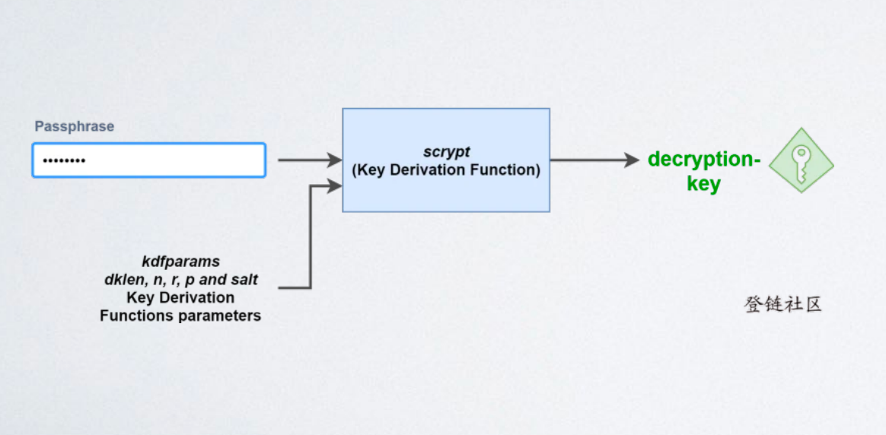

在 Web3 领域，**KeyStore** 是一种用于**加密存储私钥的标准化 JSON 文件格式**，其核心作用是将敏感的私钥通过密码加密后安全存储，避免用户直接暴露原始私钥（如十六进制字符串），同时简化私钥的备份、传输和导入流程。几乎所有主流加密货币钱包（如 MetaMask、Geth、Trust Wallet 等）都支持 KeyStore 格式，尤其在以太坊生态中应用最为广泛。

### 一、KeyStore 的核心作用

私钥是区块链账户的 “终极所有权证明”，一旦泄露或丢失，对应账户的资产将无法挽回。原始私钥通常是一串 64 字符的十六进制字符串（如`0x5f4dcc3b5aa765d61d8327deb882cf99b6d76ad4b`），直接存储或传输存在极高风险（易被窃取、误删或输入错误）。

KeyStore 的诞生正是为了解决这一问题：

- **加密保护**：通过密码对私钥进行加密，只有输入正确密码才能解密出原始私钥。
- **标准化格式**：统一的 JSON 结构确保不同钱包间可兼容（如从 Geth 导出的 KeyStore 可导入 MetaMask）。
- **便捷管理**：以文件形式存储，便于用户备份（如保存到 U 盘、硬盘）或传输（如通过邮件、云盘，需注意安全）。

### 二、KeyStore 的结构解析（以ETH为例）

KeyStore 是一个 JSON 格式的文本文件，包含多个字段，核心是 “加密算法参数” 和 “加密后的私钥”。以下是一个典型的以太坊 KeyStore 示例及其字段含义：

```json
{
  "version": 3,
  "id": "a64aaa77-558e-401d-9e95-2b1151ab43e2e",
  "address": "0x71c7656ec7ab88b098defb751b7401b5f6d8976f",
  "crypto": {
    "ciphertext": "a1f54cc3b5aa765d61d8327deb882cf99b6d76ad4b...",
    "cipherparams": {
      "iv": "f8d6a3c2b1e4f7d8a9b0c1d2e3f4a5b6"
    },
    "cipher": "aes-128-ctr",
    "kdf": "scrypt",
    "kdfparams": {
      "dklen": 32,
      "salt": "e7f8d9c0b1a2e3f4d5c6b7a8e9f0d1c2b3a4e5f6d7c8b9a0",
      "n": 262144,
      "r": 8,
      "p": 1
    },
    "mac": "b2c3d4e5f6a7b8c9d0e1f2a3b4c5d6e7f8a9b0c1d2e3f4a5b6c7d8e9f0a1b2"
  }
}
```

#### 核心字段详解：

1. **version**
   - 版本号，目前主流为`3`（以太坊定义的版本），用于区分不同的加密标准，确保解密算法兼容。
2. **id**
   - 随机生成的 UUID（唯一标识符），用于标识该 KeyStore 文件，无加密相关作用，仅为方便管理。
3. **address**
   - 对应的区块链账户地址（公钥哈希），以`0x`开头的 42 字符字符串。
   - 作用：直观展示该 KeyStore 对应的账户，无需解密即可知道关联的地址。
4. **crypto**（核心加密信息）
   该字段包含加密私钥的所有关键信息，是 KeyStore 的核心：
   - **ciphertext**：加密后的私钥密文（十六进制字符串），需通过密码解密才能得到原始私钥。
   - **cipherparams**：对称加密算法的参数，例如：
     - `iv`（Initialization Vector，初始化向量）：16 字节随机数，用于 AES 等对称加密，确保相同明文加密后结果不同。
   - **cipher**：用于加密私钥的对称加密算法，主流为`aes-128-ctr`（128 位 AES 算法，CTR 模式），加密速度快且安全性高。
   - **kdf**（Key Derivation Function，密钥派生函数）：从用户密码生成加密密钥的算法，用于防止暴力破解密码。
     - 主流算法：`scrypt`（以太坊默认）或`pbkdf2`。
   - **kdfparams**：KDF 算法的参数（不同算法参数不同）：
     - 以`scrypt`为例：
       - `dklen`：派生密钥的长度（通常 32 字节，256 位）。
       - `salt`：随机盐值（16 字节以上），增加密码哈希的唯一性（相同密码 + 不同 salt→不同密钥）。
       - `n`：CPU / 内存成本因子（如 262144），值越大，计算密钥所需时间越长，抗暴力破解能力越强。
       - `r`：块大小因子（如 8）。
       - `p`：并行化因子（如 1）。
   - **mac**（Message Authentication Code，消息认证码）：用于验证密码正确性的哈希值。
     - 计算方式：`SHA-256(派生密钥的后16字节 + ciphertext)`。
     - 作用：解密前先验证密码是否正确（若密码错误，计算出的 mac 与存储的 mac 不匹配，直接拒绝解密）。

### 三、KeyStore 的加密与解密流程

KeyStore 的核心是 “密码→加密密钥→加密私钥” 的过程，以及反向的解密过程，具体步骤如下：

#### 1. 加密（生成 KeyStore）

当用户创建钱包或导出私钥为 KeyStore 时，流程为：
① 用户输入密码（如`mypass123`）；
② 生成随机参数：salt（盐值）、iv（初始化向量）、id（UUID）；
③ 通过 KDF 算法（如 scrypt），以 “密码 + salt” 为输入，生成 32 字节的**派生密钥**（`DK`）；
④ 用对称加密算法（如 AES-128-CTR），以`DK`为密钥、`iv`为参数，加密原始私钥，得到**ciphertext**；
⑤ 计算`mac`：`SHA-256(DK的后16字节 + ciphertext)`；
⑥ 将所有参数（version、id、address、crypto 等）组合成 JSON，即 KeyStore 文件。



#### 2. 解密（从 KeyStore 恢复私钥）

当用户导入 KeyStore 时，流程为：
① 用户输入密码和 KeyStore 文件；
② 解析 KeyStore，获取 kdf、kdfparams、ciphertext、iv、mac 等信息；
③ 用相同的 KDF 算法和 kdfparams，以 “输入密码 + salt” 为输入，重新生成**派生密钥**（`DK'`）；
④ 验证密码：计算`SHA-256(DK'的后16字节 + ciphertext)`，若结果与 KeyStore 中的`mac`一致，则密码正确；
⑤ 用对称加密算法和`iv`，以`DK'`为密钥解密`ciphertext`，得到原始私钥。


### 四、KeyStore 与其他私钥存储方式的对比

| 存储方式        | 形式              | 安全性                        | 易用性                       | 适用场景                 |
| --------------- | ----------------- | ----------------------------- | ---------------------------- | ------------------------ |
| KeyStore        | 加密 JSON 文件    | 高（依赖密码强度和 KDF 参数） | 高（文件形式，需记密码）     | 日常钱包备份、跨钱包导入 |
| 原始私钥        | 64 字符十六进制串 | 极低（易泄露、误删）          | 低（需精确记录，易输入错误） | 开发测试、临时使用       |
| 助记词（BIP39） | 12-24 个单词序列  | 高（可恢复所有私钥）          | 高（易记忆，支持多链）       | 长期备份、全钱包恢复     |
| 硬件钱包        | 离线芯片存储      | 极高（私钥永不联网）          | 中（需硬件设备，操作稍复杂） | 大额资产长期存储         |

### 五、安全性注意事项

1. **密码是核心**：KeyStore 的安全性完全依赖于密码强度。弱密码（如`123456`）易被暴力破解，建议使用 12 位以上包含大小写、数字和符号的复杂密码。
2. **KDF 参数影响抗破解能力**：`scrypt`的`n`值越大（如 262144），破解密码的时间成本越高。钱包通常会选择安全的默认参数，但用户也可手动调整（高级功能）。
3. **KeyStore 文件本身不包含密码**：即使文件泄露，没有密码也无法解密出私钥。但仍需妥善保管文件（如离线存储，避免上传至公共云盘）。
4. **备份不可替代**：KeyStore 文件若丢失且无备份，即使记得密码也无法恢复私钥。建议多重备份（如 U 盘 + 纸质打印）。
5. **警惕恶意软件**：导入 KeyStore 时，需确保钱包软件安全（无病毒），避免密码被窃取。

### 六、应用场景

1. **钱包账户导出 / 导入**：用户在 MetaMask 中导出账户时，可选择下载 KeyStore 文件；切换钱包时，通过 “导入 KeyStore + 密码” 恢复账户。
2. **交易所私钥管理**：部分去中心化交易所（DEX）会为用户生成 KeyStore，用于加密存储交易签名所需的私钥。
3. **开发环境**：开发者在本地节点（如 Geth）创建账户时，节点会自动生成 KeyStore 文件（通常存储在`~/.ethereum/keystore`目录），用于后续交易签名。

### 总结

KeyStore 是 Web3 中私钥加密存储的标准化方案，通过 “密码 + 加密算法” 的组合，在安全性和易用性之间取得平衡。其核心价值在于：让用户无需直接处理原始私钥，通过管理密码和 KeyStore 文件即可安全管理区块链账户。理解 KeyStore 的结构和加密原理，有助于用户更安全地备份和使用私钥，避免因私钥泄露或丢失导致的资产风险。


参考文章：https://learnblockchain.cn/2019/04/11/wallet-dev-guide


在 Web3 领域，**MPC（Secure Multi-Party Computation，安全多方计算）** 是一种核心密码学技术，其核心能力是：**让多个参与方在不泄露各自私有数据的前提下，共同完成某项计算任务**。在区块链、加密货币等场景中，MPC 主要用于解决 “私钥管理安全”“签名隐私”“数据协作” 等关键问题，是平衡去中心化、安全性与可用性的重要技术方案。

### 一、MPC 的核心原理：“数据保密，计算协同”

MPC 的本质是通过密码学协议，让多个参与方（例如 3 个节点、2 个用户 + 1 个服务器等）在各自数据不暴露给对方的情况下，联合执行计算逻辑，并得到与 “所有数据集中在一起计算” 相同的结果。

#### 核心目标：

- **隐私性**：参与方的私有数据（如私钥份额、敏感交易信息）全程不泄露给其他方。
- **正确性**：最终计算结果与 “数据集中计算” 的结果完全一致，无偏差。
- **鲁棒性**：少数参与方恶意作弊或掉线时，协议仍能正常运行（例如 “3 方参与，容忍 1 方作弊”）。

#### 关键技术支撑：

1. **秘密分享（Secret Sharing）**
   将原始敏感数据（如私钥）拆分为多个 “份额（Share）”，每个参与方持有一个份额，单个份额无法推导出原始数据，需多个份额协同才能恢复或使用原始数据。
   - 例如：将私钥`K`拆分为`K1、K2、K3`，单个`K1`或`K2`无法得到`K`，但`K1+K2+K3`（通过特定算法）可还原`K`。
2. **安全计算协议**
   参与方通过加密消息交互完成计算，避免直接暴露数据。常见协议包括：
   - **不经意传输（Oblivious Transfer）**：一方在不泄露选择的情况下获取另一方的部分数据。
   - **同态加密（Homomorphic Encryption）**：直接对加密数据进行计算，得到的结果解密后与明文计算一致。
   - **零知识证明（Zero-Knowledge Proof）**：证明某个陈述为真，而不泄露陈述的具体内容。

### 二、Web3 中 MPC 的核心应用场景

Web3 的核心是 “资产所有权与数据主权归用户”，但私钥管理、多角色协作等场景天然需要多方参与，MPC 在此类场景中发挥关键作用：

#### 1. 私钥管理与门限签名（Threshold Signature）

传统 Web3 钱包的私钥由单一用户保管，存在 “丢失即资产丢失、泄露即资产被盗” 的风险。MPC 通过 “私钥拆分 + 多方签名” 解决这一问题：

- **私钥拆分**：将私钥`K`拆分为`n`个份额，由`n`个参与方（如用户设备、云端服务器、硬件设备等）分别持有，单个份额无实际意义。
- **门限签名**：设定 “门限值`t`”（如`2-of-3`，即 3 个参与方中至少 2 个提供份额），签名时需`t`个参与方通过 MPC 协议协同计算，生成与原始私钥`K`等效的签名，但全程不还原`K`。

**优势**：

- 避免单点风险：单个份额丢失或泄露不影响整体安全。
- 兼容性强：生成的签名与普通私钥签名格式一致（如 ECDSA、EdDSA），可被区块链直接验证，无需修改底层协议。

**案例**：

- 钱包应用（如 ZenGo）：用户无需备份助记词，私钥份额分别存储在用户手机和云端，转账时双方协同签名。
- 机构资产管理：交易所或 DAO 的大额资产，由多个管理员分别持有份额，需多人授权才能发起交易。

#### 2. 隐私交易与数据协作

区块链上的交易数据（地址、金额、合约交互）默认公开透明，MPC 可实现 “交易信息保密但仍能被区块链验证”：

- **匿名转账**：通过 MPC 让交易双方在不暴露真实地址的情况下，完成资产转移（如利用 MPC 生成临时匿名地址，协同计算交易凭证）。
- **跨链资产转移**：多链节点通过 MPC 协同验证跨链交易的合法性，避免单节点作恶，同时不泄露链内敏感数据（如余额、私钥）。

**案例**：

- Aztec、Mina 等隐私公链：利用 MPC + 零知识证明，让交易金额和参与方地址对外隐藏，仅参与方知晓详情。
- 跨链桥（如 Poly Network）：使用 MPC 节点组验证跨链交易，避免单节点伪造交易。

#### 3. 去中心化身份（DID）与权限管理

在 DID 场景中，用户身份信息（如身份凭证、权限密钥）需多机构协同验证，MPC 可实现 “信息不泄露但验证通过”：

- 例如：用户向银行证明 “自己的信用分≥600”，无需暴露具体分数，而是通过 MPC 让银行与征信机构协同计算，仅返回 “是否达标” 的结果。

### 三、MPC 与 Web3 其他技术的对比

#### 1. MPC vs 多签（Multi-Signature）

- **多签**：多个独立私钥分别对交易签名，区块链需验证所有签名（如 2-of-3 多签需 3 个私钥中的 2 个签名）。
- **MPC 门限签名**：多个份额协同生成**一个签名**，区块链验证方式与单私钥签名完全一致，无需修改链上逻辑。
- 优势：MPC 签名更轻量（仅一个签名），兼容性更强（支持所有基于单签名的区块链）。

#### 2. MPC vs Shamir 秘密分享（Shamir's Secret Sharing, SSS）

- **SSS**：仅解决 “私钥拆分与恢复”，恢复时需将所有份额聚合还原出完整私钥（存在私钥暴露风险）。
- **MPC**：无需还原完整私钥，直接通过份额协同完成计算（如签名），全程私钥不落地，安全性更高。

#### 3. MPC vs 硬件钱包（Hardware Wallet）

- **硬件钱包**：私钥存储在离线硬件中，签名时硬件内部完成计算，避免私钥暴露在联网环境。
- **MPC**：私钥无实体存储，以份额形式分布在多个节点，即使单个节点被攻破，私钥仍安全。
- 优势：MPC 无 “硬件丢失即私钥丢失” 的风险，且支持动态调整参与方（如增加 / 减少份额持有方）。

### 四、MPC 在 Web3 中的挑战与局限

1. **计算复杂度高**：多方加密交互需要大量通信与计算资源，可能导致签名延迟（如 MPC 签名耗时比普通签名长 10-100 倍）。
2. **协议设计复杂**：需平衡安全性（抗合谋、抗攻击）与效率，实现难度高，易出现逻辑漏洞。
3. **去中心化权衡**：部分 MPC 方案依赖中心化节点（如 “用户 + 服务商” 的 2-of-2 架构），存在服务商作恶风险（需通过经济模型或多节点组缓解）。

### 五、典型案例与行业应用

1. **钱包领域**：
   - ZenGo：首个无助记词钱包，采用 2-of-2 MPC 架构（用户设备 + ZenGo 服务器），用户无需备份私钥，丢失设备可通过邮箱 + 密码恢复份额。
   - Coinbase Wallet：支持 MPC 门限签名，用于机构客户的多权限资产管理。
2. **隐私协议**：
   - Partisia Blockchain：基于 MPC 的公链，支持隐私智能合约，多方可在链上协同计算敏感数据。
   - Espresso Systems：利用 MPC 实现去中心化排序（Orderflow），保护交易隐私的同时避免 MEV（最大可提取价值）剥削。
3. **跨链与 DeFi**：
   - Chainlink CCIP（跨链交互协议）：部分节点采用 MPC 协同验证跨链消息，增强安全性。
   - Aave Arc：机构级借贷协议，通过 MPC 实现多机构对借贷额度的协同审批，不泄露机构内部数据。

### 总结

MPC 通过 “数据保密 + 协同计算” 的特性，完美适配了 Web3 对 “安全、隐私、去中心化” 的核心需求，尤其在私钥管理、隐私交易、多角色协作等场景中成为关键技术。尽管存在计算效率与实现复杂度的挑战，但随着密码学协议的优化（如 FastMPC、Threshold ECDSA 等），MPC 正逐步成为 Web3 基础设施的重要组成部分，推动区块链从 “公开透明” 向 “可控隐私” 演进。