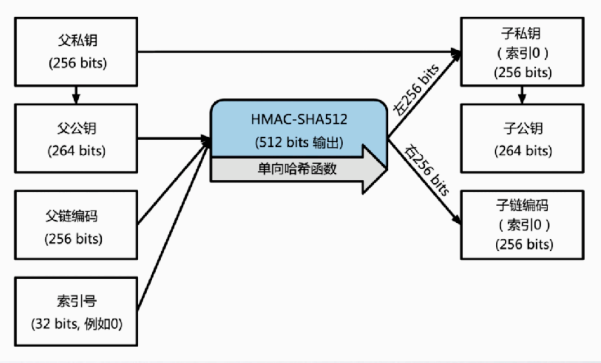
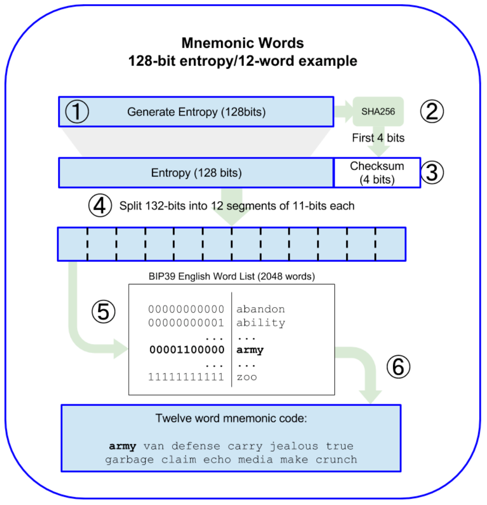
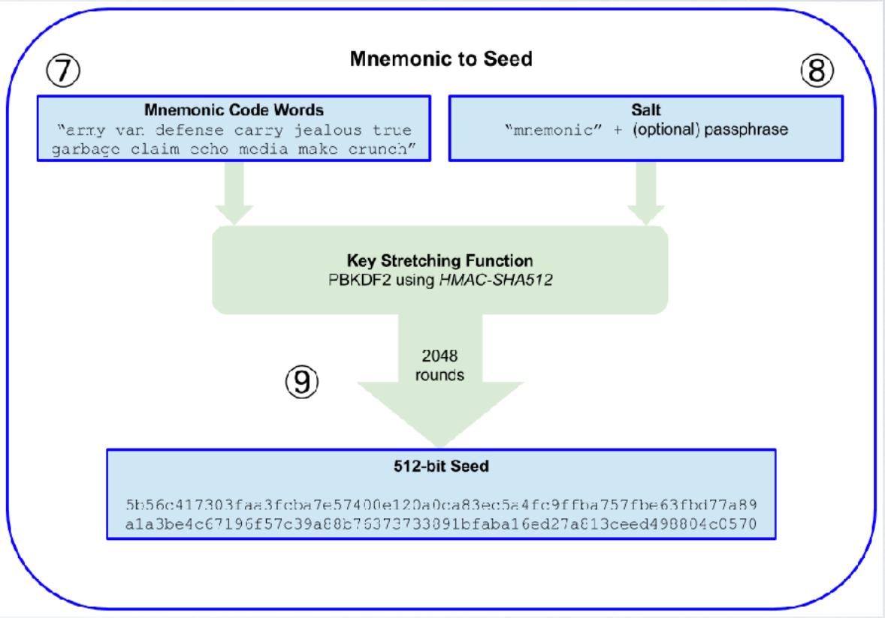

# BIP32

在 Web3 领域，分层确定性推导（Hierarchical Deterministic Derivation，简称 HD 推导）是一种通过单一主密钥生成无限个子密钥的技术，核心由 BIP32 标准定义。

它允许用户通过一个种子（Seed）生成树状结构的密钥体系，只需备份主密钥即可恢复所有子密钥，极大简化了多链资产的管理。

以下从原理、结构、安全性和应用场景展开详细说明，并辅以文字图示。

### 一、核心原理与结构

#### 1. 主密钥与链码的生成

HD 钱包的起点是一个**种子**（通常由 BIP39 助记词生成），通过 HMAC-SHA512 算法生成**主私钥（m）**和 **主链码（Master Chain Code）**。例如：

- **种子**：通过 12-24 个助记词和 PBKDF2 算法生成的 512 位随机数。
- **主私钥**：HMAC-SHA512 输出的前 256 位，作为密钥树的根节点。
- **主链码**：后 256 位，用于生成子密钥时增加随机性。


#### 2. 密钥派生的树状结构

主密钥通过 **索引（Index）**和 **链码** 递归生成子密钥，形成层级结构：

- **父密钥** + **索引** + **链码** → **子密钥** + **新链码**
- 每个子密钥可继续派生，理论上生成无限数量的密钥对。



#### 3. 路径标识（Derivation Path）

每个子密钥通过路径唯一标识，例如`m/44'/0'/0'/0/0`，其中：

- `m`：根节点。
- `44'`：BIP44 标准的固定用途标识（硬化派生，`'`表示硬化）。
- `0'`：币种类型（0 代表比特币，60 代表以太坊）。
- `0'`：账户索引。
- `0`：外部链（收款地址）。
- `0`：地址索引。

### 二、派生机制：硬化与非硬化

#### 1. 硬化派生（Hardened Derivation）

- **特点**：使用父私钥和索引生成子私钥，子密钥无法通过父公钥推导，增强安全性。
- **应用场景**：路径中的前三层（purpose、coin_type、account）必须使用硬化派生，确保即使子公钥泄露也不影响父链安全。
- **公式**：
  `child_private_key = HMAC-SHA512(parent_private_key || index)`
  （`||`表示拼接，`index ≥ 2^31`时使用硬化模式）

#### 2. 非硬化派生（Non-hardened Derivation）

- **特点**：仅用父公钥和链码生成子公钥，无需父私钥参与。
- **应用场景**：末端层级（change、address_index）通常使用非硬化派生，方便钱包预先生成大量收款地址。
- **公式**：
  `child_public_key = parent_public_key + HMAC-SHA512(parent_chain_code || index)`

### 三、助记词与种子的生成（BIP39）

1. **熵与校验和**
   - 生成 128-256 位随机熵（Entropy），例如：
     `熵 = 0x1a2b3c4d5e6f7a8b9c0d1e2f3a4b5c6d`（128 位）。
   - 计算熵的 SHA-256 哈希，取前 4 位作为校验和，与熵拼接成 132 位数据。
   - 将 132 位分割为 12 组 11 位数据，每组映射 BIP39 词库中的一个单词，生成 12 个助记词。
2. **种子生成**
   助记词通过 PBKDF2 算法（盐为`"mnemonic"+passphrase`，迭代 2048 次）生成 512 位种子，作为 BIP32 的输入。

### 四、多链支持与路径规范（BIP44）

BIP44 定义了五级路径结构，实现多币种、多账户管理：

1. **层级含义**：
   - `purpose'`：固定为`44'`，标识 BIP44 协议。
   - `coin_type'`：币种编号（如 0 = 比特币，60 = 以太坊，195=Solana）。
   - `account'`：账户索引，区分不同用途（如个人账户、企业账户）。
   - `change`：链类型（0 = 外部链，1 = 内部链 / 找零地址）。
   - `address_index`：地址序号，从 0 开始递增。
2. **跨链示例**：
   - **比特币地址**：`m/44'/0'/0'/0/0`
   - **以太坊地址**：`m/44'/60'/0'/0/0`
   - **Solana 地址**：`m/44'/195'/0'/0/0`

### 五、安全性设计

1. **硬化派生的防御机制**
   硬化派生通过父私钥参与计算，确保子私钥与父公钥无关联。例如，若攻击者获得子公钥和链码，无法反推父私钥或其他子密钥。
2. **避免地址复用**
   HD 钱包通过路径生成唯一地址，每次交易使用新地址，降低私钥泄露风险。例如，交易所可通过`m/44'/0'/0'/1/0`生成找零地址，避免重复使用同一地址。
3. **种子的唯一性**
   种子由高强度熵生成（如 256 位），配合 BIP39 校验和，确保不同钱包的助记词几乎不可能重复。若种子泄露，所有子密钥均面临风险，因此需离线存储助记词。

### 六、代码示例与实现逻辑

以下是 HD 钱包的简化实现逻辑（Python 伪代码）：

```python
import hmac
import hashlib

class HDWallet:
    def __init__(self, seed):
        self.master_private_key, self.master_chain_code = self._derive_master_key(seed)
    
    def _derive_master_key(self, seed):
        # 通过HMAC-SHA512生成主私钥和链码
        hmac_result = hmac.new(seed, b"Bitcoin seed", hashlib.sha512).digest()
        return hmac_result[:32], hmac_result[32:]
    
    def derive_child_key(self, parent_key, parent_chain_code, index, is_hardened=False):
        # 硬化派生时使用私钥，否则使用公钥
        data = parent_key + index.to_bytes(4, 'big') if is_hardened else parent_chain_code + index.to_bytes(4, 'big')
        hmac_result = hmac.new(parent_key if is_hardened else parent_chain_code, data, hashlib.sha512).digest()
        return hmac_result[:32], hmac_result[32:]
```

### 七、文字图示与路径解析

#### 1. 密钥派生树结构

```plaintext
m（主密钥）
├─44'（BIP44用途）
│ ├─0'（比特币）
│ │ ├─0'（账户0）
│ │ │ ├─0（外部链）
│ │ │ │ ├─0（地址0）
│ │ │ │ └─1（地址1）
│ │ │ └─1（内部链）
│ │ └─1'（账户1）
│ └─60'（以太坊）
│   └─0'（账户0）
└─84'（BIP84，P2WPKH地址）
  └─0'（比特币）
```

#### 2. 硬化与非硬化派生对比

- **硬化派生**：`m/44'/0'/0'`
  （父私钥 + 索引 → 子私钥，无法通过父公钥推导）
- **非硬化派生**：`m/44'/0'/0'/0/0`
  （父公钥 + 链码 → 子公钥，可公开用于收款）

### 八、应用场景

1. **多链资产管理**：通过 BIP44 路径为不同区块链生成独立子密钥，如同时管理比特币、以太坊和 Solana 资产。
2. **企业级钱包**：公司可通过主密钥为员工生成子账户，每个账户的私钥相互隔离，便于权限控制。
3. **冷钱包与热钱包分离**：主密钥离线存储（冷钱包），通过非硬化派生生成在线使用的子公钥（热钱包），降低私钥暴露风险。

### 总结

HD 推导通过 BIP32、BIP39、BIP44 等标准构建了安全、高效的密钥管理体系，是 Web3 钱包的核心技术。其树状结构和路径规范支持多链、多账户场景，硬化派生和助记词机制保障了安全性与易用性。理解这一技术，能帮助用户更安全地管理数字资产，并为开发跨链应用提供底层支持。


# BIP39

BIP39（Bitcoin Improvement Proposal 39）是区块链领域最基础的标准之一，定义了**助记词（Mnemonic Phrase）的生成规则**，用于将复杂的随机私钥种子转化为人类易记的单词序列，解决了 “私钥难备份、易丢失” 的问题。几乎所有现代加密货币钱包（如 MetaMask、Trust Wallet 等）都采用 BIP39 作为助记词标准。

### 一、BIP39 的核心作用

在 BIP39 出现前，用户需要直接备份 64 字节（512 位）的随机种子（或更长的私钥），这些由十六进制字符组成的字符串（如`5f4dcc3b5aa765d61d8327deb882cf99b6d76ad4b`）极难记忆，且容易输入错误。

BIP39 的核心价值是：**将随机种子转化为 12-24 个常见单词的序列（助记词）**，既便于人类记忆和备份，又能通过单词序列反向推导回原始种子，实现钱包的安全恢复。

### 二、BIP39 的工作流程（从熵到助记词）

BIP39 的完整流程可分为 5 个步骤，核心是 “随机熵→校验和→单词索引→助记词” 的转化：

#### 步骤 1：生成随机熵（Entropy）

熵是 “随机不确定性” 的度量，是 BIP39 的起点。BIP39 要求熵的长度必须是**128-256 位**，且是 32 的倍数（即 128/160/192/224/256 位）。

- 熵的长度直接决定了安全性：长度越长，随机性越高，被暴力破解的概率越低。
- 示例：生成 128 位熵（二进制）：
  `11010010 01110111 10111100 01101110 01110110 01011100 10010110 11000110 01001110 11001110 01110101 10100101 00111001 01101010 01100100 11101011`

#### 步骤 2：计算校验和（Checksum）

为了检测助记词输入错误（如拼写错误、单词顺序错误），BIP39 引入了校验和机制：

- 对步骤 1 的熵计算**SHA-256 哈希值**（256 位）；
- 取哈希值的前`(熵长度 / 32)`位作为校验和（因为熵长度是 32 的倍数，所以校验和长度为 4/5/6/7/8 位，对应 128/160/192/224/256 位熵）。
- 示例（接 128 位熵）：
  128 位熵的 SHA-256 哈希前 4 位为`1001`（二进制），即校验和为`1001`。

#### 步骤 3：组合熵与校验和

将步骤 1 的熵与步骤 2 的校验和拼接，形成一个新的二进制串：

- 总长度 = 熵长度 + 校验和长度 = 128+4=132 位（对应 12 个单词）、160+5=165 位（15 个单词）、…、256+8=264 位（24 个单词）。
- 示例（接 128 位熵 + 4 位校验和）：
  拼接后为`11010010 01110111 ... 11101011 1001`（共 132 位）。

#### 步骤 4：分割为 11 位片段

由于 BIP39 定义了一个包含**2048 个单词的固定列表**（`2^11=2048`），每个单词对应一个 11 位的二进制数（00000000000 到 11111111111）。因此，需要将步骤 3 的总二进制串分割为若干个 11 位的片段：

- 总长度必须是 11 的倍数（132=11×12，165=11×15，…，264=11×24），这也是熵长度设计为 32 倍数的原因（确保总长度能被 11 整除）。
- 示例（132 位总长度）：
  分割为 12 个 11 位片段：
  `11010010011`、`10111101111`、`00011011100`、…、`11001011101`（共 12 个）。

#### 步骤 5：映射为助记词

将每个 11 位片段转换为十进制数（0-2047），然后在 BIP39 单词表中查找对应的单词，即得到助记词序列。

- 示例：
  11 位片段`11010010011`对应的十进制是`1675`，在英语单词表中对应 “`winner`”；
  12 个片段最终映射为 12 个单词，如：
  `winner thank year wave sausage worth useful legal winner thank yellow`




### 三、从助记词到种子（Seed）

助记词本身不是最终用于生成私钥的种子，而是通过特定算法转化为种子。BIP39 规定：

- 助记词通过**PBKDF2**（基于密码的密钥派生函数）生成 512 位（64 字节）的种子；
- 派生过程中需要一个 “盐值（Salt）”，格式为`"mnemonic"+password`（`password`是用户可选的密码，增强安全性）；
- 迭代次数固定为 2048 次，伪随机函数为 HMAC-SHA512。

公式：`种子 = PBKDF2(HMAC-SHA512, 助记词, 盐值, 2048, 512)`

- 若用户未设置密码，盐值为`"mnemonic"`（无密码）；
- 若设置了密码，即使助记词泄露，没有密码也无法生成正确的种子，进一步提升安全性。




### 四、BIP39 单词表

BIP39 定义了**2048 个单词的标准列表**，支持多种语言（英语、中文、日语等），但核心是 “11 位二进制→单词” 的一一映射。

- 英语单词表示例（部分）：
  0: "abandon"、1: "ability"、2: "able"、…、2047: "zoo"
- 中文单词表示例（部分）：
  0: "的"、1: "一"、2: "是"、…、2047: "做"

不同语言的单词表独立，但只要熵相同，不同语言生成的助记词序列虽然单词不同，但最终生成的种子是相同的（若密码相同）。

### 五、总结

BIP39 的核心逻辑可简化为：
`随机熵 → 加校验和 → 分割为11位片段 → 映射为助记词 → 派生为种子`

它通过 “单词化” 解决了私钥备份的痛点，是 Web3 钱包（尤其是分层确定性钱包 BIP32）的基础标准。

记住：**助记词是钱包的 “唯一钥匙”，丢失则资产无法恢复，泄露则资产可能被盗**，必须离线备份并妥善保管。


# BIP44

BIP44（Bitcoin Improvement Proposal 44）是区块链钱包领域的核心标准之一，全称为 “多币种分层确定性钱包的结构”，其核心作用是**为分层确定性（HD）钱包定义统一的密钥派生路径规范**，解决了多币种、多账户管理的标准化问题。

在 BIP44 出现前，不同钱包对 HD 密钥的派生路径没有统一约定，导致用户在不同钱包间恢复资产时可能出现地址不匹配、资产无法显示的问题。BIP44 通过定义清晰的路径结构，让所有遵循该标准的钱包能基于同一套助记词，按相同规则生成不同币种、不同账户的密钥，实现了跨钱包的兼容性。

### 一、BIP44 的核心目标

1. **多币种统一管理**：通过路径区分不同区块链（如比特币、以太坊、莱特币等），让一个 HD 钱包可同时管理多种加密货币。
2. **账户隔离**：支持为同一币种创建多个独立账户（如 “个人账户”“企业账户”），实现资金用途的分离。
3. **地址分类**：区分 “收款地址” 和 “找零地址”，提升交易隐私性。
4. **跨钱包兼容**：所有遵循 BIP44 的钱包使用相同路径规则，确保助记词在不同钱包中恢复时能正确匹配资产。

### 二、BIP44 的五级路径结构

BIP44 定义了**五级分层路径**，格式为：
`m / purpose' / coin_type' / account' / change / address_index`

每一级路径均有明确含义，其中带`'`的表示使用**硬化派生**（Hardened Derivation），增强安全性（前三级必须硬化，后两级可选非硬化）。

#### 1. 第一级：purpose'（用途）

- 固定值为`44'`（十进制），表示该路径遵循 BIP44 标准。
- 之所以用硬化派生（加`'`），是为了与其他标准（如 BIP49、BIP84）的路径区分开，避免冲突。
- 示例：`m/44'`

#### 2. 第二级：coin_type'（币种类型）

- 用于区分不同的加密货币，每个币种有唯一的编号（由 SLIP-44 标准维护）。
- 必须使用硬化派生，确保不同币种的密钥体系完全隔离（即使某币种的子密钥泄露，不影响其他币种）。
- 常见币种编号示例：
  - 比特币（BTC）：`0'`
  - 以太坊（ETH）：`60'`
  - 莱特币（LTC）：`2'`
  - 比特币现金（BCH）：`145'`
  - Solana（SOL）：`195'`
  - USDT（ERC-20）：跟随以太坊`60'`（因基于以太坊链）
- 示例：比特币路径片段`m/44'/0'`，以太坊为`m/44'/60'`

#### 3. 第三级：account'（账户）

- 用于区分同一币种的不同账户（如 “日常消费账户”“储蓄账户”“公司账户”）。
- 必须使用硬化派生，确保账户间的密钥完全独立（一个账户的密钥泄露不影响其他账户）。
- 索引从`0'`开始递增，用户可根据需求创建任意多个账户。
- 示例：比特币第一个账户`m/44'/0'/0'`，第二个账户`m/44'/0'/1'`

#### 4. 第四级：change（链类型）

- 用于区分 “外部链” 和 “内部链”，实现地址功能的分类：
  - `0`：外部链（External Chain）—— 用于生成对外公开的收款地址（如接收他人转账）。
  - `1`：内部链（Internal Chain）—— 用于生成找零地址（交易时未花完的余额会转回找零地址，提升隐私性）。
- 通常使用非硬化派生（不加`'`），因为外部链地址需要提前生成并公开（如在交易所展示收款地址），非硬化派生允许通过父公钥直接生成子公钥，无需暴露私钥。
- 示例：比特币第一个账户的收款地址路径`m/44'/0'/0'/0`，找零地址路径`m/44'/0'/0'/1`

#### 5. 第五级：address_index（地址索引）

- 同一链类型下的地址序号，从`0`开始递增，用于生成多个独立地址。
- 使用非硬化派生，支持批量生成地址（如一次生成 10 个收款地址供不同场景使用）。
- 钱包通常会自动递增索引，每次收款使用新地址（避免地址复用，增强隐私）。
- 示例：比特币第一个账户的第一个收款地址`m/44'/0'/0'/0/0`，第二个收款地址`m/44'/0'/0'/0/1`

### 三、完整路径示例

不同场景的 BIP44 路径如下：

| 场景                      | 完整路径            | 说明                                  |
| ------------------------- | ------------------- | ------------------------------------- |
| 比特币收款地址（第 1 个） | `m/44'/0'/0'/0/0`   | 外部链第 0 个地址                     |
| 比特币找零地址（第 1 个） | `m/44'/0'/0'/1/0`   | 内部链第 0 个地址                     |
| 以太坊账户 1 的收款地址   | `m/44'/60'/1'/0/0`  | 以太坊第 1 个账户的外部链第 0 个地址  |
| Solana 第 0 个账户地址    | `m/44'/195'/0'/0/0` | Solana（编号 195）第 0 个账户收款地址 |

### 四、BIP44 与其他 BIP 的关系

BIP44 并非独立存在，而是基于以下标准构建的完整体系：

1. **BIP39**：提供助记词生成规则，将随机种子转化为人类易记的单词序列（作为 HD 钱包的起点）。
2. **BIP32**：定义 HD 钱包的密钥派生算法，通过主密钥递归生成子密钥（树状结构）。
3. **BIP44**：在 BIP32 基础上标准化路径结构，明确多币种、多账户的派生规则。

三者关系可简化为：
`助记词（BIP39）→ 种子 → 主密钥（BIP32）→ 按BIP44路径派生币种/账户/地址`

### 五、安全性设计

1. **硬化派生的分层防护**：
   前三级（purpose'、coin_type'、account'）必须使用硬化派生，意味着子密钥的生成依赖父私钥，攻击者即使获取子公钥和链码，也无法反推父私钥或其他子密钥，确保核心层级的安全。
2. **地址隔离与隐私**：
   通过 change 层级区分收款和找零地址，避免地址复用（同一地址多次收款会暴露交易历史）；address_index 递增生成新地址，进一步增强交易隐私。
3. **跨钱包恢复的一致性**：
   统一的路径规则确保用户在不同钱包中导入同一助记词时，能正确识别所有币种和账户的资产（若钱包支持该币种的 coin_type 编号）。

### 六、实际应用与注意事项

1. **钱包兼容性**：
   几乎所有主流钱包（如 MetaMask、Trust Wallet、Ledger、Trezor）均支持 BIP44，但部分钱包可能默认使用其他标准（如 BIP49 用于隔离见证地址），需在设置中手动切换。
2. **币种支持范围**：
   钱包需包含对应币种的 coin_type 编号才能正确生成地址，若某币种编号未被钱包收录，即使路径正确也无法显示资产（需手动添加自定义币种）。
3. **备份与恢复**：
   只要备份了 BIP39 助记词，即可在任何支持 BIP44 的钱包中恢复所有路径下的资产（无需单独备份每个地址的私钥）。

### 总结

BIP44 通过标准化五级路径结构，解决了 HD 钱包在多币种、多账户管理中的兼容性问题，是现代加密货币钱包的核心规范。其设计既保证了安全性（硬化派生），又兼顾了灵活性（多账户、多地址）和隐私性（地址分类），使得一个助记词即可安全管理跨链资产，极大降低了用户的使用门槛。理解 BIP44 路径规则，有助于用户更清晰地掌握钱包的资产管理逻辑，避免因路径不匹配导致的资产丢失问题。